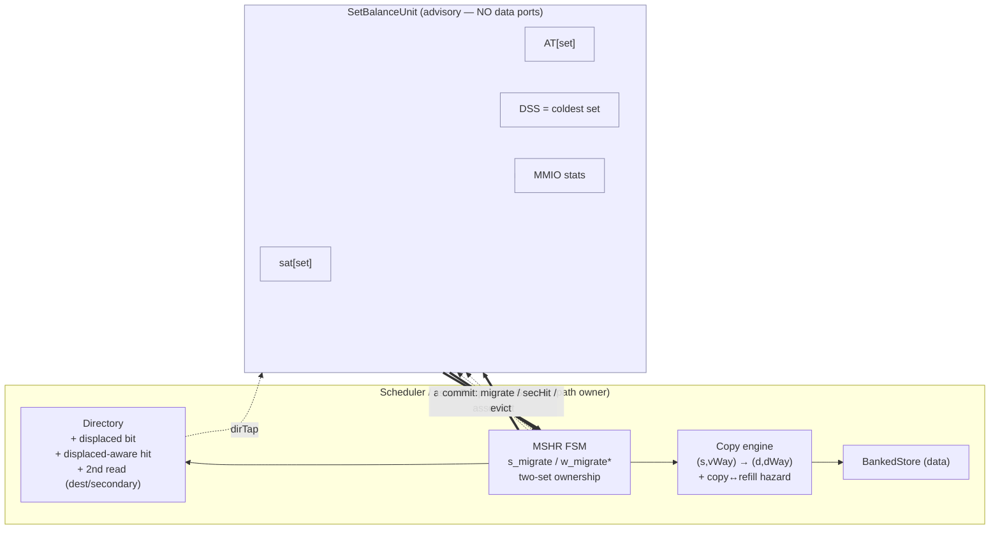
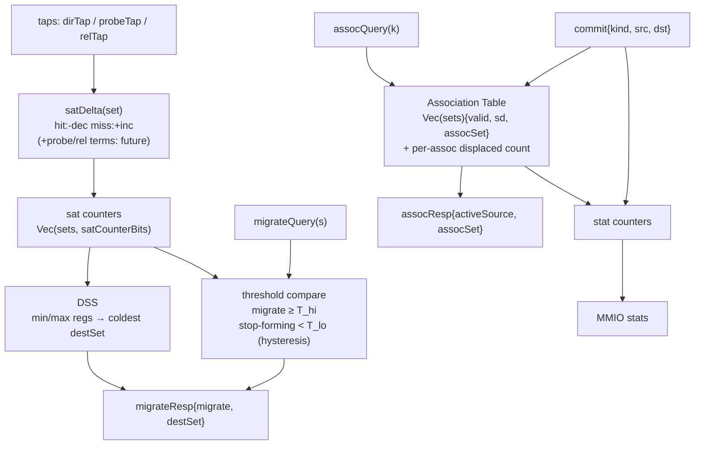
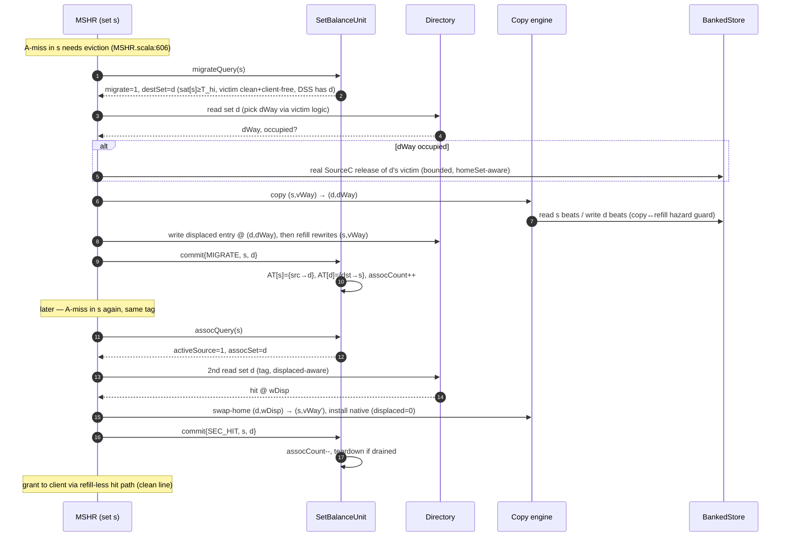
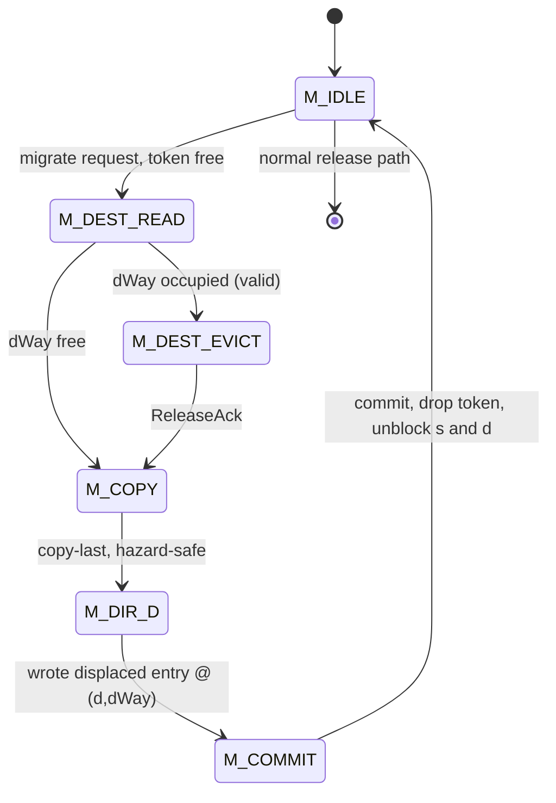
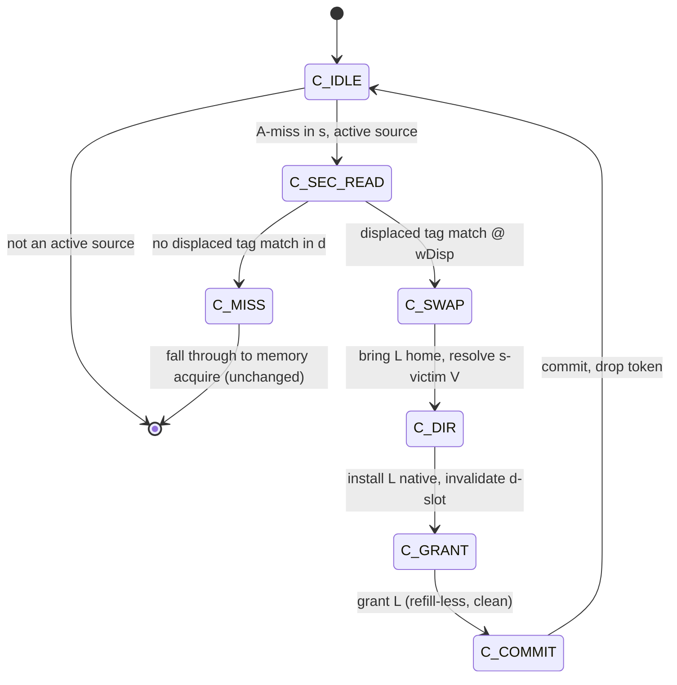
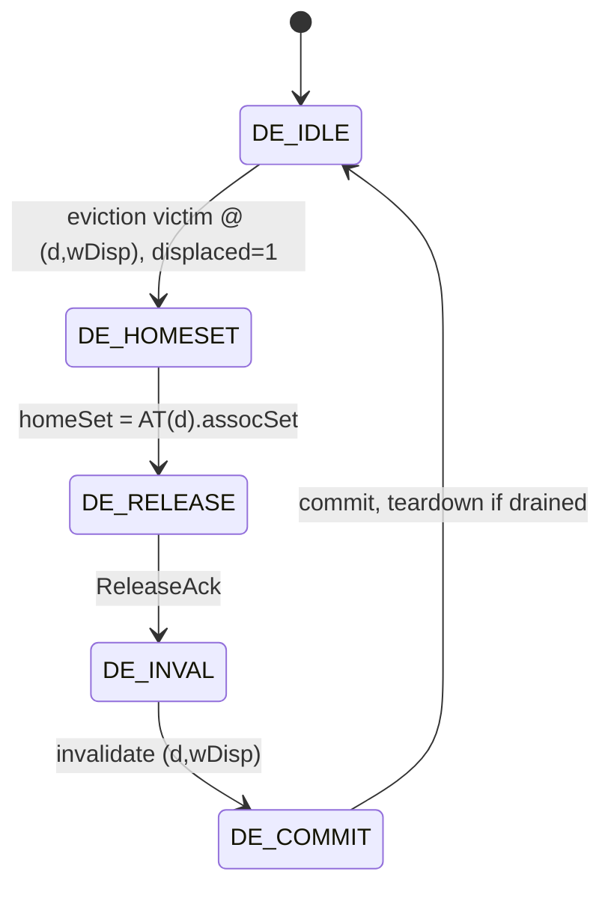

# SetBalanceUnit — design note (SCRATCH / working doc — fold into SBC plan or delete)

## Decomposition decision: SBU is **advisory + bookkeeping only**, it owns **no data/SRAM ports**

The dangerous datapath (BankedStore copy, Directory writes, the `s_migrate`/`w_migrate*` flow, two-set
ownership) stays where the existing ownership/arbitration logic already lives: **MSHR + Scheduler +
BankedStore**. `SetBalanceUnit` is a self-contained observer/oracle that:

- maintains per-set **saturation counters**, the **Association Table (AT)**, and the **DSS**;
- answers two **advisory queries** (should set `s` migrate / where; is set `k` an active source / where);
- accepts **commits** telling it what actually happened, so its bookkeeping never drifts from the datapath;
- exposes **read-only MMIO** stats.

Why this split (simplicity-first): SBU has no BankedStore/Directory ports, so **it physically cannot
corrupt data or deadlock the datapath** — it can only give bad *advice*, which is observable and
testable in isolation. This is much easier to debug than an SBU that drives SRAMs.

> This **refines** the plan line "SetBalanceUnit owns the copy/migration sequencer": the *sequencer*
> (schedule bits + copy engine) lives in MSHR/Scheduler/BankedStore; SBU owns only counters/AT/DSS.

## Key simplification: SBU is **set-granular only — it never tracks ways**

- Destination **way** for a migration comes from a Directory **read of set `d`** (reuses the existing
  random-victim logic + the new "second read" mechanism).
- Secondary-search **way** comes from the Directory read of `d` (hit ⇒ returns the way).

So SBU stores `sat[set]`, `AT[set]`, `DSS over sets`. The one extra-read mechanism in the Directory
serves **both** migration-destination selection and secondary search.

## Probe visibility (your future direction)

To let probe behavior influence the counters, SBU taps three signals — **all already present in the
Scheduler**:

| Tap | Source in Scheduler | Carries | Use |
|-----|--------------------|---------|-----|
| `dirTap` | `directory.io.result` | set, way, hit, state, dirty, clients, displaced | base sat: hit→dec / miss→inc; AT/DSS sampling |
| `probeTap` | `schedule.b` fire (`io.schedule.bits.b`, [MSHR.scala:286](src/MSHR.scala#L286)) | set, param (toN/toB), clients | probe pressure (future sat term) |
| `relTap` | `sinkC.io.resp` ([Scheduler.scala:79](src/Scheduler.scala#L79)) | set, opcode (ProbeAck\* vs Release\*), param, dirty | distinguish probe-driven invalidation vs voluntary release; dirty writeback |

Under **principle 4** (displaced lines are clean + client-free), every probe/release event always
pertains to a **native** line in **its own address set**, so per-set attribution is unambiguous — the
displaced population is never probed or released. (Holds even if we later relax "clean"; only relaxing
"client-free" would muddy attribution.)

The sat update is a **pluggable combinational delta** so adding probe terms later is a localized edit
that never touches the datapath:

```
satDelta(set) =  (+incHit  on dirTap.hit  for set)
               + (-decMiss on dirTap.miss for set)
               + (wProbe   * probeTap term)   // reserved = 0 today, weighted later
               + (wRel     * relTap term)     // reserved = 0 today
```

## IO sketch (Chisel-ish)

```scala
class SetBalanceUnit(params) extends Module {
  val io = IO(new Bundle {
    // observational taps (one-directional, read-only)
    val dirTap   = Input(Valid(new DirTap(params)))     // set,way,hit,state,dirty,clients,displaced
    val probeTap = Input(Valid(new ProbeTap(params)))   // set,param,clients   (B fire)
    val relTap   = Input(Valid(new RelTap(params)))     // set,opcode,param,dirty (C resp)

    // advisory queries (Scheduler/MSHR ask; SBU answers same/next cycle)
    val migrateQuery = Flipped(Valid(UInt(setBits.W)))  // "migrate victim of set s?"
    val migrateResp  = Output(new Bundle {              // -> gates s_migrate at MSHR:606
      val migrate = Bool()
      val destSet = UInt(setBits.W)                     // from DSS coldest
    })
    val assocQuery = Flipped(Valid(UInt(setBits.W)))    // secondary-search + homeSet lookup
    val assocResp  = Output(new Bundle {
      val activeSource = Bool()                         // AT[k].valid && !sd  -> do 2nd read
      val assocSet     = UInt(setBits.W)                // = homeSet when k is a destination
    })

    // commit: datapath reports what really happened (keeps AT/DSS truthful)
    val commit = Flipped(Valid(new Bundle {
      val kind = UInt(2.W)                              // MIGRATE | SEC_HIT | DISP_EVICT
      val src  = UInt(setBits.W)
      val dst  = UInt(setBits.W)
    }))

    // read-only MMIO
    val stats = Output(new SbcStats(params))            // migrations, secHits, secMiss, activeAssoc
  })
}
```

---

## Diagram 1 — Context: advisory SBU vs datapath owner



## Diagram 2 — SBU internals



## Diagram 3 — Sequences (migration write-path, then secondary hit)



## Open knobs
- **AT storage**: registers (default, simple) vs SRAM if `sets` makes flop area/timing hurt.
- **DSS depth `D`**: independent of set count; trades selector area for destination quality.
- **satDelta weights** `wProbe`/`wRel`: 0 for v1; your probe-integration work tunes these.
- **assocCount width**: per-association displaced-line counter for safe teardown (Phase 4).

---

# State machines: migration, secondary search, displaced eviction

All three run **inside the MSHR's owned two-set execution plan** — *not* in SBU (which only answers
`migrateQuery`/`assocQuery` on entry and takes `commit{…}` on exit). They share three resources:

- the **second directory read** (destination pick + secondary search),
- the **copy engine** (set-to-set block move + copy↔refill hazard guard),
- a **single per-bank migration token** `mig_busy` — at most one cross-set move in flight. This is
  what makes the FSMs **non-recursive and deadlock-free**: while the token is held, no nested flow can
  start another cross-set move, so a victim that would otherwise migrate is instead dropped/released.

The MSHR keeps its existing `s_*`/`w_*` scoreboard for the **new line's** acquire/grant; these FSMs
**replace the victim's `s_release` step** and add the second read. New per-MSHR state (explicit
registers — chosen over more scoreboard bits for readability):

| field | meaning |
|---|---|
| `mig_state` / `sec_state` / `disp_state` | the three sub-FSMs below |
| `dSet`, `dWay` | destination set/way latched from the 2nd read |
| `mig_busy` (per bank) | the single cross-set-move token |

**Two invariants that tie the FSMs to the scoreboard:**
1. **A2 guard** — the refill write into `(s,vWay)` is gated until the FSM passes its `*_COPY` state.
2. **A1/D guard** — both `s` and `dSet` block nesting (`blockB`/`blockC`) until `*_COMMIT`.

**Routing** (decided at the A-miss / eviction point, [MSHR.scala:606](src/MSHR.scala#L606)):
`assocResp.activeSource` → **secondary search** · else clean+client-free victim & `sat[s]≥T_hi` &
token free → **migration** · else victim `displaced=1` → **displaced eviction** · else **normal**.

## 1 — Migration (write-path; replaces victim release on a hot-set miss)



| state | action |
|---|---|
| `M_DEST_READ` | take `mig_busy`; 2nd-read of `dSet` → latch `dWay`, occupied?, d-victim meta |
| `M_DEST_EVICT` | d-victim occupied → evict it for real (if it is itself `displaced`, run **FSM 3** with its `homeSet`); wait `ReleaseAck` |
| `M_COPY` | copy `(s,vWay) → (d,dWay)`; refill of the new line into `(s,vWay)` stays gated until exit |
| `M_DIR_D` | dir-write `(d,dWay) = {displaced=1, s-victim tag/state}` |
| `M_COMMIT` | `commit{MIGRATE,s,d}` → `AT[s]→d`, `AT[d]→s`, `assocCount++`; drop token; new line refills `(s,vWay)` as native via the normal scoreboard |

## 2 — Secondary search + swap-home (read-path)



| state | action |
|---|---|
| `C_SEC_READ` | take `mig_busy`; 2nd-read of `d=AT[s].assocSet` with req tag, **displaced-aware** match |
| `C_SWAP` | copy `(d,wDisp) → (s,vWay')`; evict s-victim **V** — clean+client-free ⇒ **drop** (no traffic), dirty ⇒ Release. V **cannot migrate** (token busy) ⇒ bounded |
| `C_DIR` | dir-write `(s,vWay') = native L (displaced=0)`; invalidate `(d,wDisp)` |
| `C_GRANT` | grant L to client via the clean, refill-less hit path |
| `C_COMMIT` | `commit{SEC_HIT,s,d}`; `assocCount--`; teardown if drained; drop token |

> Single-copy invariant (A4): L is installed native in `s` **and** invalidated in `d` in the same
> owned plan, so it is never resident in both — assert it.

## 3 — Displaced eviction (victim way has `displaced=1`)

Invoked standalone (any eviction in a destination set) or nested from `M_DEST_EVICT`.



| state | action |
|---|---|
| `DE_HOMESET` | `assocResp.assocSet` → `homeSet`; `addr = expandAddress(tag, homeSet, 0)` ([Parameters.scala:226](src/Parameters.scala#L226)) — **the only edit to the real-writeback address path** |
| `DE_RELEASE`| clean ⇒ `Release` (no data) at `addr`; *(future dirty-relax ⇒ `ReleaseData`)*; wait `ReleaseAck` |
| `DE_INVAL` | invalidate `(d,wDisp)` |
| `DE_COMMIT` | `commit{DISP_EVICT, homeSet, d}`; `assocCount--`; recycle AT entry only when count hits 0 |

> Why no home-set fixup: when L was migrated, `s`'s entry was already overwritten by the new line, so
> L lives **only** in `d`. Eviction touches just `(d,wDisp)` + the home-addressed Release — no second
> set to update.
