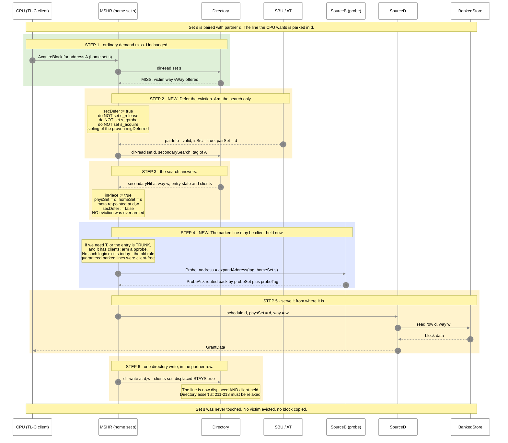
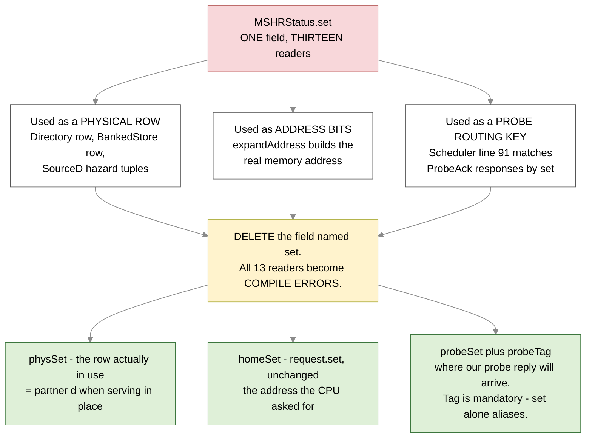
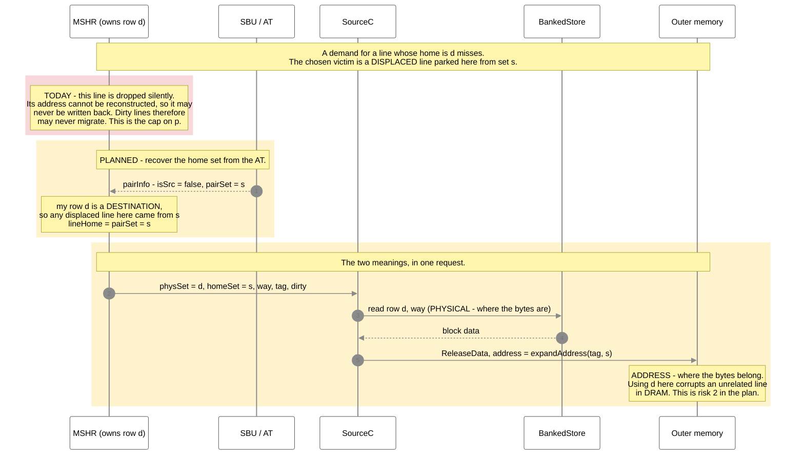
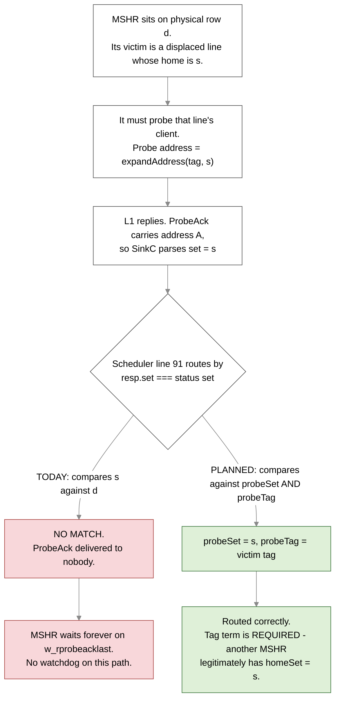
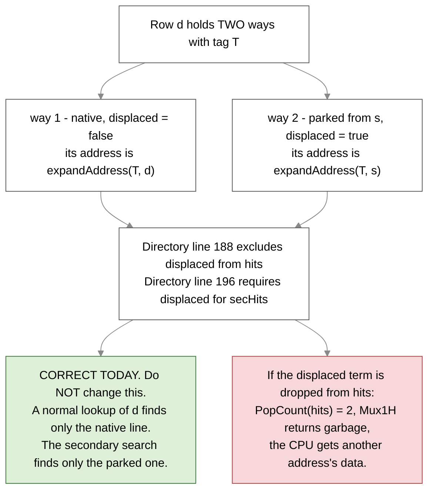
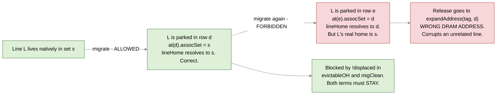

# SBC Phase 3R — serve-in-place + first-class displaced lines (visual)

**Status: PLANNED.** Companion to [TASK.md](TASK.md) and [../../phase-3.md](../../phase-3.md).
Supersedes Part B of [../../diagram.md](../../diagram.md), which draws the full swap — that was
superseded first by repatriation, and now by serve-in-place.

**Colour key:** 🟢 green = built and working today · 🟡 yellow = changes in this task ·
🔴 red = deleted or broken today · 🔵 blue = new hardware.

## The idea, in plain English

- Today a secondary hit **copies the line home** (repatriation), evicting a good line from the home
  set to make room. The paper does not do this. It **serves the line where it sits.**
- Serving in place means the line **stays displaced while a client holds it**. It can then be dirty.
  That is the whole unlock: today `displaced` means clean and client-free, which is what forbids
  migrating dirty victims.
- To make that safe we need one thing: **the home set of a parked line**. Under strict 1:1 pinning it
  is already known — `AT[row].assocSet`. No directory format change.
- The refactor is therefore: **stop letting one wire called `set` mean two different things.**

## The whole vocabulary (nine names)

| name | in one line |
|---|---|
| `homeSet` | the set the **address** maps to — today's `request.set`, unchanged |
| `physSet` | the SRAM **row** actually being used |
| `probeSet` / `probeTag` | where our outstanding probe will be answered |
| `pairSetReg` | the associated set. **Already exists** — no new register |
| `isSrc` | is my set the source side of the pairing (else the destination side) |
| `lineHome` | the home set of the line currently in `meta` |
| `inPlace` | this MSHR is serving from the partner row |
| `secDefer` | eviction held back until the search answers |
| `busyWays` / `freeWays` | ways locked by a live MSHR / the rest |

---

## Part 1 — today vs planned, side by side

```mermaid
%%{init: {"theme":"base","themeVariables":{"background":"#ffffff","mainBkg":"#ffffff","textColor":"#000000","lineColor":"#8a8a8a","primaryColor":"#ffffff","primaryTextColor":"#000000","primaryBorderColor":"#555555","secondaryColor":"#f2f2f2","tertiaryColor":"#ffffff","nodeTextColor":"#000000","nodeBorder":"#555555","clusterBkg":"#f7f7f7","clusterBorder":"#999999","edgeLabelBackground":"#ffffff"}}}%%
flowchart TD
    START["Demand miss in set s<br/>s is a paired source, partner is d"] --> SEARCH["Secondary search of set d<br/>finds the line at way w"]

    SEARCH --> T
    SEARCH --> P

    subgraph T["TODAY - repatriate (being deleted)"]
      T1["Evict a victim from set s<br/>to make room"] --> T2["SetCopyUnit copies the block<br/>from d,w into s,victimWay"]
      T2 --> T3["dir-write 1: erase parked copy at d,w"]
      T3 --> T4["dir-write 2: install natively in s"]
      T4 --> T5["SourceD reads s,victimWay<br/>GrantData"]
      T5 --> T6["Line is native. displaced stays<br/>clean and client-free."]
    end

    subgraph P["PLANNED - serve in place"]
      P1["Evict nothing.<br/>Set s is not touched at all."] --> P2["No copy. Nothing moves."]
      P2 --> P3["SourceD reads d,w directly<br/>GrantData"]
      P3 --> P4["dir-write: set clients at d,w<br/>displaced STAYS true"]
      P4 --> P5["Line stays parked, now client-held<br/>and eventually dirty"]
    end

    style START fill:#ffffff,stroke:#555555,color:#000000
    style SEARCH fill:#dff0d8,stroke:#3c763d,color:#000000
    style T1 fill:#f8d7da,stroke:#a94442,color:#000000
    style T2 fill:#f8d7da,stroke:#a94442,color:#000000
    style T3 fill:#f8d7da,stroke:#a94442,color:#000000
    style T4 fill:#f8d7da,stroke:#a94442,color:#000000
    style T5 fill:#f8d7da,stroke:#a94442,color:#000000
    style T6 fill:#f8d7da,stroke:#a94442,color:#000000
    style P1 fill:#fff3cd,stroke:#aaaa33,color:#000000
    style P2 fill:#fff3cd,stroke:#aaaa33,color:#000000
    style P3 fill:#fff3cd,stroke:#aaaa33,color:#000000
    style P4 fill:#fff3cd,stroke:#aaaa33,color:#000000
    style P5 fill:#fff3cd,stroke:#aaaa33,color:#000000
```



**What the planned side deletes:** one block copy, one home-set eviction, and one directory write,
per secondary hit. It also deletes `doSecCopy` / `s_scopy` / `w_scopy` and the SetCopyUnit write into
a live set — which is where both open corruption leads live.

---

## Part 2 — the planned serve-in-place transaction



---

## Part 3 — the one structural change: `set` currently means two things



**Why delete rather than rename.** Nine readers want the address, four want the row, two want the
routing key. Whichever meaning we keep, a **missed** site silently keeps working for native lines and
breaks only for displaced ones — the worst possible failure. Deleting the name makes every site a
compile error that must be decided explicitly.

---

## Part 4 — evicting a DIRTY displaced line (Stage 2, the `p` unlock)

This is the split doing real work. The same MSHR uses **both** meanings in the same transaction.



---

## Part 5 — the probe-response routing fix

The first thing that breaks once displaced lines can be client-held. It is a **hang, not corruption**,
which makes it a good early canary.



`MSHR.scala:782` already warns *"Caution: the probe matches us only in set."* That comment becomes
false and must be updated in the same change.

---

## Part 6 — `displaced` is the discriminator. It must NOT be weakened anywhere.



**This is not hypothetical here.** `set_addr(s,t)` in the stress test puts the tag entirely above the
set-index bits, so **the same tag exists in every set**. The collision is guaranteed, not rare. Add
`assert(PopCount(hits) <= 1)` at `Directory.scala:190` in Stage 1 as a permanent net.

### And the same bit enforces single-hop

A displaced line may **never** be migrated again. The AT records **one hop** only.



**Stage 2 drops `!dirty` from those expressions and nothing else.** `!displaced` stays:

```scala
val migClean = !new_meta.dirty && !new_meta.displaced   // BEFORE
val migClean =                    !new_meta.displaced   // AFTER
```

---

## Part 7 — stage map

> **Re-ordered by Amendment 1 (2026-08-29).** The original plan kept repatriation alive through three
> stages so that deleting it last would act as an experiment isolating the corruption. **The shadow
> model answered that question on its first run** (finding P5 — the repatriation copy overtaking the
> migration copy into the same way). With the cause known directly, there is no reason to keep the
> code, so serve-in-place moved to the front and the deferral/way-lock folded into it.

| stage | what changes | invariant after | gate |
|---|---|---|---|
| 1 ✅ | asserts, shadow models, delete `MSHRStatus.set`, add `isSrc` | both halves still hold | SBC-off regression green |
| **2** ⬅ | **serve in place** (`inPlace`) — delete the repatriation copy, plus `secDefer` and `busyWays`, pprobe arm, C/X search | `displaced ⇒ clean` only | 7/7, SecHits > 0 |
| 3 | displaced victims Release at `lineHome`, drop `!dirty` from migrate | `displaced` means only "row ≠ address set" | `p` measurably up |

**Stage 2 deletes P5's mechanism rather than fixing it** — serve-in-place performs no copy, so
`doSecCopy` and `doMigCopy` can no longer collide. If `case_reaccess_migrated` passes once Stage 2
lands, P5 was the long-open corruption. If it does not, P5 was real but not the whole story — and the
shadow model is now in place to find the rest.
