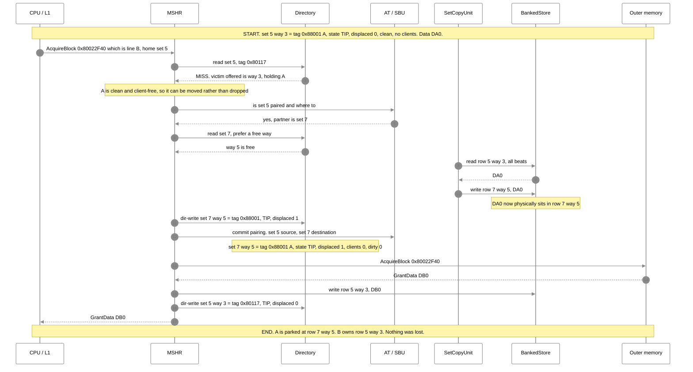
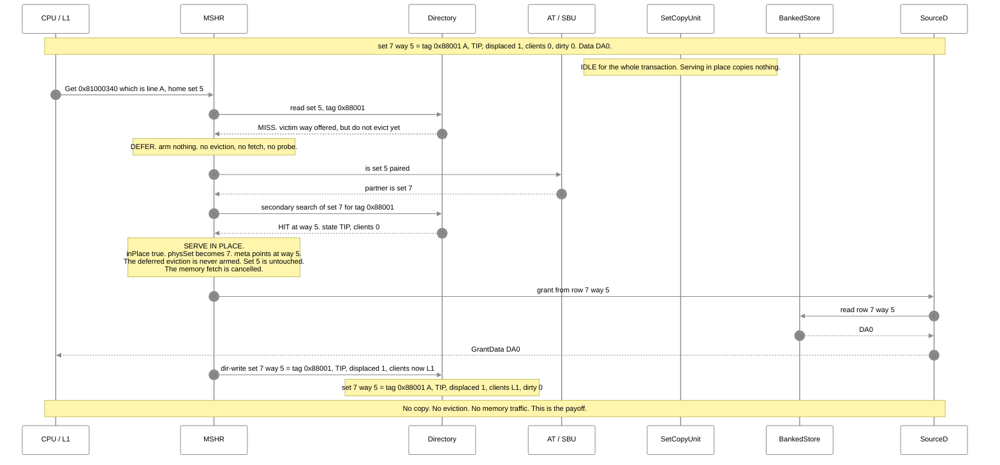
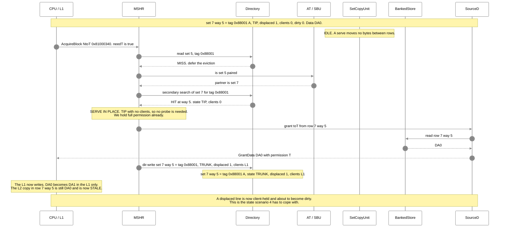
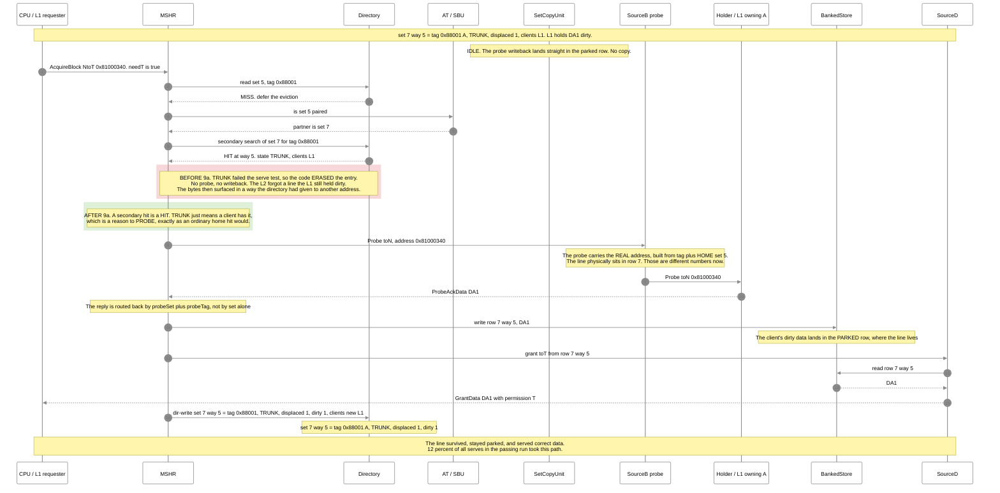
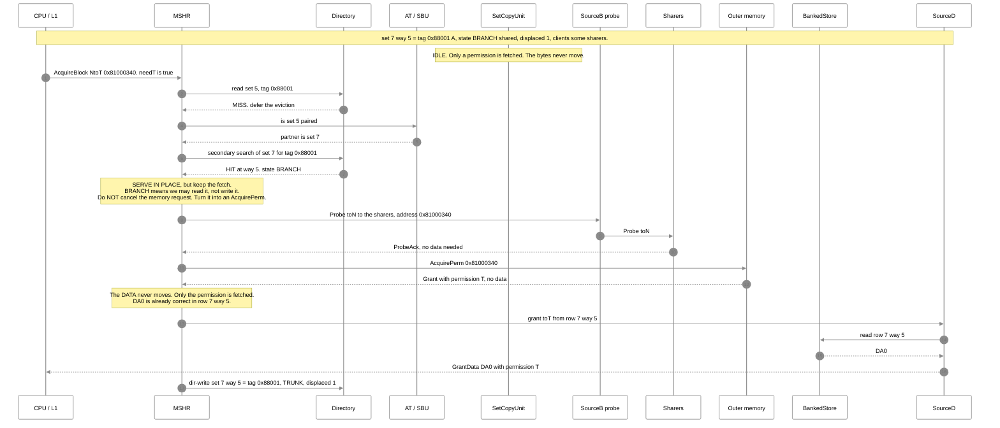
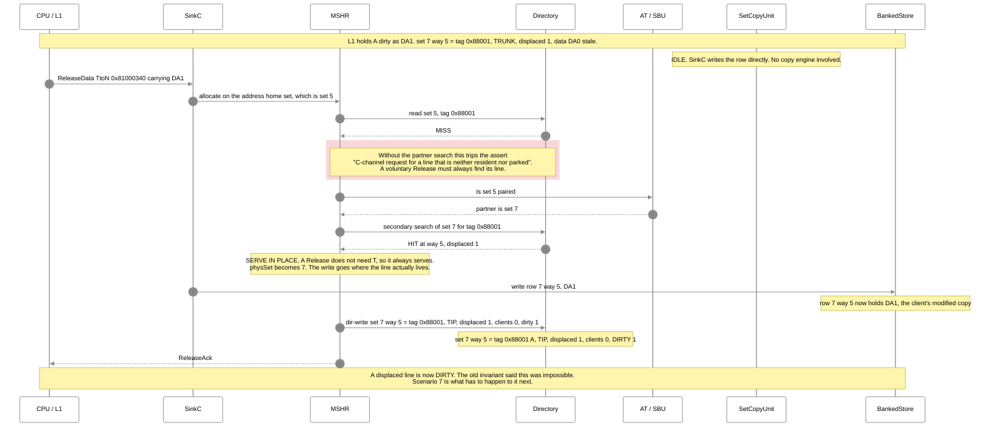
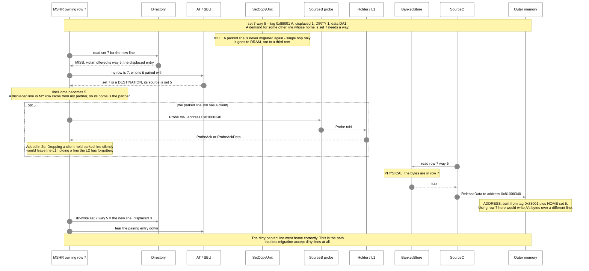
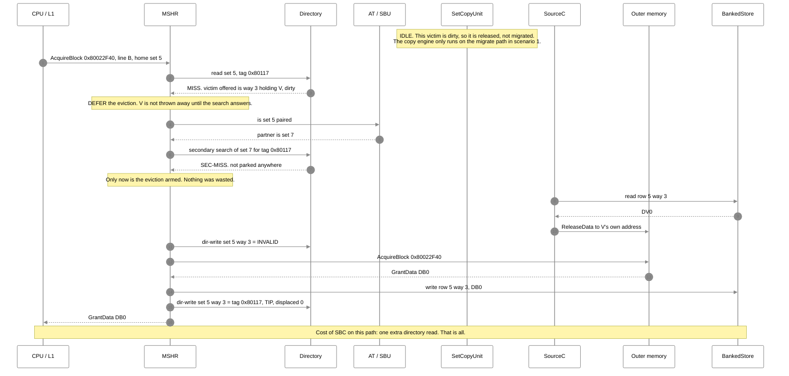
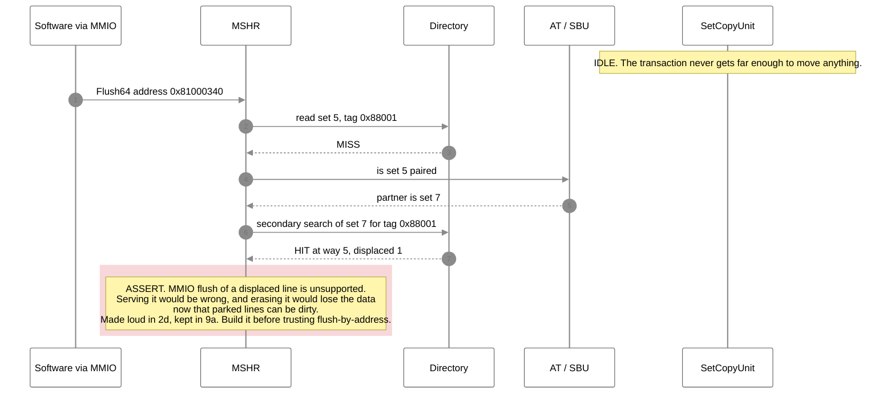
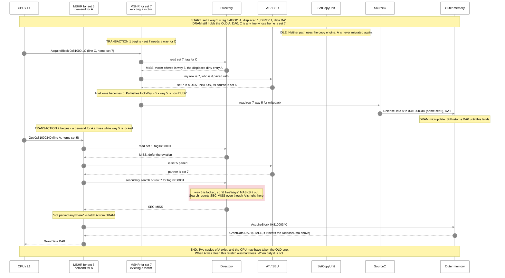

# After migration — every transaction, with sample data

**Status: as built and passing, 2026-08-30** (`sbc-serve-in-place-gate4-green`, GATE 4 green, 7/7).

This file is **only transaction diagrams**. It answers one question: once a line has been migrated out
of its home set, what happens to it next — in every case.

---

## The cast (real values from the passing run)

Geometry: **8 sets, 8 ways, 64-byte blocks.** Pairing under test: **set 5 is the hot source, set 7 is
its cold partner.**

| name | address | home set | tag as the directory records it | role |
|---|---|---:|---|---|
| **A** | `0x81000340` | 5 | `0x88001` | the line that gets migrated, then re-used |
| **B** | `0x80022F40` | 5 | `0x80117` | the line that refills into A's freed way |
| **V** | `0x81000140` | 5 | `0x88000` | a second resident of set 5 |

Data payloads are shown as `DA0`, `DA1`, … so you can follow which bytes are where.

> The tag column is what the directory actually stores. It is the address with the set-index and
> block-offset bits stripped, after bank interleaving — so it is **not** simply `address >> 9`. The
> values above are copied from the real run, not derived.

Directory entry shorthand used in the notes:

```
set 7 way 5 = tag 0x88001 | state TIP | displaced 1 | clients 0 | dirty 0
```

`displaced 1` means **the bytes are in row 7 but the address belongs to set 5.** That one bit is the
whole design.

---

## Index

| # | scenario | key point |
|---|---|---|
| 1 | Migration — how A gets parked | the setup for everything below |
| 2 | Read of a parked line, entry is TIP | serve in place, nothing moves |
| 3 | Write of a parked line, entry is TIP | serve, entry becomes TRUNK, stays displaced |
| 4 | Write of a parked line, entry is TRUNK | **probe the holder back, then serve** — the 9a fix |
| 5 | Write of a parked line, entry is BRANCH | serve **and** fetch permission — built, unexercised |
| 6 | Client releases a parked line dirty | a displaced line becomes dirty — the 9b consequence |
| 7 | Evicting a dirty parked line | Release must use the **home** address, not the row |
| 8 | Not parked anywhere | ordinary miss, for contrast |
| 9 | MMIO flush of a parked line | unsupported, and now asserted |

---

## 1 — Migration: how A gets parked in set 7

Set 5 is hot. A demand for **B** misses in set 5. Instead of throwing A away, the L2 moves it to the
cold partner and gives its way to B.



**A normal lookup of set 7 will never find A** — the directory excludes `displaced` ways from ordinary
hits. Only the secondary search can see it. That is what keeps two lines with the same tag in one row
from colliding.

---

## 2 — Read of a parked line, entry is TIP

The simple win. A is parked, nobody holds it, and the CPU wants to read it.



Compare with the old design, which copied A back into set 5 first — that cost one block copy, one
eviction of a healthy line, and one extra directory write, **per hit**.

---

## 3 — Write of a parked line, entry is TIP

Same as scenario 2, but the CPU wants to write. The entry ends up **TRUNK** — a client holds it
exclusively and may dirty it. **A displaced line is now client-held**, which the old invariant forbade.



---

## 4 — Write of a parked line, entry is TRUNK — **the 9a fix**

Another writer wants A while a client still holds it exclusively. This is the case that used to
destroy the line.



---

## 5 — Write of a parked line, entry is BRANCH

The one case that cannot be served as-is: the L2 only has a **shared** copy, so it has no write
permission to give. It serves in place **and** asks memory for permission — it does not erase and
refetch.

> ⚠️ **Built but never exercised.** `secPerm = 0` in the passing run — no secondary hit ever found a
> BRANCH entry. This path elaborates and is asserted safe. It is **not** proven working.



---

## 6 — A client releases a parked line, dirty

The L1 evicts A and writes it back. The L2 must find where A actually lives before it can accept the
data. This is why the C channel had to learn to search the partner set.



---

## 7 — Evicting a dirty parked line — the address split earns its keep

Set 7 is full and needs a way. It picks the displaced way 5. The bytes are in **row 7**, but the
address is **set 5**. Get this wrong and you corrupt an unrelated line in DRAM.



---

## 8 — Not parked anywhere: the ordinary path, for contrast

Most misses look like this. The search runs, finds nothing, and the normal machinery takes over. The
search costs one extra directory read and nothing else.



---

## 9 — MMIO flush of a parked line: unsupported, and now loud about it

A flush by address reaches the home set, which does not hold the line. Before, this was a **silent
no-op** — the flush reported success and the line stayed in the cache. Now it asserts.


---

## 10 — POSSIBLE BUG (unconfirmed): the search skips a locked way — safe when clean, maybe not after 9b

**Status: not observed, reachability not proven. Recorded for the findings register, not a confirmed defect.**

Serve-in-place is the first thing in this cache that puts **two MSHRs on one directory row at once** —
row 7's owner and set 5's borrower reaching in. The baseline forbade this (one MSHR per set,
`Scheduler.scala:214-215`), so it never needed a way-lock; SBC adds one (`MSHR.scala:432-436`) and the
directory refuses a busy way as a victim. That closes the *eviction* side.

The **search** side is protected differently: it masks out locked ways with `& freeWays`
(`Directory.scala:247-249`), and the comment says missing one is safe *"because the requester simply
fetches from memory instead."* That was true only while **`displaced ⇒ clean`** held — DRAM was always
current. **9b retired that.** If the search skips a **dirty** parked way, the requester fetches a
**stale** line from DRAM and two copies of the line exist at once.

This needs two transactions running together, so both are shown from their own start. They are on
**different home sets** (5 and 7), so the one-MSHR-per-set interlock never serialises them.



**Why it might still be safe.** Two guesses, neither verified:
- The in-flight `ReleaseData` and the demand `AcquireBlock` both name **A's real address** (home set
  5). If the outer fabric orders them, the demand may get the fresh DA1 — but that is an ordering
  assumption the baseline never had to make, because its one-per-set rule serialised the two on the
  directory itself.
- Reachability. The lock only bites while row 7's owner is *actively* evicting the parked way, in the
  same few cycles the borrower searches it. A single in-order Rocket core may not overlap them
  (`§10.7` already flags this for the way-lock case).

**Why it is worth recording anyway.** Same shape as the two hazards this project deferred rather than
dismissed — the `SBC_Reset` AT-wipe (`§10.9`) and the dirty-source blocker (`§10.10`) — each *"harmless
before 9b, and 9b changed exactly the thing the old reasoning rested on."* This is a third instance, on
the one path (`& freeWays`) whose safety comment still cites the retired invariant by name.

**Suggested next step:** do not write a directed case — a single core likely cannot force the overlap,
and claiming coverage would be faking it. Instead: (a) assert that a `SEC-MISS` never coincides with a
locked **dirty** displaced way in the searched row, so the S11 soak traps it if it ever occurs; and
(b) fix the `Directory.scala:246` comment, which still asserts refetch-is-safe on the strength of
`displaced ⇒ clean`.
