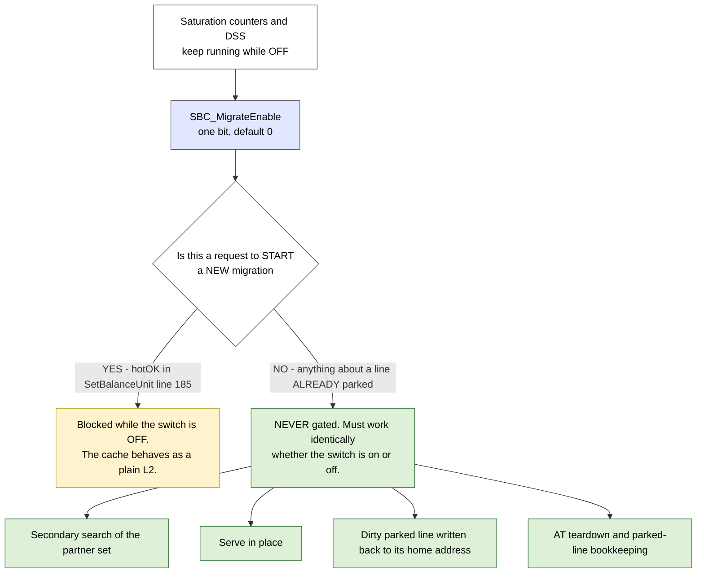
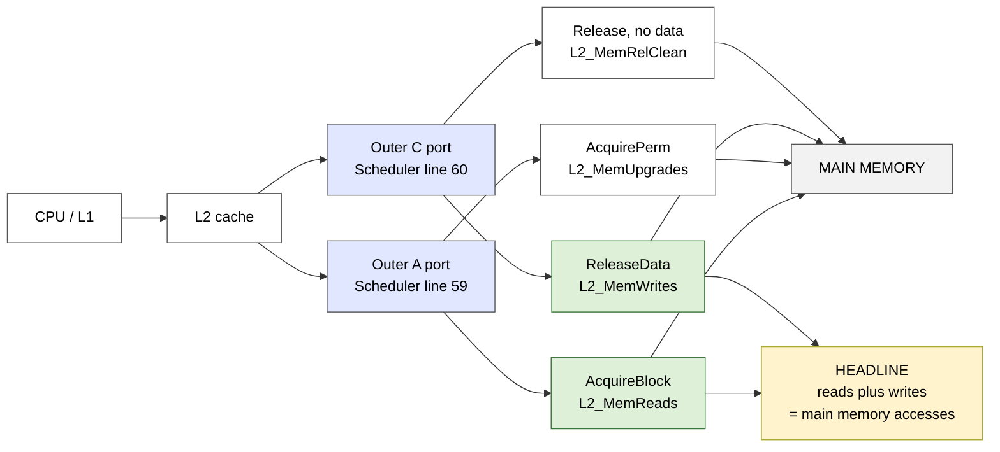
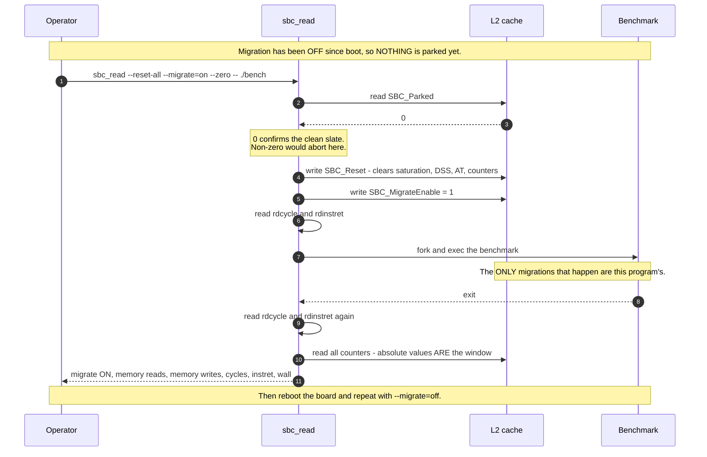
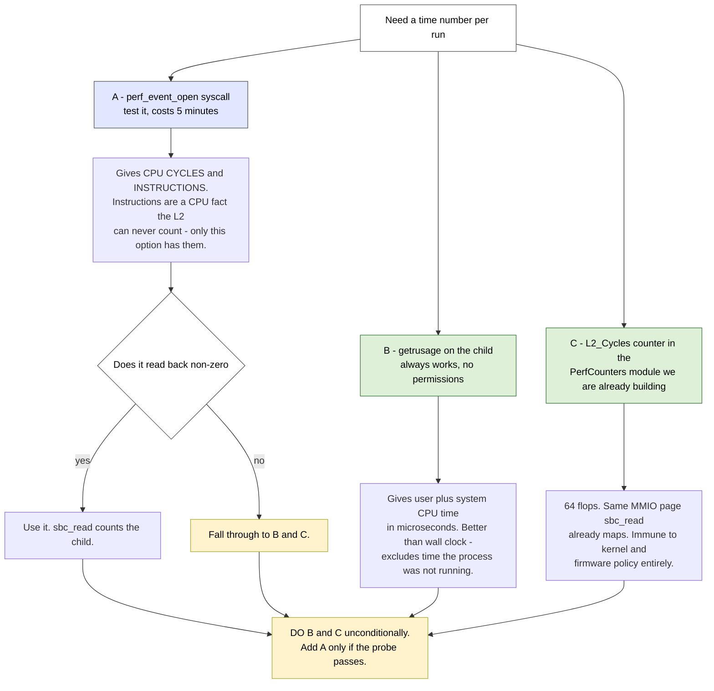
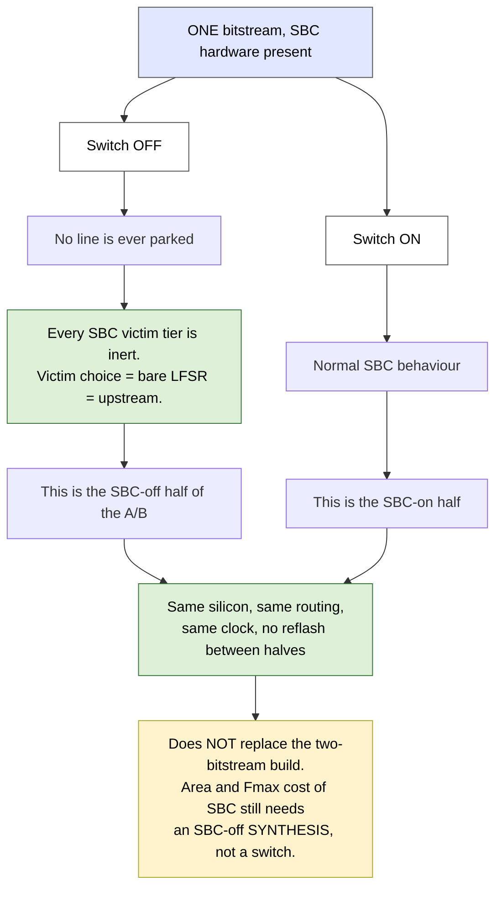

# Coder task 006 — migration on/off switch + main-memory traffic counters

**Filed:** 2026-09-10 · **Thinker → coder** · **Branch:** continue on `sbc-sampling`
**Baseline:** current `HEAD` (`d8671cf`) · **Status:** OPEN

---

## 0. Why this task exists (read this first)

We ran the first real A/B on the board — `520.omnetpp_r`, SBC on vs SBC off — and the numbers are
not trustworthy, for two reasons that have nothing to do with the SBC design itself:

1. **The measurement window is polluted by boot.** The cache starts migrating the moment Linux
   boots. By the time a benchmark starts, hundreds of lines are already parked. Zeroing the counters
   (`SBC_StatsReset`, 0x3B8) does not undo that — it only zeroes the counters, which is exactly what
   it was designed to do. There is no software way to un-park lines.
2. **We are measuring the wrong thing.** `L2_Accesses` / `L2_Hits` count directory lookups from every
   source — client write-backs, flushes, permission upgrades. Three of those inflate the hit rate and
   one (repeat-path hits) is invisible entirely. Both builds are inflated by roughly the same amount,
   so the *gap* is real, but no absolute number from either config can be quoted.

**The decision taken by the thinker (2026-09-10):**

- The headline metric becomes **main-memory accesses**, not hit rate. It is measured at the outer
  port, it does not depend on anyone's definition of "an access", and it is the thing that actually
  costs time on a real machine. If SBC reduces memory traffic for the same program, SBC helps.
- Migration gets an **on/off switch, default OFF**, so the measured window starts from a genuinely
  clean cache without needing a flush mechanism we do not have.
- **Cycle counting stays in software** — `rdcycle` / `rdinstret`, which this project already uses
  (`sw/matmult_stress.c:24`, `sw/misshit_generator.c:15`). **No cycle-counting hardware is in scope.**
  > ⚠️ **Reversed by Amendment 1 (§11).** The §6 pre-flight was run on the board on 2026-09-10 and
  > `rdcycle` **traps** from user mode. A small cycle counter is now in scope. Read §11 before
  > starting Part B.

Everything above is one work order because the three pieces share one measurement recipe and one
software tool.

---

## 1. Scope at a glance

| Part | What | Where | New hardware? |
|---|---|---|---|
| **A** | `SBC_MigrateEnable` — one R/W bit, default OFF, gates only the start of a *new* migration | `Control.scala`, `Scheduler.scala`, `SetBalanceUnit.scala:185` | 1 register + 1 AND term |
| **B** | Four main-memory traffic counters, in their own module, behind their own flag | new `PerfCounters.scala`, `Scheduler.scala`, `Control.scala` | 4 × 64-bit counters |
| **C** | `sbc_read` learns the switch, the reset ordering, and cycle/instret/wall timing | `sw/sbc_read.c`, `sw/sbc_mmio.h` | none |
| **D** | Docs: `CLAUDE.md` register table, `ai-documents/guides/devmem-register-map.md` | — | none |

**Out of scope, explicitly:** any change to `L2_Accesses` / `L2_Hits` (they stay exactly as they
are); the A-channel hit decomposition and interval sampler of task 005; any change to victim
selection in `Directory.scala`; any change to how migrations work once started.

---

## 2. Part A — `SBC_MigrateEnable`

### A.1 The gate

There is exactly one place a new migration can start. `SetBalanceUnit.scala:185`:

```scala
val hotOK = (params.micro.sbcAutoMigrate.B || armed(qSet)) && (sat(qSet) >= tHi)
```

`hotOK` feeds `io.migrateResp.migrate` (`:186`), whose only consumer is `adviceMigrate`
(`Scheduler.scala:652`). Verified by grep 2026-09-10 — there is no second path.

**Change:**

```scala
// SBC: MMIO master switch. Gates only the START of a new migration; every already-parked
// line keeps being searched, served, written back and evicted exactly as before.
val hotOK = io.migrateEnable && (params.micro.sbcAutoMigrate.B || armed(qSet)) && (sat(qSet) >= tHi)
```

### A.2 What must keep working while the switch is OFF

This is the part that is easy to get wrong. **Do not gate the SBC flow — gate only the decision to
start a new migration.** With the switch OFF, all of the following must behave exactly as they do
today:

- the secondary search of a partner set (`internalRead` path)
- serve-in-place of an already-parked line
- write-back of a dirty parked line at its home address (`dispRelease`)
- silent drop of a clean parked line (`dispDrop`)
- AT teardown, `parkCount` / `nParked` bookkeeping
- saturation counters and the DSS — **these keep running.** We want to see heat build up even when
  migration is off; it is also what makes the "arm then run" recipe possible.

Consequence: **flipping the switch off mid-run is always safe.** Nothing is stranded, because
nothing that is already parked depends on the switch.



### A.3 The register

`0x3C0` — `SBC_MigrateEnable`, **read/write**, 1 bit, `RegInit(false.B)`.

- Read-back is mandatory, not optional. Every counter dump must be able to say which state the
  switch was in, or a reading is uninterpretable six weeks later.
- Wire it exactly like `sbcSetSel` (a plain `RegField` over a `RegInit`), not like the write-only
  pulse fields. It is level, not a pulse.
- Plumb it `Control.scala` → `InclusiveCache.scala` → `Scheduler.scala` → `SetBalanceUnit.io`,
  following the existing `sbc_stats_reset` path. Tie it down the same way when
  `enableSetBalancing = false`.

### A.4 The stale-heat problem, and the assert that goes with it

If migration is off from boot until the benchmark starts, the saturation counters have been heating
up the whole time. The instant the switch goes on, a burst of migrations fires from boot-time heat,
not from the benchmark.

**The fix is in software ordering, not in hardware:** while migration has been off since boot,
nothing is parked, so the full `SBC_Reset` (0x358) is safe *at that one moment* — it wipes
saturation, DSS, AT and counters together. The recipe in §4 does exactly that.

**Add one sim-only assert** (`SetBalanceUnit.scala`, next to the existing `io.clear` handling):

```scala
// SBC_Reset while lines are parked orphans them - the AT is their only home-set record.
assert (!io.clear || nParked === 0.U, "SBC_Reset issued while lines are still parked")
```

This is the net that makes the "reset then arm" recipe safe to automate. If it fires, the software
sequenced the run wrongly and the numbers from that run are void.

---

## 3. Part B — main-memory traffic counters

### B.1 What to count, and where

Everything the L2 sends toward main memory leaves through two ports, both wired in
`Scheduler.scala:59-60`:

- `io.out.a` ← `sourceA.io.a` — Acquires. `AcquireBlock` fetches a block from memory;
  `AcquirePerm` asks for permission only and moves no data.
- `io.out.c` ← `sourceC.io.c` — Releases. `ReleaseData` writes a dirty block to memory;
  a plain `Release` moves no data.

| Counter | Fires when | Meaning in one line |
|---|---|---|
| `L2_MemReads` | outer `AcquireBlock` issued | **a block was read from main memory** |
| `L2_MemWrites` | outer `ReleaseData` issued | **a dirty block was written to main memory** |
| `L2_MemUpgrades` | outer `AcquirePerm` issued | a permission round trip — costs latency, moves no bytes |
| `L2_MemRelClean` | outer `Release` (no data) issued | a clean eviction announced — moves no bytes |

**The headline number is `L2_MemReads + L2_MemWrites`.** Bytes moved =
`(L2_MemReads + L2_MemWrites) × blockBytes`.

Report reads and writes **separately** in every result table. SBC can plausibly trade one for the
other — a parked dirty line that would have been dropped now gets written back — and a combined
figure would hide that.

### B.2 Exact hook points

- **A side:** count on `io.out.a.fire` in `Scheduler.scala`, decoding
  `io.out.a.bits.opcode === TLMessages.AcquireBlock` vs `AcquirePerm`. The outer A message is single
  beat, so one `fire` is one memory access. Count at the port, not inside `SourceA`, so the
  `outerBuf` cannot cause a double count.
- **C side:** count on `sourceC.io.req.fire`, using `sourceC.io.req.bits.dirty` to split
  `ReleaseData` from `Release`. **Do not count `io.out.c.fire`** — outer C is multi-beat for
  `ReleaseData` and would count one eviction four times. `SourceC.scala:81` (`io.req.ready := !busy
  && room`) plus `:99` guarantees `io.req.fire` is exactly once per outer release.

Add a sim-only cross-check that the two agree, so a future change to `SourceC` cannot silently break
the count:

```scala
// One io.req.fire per outer release: the beat count must reconcile.
assert (memWriteBeats === memWrites * beatsPerBlock.U)
```

(Only where `blockBytes =/= outer beatBytes`; otherwise it is trivially true.)

### B.3 The module and its flag

Put all four counters in **one new module**, `design/craft/inclusivecache/src/PerfCounters.scala`,
instantiated once per bank from `Scheduler.scala`.

- New micro-parameter in `InclusiveCacheMicroParameters` (`Parameters.scala`):
  `enablePerfCounters: Boolean = true`.
- When `false`, the module is not instantiated and the MMIO fields read as zero — **zero hardware**,
  per the standing convention in `CLAUDE.md` § Conventions. This gives us a clean bitstream for area
  and timing characterisation without hand-editing the RTL.
- Default is `true` so every existing build keeps measuring. Only the area-characterisation config
  sets it `false`.

**These counters are NOT gated by `enableSetBalancing`.** The whole point is comparing a build that
has SBC against one that does not — they must exist and count identically in both.

### B.4 Reset behaviour

Add all four to the `SBC_StatsReset` (0x3B8) clear list, alongside the twelve SBC counters and
`L2_Accesses` / `L2_Hits`. They are event counters; `sbc_read --zero` must window them.

They must **not** be touched by `SBC_Reset` (0x358) — same rule as `L2_Accesses` / `L2_Hits` today.



### B.5 Why this metric and not hit rate

Worth writing into `REPORT.md` so it does not get re-litigated:

- A hit-rate number needs a *denominator*, and every candidate denominator is a judgement call
  (does an L1 write-back count? a flush? a permission upgrade?). That judgement is exactly where
  `L2_Accesses` went wrong.
- A memory-access count has no denominator. It is a count of things that physically happened at the
  memory port.
- Memory accesses are also what dominates real runtime, so a reduction is directly a performance
  claim rather than a proxy for one.

**The one condition:** the two runs must execute **the same program to completion**. Fewer memory
accesses over a fixed 600-second wall-clock window can simply mean the machine did less work. This
is why §4 uses `sbc_read --zero -- <cmd>` on a benchmark input that finishes, not
`sw/run_sbc_window.sh`'s fixed-duration window.

---

## 4. Part C — software: `sbc_read` and the measurement recipe

No hardware. `sw/sbc_read.c` gains:

| Flag | Behaviour |
|---|---|
| `--migrate=on` / `--migrate=off` | write `SBC_MigrateEnable` (0x3C0) |
| `--reset-all` | write `SBC_Reset` (0x358), but **refuse** if `SBC_Parked` (0x3A0) is non-zero, unless `--force` is also given |
| (always) | print `migrate: ON` / `migrate: OFF` / `migrate: n/a` on **every** dump. `n/a` when `SBC_Status` bit 0 says SBC is not built in |
| (in `-- <cmd>` mode) | print `cycles`, `instret` and wall-clock seconds for the child, read with `rdcycle` / `rdinstret` around the `fork`/`wait` |

`sw/sbc_mmio.h` gains the five new offsets (`0x3C0`, `0x3C8`, `0x3D0`, `0x3D8`, `0x3E0`) and
`sw/sbc_read.c`'s register table gains the four counters at 64 bits.

If `rdcycle` traps (`SIGILL`) because Linux has not set `scounteren`, fall back to wall clock only
and print `cycles: unavailable` rather than a wrong number. §6 has the command to test this before
the work starts.

### The recipe this unlocks



**Reboot between the two halves of an A/B.** There is no way to un-park lines from software: a
parked line is last priority for eviction (`Directory.scala` tier 5, from commit `322494a`), so no
amount of memory pressure will flush them out. Reboot is the clean slate.

---

## 5. Register map additions

| Offset | Name | R/W | Width | Notes |
|---|---|---|---|---|
| `0x3C0` | `SBC_MigrateEnable` | R/W | 1 | **Default 0 (OFF).** Gates only the start of a new migration |
| `0x3C8` | `L2_MemReads` | R | 64 | outer `AcquireBlock` — blocks read from main memory |
| `0x3D0` | `L2_MemWrites` | R | 64 | outer `ReleaseData` — dirty blocks written to main memory |
| `0x3D8` | `L2_MemUpgrades` | R | 64 | outer `AcquirePerm` — permission only, no bytes |
| `0x3E0` | `L2_MemRelClean` | R | 64 | outer `Release` without data — no bytes |

Current map ends at `0x3B8`. Update, **in the same commit**: `sw/sbc_mmio.h`, the register table in
`CLAUDE.md`, and `ai-documents/guides/devmem-register-map.md`.

---

## 6. Before you start — check the software cycle counters work

Run this once. It decides whether Part C prints real cycles or falls back to wall clock.

```bash
cat > /tmp/cyc.c <<'EOF'
#include <stdio.h>
#include <stdint.h>
#include <time.h>
static inline uint64_t rdcycle(void)  { uint64_t x; asm volatile("rdcycle %0"  : "=r"(x)); return x; }
static inline uint64_t rdinstret(void){ uint64_t x; asm volatile("rdinstret %0": "=r"(x)); return x; }
int main(void) {
    struct timespec t0, t1;
    clock_gettime(CLOCK_MONOTONIC, &t0);
    uint64_t c0 = rdcycle(), i0 = rdinstret();
    for (volatile long k = 0; k < 20000000; k++) { }
    uint64_t i1 = rdinstret(), c1 = rdcycle();
    clock_gettime(CLOCK_MONOTONIC, &t1);
    double s = (t1.tv_sec - t0.tv_sec) + (t1.tv_nsec - t0.tv_nsec) / 1e9;
    printf("cycles=%llu instret=%llu wall=%.3fs -> %.2f MHz, IPC=%.3f\n",
           (unsigned long long)(c1 - c0), (unsigned long long)(i1 - i0), s,
           (double)(c1 - c0) / s / 1e6, (double)(i1 - i0) / (double)(c1 - c0));
    return 0;
}
EOF
riscv64-unknown-linux-gnu-gcc -O2 -static -o cyc /tmp/cyc.c
riscv64-unknown-linux-gnu-strip cyc
# copy `cyc` to the board the same way sbc_read is copied (ai-documents/guides/fpga-linux-run.md), then:
./cyc
```

**Reading the result:**

- Prints numbers, and the MHz matches the board clock → user-mode CSR reads work. Part C prints real
  cycles.
- `Illegal instruction` → Linux has not set `scounteren`. Part C prints wall clock only. Do not spend
  time fixing the kernel for this; wall clock on a fixed-work benchmark is sufficient.
- IPC well below 0.1 on that empty loop means the counters are counting something odd — report it.

Supporting probes on the board, all cheap:

```bash
cat /proc/cpuinfo
dmesg | grep -i -e pmu -e perf -e counter
ls /sys/bus/event_source/devices/ 2>/dev/null || echo "no perf event sources"
command -v perf time || echo "no perf, no /usr/bin/time - use shell builtin time"
```

---

## 7. Verification gates

| # | Gate | Pass condition |
|---|---|---|
| G0 | Elaborate `…NoSbcConfig` with `enablePerfCounters=false` | bit-exact with the pre-006 NoSbc build; zero new hardware |
| G1 | Elaborate `…NoSbcConfig` with `enablePerfCounters=true` | the four memory counters exist and count; `L2_Accesses`/`L2_Hits` byte-identical to today |
| G2 | `migration_stress_test`, SBC on, `SBC_MigrateEnable=1` | 7/7 PASS, 0 asserts — **unchanged** from `d8671cf` |
| G3 | `migration_stress_test`, SBC on, `SBC_MigrateEnable=0` | 7/7 PASS, `SBC_Migrations` = 0, `SBC_Parked` = 0, and `L2_Accesses`/`L2_Hits`/memory counters **match the NoSbc run** to within the OR-reduction noise. This is the real test of "the switch off means a plain L2." |
| G4 | Flip the switch off mid-run with lines parked | no assert, no hang, `SBC_SecHits` keeps rising, `SBC_DispRelease`/`SBC_DispDrop` keep rising — parked lines are still served and still retired |
| G5 | Memory-counter identity, one Verilator run | `L2_MemReads` equals the count of `OUTER-A` debug lines when `sbcDebug=true`; `L2_MemWrites × beatsPerBlock` equals outer C data beats |
| G6 | `SBC_Reset` while parked | the new assert fires in sim; `sbc_read --reset-all` refuses on the board |
| G7 | `sbc_read --reset-all --migrate=on --zero -- ./bench` end to end on the board | one output block containing migrate state, all counters, cycles/instret (or an explicit `unavailable`), and wall clock |

**Control config:** `SingleRocketVCU118L18K256K16WL2ConfigNoSbc`.
**Regression control:** `VerilatorRocket8KL116KL2NoSbcConfig` for the Verilator gates.

---

## 8. Relationship to task 005

Task 005 (`ai-documents/coder/005-hit-accounting-and-sampling/`) is **not being folded in and not
being deleted.** It stays open and un-started.

The reason: 005 exists to make the *hit rate* honest. Since the headline metric is now memory
traffic, 005 is no longer blocking any result — it became a nice-to-have for a secondary number.
Re-open it after 006 lands and after the re-run in
`ai-documents/performance/workplan-parked-occupancy-2026-09-11.md` produces a memory-traffic differential.

One thing 005 established that **still binds here**: `L2_Accesses` / `L2_Hits` must not change.
Everything in 006 is additive.

---

## 9. Suggested commit split

Four commits, each independently green:

1. `SBC: SBC_MigrateEnable (0x3C0) — MMIO switch for starting new migrations, default off`
2. `SBC: main-memory traffic counters in a switchable PerfCounters module`
3. `SBC: sbc_read learns --migrate, --reset-all, and child cycle/instret timing`
4. `docs: register map + CLAUDE.md for 006`

Keep the SW-header update in the **same commit** as the register it describes (CLAUDE.md rule).

---

## 10. Things to report back even if they look small

- Whether `rdcycle` works from user mode on this board (§6). It changes what every future run can
  claim.
- Whether `L2_MemRelClean` is ever non-zero. If the L2 never announces clean evictions outward, say
  so and we will drop the counter rather than carry a permanently-zero register.
- The G3 delta between "SBC built, switch off" and "SBC not built at all". If it is not
  near-zero, something in the SBC path is affecting the baseline and that is a finding in its own
  right, not a rounding error to wave off.
- Anything in the RTL that contradicts this work order. Per the standing rule: surface it, do not
  work around it silently.

---

## 11. Amendment 1 (2026-09-10) — the software cycle counters do not work on this board

The §6 pre-flight was run before the task started. **It failed.** This amendment records the evidence
and adds one small piece of hardware that §0 originally ruled out.

### 11.1 Evidence

`./cyc` on the board:

```
unhandled signal 4 code 0x1 at 0x0000000000010434 in cyc
cause: 0000000000000002   badaddr: 00000000c00029f3
Illegal instruction
```

`badaddr` carries the faulting instruction word. Decoded:

| bits | value | meaning |
|---|---|---|
| [31:20] | `0xC00` | CSR = `cycle` |
| [19:15] | `x0` | rs1 |
| [14:12] | `010` | CSRRS |
| [11:7] | `x19` | rd (= `s3`, matches the register dump) |
| [6:0] | `0x73` | SYSTEM |

That is `rdcycle s3`, `cause = 2` (illegal instruction). It is the `cycle` CSR specifically.

Supporting evidence from the same session:

| Probe | Result | What it means |
|---|---|---|
| `cat /proc/cpuinfo` → `isa: rv64imafdc_zicntr_zicsr_zifencei_zihpm` | **`zicntr` present** | the counters **exist in hardware**. This is a permission problem (`mcounteren` / `scounteren`), not missing hardware |
| `dmesg \| grep -i -e pmu -e perf -e counter` | empty | no RISC-V PMU driver announced itself |
| `ls /sys/bus/event_source/devices/` | `cpu  software` | but a kernel `cpu` PMU **is** registered — the `perf_event_open` syscall may still work |
| `command -v perf time` | nothing | no `perf` binary, no `/usr/bin/time`. Shell builtin `time` only |

**Do not try to fix the kernel or firmware for this.** Granting user-mode access means rebuilding
OpenSBI's `mcounteren` or Linux's `scounteren` and re-flashing — days of yak-shaving that does not
help the L2-side measurement at all.

### 11.2 Three ways forward, and which to take



### 11.3 Part E (new) — `L2_Cycles`

Add to the **same** `PerfCounters.scala` module as Part B, under the **same** `enablePerfCounters`
flag:

```scala
// Free-running L2 clock counter. Reset by SBC_StatsReset, so `sbc_read --zero -- cmd`
// yields exactly the cycles the child ran for.
val cycles = RegInit(0.U(64.W))
cycles := cycles + 1.U
when (io.clearStats) { cycles := 0.U }
```

| Offset | Name | R/W | Width | Notes |
|---|---|---|---|---|
| `0x3E8` | `L2_Cycles` | R | 64 | free-running L2 clock; **in the `SBC_StatsReset` clear list** like the other counters |

**Caveat to write into `REPORT.md`:** this counts the **L2 / uncore clock**, not necessarily the core
clock. On this VCU118 config they are expected to be the same domain — **confirm it and say so.** Even
if they are not, the number is still valid as an SBC-on vs SBC-off ratio at a fixed frequency.
Calibrate once with `sbc_read --zero`, `sleep 10`, `sbc_read`, and compare the delta against 10 s.

**What `L2_Cycles` cannot give us: instruction count.** Instructions retired is a core fact. If
option A works, we get IPC; if not, we have cycles and CPU time but no IPC. That is acceptable —
main-memory accesses remain the headline metric and do not need IPC.

### 11.4 Part C revised — what `sbc_read` prints

For `-- <cmd>` mode, in this order of preference, printing whichever is available:

1. `L2_Cycles` delta — always available once Part E lands. **This is the primary time number.**
2. `perf_event_open` cycles + instructions — only if §11.5's probe passes. Gives IPC.
3. `getrusage(RUSAGE_CHILDREN)` user + system CPU time — always available, no permissions needed.
4. wall clock via `clock_gettime(CLOCK_MONOTONIC)` — always available.

Drop the `rdcycle` / `rdinstret` inline-asm approach from Part C entirely. It traps here.

### 11.5 The probe for option A

Already cross-compiled and staged at `sw/build/pe` (source `sw/build/pe.c`). It opens
`PERF_TYPE_HARDWARE` / `PERF_COUNT_HW_CPU_CYCLES` and `PERF_COUNT_HW_INSTRUCTIONS` via
`perf_event_open`, runs a fixed loop, and prints both.

On the board:

```bash
cat /proc/sys/kernel/perf_event_paranoid    # expect <= 1; we are root, so any value should be fine
./pe
```

- Prints non-zero cycles and instructions → option A works. Wire it into `sbc_read`, and we get IPC.
- `perf_event_open failed: ...` or counters read back 0 → the `cpu` PMU is registered but not backed
  by real counters. Skip option A. **Report the exact errno either way.**

A companion probe `sw/build/csrprobe` (source `sw/build/csrprobe.c`) traps each of `rdcycle`,
`rdtime`, `rdinstret` under a `SIGILL` handler and reports which are permitted individually. Run it
once and record the three-line result in `REPORT.md` — it is the permanent record of what this board
allows.

### 11.6 Gates added

| # | Gate | Pass condition |
|---|---|---|
| G8 | `L2_Cycles` calibration | `--zero`, `sleep 10`, read → delta / 10 equals the board clock in Hz, within 1% |
| G9 | `L2_Cycles` windowing | `sbc_read --zero -- ./bench` cycle count is consistent with the wall clock for the same run |
| G10 | `sw/build/pe` result recorded | option A verdict + errno in `REPORT.md`, whichever way it goes |

---

## 12. Amendment 2 (2026-09-10) — probe results, and the one-bitstream A/B

### 12.1 Probe results — option A is dead, `rdtime` survives

```
# ./pe
cycles       perf_event_open failed: Invalid argument
instructions perf_event_open failed: Invalid argument

# ./csrprobe
rdcycle    TRAPS   (illegal instruction)
rdtime     OK      value=564750466
rdinstret  TRAPS   (illegal instruction)
```

- **Option A (`perf_event_open`) is dead.** `EINVAL` on both hardware events: the `cpu` PMU is
  registered but has no real backing counters. Do not wire it into `sbc_read`.
- **`rdtime` works.** The grant is selective — `mcounteren`/`scounteren` give TM but not CY or IR.
  That makes `rdtime` a single-instruction, no-syscall monotonic timestamp available from user mode.
- **Instruction count is unavailable on this board, by any route.** Accept it. No IPC. State it once
  in `REPORT.md` and move on — main-memory accesses remain the headline metric.

**Part C revised time sources**, replacing §11.4:

1. `L2_Cycles` delta (Part E) — **primary**, the only true cycle count.
2. `rdtime` delta — cheap, no syscall. **Calibrate the timebase first** (below).
3. `getrusage(RUSAGE_CHILDREN)` — user + system CPU time, excludes descheduled time.
4. `clock_gettime(CLOCK_MONOTONIC)` wall clock.

Timebase calibration, once, recorded in `REPORT.md`:

```bash
cat /proc/device-tree/cpus/timebase-frequency | od -An -tu4 --endian=big
dmesg | grep -i -e timebase -e clocksource -e riscv_timer
```

Cross-check it by reading `rdtime` 10 seconds apart and dividing. If the DT value and the measured
value disagree, **trust the measurement** and say so.

### 12.2 The one-bitstream A/B — feasible, and G3 is what decides it

The question: can SBC-on and SBC-off both be measured on **one** bitstream, using
`SBC_MigrateEnable`, instead of building two? (This was recorded as the preferred method back on
2026-06-17 and is now within reach.)

**Traced through the RTL 2026-09-10. With the switch off from boot, nothing is ever parked, and the
whole SBC datapath reduces to upstream by construction:**

| SBC addition | State when the switch is off | Reduces to upstream? |
|---|---|---|
| `preferEvictable` (tier 2) | driven by `adviceMigrate` (`Scheduler.scala:447`), which is gated by `hotOK` | ✅ never asserted |
| `preferInvalid` (tier 1) | only from the dread lane (`Scheduler.scala:430`), and `dread.valid = doSearch \|\| doDread` (`MSHR.scala:580`) — both need a pairing or a migration | ✅ never asserted |
| `nonDisplacedOH` mask (tier 3) | no line is ever `displaced` → mask is all ones | ✅ no effect |
| tiers 4 and 5 | unreachable while tier 3 always yields | ✅ dead |
| `busyWays` / `freeWays` | one MSHR per set (`Scheduler.scala:214-215`) and no serve-in-place → no second MSHR in the row → mask is zero for the read in flight | ✅ no effect |
| `dstSetConflict` stall | needs `dstValid` or `secValid`, neither of which is ever set | ✅ no stalls |
| SBU saturation counters + DSS | keep running | observation only, no backpressure |

Upstream victim selection (`git show 46e20be:…/Directory.scala:117`) is the bare LFSR pick. Ours
with the switch off is `lfsrVictimOH & (all ones) & (all ones)` — **the same pick.**



**What it buys:** the two halves share silicon, routing and clock. Build-to-build place-and-route
variation is removed as a confound, and no reflash is needed between halves.

**What it does NOT buy — say this in the thesis, do not let it slide:**

- **Area and Fmax cost of SBC.** The SBC hardware is physically present in this bitstream. Measuring
  what SBC costs in gates and timing still requires a separate `…NoSbc` **synthesis**. Keep that
  build; it just stops being the performance control.
- **Absolute cycle counts.** If SBC's presence lowers Fmax, *both* halves run at that lower clock.
  The ratio is fair; the absolute numbers are not "what a real SBC machine would do". Report the
  achieved Fmax of both builds alongside.

**Run ordering matters, and it removes a reboot:**

1. Boot. Switch is OFF. Run the **SBC-off half first** — nothing parks.
2. `sbc_read --reset-all --migrate=on --zero -- ./bench` for the SBC-on half. `--reset-all` is safe
   here precisely because half 1 parked nothing.
3. The reverse order needs a reboot, because half 1 would leave lines parked that nothing can flush.

Residual cache warmth from half 1 carries into half 2. For a SPEC working set against 256 KB this is
negligible, but **do one reboot-separated repeat** to confirm it, and report both.

**G3 is now load-bearing, not a formality.** The table above is an argument from reading the RTL, not
a measurement. If G3 shows a non-trivial delta between "switch off" and "NoSbc build", either there
is a bug or the one-bitstream method does not hold — and we fall back to two bitstreams. Run G3
before committing the methodology.

### 12.3 Gates added

| # | Gate | Pass condition |
|---|---|---|
| G11 | `rdtime` timebase calibration | DT value and the measured 10-second delta agree; both recorded |
| G12 | One-bitstream A/B, order (1) then (2) above | result matches the reboot-separated repeat within run-to-run noise |

---

## 13. Amendment 3 (2026-09-14) — the results are in. Close out the REPORT and the 64-bit change

**Why:** the fixed-work A/B this task exists for has run on the board. Three pairs finished between
2026-09-11 and 09-13; the thinker recovered them from `chipyard/scripts/logs/`. The REPORT does not
have them, its Verdict still says Parts B–E are untouched, and a 32→64-bit counter change sits
uncommitted in the working tree. **No new RTL features in this amendment.**

### 13.1 Put the results in REPORT → "Numbers"

- Source: `ai-documents/performance/fpga-ab-baseline-2026-09-11.md` §4. All values there are copied from the logs.
- Use **pair B** as the main table (256 KB, the real geometry, the longest run). Add A and C as extra rows.
- Quote reads and writes separately.
- `instret` row: "not available on this board" (Amendment 1).
- Say plainly: one run per pair; no reboot-separated repeat yet, so G12 is still open.

### 13.2 Refresh the top of the REPORT

- **Status + Summary:** Parts A, B, D, E landed; C partial (child timing not done).
- **Verdict:** replace the three G3 options with what happened — the one-bitstream method is accepted
  (board: 90.19% vs 90.24%), the fixed-work A/B is done, and SBC is slower.
- **Gates table:** mark what now has board evidence (G7, G9). G6, G8, G11, G12 stay open unless you run them.

### 13.3 Finish the 64-bit SBC counter change

`Control.scala` and `SetBalanceUnit.scala` (uncommitted) widen the SBC event counters from 32 to 64
bits. The software and docs still assume 32. Land it as **one commit** with:

| file | change |
|---|---|
| `sw/sbc_read.c` | `REGS[]` width 32 → 64 for every widened counter (`0x328`…`0x3A0`; not `0x398`). Drop the `& 0xffffffffULL` on `parked` (~L173). Fix the 32-bit comments (~L36-37, L60-62, L216-217) |
| `ai-documents/guides/devmem-register-map.md` | `devmem … 32` → `64` on the same rows |
| `ai-documents/guides/fpga-linux-run.md` | ~L92: "32-bit-wrap-safe DELTA" → "DELTA" |
| `CLAUDE.md` register table | mark those rows `64`, like `0x3C8`–`0x3E8` |

Before committing:
- `migration_stress_test` 7/7, 0 asserts; `sbc_migrate_switch_test` 4/4 (via `make run-binary`).
- Elaborate both the SBC and NoSbc configs.
- Report the FF/LUT cost of the wider counters if a synth report exists; if not, say so.

### 13.4 Still open — report on them, do not start them

- `sbc_read` child timing (`rdtime` / `getrusage`) — optional now that `L2_Cycles` works.
- `L2_Cycles` clock domain — is the L2 clock the CPU clock on the VCU118 config? Answer by reading the config; no run needed.

---

## 14. Amendment 4 (2026-09-14) — 64-bit is a must. Finish it before anything else

Damith needs 64-bit counters for every long board run. §13.3 now **blocks** closing this task.

1. **One more 32-bit leftover:** `sw/run_sbc_window.sh:9` still says the SBC counters "WRAP silently". Fix the comment.
2. **Before the commit:** `migration_stress_test` 7/7 and `sbc_migrate_switch_test` 4/4 through
   `make run-binary`; elaborate both the SBC and NoSbc configs. Put the results in REPORT.
3. **After the commit:** the board keeps reading 32-bit counters until a bitstream is rebuilt from this
   commit. Say in REPORT which bitstream was rebuilt, or that it is still owed.
4. **One REPORT wording fix (Verdict):** it says "the two same-work halves agree (90.19% vs 90.24%)".
   Those two numbers are the switch-off half of one bitstream vs a separately built NoSbc bitstream,
   both in fixed-time windows. The OFF half is "SBC built but switched off", not "no SBC" — the board
   check says that gap is small. Say that instead.

---

## 15. Amendment 5 (2026-09-14) — close-out checklist, and what comes next

**Why:** thinker review of the working tree on 2026-09-14. Amendment 4 is still the job. This adds
three REPORT corrections and says how to split the commit, because the tree now also holds thinker
doc edits. **No new RTL.**

### 15.1 Still owed from Amendment 4 (none of it is done yet — checked 2026-09-14)

- [ ] `migration_stress_test` 7/7, 0 asserts, and `sbc_migrate_switch_test` 4/4, through `make run-binary`.
      `sw/verilator_logs/` has nothing newer than `006-partB-counters`.
- [ ] Elaborate `VerilatorRocket8KL116KL2Config` and `VerilatorRocket8KL116KL2NoSbcConfig`.
- [ ] `sw/run_sbc_window.sh:9-12` still says the SBC counters are 32-bit and "WRAP silently". Fix the comment.
- [ ] REPORT Verdict wording (Amendment 4 item 4).
- [ ] Commit, then record the bitstream status (Amendment 4 item 3, and 15.4 below).

### 15.2 Three more REPORT corrections

1. **Verdict** says "The 64-bit counter widening (§13.3) is landed". It is changed in the tree but not
   tested or committed. Replace it with the commit hash once it is.
2. **What was built → `sbc_mmio.h` row** says the five counter offsets are "declared but no hardware
   answers them yet". Part B landed, so they answer. Mark it ✅.
3. **Summary** repeats "the two same-work halves agree to within noise (90.19% vs 90.24% hit rate)" —
   same correction as Amendment 4 item 4.

Leave gate G0 open in the REPORT with a pointer: task 005's first check (V1) elaborates the
`enablePerfCounters = false` build.

### 15.3 How to split the commit

The working tree also holds thinker doc edits: `CLAUDE.md`, `ai-documents/README.md`,
`ai-documents/coder/README.md`, the new `ai-documents/guides/cache-terminology.md`,
`ai-documents/guides/devmem-register-map.md`, this TASK, task 005's TASK, the 003 REPORT,
`tasks/phase-3.md`, the workplan, the 2026-09-14 weekly report, and `performance/why-sbc-loses-2026-09-15.md`.
Keep all of them **out** of the 64-bit commit.

- **64-bit commit:** `Control.scala`, `SetBalanceUnit.scala`, `sw/sbc_read.c`, `sw/run_sbc_window.sh`,
  and this task's `REPORT.md`.
- **Docs commit:** everything else — or leave it to the user.

### 15.4 Bitstream — recommendation, the user decides

Do **not** rebuild the bitstream for the 64-bit change alone. Task 005 changes the register map again,
so rebuild **once**, after 005 lands. Short board runs this week are safe on the current 32-bit image:
the fastest counter (`secMiss`, about 11% of L2 lookups) needs about 5 hours at ~2 M lookups/s to wrap.
If the user needs a long run before 005 lands, rebuild now. Record which in REPORT.

### 15.5 After this commit

This task closes. Task 005 is next — its TASK now ends with Amendment 1. The hit/miss words it is
built on are in `ai-documents/guides/cache-terminology.md`; read that first.

### 15.6 Correction (2026-09-14, later the same day) — the 64-bit commit had already landed

15.1 was wrong, and so were parts of 15.2 and 15.3. The 64-bit commit landed at 13:54 as **`06fcca8`**
(`Control.scala`, `SetBalanceUnit.scala`, `sw/sbc_read.c`), before this amendment was written. Its
message reports: generated Verilog is 64-bit for all 13 counters, `migration_stress_test` 7/7 PASS,
`sbc_migrate_switch_test` PASS, NoSbc config elaborates. The tree has no 32-bit counter left.

What is really left:
- [ ] `sw/run_sbc_window.sh:9-12` — the stale 32-bit comment. It was not in that commit.
- [ ] REPORT Verdict — "landed" is right; add `06fcca8`. 15.2 items 2 and 3 still stand.
- [ ] REPORT — say where the test logs are. Nothing from 2026-09-14 is under `sw/verilator_logs/`,
      `results/` or `sims/verilator/output/`. If they are gone, say so. Do not re-run just for this:
      task 005 re-runs both tests.
- [ ] Commit the script comment and the REPORT together. 15.3's file list no longer applies.

15.4 (one bitstream, after 005) and 15.5 still stand.

---

## 16. Amendment 6 (2026-09-14) — close-out clean-up, then close

**Why:** the thinker reviewed everything this task changed (`d8671cf..06fcca8`). The code works, but it
has one sim check that can raise a false alarm, some stale comments and a little dead code. Damith wants
this task closed with none of that left. This section replaces 15.6's "what is really left" list.
**No behaviour change. No counter meaning, width or address changes.**

### 16.1 RTL

| # | Where | Do |
|---|---|---|
| R1 | `Scheduler.scala:760-773` — the `beatsPerBlock` / `memWriteBeats` assert block | **Delete it** (keep the `else` branch). An `SBC_StatsReset` that lands after `SourceC` accepted a dirty release zeroes `memWrites`; the release's remaining beats then count against 0 and the assert fires. No test has hit it — none resets the stats during write traffic — but task 005's tests will. The identity it guards already passed as G5 |
| R2 | `PerfCounters.scala:1-12` (header) | Cut to 2–3 lines: what the module counts, and that it is not gated by `enableSetBalancing`. Drop the "every denominator is a judgement call" argument — the agreed terminology now fixes the denominator, and task 005 adds hit and miss counters to this file |
| R3 | `PerfCounters.scala:37-39` | Keep the rule — count `sourceC.io.req.fire`, not the multi-beat `io.out.c.fire` — in 2 lines. Drop the `SourceC.scala:81` line reference |
| R4 | `Control.scala:166` | `// SBC 004: free-running total L2 hit-rate counters …` now sits above `SBC_MigrateEnable` and the memory counters. Move it down to `l2AccessesField` |
| R5 | `Parameters.scala`, `Configs.scala` — the `enablePerfCounters` comments (4 and 3 lines) | One line each, for example `// 006: memory-traffic counters; false only for area/timing builds` |

### 16.2 Software

| # | Where | Do |
|---|---|---|
| S1 | `sw/run_sbc_window.sh:6-12` | Delete the 32-bit wrap paragraph (lines 9-12). Replace "NEVER has to finish - which is the whole point" with: a fixed-time **observation** window; not valid for an on/off comparison — use `sbc_read --zero -- <cmd>` so both halves do the same work. Keep the script: `run_board_session.exp` copies it to the board |
| S2 | `sw/run_sbc_window.sh:41-44` | The `ref` comment says the run is meant to finish under `sbc_read --zero`, not on this script's timer — the opposite of what the script does. Keep one line: `--sim-time-limit=1s` overrides the ini (2.25 s) |
| S3 | `sw/sbc_read.c:65-94` and `:220` | Every counter is 64-bit, so the `bits` column and `mask_of()` do nothing. Remove both; the delta is plain `b[i] - a[i]` (unsigned 64-bit wraps on its own). Remove the width-mask wording from the header and the table comment |
| S4 | `sw/sbc_read.c:157-164` | Reject unknown options: one-line usage to stderr, exit 2. Arguments after `--` belong to the child and are not checked. Today a typo such as `--migrate=1` is ignored and the benchmark runs with the switch unchanged |
| S5 | `sw/sbc_migrate_switch_test.c:117-118` | T4 passes when nothing is parked at the flip. Make that a FAIL ("nothing parked at flip — T4 proves nothing"): `t4_live = (parked_base > 0) && (live_end > live_base)` |

### 16.3 Check

Through `make run-binary` / `run_sbc.sh`. Save logs under `sw/verilator_logs/` with a `006-closeout` suffix.

1. Elaborate `VerilatorRocket8KL116KL2Config` and `VerilatorRocket8KL116KL2NoSbcConfig`.
2. `migration_stress_test`: 7/7, 0 asserts, both configs. Every value in the `[SBC]` and `[SBC-MEM]` lines
   should equal the `006-partB-counters` logs of the same config — nothing since then changes behaviour.
   If any differ, report which. Do not chase it.
3. `sbc_migrate_switch_test`: 4/4, and T4 reports more than 0 lines parked at the flip.
4. `sbc_read` builds with no warnings. No board run needed.

### 16.4 REPORT, then commit

- REPORT fixes still owed from 15.2 (items 2 and 3) and 15.6: add `06fcca8` to the Verdict; mark the
  `sbc_mmio.h` row ✅; fix the 90.19% / 90.24% wording; give log paths (the 64-bit run left none — cite this
  close-out run).
- Gates: G0 → "task 005, first check". G6 → "next board session: `sbc_read --reset-all` after a
  migrate-on half must refuse". G8, G11, G12 stay open (tracked in `ai-documents/README.md`).
- Bitstream: the board still runs the 32-bit image; one rebuild after task 005.
- Status → **Closed**.
- **One commit:** `SBC 006 close-out: drop false-alarm beat check, stale comments, dead sbc_read code` —
  only the files in 16.1–16.2 and this task's `REPORT.md`. Leave the thinker's doc edits (`CLAUDE.md`,
  `ai-documents/…`) out.

### 16.5 Do not

- Rename `L2_MemUpgrades` (it counts outer `AcquirePerm`, not upgrade misses) — Damith decides.
- Shrink `nParked` — task 005 moves it.
- Commit anything in the chipyard repo (`run_board_session.exp`, configs) — ask Damith first.
- Start task 005 work in this commit.
