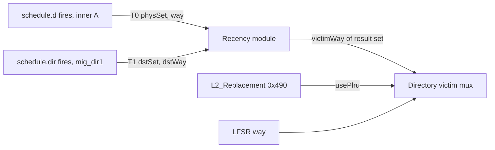

# Coder task 008 — PLRU replacement in the L2, behind one runtime register

**Opened 2026-09-17.** Thinker → coder. Do not edit this file; write everything in `REPORT.md`.
Starting point: `7a191fe` on branch `sbc-sampling` (RTL = `744fabb`: 007 C0–C3 + the B7-1 fix).
Task 007 commit 4 (guest cap) is **on hold** — do not apply `wip-2026-09-17/apply_c4.py`.

**Why:** [../../performance/plru-plan-2026-09-17.md](../../performance/plru-plan-2026-09-17.md) — read §0–§3.
Where the plan and this TASK differ, **this TASK wins** (register offsets, commit split, the checks).

**Decisions made by the user (2026-09-17):**

| # | Decision |
|---|---|
| D1 | The policy is chosen at **run time** by a 1-bit register, reset = random |
| D2 | **Staged.** With PLRU on, a migration takes D's PLRU way. If that way is dirty or held by a client, the migration **aborts** (as today), and the abort is counted by reason. Evicting such a way (probe + write-back) is **task 009**, not this task |
| D3 | A "use" (touch) = every inner-A D grant + every migration install. Nothing else |

---

## 0. Before you start

- Read `CLAUDE.md` top to bottom, then the plan above.
- **Simulate only through `make run-binary` / `run_sbc.sh`.** A bare `$SIM` omits `+dramsim`.
- **Zero hardware when `plruReplacement = false`.** Scala `if` / `Option`, as `homeShadow` and
  `enablePerfCounters` do. With the flag off, the generated Verilog must be **byte-identical** to `744fabb`.
- Counter rules from 005 §2.2 still bind: MSHR pulses are added with `PopCount`, never OR-ed.
- **The Verilator sim is not reproducible across builds** (005 finding F2, 007 "Where the work order is
  wrong"). So every "unchanged" check below is either (a) byte-identical Verilog, (b) the deterministic
  switch test, or (c) two runs of the **same** simulator build. Never ask stress-test numbers from two
  different builds to match.
- Words: **S** = source set, **D** = destination set, **K** = ways. A **touch** tells the recency tracker
  that a line was just used.

---

## 1. What changes, in one paragraph

Today the victim way is random (LFSR, [Directory.scala:176-180](../../../design/craft/inclusivecache/src/Directory.scala#L176-L180)).
Add a small module that keeps a **15-bit PLRU tree per set** (rocket-chip's own `SetAssocLRU(sets, ways,
"plru")`), learns from touches, and gives back one victim way. A register chooses whether the victim mux
uses that way or the LFSR way. Nothing else in the cache reads the tracker. A guest installed by a
migration is touched, so it enters D as most-recently-used, which is the paper's rule (§2.2).



---

## 2. Commit 1 — the tracker, the touches, the register, the software

### 2.1 Parameter

- `InclusiveCacheMicroParameters`: `plruReplacement: Boolean = false`.
- `WithInclusiveCache(..., plruReplacement: Boolean = false)`, passed through.
- **Not** tied to `enableSetBalancing` — the plain-L2 half needs it too.

### 2.2 New module `Recency.scala`

```scala
class RecencyTouch(params: InclusiveCacheParameters) extends InclusiveCacheBundle(params) {
  val set = UInt(params.setBits.W)
  val way = UInt(params.wayBits.W)
}

class Recency(params: InclusiveCacheParameters) extends Module {
  val io = IO(new Bundle {
    val touch     = Flipped(Vec(2, Valid(new RecencyTouch(params))))  // 0 = access, 1 = install
    val querySet  = Input(UInt(params.setBits.W))
    val victimWay = Output(UInt(params.wayBits.W))
  })
  val plru = new SetAssocLRU(params.cache.sets, params.cache.ways, "plru")
  // One register stage: keeps the schedule path short. Valid bits reset to 0.
  ...
  plru.access(sets, touchWays)          // folds in order: access first, then install
  io.victimWay := plru.way(io.querySet)
}
```

- **No same-cycle bypass.** A touch changes the state from the cycle after its register stage. The victim
  is always read from registers. This keeps the module out of any loop (B7-2).
- Ways that are not a power of two are supported by `PseudoLRU`; no special case.

### 2.3 Directory

- New IO, only when `plruReplacement`: `touch` (passed straight to `Recency`) and `usePlru: Bool`.
- `recency.io.querySet := set` — the **result-aligned** `set` register the tap already uses.
- Victim mux: replace only the policy term. Tier order, the way-lock mask and every assert stay.

```scala
val policyOH = Mux(usePlru, UIntToOH(recency.io.victimWay, params.cache.ways), victimWayOHLFSR)
// then use policyOH where lfsrVictimOH is used today
```

- The LFSR keeps advancing exactly as today, whatever the policy.

### 2.4 Touches (Scheduler + MSHR)

| # | valid | set | way |
|---|---|---|---|
| T0 | `schedule.d.valid && schedule.d.bits.prio(0) && !schedule.d.bits.control && !schedule.d.bits.bad` | `schedule.d.bits.physSet` | `schedule.d.bits.way` |
| T1 | `schedule.dir.valid && schedule.dirInstall` | `schedule.dir.bits.set` | `schedule.dir.bits.way` |

- `schedule.d.valid` already means the D request fires: an MSHR is only selected when `sourceD` is ready
  ([Scheduler.scala:142](../../../design/craft/inclusivecache/src/Scheduler.scala#L142)). Add
  `assert(!schedule.d.valid || sourceD.io.req.ready)` so that stays checked.
- Each request sends exactly one D grant (`s_execute`), so T0 is one touch per access. It covers primary
  hits, data misses (the refilled way), secondary hits (the guest's way **in D**), and repeats.
- `dirInstall`: new `Option[Bool]` on `ScheduleRequest`, present only when `plruReplacement &&
  enableSetBalancing`, driven by `mig_dir1` ([MSHR.scala:540](../../../design/craft/inclusivecache/src/MSHR.scala#L540)).
  In a NoSbc build, T1.valid is `false.B`.
- **Not touches:** inner C `Release`/`ReleaseData`, B probes, X flushes, the secondary-search read, the
  destination probe. Do not add them.

### 2.5 Register `L2_Replacement` (`0x490`)

`0x470`–`0x480` are reserved by task 005 commit 3 — do not use them.

- `Control.scala`: `RegInit(false.B)` + 1-bit R/W field at `0x490`, only when `outer.micro.plruReplacement`,
  else absent (reads 0). Description: "0 = random, 1 = PLRU".
- **Not** cleared by `SBC_Reset` or `SBC_StatsReset`, not affected by `L2_StatsHold`.
- Wire like `SBC_MigrateEnable`: Control → `InclusiveCache` (tie-down `false.B` when no control port) →
  `Scheduler.io.usePlru` → `Directory.io.usePlru`.
- Safe to flip at any time: every way is a legal victim, and the tracker keeps learning while random is
  selected.

### 2.6 Software

| File | Change |
|---|---|
| `sw/sbc_mmio.h` | `L2_REPLACEMENT` `0x490` (and the three counters of commit 2, in that commit) |
| `sw/sbc_read.c` | `--policy=random\|plru`: write, read back, fail loudly if the read-back does not match (flag not built). Print `policy=` in the `[SBC-WINDOW]` line and in the summary |
| `chipyard/scripts/ssbc_scripts/run_board_session.exp` | `-policy random\|plru`: after boot and before the first half, run `sbc_read --policy=X` and confirm the read-back; print it in the session header. Without `-policy`, print the state found |
| `sw/scripts/compile_app.sh` | pass `$EXTRA_CFLAGS` to gcc (empty by default) |
| `sw/migration_stress_test.c`, `sw/sbc_migrate_switch_test.c` | `#ifdef L2_POLICY`: write `0x490` first thing in `main`, then print `[SBC] policy=<read-back>` |

### 2.7 Sim-only printfs (`sbcDebug`)

Prefix `[SBC]` so `run_sbc.sh` keeps them in `sbc.log`. Include a cycle count.

- In `Recency`, when a touch is **applied**: `[SBC] PLRU-TOUCH cyc= set= way= src=` (0 access, 1 install).
- In `Directory`, on `ren2 && !io.result.bits.hit` (every read that may use a victim, including the
  destination probe): `[SBC] PLRU-VICTIM cyc= set= plruWay= chosen= usePlru= tier= busy= internal=`
  with `tier` 0 invalid, 1 evictable, 2 policy, 3 lowest-free fallback.

### 2.8 Configs (chipyard repo — uncommitted work, **edit, never `git checkout`**)

`plruReplacement = true` in `VerilatorRocket8KL116KL2Config`, `VerilatorRocket8KL116KL2NoSbcConfig` and
`SingleRocketVCU118L18K64K16WL2ConfigSBC`. Do this **after** check V0.

---

## 3. Commit 2 — D2: the destination probe uses D's PLRU way; count aborts by reason

### 3.1 The one-term change

In the Directory victim mux, the evictable tier becomes `preferEvictable && !usePlru`. So with PLRU on, the
destination probe takes an **invalid** way if there is one, else **D's PLRU way**. With random on, nothing
changes. The MSHR's existing test ([MSHR.scala:1524-1539](../../../design/craft/inclusivecache/src/MSHR.scala#L1524-L1539))
then either uses that way or aborts — no MSHR change for the behaviour.

A PLRU way that is a guest of S is a legal reuse (007 C2, `migDstReuse`). Nothing new there.

### 3.2 Three counters (both policies)

At the destination-read abort branch, the MSHR raises one of three pulses from `io.directory.bits`:

| Offset | Register | Pulse when the destination way was |
|---|---|---|
| `0x498` | `SBC_DstAbortDirty` | dirty, no client bit |
| `0x4A0` | `SBC_DstAbortHeld` | clean, client bit set |
| `0x4A8` | `SBC_DstAbortBoth` | dirty and client bit set |

- `PopCount` over the MSHRs in `SBCEventPulses`, 64-bit, in `PerfCounters` behind `enablePerfCounters`.
- Cleared by `SBC_StatsReset` and `SBC_Reset`, held by `L2_StatsHold`, like the other SBC event counters.
- They answer two questions: how much task 009 would recover, and (in random mode) the F9 question —
  why aborts rose 52% after teardown.
- `sbcDebug`: add the reason to the existing `ABORT-DST` printf.
- Update `sw/sbc_mmio.h` and `sbc_read` output in the same commit.

---

## 4. Checks

Gate = `migration_stress_test` 8/8 on `VerilatorRocket8KL116KL2Config` and 7/7 on `…NoSbcConfig`,
`sbc_migrate_switch_test` T1–T4, 0 asserts, both shadow checkers quiet.
Random-mode runs use `SBC_LABEL=008-cN-random`; PLRU-mode runs use `EXTRA_CFLAGS=-DL2_POLICY=1` and
`SBC_LABEL=008-cN-plru`, with `SBC_CLEAN=0` so both modes run on the **same** simulator build.

| # | When | Check | Pass |
|---|---|---|---|
| V0 | C1, flag still false everywhere | Save the generated Verilog of the current build first (or rebuild `744fabb`), then elaborate C1 | Verilog of both Verilator configs **byte-identical** |
| V1 | C1 and C2, flag true, random | Gate | green; switch test output **identical** to `007-b71-c3` (it is deterministic across builds). Stress-test numbers reported, not compared |
| V2 | C1 and C2, same build, PLRU | Gate | green; identities hold: accesses = the four outcomes, `L2_SecondSearch` = secondary hits + secondary misses |
| V3 | C1 and C2, from V1 + V2 logs | **Replay.** New `sw/scripts/plru_replay.py`: rebuild each set's tree from `PLRU-TOUCH` lines (touches from earlier cycles only, access before install), then check every `PLRU-VICTIM` line | `plruWay` = model on **every** line; `chosen = plruWay` whenever `tier = 2`. Report tier counts per mode, and **how often a migration's destination way equals the previous install into that set** — random vs PLRU (the plan says ~72% of migrations reuse a guest in random mode; this checks whether it is the *same* guest) |
| V4 | C2, same build, NoSbc config | Random vs PLRU, plain L2 | Report `L2_DataMiss` and hit rate for both. Sanity only: 8 sets and a 256 B L1 are not the board. If PLRU is clearly worse, **report it and stop** — do not tune |
| V5 | C2 | 64 KB bitstream | No DRC error (watch `LUTLP-1`), timing met. Report FF/LUT against the last 64 KB image and the worst path if it goes through `Recency` or the victim mux |
| V6 | C2, PLRU run | The three abort counters | Their sum = number of `ABORT-DST` printfs in the same run |

**After every commit report the same numbers, per mode:** `SBC_Parked` at the end, `SBC_Migrations`,
`SBC_Attempted`, `SBC_Aborted`, `L2_PrimaryHit`, `L2_SecondaryHit`, `L2_DataMiss`, hit rate, and (C2) the
three abort counters.

---

## 5. Commits

| # | What | Gate |
|---|---|---|
| 1 | §2: `Recency`, touches, `L2_Replacement`, software, printfs, configs | V0, V1, V2, V3 |
| 2 | §3: `!usePlru` on the evictable tier + three abort counters | V1, V2, V3, V4, V6, then V5 |

Commit each change's doc edits with it: CLAUDE.md parameter table (`plruReplacement`), register table
(`0x490`; `0x498`–`0x4A8` in commit 2), and the `displaced` bit / victim-mux description.

---

## 6. Board run (after commit 2, 64 KB only)

One image. Every board step in **one tmux session**, and give the log paths as soon as each step starts.

```bash
cd $CY/scripts/ssbc_scripts
./run_board_session.exp -ab -policy random -bit <archived 008 image>   # session R
./run_board_session.exp -ab -policy plru   -bit <archived 008 image>   # session P
```

- A fresh boot per session. Order R, P; then P, R; then R, P if time allows.
- **Session R doubles as the F9 board check** (007 REPORT): it runs the `744fabb` rules, plus the new
  abort counters. It replaces the separate `744fabb` A/B.
- Archive the bitstream under a name that says 008 and the commit, and `cmp` it against the file in
  `generated-src` before the first session (the 2026-09-17 mislabelled-image mistake).

| Compare | Question |
|---|---|
| P-OFF vs R-OFF | Does PLRU alone help the plain L2? |
| **P-ON vs P-OFF** | **SBC against a plain L2 with recency — the headline** |
| R-ON vs R-OFF | Today's rules with B7-1 + C3 (F9) |
| `L2_SecondaryHit` per migration, P-ON vs R-ON | Does the MRU head start make guests pay off? (was 0.18–0.21) |
| Three abort counters, P-ON vs R-ON | The size of task 009 |
| `SBC_Parked`, P-ON | Decides 007 C4 |

Report `L2_MemReads` and `L2_MemWrites` separately, `L2_Cycles`, and the exact hit rate.

---

## 7. Do not

- **Do not** evict a dirty or client-held destination way (no probe, no write-back). That is task 009 and
  needs its own design: probing a line in a fenced row can deadlock inner C (bug P1 shape), and
  [MSHR.scala:1243](../../../design/craft/inclusivecache/src/MSHR.scala#L1243) asserts against exactly that.
- **Do not** change the saturation counters (tracker M18 — deferred by the user; the next lever if PLRU
  does not win).
- **Do not** apply 007 C4.
- **Do not** store recency bits in the directory SRAM. A hit would need a directory write, and the
  directory write waits whenever a read is in progress.
- **Do not** add a same-cycle bypass from a touch to the victim, reorder the victim tiers, or change the
  way-lock.
- **Do not** weaken any `w.displaced` test.
- **Do not** build a 256 KB image (B7-2 is open).
- **Do not** fix anything outside this task. Write it in `REPORT.md` under Findings.

---

## 8. After this task

- **Task 009** (if the abort counters are large in P-ON): evict D's PLRU way even when it is dirty or
  client-held, paper §3.3, designed around the fenced-row probe.
- **007 C4**: close it if P-ON `SBC_Parked` stays near the paper's ~2 per pairing; otherwise apply it on top.
- **M18** (heat counters, fix plan §1 rows 7, 9–12): next if P-ON does not beat P-OFF.
