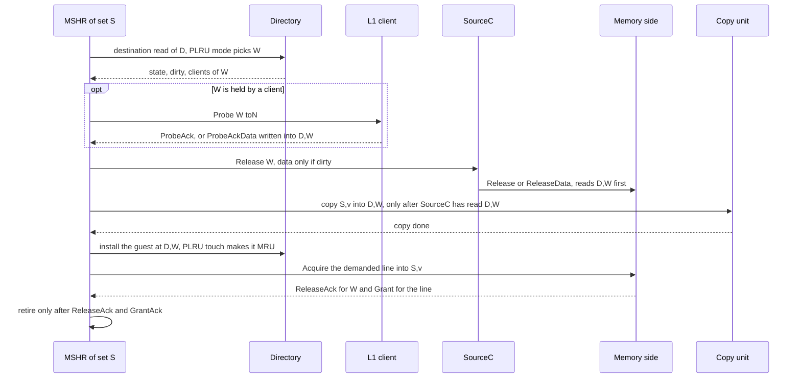

# Coder task 009 — a migration evicts D's least-recent line, whatever its state (PLRU mode)

**Opened 2026-09-18.** Thinker → coder. Do not edit this file; write everything in `REPORT.md`.
Starting point: `2be7c5a` on branch `sbc-sampling` (RTL = `201ebae`: 008 C1 + C2). All earlier work is
committed, in this repo and in the chipyard repo (`d3243fe3`).

**Why:** task 008 C2 ships "option B" — a **workaround**. With PLRU on, the destination probe skips D's
least-recent way whenever it is dirty or held by a client, and takes a more recent clean way instead. In
the `008-c2-plru` sim this skip happened on **99.8%** of migrations (47,241 of 47,352 tier-1 picks), and
on the 64 KB board SBC-on lost **0.68 primary hits per migration** against the plain L2 (random: 0.15).
The paper evicts D's LRU line whatever its state. This task does that.

**Decisions made by the user (2026-09-18):**

| # | Decision |
|---|---|
| U1 | **No register, no switch.** In PLRU mode (`L2_Replacement = 1`) this is the only behaviour. Option B is deleted |
| U2 | **PLRU only.** In random mode the destination pick and the migration path stay exactly as today |
| U3 | **Follow the TileLink rules at all times** (section 2) |
| U4 | **No read/write hazard** on any data-array row while data is overwritten or migrated (section 3) |
| U5 | **In-flight requests are handled** — no data corruption, no stall or deadlock (section 5) |
| U6 | **No new counters.** Reuse the existing ones (section 4.8) |

---

## 0. Before you start

- Read `CLAUDE.md`, this TASK, 008 `REPORT.md` findings F6 and F7, and `bug-fix-log.md` entries **P1**
  and **B8-1**.
- ⚠️ CLAUDE.md's old line "⛔ Do not build dirty-destination eviction" (2026-08-24, random replacement)
  is **superseded** by U1. It was written when the clean alternative was a random line; with PLRU the clean
  alternative is a recent line, and skipping to it is what costs the hits.
- **Simulate only through `make run-binary` / `run_sbc.sh`.** A bare `$SIM` omits `+dramsim`.
- **Zero hardware when `plruReplacement = false` or `enableSetBalancing = false`.** Scala `if` / `Option`.
  With `plruReplacement = false` the Verilog must equal `2be7c5a`'s with Scala line numbers normalised
  (the 008 V0 method, `results/008-v0/v0_compare.sh`).
- Counter rules from 005 §2.2 still bind: MSHR pulses are added with `PopCount`, never OR-ed.
- **B8-1 is open.** If "SBC: paired source migrated outside its partner set" fires, compare the event
  sequence with B8-1 and report it as a recurrence. Do not fix it here.
- Coder rules: post your plan in `REPORT.md` first and wait for the go-ahead. Short comments (1–3 lines).
  Simple RTL over clever RTL.

---

## 1. What changes, in one paragraph

Today, with PLRU on, a migration S → D takes D's invalid way, else D's least-recent **clean, client-free**
way (option B's masked walk), else it aborts. After this task it takes D's invalid way, else **D's PLRU way
W, whatever its state**. A valid W is evicted **exactly as the stock L2 evicts a victim**: probe the L1
off it (`toN`) if a client holds it, then `Release` it to memory — `ReleaseData` if dirty, `Release` (no
data) if clean. Only when that is done may the copy overwrite `(D, W)`. The rest of the migration (copy,
install the guest as MRU, refill, retire) is unchanged. Random mode is unchanged.

Names used below: **S** = the source set (the MSHR's own set), **v** = the source victim way,
**D** = the destination set, **W** = the destination way, **home(W)** = D if W is a native line of D,
S if W is a guest (section 4.2 proves a guest in D can only belong to S).

---

## 2. TileLink rules this task must keep

Every row must be true in the RTL and named in the REPORT with the line that keeps it. The sim runs with
TLMonitors on both the inner and outer links: **zero TLMonitor assertions** is a gate condition.

| # | Rule | How this design keeps it |
|---|---|---|
| T1 | A manager does not Probe a block while a Grant for that block still waits for its GrantAck | Nothing can be granting W. A native W lives in D, which is fenced (`dstSetConflict`) and offered only when no MSHR owns it (`dstOfferOwned`, `Scheduler.scala:702-705`). A guest W's home set is S, which this MSHR owns and has not granted yet. Every MSHR retires only after its GrantAck (`no_wait` has `w_grantack`) |
| T2 | A manager must accept a client's `Release` while it waits for that client's `ProbeAck` — a Release must never wait behind our own probe | Section 4.4: a Release to home(W) **nests** into the C-channel MSHR while the probe of W is open (stock rule for set S, new rule for set D) |
| T3 | One Probe per block at a time; an eviction probe asks `toN`; wait for an ack from exactly the clients probed | One probe of W, param `toN`, client mask = W's `clients`, its own done-mask (section 4.4) |
| T4 | On the outer side the L2 is a client: it gives up a block with `Release`/`ReleaseData` carrying its real permission change (`TIP`/`TRUNK` → `TtoN`, `BRANCH` → `BtoN`), data only if dirty, and waits for `ReleaseAck` | `c.bits` for W come from W's own metadata (section 4.5). Retire waits for W's `ReleaseAck` |
| T5 | The L2 must not `Acquire` a block on the outer side while its `Release` of that block is still unacknowledged | Any request for W's address waits: a native W's address maps to D (fenced until we retire), a guest W's address maps to S (queues behind us). We retire only after W's `ReleaseAck` |
| T6 | At most one outstanding `Release` per source id | In the migrate path the source victim is **moved, not released**, so W's Release is this MSHR's only one. Assert it |
| T7 | Inclusion (the L2's own rule): never drop or overwrite a line an L1 still holds | W is probed `toN` before `(D, W)` is reused |
| T8 | A valid W is evicted with **the stock message sequence**, including a `Release` for a clean W | In PLRU mode a clean W is **no longer overwritten silently**. Random mode keeps today's silent overwrite (U2) — note it in the REPORT, do not change it |

---

## 3. Data hazards on the data array (BankedStore) — none allowed

**Facts to rely on** (check them and cite them in the REPORT):
- BankedStore reads or writes the SRAM **in the cycle it accepts a request** (`BankedStore.scala:231-239`),
  so the order of acceptance is the order of access. Priority in one cycle:
  sinkC > sourceC > sinkD > sourceD write > sourceD read > copy write > copy read (`:222`).
- SinkC raises a ProbeAck response only when that beat's write is accepted into its 1-entry pipe queue
  (`SinkC.scala:117`); sinkC is the top priority, so the write lands at most one cycle later.
- SourceC is `busy` from accepting a dirty Release until its last beat's read address fires, and
  `evict_req` names the row and way it is reading (`SourceC.scala:70-99`).

**The two rows involved:** `(S, v)` and `(D, W)`.

| # | Kind | Writer / reader | Rule (the RTL must enforce it, not rely on timing) |
|---|---|---|---|
| H1 | RAW | SinkC writes W's `ProbeAckData` into `(D,W)` → SourceC reads `(D,W)` for `ReleaseData` | W's Release is scheduled only after the **last** ProbeAck beat (`w_dprobeacklast`). Stricter than stock's first-beat rule on purpose: no overlap to prove |
| H2 | RAW | A nested client `Release` of W (section 4.4) writes W's data into `(D,W)` through SourceD → SourceC reads `(D,W)` | The migrant is **stalled** while the C-channel MSHR works on home(W) (section 4.4), and SourceC's stock `evict_safe` holds the first read while SourceD still has `(D,W)` in its pipeline |
| H3 | WAR | SourceC reads `(D,W)` → the copy writes `(D,W)` | **New interlock.** The copy's write gate `copy_wsafe` is also false while SourceC is busy on `(D,W)`. SourceC exports `busy` next to `evict_req`; the Scheduler ANDs the term into `setCopyUnit.io.copy_wsafe` (`Scheduler.scala:611`). The copy unit checks it in `s_wsafe` (before reading, the Bug-B rule, `SetCopyUnit.scala:117-127`) and on every write beat (`:156`). The copy is started only after W's Release was **accepted by SourceC in an earlier cycle**, so `busy` is already visible |
| H4 | WAW | W's probe data or nested-release data lands in `(D,W)` → the copy writes `(D,W)` | Follows from H1–H3: the copy starts after the Release, which starts after the last probe beat, and `copy_wsafe` covers SourceD |
| H5 | WAR | The copy reads `(S,v)` → SinkD writes the refill into `(S,v)` | Unchanged: the Acquire waits for `w_copy` (`MSHR.scala:580`) |
| H6 | WAR | SourceD still reading `(D,W)` for an older response (Bug B) → the copy writes | Unchanged: `s_wsafe` + `copy_wsafe` |
| H7 | Directory | Our snapshot of W (taken at the destination read) → a nested Release changes W's entry | The nested write-back is forwarded into W's latched metadata (section 4.4), and the migrant is stalled until the C-channel MSHR is done, so our later install of the guest is the last write to `(D,W)` |

The sim-only BankedStore and directory shadow checkers are the net for H1–H7. They must stay quiet.

---

## 4. Design

### 4.1 Directory (`Directory.scala:209-230`)

- The clean-way tier is used **only in random mode**:
  `Mux(preferEvictable && !usePlru && evictOH.orR, PriorityEncoderOH(evictOH), …)`.
  In PLRU mode the destination probe therefore takes an invalid way, else D's PLRU way (over the ways the
  way-lock leaves free), else the lowest free way — the existing tiers.
- **Delete option B:** `Recency.maskedWay`, `Recency.io.evictMask`, `Recency.io.evictWay`, `evictPick`,
  and the `emask`/`evictWay` fields of the `PLRU-VICTIM` printf. Random mode keeps
  `PriorityEncoderOH(evictOH)`, which is exactly `744fabb`'s pick.
- Fix the assert at `:230` to match.

### 4.2 Who owns a guest in D

The destination is either S's existing partner (`dIsSource` → `assocSet`) or an **unpaired** cold set
(`dssOK` needs `!at(dssPick).valid`), `SetBalanceUnit.scala:161-181`. An unpaired set holds no guests, and
strict 1:1 means D's partner is S. So **a guest in D is always a guest of S**:
`home(W) = Mux(W.displaced, request.set, migDstSet)`. Latch it at the destination-read result.
Sim-only net: `assert(!W.displaced || W.homeShadow === request.set)`.

### 4.3 MSHR — new state, and the decision at the destination-read result

New registers (all reset in the allocate/assess block beside the other migration defaults,
`MSHR.scala:1566-1626`): `dstEvict`, `s_dprobe`, `w_dprobeackfirst`, `w_dprobeacklast`, `s_drelease`,
`w_dreleaseack`, `dstMeta` (W's `DirectoryEntry`), `dstHome`, `dprobes_done`.

⛔ **Do not reuse** `s_rprobe` / `w_rprobeack*` / `s_release` / `w_releaseack` / `probes_done` /
`probes_toN` / `meta` for W. Every reader of those means the **source** line. Example of what goes wrong:
the ProbeAck block marks `meta` dirty on a **tag match alone** (`MSHR.scala:1023`), and the same tag exists
in every set, so W's `ProbeAckData` would mark the source victim dirty.

At the destination-read result (`MSHR.scala:1523-1565`):

| W is | Random mode | PLRU mode |
|---|---|---|
| invalid | as today | as today |
| valid, clean, client-free | as today (silent overwrite) | **evict** (Release, no data) |
| valid, dirty and/or client-held | abort, as today | **evict**: probe if held, then Release/ReleaseData |

"Evict" arms: `dstEvict := true`, latch `dstMeta` / `dstHome`, `migDstWay := W`,
`migDstReuse := W.displaced`; if `W.clients =/= 0` arm the probe (`s_dprobe`, `w_dprobeack*` := false);
always arm the Release (`s_drelease`, `w_dreleaseack` := false). Arm `w_copy`, `s_dmeta`, `s_writeback` as
today, but the copy may start only when the Release has gone (4.6).

**PLRU mode never aborts at the destination probe.** Assert it.

### 4.4 The probe of W, and the nesting that prevents the P1 deadlock (commit 2)

**The risk.** While probing W the migrant holds D fenced and waits on the L1 — the hold-and-wait edge the
design has avoided until now (`MSHR.scala:472-476`). A client `Release` to set D cannot allocate an MSHR
(`allocReady` is fenced) and has no MSHR on D to queue behind, so it blocks the head of the C channel
(`Scheduler.scala:422-423`). If the L1's `ProbeAck` for W is behind it, both wait for ever. That is bug P1's
shape, and it breaks TileLink rule T2.

**The fix is the stock nesting rule, extended to D.** In stock, while an MSHR waits for probe acks it
reports `nestC` (`MSHR.scala:471`), and a Release to its set goes to the special C-channel MSHR (`c_mshr`),
which finishes the Release and forwards its effect back (`nestedwb`, `MSHR.scala:421-427`). Do the same for
W:

| # | Where | Change |
|---|---|---|
| N1 | MSHR status | New `nestD := dstEvict && !w_dprobeackfirst && !dstMeta.displaced` (native W: its address maps to D). The Scheduler reads it with the existing `dstSet` |
| N2 | MSHR `nestC` (`:471`) | Add `\|\| (dstEvict && !w_dprobeackfirst)`. A guest W's address maps to S, so its Release nests on S the stock way |
| N3 | Scheduler | `nestDMatch = OR over MSHRs of (valid && nestD && dstSet === request.set) && prio(2)`. Use `nestC \|\| nestDMatch` everywhere stock uses `nestC` (`:306`, `:311`, `:414`, `:508`) |
| N4 | Scheduler `dirTarget` (`:519`) | Today `alloc` sends the directory result to a normal MSHR. With `nestDMatch` it must go to `c_mshr` |
| N5 | Scheduler stall (`:119-122`) | Also stall an MSHR while `c_mshr` is valid and `c_mshr.homeSet === that MSHR's dstSet` (twin of the stock same-set stall) |
| N6 | MSHR | Twin of the `nestedwb` block for W: `when (dstEvict && nestedwb.homeSet === dstHome && nestedwb.tag === dstMeta.tag) { c_set_dirty → dstMeta.dirty := true }`. (No outer probes exist — `require(lastLevel)` — so the `b_*` fields never fire; assert it) |
| N7 | MSHR status + Scheduler ProbeAck routing | New status fields `probeWay` / `probePhysSet` = `(W, D)` while W's probe is open, else `(meta.way, physSet)`. The SinkC lookup (`Scheduler.scala:536-549`) uses them. `probeSet`/`probeTag` become `home(W)` / `W.tag` while W's probe is open; `probeAckPending` adds `!w_dprobeacklast`. ⛔ **Do not repoint `status.way` / `status.physSet`** — the way-lock, SinkD and `partnerBusy` read them |
| N8 | MSHR ProbeAck block (`:1001-1023`) | Split it. While W's probe is open, update **only** `dprobes_done`, `w_dprobeack*` (with `last = (dprobes_done \| bit) === dstMeta.clients`) and `dstMeta.dirty`. The stock half is guarded by `!probingW`. Assert the two probes are never open together |
| N9 | MSHR `b.bits` (`:814-818`) | While `!s_dprobe`: param `toN`, tag `dstMeta.tag`, homeSet `dstHome`, clients `dstMeta.clients` (no excluded client — the requester did not ask about W). `b.valid` adds `!s_dprobe` |

The C-channel MSHR never waits on the migrant, so N5's stall is bounded. Outside W's probe window a Release
to D is still fenced, exactly as today; then the migrant waits on nothing from the L1, so no cycle forms
(the existing C-head watchdog, `Scheduler.scala:436-439`, stays and must stay silent).

### 4.5 The Release of W

- `c.valid` adds `!s_drelease && w_dprobeacklast` (H1). The three `c` sources (stock release, stock
  probe-ack, W's release) are never valid together — assert `PopCount <= 1`.
- `c.bits` while W's Release is the one going: opcode `Mux(dstMeta.dirty, ReleaseData, Release)`, param
  `Mux(dstMeta.state === BRANCH, BtoN, TtoN)`, tag `dstMeta.tag`, physSet `migDstSet`, homeSet `dstHome`,
  way `migDstWay`, dirty `dstMeta.dirty`. Extend the displaced-address assert (`MSHR.scala:789-791`) to W.
- The completion that clears `s_drelease` uses **the identical condition** as the valid (the `707445c`
  rule, `MSHR.scala:652-680`).
- `ReleaseAck` sets `w_dreleaseack`. Assert `w_releaseack` is already true then (T6).
- `no_wait` (and so retire and reload) adds `w_dprobeacklast && w_dreleaseack`.
- No directory write for W: the guest install (`mig_dir1`) overwrites `(D,W)`, and D is fenced until then —
  the same argument today's silent overwrite already rests on.

### 4.6 The copy

- `doMigCopy` (`MSHR.scala:615`) adds `w_dprobeacklast && s_drelease` — the probe is complete and the
  Release was accepted in an **earlier** cycle. Both are true when there is no eviction, so the non-evict
  path is unchanged.
- H3 interlock as in section 3.
- The Acquire keeps waiting for `w_copy` (H5, unchanged).

### 4.7 Parked count and teardown

- A guest W is a **slot reuse**: `migDstReuse` → `migCommitReuse`, so `SBC_Parked` and the per-set
  `parkCount` are unchanged (one guest of S leaves, one arrives). Do **not** pulse `dispRelease` /
  `dispDrop` for W — those count demand evictions of guests, and they decrement `parkCount`.
- The pairing (S, D) cannot be torn down during the migration: D is fenced and S is ours, so no other guest
  of S can leave D. Say so in the REPORT with the evidence.

### 4.8 Counters — existing ones only (U6)

| Existing counter | Meaning after this task |
|---|---|
| `0x498` / `0x4A0` / `0x4A8` | **Renamed** `SBC_DstDirty` / `SBC_DstHeld` / `SBC_DstBoth`: the destination way chosen at the probe was dirty (no client) / clean but client-held / both. Pulsed at the destination-read result in **both** modes. Random mode: each such way aborts, so the numbers equal today's. PLRU mode: each such way is evicted. Rename in RTL, `Control.scala`, `sw/sbc_mmio.h`, `sw/sbc_read.c`, `sw/migration_stress_test.c`, CLAUDE.md. Same offsets, same widths |
| `L2_MemWrites` | now also W's `ReleaseData` (counted at SourceC, no change) |
| `L2_MemRelClean` | now also a clean W's `Release` (no change) |
| `SBC_Aborted` | in PLRU mode = declines only (no destination aborts) |
| `SBC_Attempted`, `SBC_Migrations` | in PLRU mode every started migration commits, so they are equal (± one in flight) |

No new register, no new counter, no new MMIO field.

### 4.9 Asserts and watchdogs (sim)

- W's eviction completes: a counter like `migDeferCtr` on `dstEvict && !(w_dprobeacklast && w_dreleaseack)`,
  assert `< 2000` cycles, message carrying the new registers.
- Add the new registers to the `liveCtr` message (`MSHR.scala:1302-1314`).
- One Release per MSHR (T6); the two probes never open together (N8); PLRU mode never aborts at the
  destination (4.3); no grant pending while W's probe is open (`w_grantfirst` true); a guest W's home is S
  (4.2); no `b_*` nested write-back ever matches W (N6).

---

## 5. In-flight requests — each case must be handled and named in the REPORT

| # | In flight when we evict W | What happens | Why no corruption and no stall |
|---|---|---|---|
| I1 | The L1 is releasing **W itself** (voluntary `Release`/`ReleaseData`) as our probe arrives | The Release nests into `c_mshr` (N3 native, N2 guest); `c_mshr` updates W's entry and writes its data; N6 marks `dstMeta` dirty; the L1 then answers the probe with `NtoN` | T2 kept; the migrant is stalled until `c_mshr` is done (N5); the Release of W reads the new data (H2) |
| I2 | The L1 releases **another line X of D** during W's probe | Nests into `c_mshr`, which finishes it | The ProbeAck behind it gets through (no P1) |
| I3 | The L1 releases a line of D **outside** W's probe window | Fenced, as today; the C head waits until we retire | The migrant needs nothing from the L1 C channel to retire (SourceC, copy, memory, the Grant on D, GrantAck on E) — no cycle. C-head watchdog stays silent |
| I4 | The L1 has an `Acquire` of W waiting (it dropped W silently; the directory bit is stale) | The Acquire waits at the fence (native) or behind us on S (guest); the L1 still answers our probe (`NtoN`) — clients must not block a Probe on their own Acquire | After we retire, the Acquire refetches W from memory, after W's `ReleaseAck` (T5) |
| I5 | SourceD is still sending an older response out of `(D,W)` (e.g. an I$ `Get`, which has no GrantAck) | Our SourceC read waits on `evict_safe`; the copy waits on `copy_wsafe` | H2, H6 |
| I6 | A flush (X channel) of W's address | Waits at the fence (native) or behind us on S (guest) | A flush of a parked line is still unsupported and asserted (`MSHR.scala:1434`) |
| I7 | A second migration | Cannot start — one migration per bank (`anyMigrating`) | unchanged |
| I8 | Anyone else reading or writing D's row | None can: D is fenced and offered only when no MSHR owns it; only S's MSHR (us) serves from D | 4.2 |

---

## 6. Software

- `sw/sbc_mmio.h`, `sw/sbc_read.c`, `sw/migration_stress_test.c`: the three renames only (4.8). The
  `[SBC-DSTABORT]` stress-test line becomes `[SBC-DST]`. **Keep the binary layout of the flag-free image
  unchanged** if you can (007 F4: a layout change alone moves the numbers); say in the REPORT whether it did.

---

## 7. Checks

Same simulator build for every pair compared. Configs: `VerilatorRocket8KL116KL2Config` (SBC) and
`VerilatorRocket8KL116KL2NoSbcConfig`, both with `plruReplacement = true` (already set in chipyard `428b5bd0`).

| # | After | What | Pass |
|---|---|---|---|
| V0 | C1 | `plruReplacement = false` in both configs, `make verilog`, compare with `2be7c5a` (008 V0 method) | identical once Scala line numbers are normalised |
| V1 | C1, C2 | **Random mode unchanged.** Gate with the random binaries | switch test `.log` identical to `008-c2-random`; every stress-test counter identical to `008-c2-random` (008 F3: this sim is reproducible across these builds with the same binary) |
| V2 | C1, C2 | **PLRU gate.** Stress test (8/8 SBC, 7/7 NoSbc) + switch test | 0 asserts, **0 TLMonitor errors**, shadow checkers quiet, C-head and new watchdogs silent. Identities hold: accesses = the four outcomes; data misses = memory reads; second searches = secondary hits + secondary misses. PLRU mode: 0 `ABORT-DST` printfs, `SBC_Attempted` = `SBC_Migrations` (± 1) |
| V3 | C1, C2 | `sw/scripts/plru_replay.py` on the PLRU logs | `plruWay` = model on every line; every destination pick = D's PLRU way except way-lock fallbacks (report how many) |
| V4 | C2 | **Coverage of the new paths**, from `sbcDebug` printfs you add (one line per event) | Report the count of each: W probed; W probe returned data; W released dirty; W released clean; W was a guest; D-nest fired (native W); S-nest fired during W's probe (guest W); migrant stalled by N5; `copy_wsafe` held by the H3 term. **Any of D-nest / S-nest / H3 = 0 → write a directed test that forces it** and report it before C2 is committed |
| V5 | C2 | NoSbc config, PLRU | every counter identical to `008-c2` NoSbc PLRU (this task must not touch the plain L2) |
| V6 | C2 | 64 KB bitstream `bistream_gen_vcu118.sh sbc_64l2_plru` | DRC clean (watch `LUTLP-1`), timing met; report LUT/FF against the `008-c2B` image and the worst path if it goes through the new muxes |

⚠️ If V2 stops on the B8-1 assert, report it as a recurrence (section 0) and ask before going on.

---

## 8. Commits

| # | What | Checks |
|---|---|---|
| 1 | 4.1 (Directory, delete option B) + 4.3/4.5/4.6/4.7 for a **client-free** W (clean or dirty: Release/ReleaseData, H3 interlock) + 4.8 renames + 4.9 + section 6. A **client-held** W in PLRU mode still aborts in this commit (temporary; counted in `SBC_DstHeld`/`SBC_DstBoth`) | V0, V1, V2, V3 |
| 2 | 4.4 (probe of W + nesting N1–N9) — a client-held W is now evicted; PLRU mode never aborts | V1, V2, V3, V4, V5, then V6 |
| 3 | Docs: CLAUDE.md (register rows renamed; the ⛔ line; the parameter row for `plruReplacement`; the `displaced`-bit paragraph that describes option B), `ai-documents/README.md` tracker, this task's REPORT | — |

Commit messages end with the co-author line. Commit only after the gate for that commit is green.

---

## 9. Board run (after commit 2, 64 KB only — B7-2 still blocks 256 KB)

- Image: `FPGASingleRocketVCU118L18K64K16WL2ConfigSBCPLRU` built from commit 2. Archive it under task +
  commit, `cmp`-verified (the 008 archive rule).
- Sessions: `run_board_session.exp -policy plru -ab`, a fresh boot each. Two sessions, then two more (M2:
  we still have no repeats). Log paths go in the REPORT.
- Report per half: hit rate, `L2_MemReads` and `L2_MemWrites` **separately**, `L2_MemRelClean`, `L2_Cycles`,
  `SBC_Migrations`, `SBC_Attempted`, `SBC_Aborted`, `SBC_DstDirty/Held/Both`, secondary hits per
  migration, and **primary hits lost per migration** =
  (P-OFF primary-hit rate − P-ON primary-hit rate) × P-ON accesses ÷ P-ON migrations.
- Put the `008-c2B` session P numbers beside them (a different image — the plain-L2 half shows the drift).

**Prediction (write the real numbers next to it):** primary hits lost per migration falls from 0.68 toward
0.15 or below; net hits per migration (secondary − lost) turns positive; SBC-on reads fall below the plain
L2's. Memory writes rise by up to the number of dirty W's.
**If lost-per-migration stays near 0.68**, the skipped LRU way was not the cost — report it; the next lever
is the heat counters (tracker M18), not this code.

---

## 10. Do not

- Do not add a register, a switch or a new counter (U1, U6).
- Do not change random mode in any way (U2) — including its silent overwrite of a clean destination way.
- Do not reuse the stock probe/release registers, `probes_done`/`probes_toN` or `meta` for W (4.3).
- Do not repoint `status.way` / `status.physSet` (N7).
- Do not start W's Release on the first ProbeAck beat (H1).
- Do not remove or weaken the destination fence, the migration token, `s_wsafe`, or any `w.displaced` test.
- Do not reorder BankedStore priorities.
- Do not fix B8-1, M17 or M18 here. Do not tune thresholds.
- Do not migrate a dirty **source** victim (L5) — a different task.

## 11. After this task

If the board shows SBC-on beating the plain L2: repeats, then 128 KB. If not: M18 (heat counters follow
the paper) is the next lever, then L5 (dirty-source migration).
