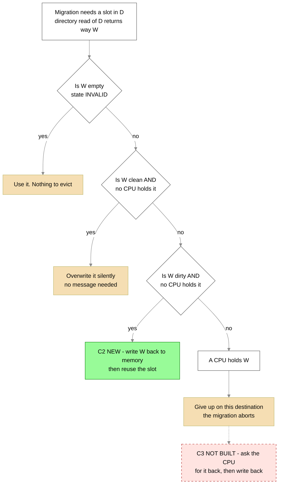
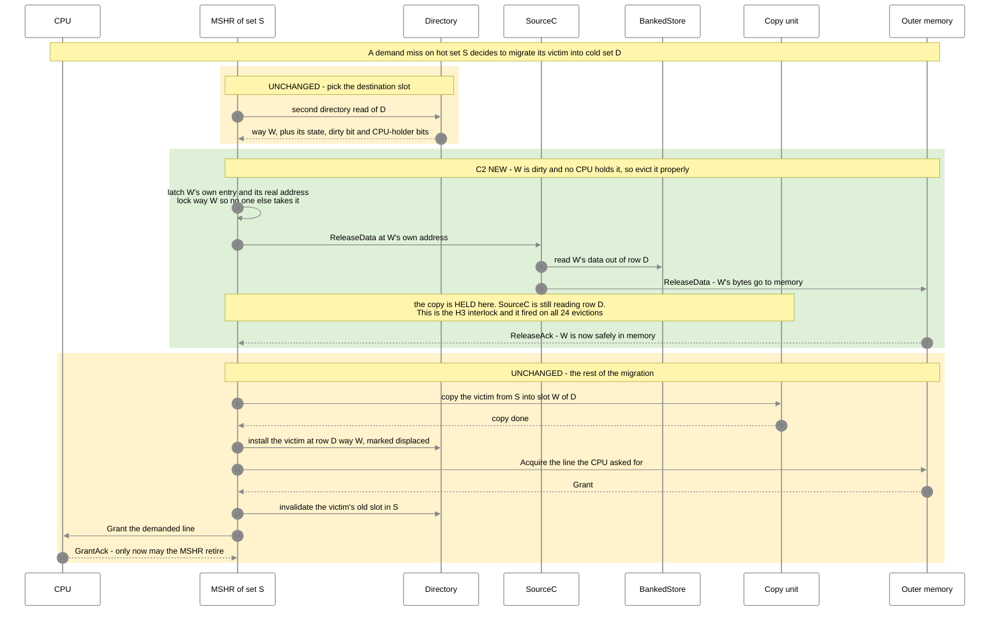
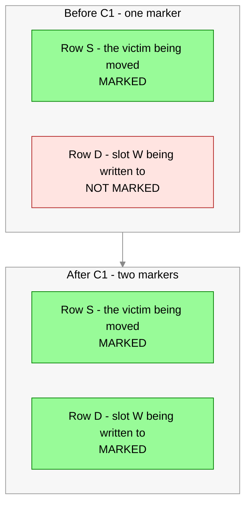

# Task 012 — what changed in the migration transaction (visual)

Companion to [TASK.md](TASK.md) and [REPORT.md](REPORT.md). Written 2026-09-24.

**Colour key:** 🟢 green = built and sim-green in this task · 🟡 yellow = unchanged from `201ebae` ·
🔴 red = **not built** (the dangerous stage, held back).

## The whole thing in plain English

A migration moves a line out of a **hot** set S into a **cold** partner set D. To do that it needs a
free slot in D. The question this task is about is: **what if every slot in D is taken?**

- **Before (`201ebae`, option B):** the cache looks for a slot in D holding a line that is *clean* and
  *not held by any CPU cache*, because such a line can simply be thrown away. If it cannot find one, the
  migration **gives up**.
- **What task 009 tried:** take D's least-recently-used slot *whatever* is in it — ask the CPU to hand
  the line back if it holds it, then write it out to memory. This **hung the board**.
- **What this task built (C2):** take the slot if the line is **dirty but no CPU holds it**. Write it out
  to memory properly, then reuse the slot. **No CPU is involved**, so nothing can wait on the CPU.
- **Still not built (C3):** the case where **a CPU still holds the line**. That one needs to ask the CPU
  and wait for its answer, which is exactly what hung the board.

Why the split is worth it: on the board, **55% of the give-ups were the dirty case** and only 45% were
the CPU-holds-it case. So C2 recovers more than half the lost migrations with none of the risk.

---

## 1. The decision, before and after

Before C2, the **dirty** branch (F → yes) did not exist — it fell into "give up". That is the only
behavioural change, and it happens **only when `L2_Replacement = 1`** (PLRU).

**Measured, stress test:** the remaining aborts are now **97, every one of them `dirty=0 held=1`** — the
CPU-holds-it case. **Zero dirty-only aborts are left.** That is C2 doing exactly its job and nothing else.

---

## 2. The new transaction — dirty W, no CPU holds it 🟢

**The two orderings that make this safe, and both are enforced, not hoped for:**

| rule | what it stops | how |
|---|---|---|
| the copy may not start until W's `ReleaseData` has been **accepted** | the copy overwriting W's bytes before memory has them | `doMigCopy` waits for `s_drelease` |
| the copy may not write row D while `SourceC` is still **reading** it | half-old, half-new data going to memory | **H3** — `copy_wsafe` also false while `SourceC.busy` names that row |

**H3 fired on 24 of 24 evictions in the stress test.** Without it, every one of those would have been a
silent data corruption.

---

## 3. Why C3 is held back 🔴 — the shape that hung the board

```mermaid
%%{init: {"theme":"base","themeVariables":{"background":"#ffffff","mainBkg":"#ffffff","textColor":"#000000","lineColor":"#8a8a8a","primaryColor":"#ffffff","primaryTextColor":"#000000","primaryBorderColor":"#555555","secondaryColor":"#f2f2f2","tertiaryColor":"#ffffff","nodeTextColor":"#000000","nodeBorder":"#555555","clusterBkg":"#f7f7f7","clusterBorder":"#999999","edgeLabelBackground":"#ffffff"}}}%%
flowchart LR
    A["Migration fences row D<br/>nobody else may touch it"] --> B["Migration asks the CPU<br/>to give W back"]
    B --> C["Waits for the CPU's answer"]
    C --> D["The CPU's answer travels on<br/>the same wire as its own write-backs"]
    D --> E["One of those write-backs<br/>is addressed to row D"]
    E --> F["The cache refuses it,<br/>because row D is fenced"]
    F --> G["It sits at the head of the queue<br/>and blocks everything behind it"]
    G --> C

    style A fill:mistyrose,stroke:firebrick
    style F fill:mistyrose,stroke:firebrick
    style G fill:mistyrose,stroke:firebrick
```

That loop is the hang. The answer we are waiting for is stuck behind a message we are refusing, and we
are refusing it *because* we are waiting.

**C2 cannot form this loop**, because it never asks the CPU for anything. It waits only on **memory**,
which always answers and never needs our permission.

This is not a new discovery — the RTL already said so. `MSHR.scala` warns, next to the code that avoids
it, that fencing D before the probe finishes *"would add a hold-and-wait edge that the baseline does not
have."* Task 009 added exactly that edge.

---

## 4. The way-lock gap C1 closed 🟢

Each MSHR could mark **one** slot as "I am working in here, do not pick it as a victim". A migrating
MSHR is working in **two** places at once, and the second one had no marker:

It was harmless before, because the slot was overwritten a couple of cycles after it was chosen. Once a
full memory write-back happens in that window it stops being harmless — and it is a prerequisite for C3,
where the fence comes down and the marker becomes the only protection.

The marker only turns on once the directory has actually **told us** which slot W is. Before that the
register still holds the *previous* migration's slot number, and marking that would protect an innocent
slot in an innocent row.

---

## 5. What is built, what is not

| piece | status |
|---|---|
| second way-lock marker for the destination slot (C1) | 🟢 built, elaborates, sim-green |
| the misleading `allowDisplacedVictim` comment (C1) | 🟢 corrected. The flag changes no behaviour today — that is now written down instead of implied |
| dirty, CPU-free destination slot written back (C2) | 🟢 built, 24 events in the stress test, 0 asserts |
| gated on the **live** policy register, not a compile-time flag | 🟢 proven: **24 events in PLRU, 0 in random** |
| `ReleaseAck` told apart by identity, not by ordering (F6) | 🟢 built |
| H3 read-vs-write interlock | 🟢 built, fired 24 of 24 |
| CPU-holds-it slot (C3) | 🔴 **not built.** Needs the restructure in `011 §11.2(b)` |
| a watchdog that survives into the bitstream | 🔴 **not built** — new state, needs the user's approval |
| directed test for a **dirty guest** slot | 🔴 **not written.** All 24 events were native lines of D, so that combination is untested |
| bitstream and board run | 🔴 not started |
