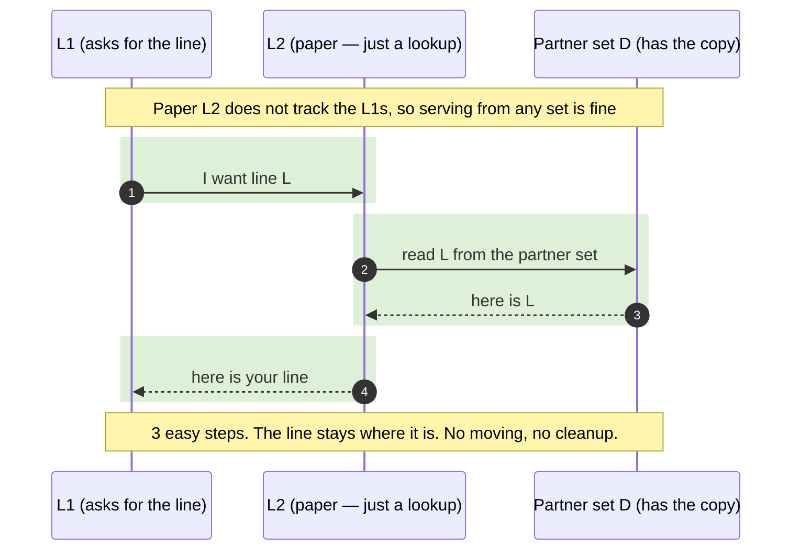
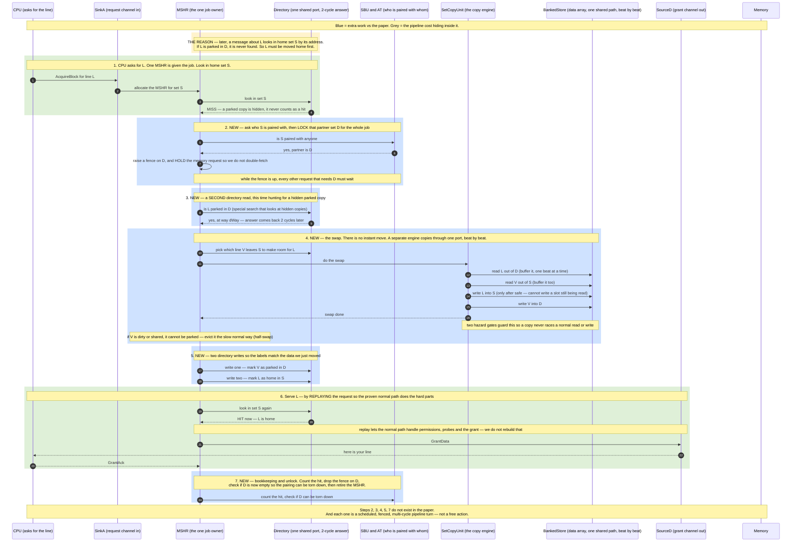

# Paper idea vs. real hardware — the same feature, two very different costs

**The one thing to take away:** the SBC paper's reuse feature is *simple on paper* and *hard in real
hardware*. The performance idea is the same. The engineering effort is not — and this document shows
exactly where all the extra effort comes from.

**The scene (same in both diagrams):** a line was moved from its home set **S** to a partner set
**D**. Now an L1 asks for that line again. What does the cache do to give it back?

**Colour key:** 🟢 green = one simple step · 🟡 yellow = a special case · 🔵 blue = extra hardware the
paper never mentions.

---

## The setup is the same — only the L2 is different

Both designs have the same shape: private **L1** caches per core, one shared **L2**. Set-balancing
happens in the L2. So the gap is **not** about how many caches there are.

The difference is what the L2 has to *do*:

| | Paper's L2 | Our L2 (real RISC-V) |
|---|---|---|
| What it is | A **lookup table** — just tags and data | A **coherence manager** |
| Does it track the L1s? | **No** | **Yes** — it knows which L1 holds each line |
| Can it serve a line from any set? | **Yes** — read it wherever it sits | **No** — a line must sit in the set its address points to |

**Why that last row is everything:** in our cache, later messages about a line (a probe, a
write-back) are found **by the line's address**. The address points to home set S. If the line is
parked in D, those messages look in S and never find it. So before we can hand the line to an L1, we
must **physically move it back home**. That single rule is what turns the paper's one easy step into
our long sequence.

---

## Diagram 1 — The paper's version (easy)

Find the line in the partner set, read it, hand it over. Done. The line never moves. Nothing else in
the cache has to change.

**Cost: almost nothing.** One lookup, one read, one hand-off.

---

## Diagram 2 — Our version (hard)

We cannot serve the line where it sits. We have to **swap it home**: bring L back to set S, and to
keep both sets full, push S's outgoing line into the slot L just left in D. Then let the normal cache
path hand it over.

But there is more hidden cost than "a few extra steps." The real cache is a **pipeline** where the
directory and the data array are **shared, one-at-a-time resources**. So every box below is not just
an action — it is a scheduled turn that waits its slot, comes back a couple of cycles later, and must
be fenced against other requests touching the same sets. Every **blue** box is work the paper never
counted. The **grey** side-notes are the pipeline realities hiding inside those boxes.

Every unit below is a real, separate piece of hardware in our design (same names as
[diagram.md](diagram.md)). The paper's diagram needed 3 boxes. Ours needs 9 — because a pipelined,
coherent cache splits the work across a request channel, one MSHR, a shared directory, the
association table, a copy engine, a shared data array, and the grant channel, instead of one
lookup table.

**Cost: a whole sequenced mini-protocol.** One MSHR must: lock a second set, wait a 2-cycle directory
answer, do a special hidden-copy search, copy two blocks beat-by-beat through a single data port
behind two hazard gates, write the directory twice, replay the request to reuse the normal serve
path, then unlock and clean up — with a slower fallback whenever the victim is dirty or shared.

**The hidden multipliers (why it is worse than the step count suggests):**
- **Shared directory, one port, 2-cycle answer** → the 3 lookups are 3 scheduled turns, each with
  latency, that also compete with every other request in the cache.
- **Shared data array, one path** → the swap is not one move but **many beats**, copied through a
  buffer, guarded by two hazard gates so it never collides with a normal access.
- **The fence** → set D is locked for the entire job, so unrelated traffic to D stalls behind it.
- **One MSHR does all of it in sequence** → no parallelism inside the job, and only one such swap
  runs at a time.

---

## Side by side

| | Paper | Ours |
|---|---|---|
| Directory reads | 1 | 3 (miss, search partner, re-check) |
| Directory writes | 0 | 2 |
| Data blocks moved | 0 | up to 2 (a full swap) |
| Sets locked during the job | 0 | 2 (home and partner) |
| Special cases to handle | none | victim dirty, victim shared, copy too weak, partner full |
| Extra rules to keep correct | none | one partner per set, never two copies of a line, clean up dead pairings |

---

## Why each extra piece is unavoidable

Every added cost traces back to **one** fact: our L2 is a coherence manager that finds lines by
address.

- Must **move the line home** → because messages find it by address.
- Must **swap in a victim** → because the home set is full, and we do not want to waste memory
  bandwidth throwing a good line away.
- Must **lock both sets** → because other requests could touch them mid-swap.
- Must **write the directory twice** → so both sets are labelled correctly after the move.
- Must **handle dirty or shared victims** → real lines are not always safe to move.
- Must **keep strict pairing rules** → so we always know the one place a moved line can be.

---

## The takeaway (slide-ready)

> **The paper's reuse = 1 easy lookup. Our reuse = a full coherent swap across two sets.**
>
> Same performance idea. The extra engineering exists entirely because a real, inclusive L2 must be
> able to find every line by its address — so a moved line has to come home before it can be used.

*(More detail: [phase-3.md](phase-3.md) for the plan, [diagram.md](diagram.md) for the full built and
planned flow, [spec-sbc-phase3-prereqs.md](spec-sbc-phase3-prereqs.md) for the coder edits.)*
