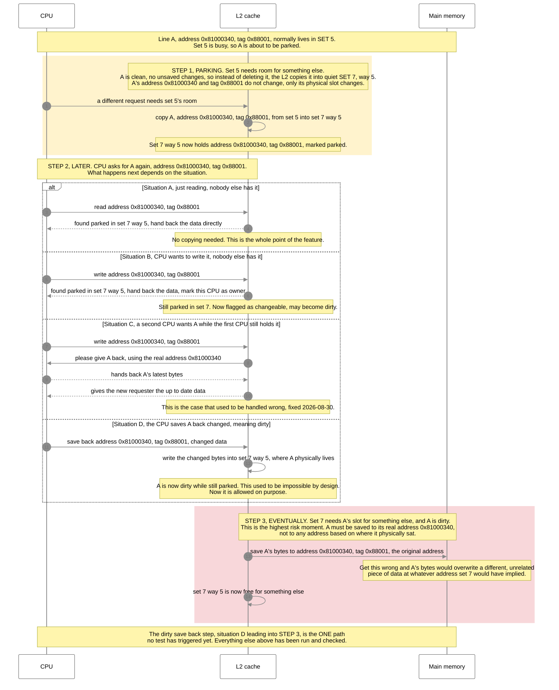

# 2026-09-01 — What our tests actually check, explained simply

This note is for anyone who isn't deep in the RTL. It explains, in plain English, what each of our
recent tests is *for*, and shows one diagram that walks through everything that can happen to a moved
line, using real addresses and tags so it's concrete.

---

## First, the one idea everything else is built on

Our cache has multiple "slots" (called **sets**). Normally, a piece of data can only live in the slot
its address says it belongs to. Our feature — **Set Balancing (SBC)** — lets a busy slot temporarily
lend a piece of data to a quieter slot, instead of throwing it away when the busy slot runs out of
room. We call this **parking** a line.

The line "remembers" its real address the whole time. Later, if someone asks for it again, the cache
can hand it back **without moving it home first** — that's the "serve in place" feature. The tests
below all exist to answer one question: **is it ever possible for a parked line to give back the wrong
data, or to get lost, or to corrupt something else in memory?**

---

## The tests, in plain English

| Test | What it's for, in plain English | Current result |
|---|---|---|
| **`migration_stress_test`** | A checklist of tricky parking situations, run one after another, to see if the basic mechanism ever breaks. | **7 of 7 pass, zero internal errors.** |
| **`serve_in_place_test`** (GATE 5) | Same idea, but stricter — each case must prove the risky situation actually happened, not just that the final answer was correct. | **6 of 9 proven**; 3 passed on the answer but never triggered the real mechanism. |
| **Amendment 11 "bug hunt"** | Runs a real matrix-multiply program with corruption checkers turned on, to see if the feature survives realistic use, not just a hand-written test. | **Passed cleanly** — but never happened to test a moved line being changed and saved back. |

**Bottom line for a non-expert:** the basic mechanism works and hasn't broken anything in a real
program. The remaining open question is specifically about a *dirty* moved line being saved back to
memory correctly — that one path hasn't been triggered by any test yet.

---

## One diagram: everything that can happen to a moved line

Below is a single running example. We track **one specific line of data**, called **A**:

| what | value |
|---|---|
| real address of A | `0x81000340` |
| tag stored for A (this is what the cache actually compares) | `0x88001` |
| A's real home slot (based on its address) | **set 5** |
| the quiet slot it gets parked into | **set 7**, way 5 |

Every step below shows **both the address and the tag together**, so you can see that the address
never changes even though the physical slot does.

**Reading it in one sentence:** the address of a piece of data never changes, only where it physically
sits — and every test we run is really asking "did the cache ever get confused between the two?" So
far: no, except for one path (a changed/dirty parked line being saved back) that hasn't been put
through its paces yet.

---

## What's still open (repeating from the technical report, in plain terms)

1. **Dirty save-back path unverified** — no test has made a moved line dirty *and then* forced it out
   of its parking spot. This is the one real corruption risk still on the table.
2. **Two-CPU handoff not yet run** — Situation C above (another CPU asking for a line while a first
   CPU holds it) needs two CPUs to test properly; that test has been built but not executed yet.
3. **Does the feature actually help performance?** — not yet studied. Everything above is only about
   correctness (getting the right answer), not speed. That's next, once the dirty save-back path is
   checked off.

Full technical detail: [REPORT.md](../coder/003-serve-in-place/REPORT.md) (GATE 5, Amendment 11) and
[TASK.md](../coder/003-serve-in-place/TASK.md) (Amendments 10-11).
