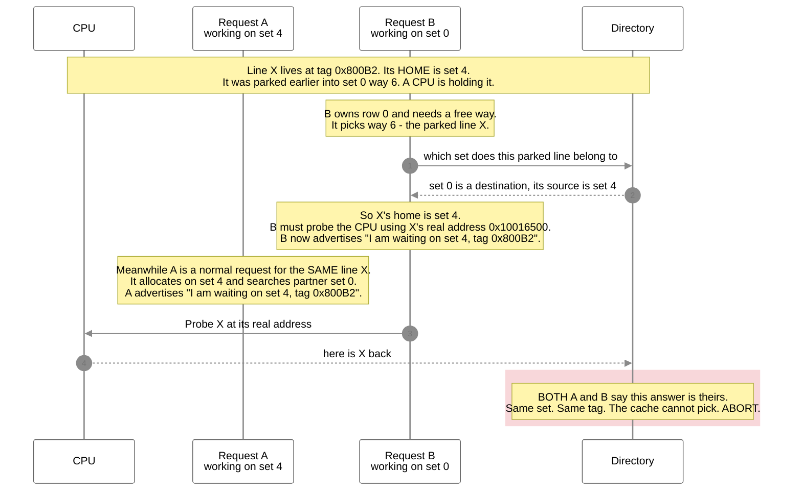
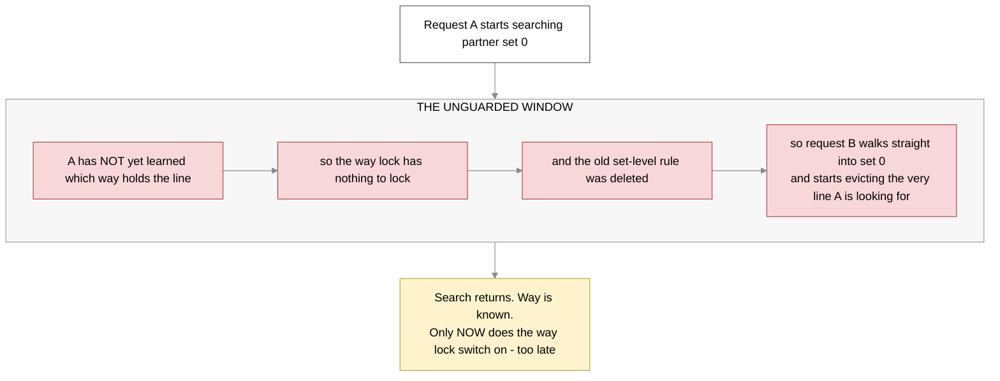
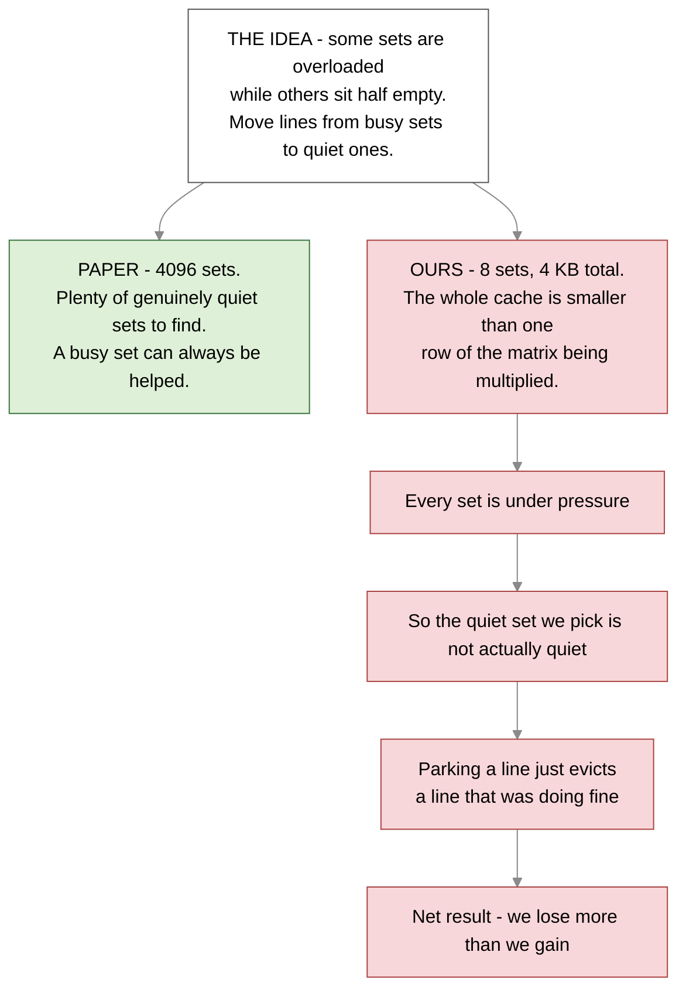
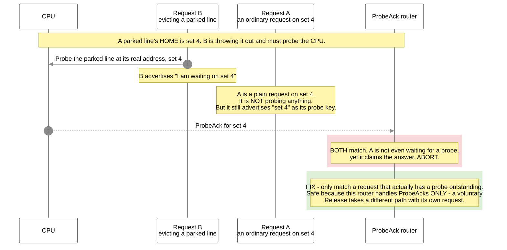

# 2026-09-03 — Bug found and fixed, first honest SBC-vs-baseline number, and how far we are from the paper

Three things happened today.

1. The assert that killed the matmult campaign was **root-caused and fixed**. Everything is green again.
2. With the fix in, we got the **first real SBC-on vs SBC-off comparison on a real benchmark**. SBC lost.
3. Comparing our setup against the Rolán et al. paper explains **why** it lost — and almost none of it
   is about the idea being wrong.

---

## Part 1 — the bug

### What was breaking

The cache aborted with:

```
Assertion failed: SBC: two MSHRs matched one ProbeAck in the way CAM
```

In plain English: when a CPU answers a probe, the cache has to work out **which pending request that
answer belongs to**. Two different pending requests both claimed it. The cache had no way to choose,
so it stopped.

### Why two requests claimed the same answer

Serve-in-place changed one rule. It used to be true that a **parked line can never be held by a CPU**.
That is no longer true — and today's run proves it: **20.6% of all serves handed the line to a CPU that
then held it**.

Once a CPU can hold a parked line, throwing that line out means **probing the CPU first**. And a probe
has to use the line's **real address** — which belongs to its **home set**, not to the set it is
physically parked in. So the evicting request temporarily takes on **another set's identity**.

Here is the collision, with the real values from the failing run.



### The one-line cause

An earlier commit, `ac7253d`, **deleted the rule that kept a second request out of a set someone was
already searching**. It replaced that rule with a narrower "way lock" — don't let anyone evict *this
specific way*.

That swap looks equivalent. It is not, for one reason:

> **The way lock cannot be switched on until the search has already finished** — because until then
> nobody knows *which* way to lock.

So the entire search window was left unguarded. The deleted signal, `secValid`, was still being
computed in the code but **read by nothing**.



### The fix

Put the deleted rule back, but apply it in **one place only**: when a request tries to **claim a set**.
Do not apply it when merely **accepting** a request off the bus — that is what caused the old
C-channel deadlock, and that half stays fixed.

```scala
val secSetConflict = mshrs.map { m =>
  m.io.status.valid && m.io.status.bits.secValid && m.io.status.bits.secSet === request.bits.set
}.reduce(_ || _)
val allocReady = alloc && !dstSetConflict && !secSetConflict
```

Also removed today: the `BUG-A-DETECT` printf. It was a leftover Phase-2 tripwire that fired
**26,329 times** in a clean run, one for every deferred search. It was crying wolf, not finding bugs.

### Proof the fix works

| | before fix | after fix |
|---|---|---|
| matmult on the shadow config | **aborted at 6,687,819 cycles**, no output at all | **ran to completion**, `*** PASSED ***` |
| Checksum | none | **82819** — identical to the SBC-off run |
| Asserts | 1 | **0** |
| Corruption checkers, both models | 0 firings | **0 firings** |
| `migration_stress_test`, stock config | — | **7 of 7 PASS**, 0 asserts |

The corruption checkers never fired **before or after**. That matters: the assert caught an ownership
mistake **before any data moved**. Nothing was ever corrupted.

> ⚠️ **This fix turned out to be necessary but NOT sufficient.** It was verified on the shadow config
> only. On the stock config the same assert still fired. See the update at the end of this file.


---

## Part 2 — the first honest performance number

Same binary, same everything, SBC on versus SBC off.

| | SBC on | SBC off | verdict |
|---|---:|---:|---|
| Checksum | 82819 | 82819 | correct |
| Hits in the home set | 67.46% | **71.68%** | SBC is 4.22 points worse |
| Hits including parked lines | **69.29%** | 71.68% | **SBC is 2.39 points worse** |
| Cycles | 40,410,046 | 39,434,943 | **SBC is 2.47% slower** |
| Lines parked | 21,017 | 0 | |

Broken down the way you asked:

```
hits in the home set     718,684
hits on parked lines      19,490
                       ---------
total hits               738,174

parked-line hits as a share of all hits = 19,490 / 738,174 = 2.64%
```

> ⚠️ **These numbers are superseded.** They were measured at threshold 4 and without the second-search
> bit. See the update at the end of this file for the paper-faithful numbers.

**Why it lost.** Parking a line does not create space — it **takes a slot in the other set**. So home
hits fell by 4.22 points. Parked lines then gave back only 1.83 points, because the search for a parked
line **fails 85.2% of the time** (112,555 of 132,045 searches found nothing). Net: worse.

---

## Part 3 — how our setup compares to the paper

This is the important part. The paper reports a **12.8% miss-rate reduction and 5% IPC gain**. We got a
loss. Almost every difference below pushes against us.

| | Rolán et al. | Ours today | matters? |
|---|---|---|---|
| L2 size | 2 MB | 4 KB | 🔴 |
| **L2 sets** | **4096** | **8** | 🔴 the big one |
| L2 ways | 8 | 8 | ok |
| L1 data cache | 32 KB | **256 B** | 🔴 |
| Replacement | LRU | **random** | 🟡 |
| Parked line inserted as | **most-recently-used** | last-to-be-evicted | 🟡 different but comparable |
| **Migrate when saturation hits** | **the maximum, 15** | **4** | 🔴 we ignored their rule |
| **Destination must be below** | **8** | **2** | 🔴 |
| **Skip pointless searches** | **yes, 1 bit per set** | **not built** | 🔴 |
| Benchmarks | SPEC CPU2006, 10 billion instructions | one matrix multiply | 🟡 |
| Headline metric | average access time and IPC | hit rate | 🟡 |

### Why 8 sets is fatal to the whole idea



### The threshold mistake — this one is ours, and it is free to fix

The paper is explicit:

> *"Only when the counter adopts its maximum value ... is it safer to presume that the set is under
> pressure. Thus our SBC only tries to displace lines from sets whose saturation counter adopts its
> maximum value."*

Their numbers: counter range 0 to 15, migrate at **15**, destination must be below **8**.

Our elaboration prints, side by side:

```
[SBC][elab] satCounter min=0 max=15 T_hi=4  T_lo=2    <- the config we measured on
[SBC][elab] satCounter min=0 max=15 T_hi=15 T_lo=8    <- the stock config
```

**The stock config is already exactly the paper's rule.** We measured on the other one. Our own notes
had recorded 15 as a "gotcha to work around" because it migrates rarely — but migrating rarely **is the
design**. At threshold 4 we parked 21,017 lines to win back 19,490 hits while destroying 45,000 home
hits. That is the paper's warning, reproduced.

### The missing second-search bit

The paper keeps **one bit per set** meaning *"my partner might be holding something of mine."* If the
bit is clear, skip the second search entirely. They measured its absence as costing 0.6-1.0% IPC.

We have **no equivalent**. Every home miss on a paired set pays for a search, and **85.2% of them find
nothing**. On our numbers that is 112,555 wasted searches in one benchmark.

### One methodology note

The paper explicitly says hit rate is the wrong yardstick:

> *"Hit and miss rates are not the best characterization for SBCs because they involve second searches
> that make secondary hits more expensive than first hits."*

They report **average access time and IPC** instead. We should too — our cycle count is the right
instinct, but we have been leading with hit rate.

---

## What to improve, in order

| # | Action | Cost | Why |
|---|---|---|---|
| 1 | ~~Re-run on the stock config at T_hi 15 / T_lo 8~~ | — | ✅ **DONE later today.** See the update below. |
| 2 | ~~Build the second-search bit~~ | — | ✅ **DONE later today.** Helped less than hoped — see the update. |
| 3 | **Grow the L2 geometry** — hundreds of sets, not 8 | config plus test rewrite | The idea needs cold sets to exist. At 8 sets they do not. This is the real blocker. |
| 4 | **Grow the L1 to something realistic** | config | A 256 B L1 sends nearly every access to the L2 and distorts the whole access stream. |
| 5 | **Report average access time and IPC**, not hit rate | scripting | The paper's own stated reason. Second searches cost time that hit rate hides. |
| 6 | Consider LRU plus most-recently-used insertion | larger | Our random replacement cannot express the paper's insertion rule at all. |

**Items 1 and 2 should happen before any further performance claim.** Item 3 is the one that decides
whether this platform can demonstrate SBC at all.

---

## Still not tested

`secWrite = 0`, `secProbe = 0`, `dispRelease = 0` — after a full real benchmark, we have **still never**
written to a parked line, probed one back on a second core, or written a dirty parked line to memory.
matmult cannot reach them: its inputs are read-only and its output is written once. Unchanged from
yesterday, and still the open correctness question.

---

## Files changed today

| file | change |
|---|---|
| `Scheduler.scala` | restored the partner-set fence on `allocReady` |
| `MSHR.scala` | deleted the `BUG-A-DETECT` tripwire |
| `sw/scripts/sbc_stats.py` | rewritten against current logging, plus hit/miss and total-hits reporting |
| `ai-documents/coder/004-l2-hitrate-counters/TASK.md` | noted the reporting side is already wired |


---

# Update — later on 2026-09-03

Items 1 and 2 above were both done the same day. Doing them exposed a **second bug**, and moved the
performance number substantially.

## The fence fix was incomplete — a second way to collide

Rebuilding at the paper threshold, the CAM assert **came back**, at cycle 16,159,095 — almost exactly
where the original stock-config failure was. The fence was genuinely in the build, so something else
was wrong.

The fence only engages while an MSHR is **searching**. But the ProbeAck router had **no test for
whether an MSHR was waiting for a probe at all**. Every live request advertises its own address as a
probe key, whether or not it has a probe outstanding.



Two things made this hard to see. It needs the stock threshold to show up, and **the second-search bit
made it more likely** — skipping searches means the fence is off more often.

**Fix:** a `probeAckPending` term on the match. Confirmed safe from `SinkC.scala:105`, where the router
output is used only when the message is a ProbeAck.

## What the second-search bit is, as built

The paper keeps one bit per set: *"my partner may hold lines of mine."* If clear, skip the second
search. We keep a **per-set count** instead of a bare bit, because we have no cheap way to read "are
any displaced lines left" out of the partner row. Under 1:1 pinning it is the same predicate.

The count is deliberately biased: every way it can drift leaves it **too high**, which costs a wasted
search. Too **low** would skip a search for a line that really is parked, refetch it from memory, and
leave two copies of one address — so it never decrements below zero.

## The numbers

Same binary, same build, SBC on versus off.

| | primary hits | total hits | cycles | vs baseline |
|---|---:|---:|---:|---|
| SBC earlier today, threshold 4, no sc bit | 67.46% | 69.29% | 40,410,046 | +2.47% |
| **SBC now, threshold 15 plus sc bit** | **69.98%** | **70.60%** | **39,648,460** | **+0.54%** |
| Baseline, SBC off | 71.68% | 71.68% | 39,434,943 | — |

All checksums **82819**. Zero asserts. Zero corruption-checker firings.

**The gap more than halved**: total hit rate went from 2.39 points behind to **1.07 points behind**,
and the cycle cost from 2.47% to **0.54%**. Migrations fell 21,017 to 15,074, searches 132,045 to
111,299.

**SBC is still slightly behind the baseline.** Being faithful to the paper made it much less harmful,
not yet helpful.

## Two honest caveats

- **The sc bit helped less than hoped.** 104,721 searches still found nothing. It only skips a search
  when the partner holds **nothing at all**. With 15,074 migrations there is nearly always *something*
  parked, so the search runs and simply fails to find *that particular* line. The paper's bit was never
  designed to fix that.
- **Three dead paths finally fired**: `secWrite=2`, `dispRel=1`, `secC=1`. Writing to a parked line,
  writing a dirty parked line back to memory, and serving a C-channel release from a partner set have
  now all happened at least once on a real workload. Barely — but no longer zero.

## Where this leaves us

The remaining 1.07 points look like **geometry, not tuning**. At 4 KB and 8 sets there is no genuinely
cold set to park into, so every park still costs the destination a line that was doing fine. That is
item 3 from the morning list, and no config change is expected to close it.
