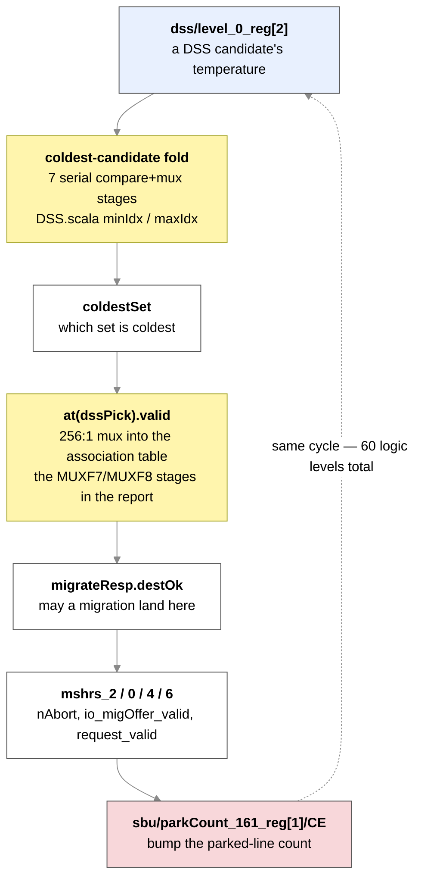

# 2026-09-08 — The SBC-off baseline exists: what SBC actually costs in area and timing

The 2026-09-03 note ended with one blocking item:

> **Blocking item: the SBC-off bitstream.** Until it exists, nothing measured on hardware can be
> called a gain or a loss.

It exists. This note reports what the two bitstreams say about **cost** — silicon area and clock
timing. It says nothing about **benefit**; that still needs a benchmark run on both bitstreams.

Three results, in order of how much they should change your plans:

1. **Area cost is large in relative terms and irrelevant in absolute terms.** The L2 grows by 157% in
   LUTs and 184% in flip-flops. The whole design goes from 5.2% to 6.1% of the FPGA.
2. **Timing cost is 0.473 ns out of a 20 ns budget — about 2.5% of Fmax.** This **corrects an earlier
   estimate of ~2.1 ns**, which was measured against the wrong reference build.
3. **The baseline is contaminated.** `SetCopyUnit` is instantiated unconditionally, so the SBC-off
   build carries 240 LUTs and 529 flip-flops of dead SBC machinery. Every delta below understates the
   true cost by that much.

---

## Part 0 — proof the two builds are actually comparable

This matters more than usual, because the two bitstreams were built five hours apart on the same day
and the RTL was being committed in between. If any non-SBC code changed between them, the comparison
is worthless.

| | SBC-on | SBC-off |
|---|---|---|
| Config | `FPGASingleRocketVCU118L18K256K16WL2ConfigSBCResetEnabled` | `FPGASingleRocketVCU118L18K256K16WL2ConfigNoSbc` |
| Reports dated | 2026-09-04 08:35 | 2026-09-04 13:31 |
| Device | xcvu9p-flga2104-2L | same |
| Vivado | 2021.1, design state `Physopt postRoute` | same |
| Geometry | 256 KB 16-way L2 (256 sets), 8 KB L1s, 1 Rocket core, 50 MHz | same |

The RTL is `rocket-chip-inclusive-cache` at `d7460ef`; the last commit touching `src/` is `8ad5e29`
("SBC: add SBC_StatsReset"). Commit timestamps alone cannot prove the two builds saw the same working
tree, so the generated Verilog was compared directly:

| Check | Result |
|---|---|
| Generated `.sv` modules byte-identical between builds | **344** |
| Modules differing | **5** — `InclusiveCache`, `InclusiveCacheBankScheduler`, `MSHR`, `Directory`, `InclusiveCacheControl` |
| Modules present only in SBC-on | **2** — `SetBalanceUnit.sv`, `DSS.sv` |
| `RocketTile.sv`, `Rocket.sv`, `DCache.sv`, `Frontend.sv` | byte-identical |
| `tile_prci_domain` flip-flops | **12,433 in both, exactly** |

Every module that differs is one SBC touches. The core, the caches, the buses, the debug module and
the DDR controller are the same netlist. **The comparison is clean.**

A useful side effect: `tile_prci_domain` came out at 28,295 LUTs (off) vs 28,276 LUTs (on) from an
identical netlist. That 19-LUT spread is the noise floor of the tool, and it is worth remembering
when reading small deltas anywhere else.

---

## Part 1 — area

Device totals for the xcvu9p: 1,182,240 LUTs, 2,364,480 flip-flops, 2,160 BRAM tiles, 6,840 DSPs.

| | SBC-off | SBC-on | Δ |
|---|---|---|---|
| **Whole design (LUTs)** | 60,887 (5.15%) | 72,064 (6.10%) | **+11,177 (+18.4%)** |
| **Whole design (FFs)** | 42,362 (1.79%) | 48,423 (2.05%) | **+6,061 (+14.3%)** |
| `chiptop0` LUT / FF | 43,647 / 19,203 | 54,835 / 25,253 | +11,188 (+25.6%) / +6,050 (+31.5%) |
| `l2` LUT / FF | 7,276 / 3,288 | 18,686 / 9,333 | **+11,410 (+157%) / +6,045 (+184%)** |
| RAMB36 / RAMB18 / DSP | 97 / 29 / 27 | 97 / 29 / 27 | **no change** |
| DRC | 54 warnings, 0 errors | 54 warnings, 0 errors | no change |

The memory story is the important one: **SBC adds no BRAM at all.** The data array and directory are
untouched. Everything SBC costs is logic and flops.

### Where the L2's +11,410 LUTs go

| Sub-block | SBC-off | SBC-on | Δ LUT | Δ FF |
|---|---|---|---|---|
| `sbu` (SetBalanceUnit, incl. `dss` 889/130) | — | 6,360 / 5,666 | **+6,360** | **+5,666** |
| `mshrs_0..6` (sum of 7) | 1,596 / 754 | 5,546 / 1,055 | **+3,950** (3.5×) | +301 |
| `directory` | 763 / 233 | 1,408 / 251 | +645 | +18 |
| `sinkX` | 103 / 27 | 371 / 27 | +268 | 0 |
| `ctrls` (MMIO) | 42 / 104 | 253 / 138 | +211 | +34 |
| scheduler glue | 1 / 14 | 178 / 14 | +177 | 0 |
| `setCopyUnit` | 240 / 529 | 340 / 556 | +100 | +27 |
| `sourceD`, `sinkA`, `sourceA` | | | +69 | 0 |
| `sourceC` | 197 / 117 | 190 / 125 | −7 | +8 |
| `sinkC`, `requests`, `bankedStore`, `sourceE` | | | −350 | −9 |
| **Total** | **7,276 / 3,288** | **18,686 / 9,333** | **+11,423** | **+6,045** |

The flip-flop column sums to +6,045 exactly, matching the measured L2 delta. The LUT column closes to
within 13 of +11,410 — tool noise, well under the 19-LUT floor established above.

Two things stand out. The SBU is 56% of the cost, as expected. But the **MSHRs tripling is the
second-largest item** and is easy to overlook, because it is spread across seven instances rather than
sitting in one obviously-new module.

### Why the SBU is 5,666 flip-flops — and one array that vanished

With `nWays = 16`, `satCounterBits` auto-derives to 5 (`Configs.scala:124`: `bitLength(2·nWays−1)`),
`setBits` is 8, and `parkCount` is `log2Ceil(ways+1)` = 5 bits. That gives:

| Array | Width | × 256 sets |
|---|---|---|
| `sat` | 5 | 1,280 |
| `at` (valid + sd + assocSet[7:0]) | 10 | 2,560 |
| `parkCount` | 5 | 1,280 |
| `armed` | 1 | **0 — optimized away, see below** |
| 13 × 32-bit statistics counters | | 416 |
| **`(sbu)` direct total** | | **5,536** |
| `dss` | | 130 |
| **`sbu` total** | | **5,666** |

That matches the reported 5,536 exactly, but only because **the entire 256-flop `armed` array is dead
in this configuration.** `armed` is written at `SetBalanceUnit.scala:172-173` and read in exactly one
place, line 185:

```scala
val hotOK = (params.micro.sbcAutoMigrate.B || armed(qSet)) && (sat(qSet) >= tHi)
```

The shipping config sets `sbcAutoMigrate = true`, so that term folds to `true.B`, `armed` is never
read, and synthesis removes the array. **Software arming via `SBC_BalanceSet` is a no-op in this
bitstream** — the MMIO write still lands, but nothing downstream consumes it. That is worth knowing
before anyone tries to drive an experiment by arming individual sets on hardware.

The three surviving per-set tables are 5,120 flops — 90% of the SBU. And critically, the SBU reports
**LUTRAM = 0**: every one of those tables is a register array with combinational read multiplexers,
not a memory. Those multiplexers are also where most of the SBU's 5,474 LUTs go, and they are the
reason the critical path looks the way it does in Part 2.

---

## Part 2 — timing, and a correction

Both bitstreams meet all constraints. `TNS = 0.000`, zero failing endpoints, hold met, in both.

The number that matters is the worst slack in `clk_out1_harnessSysPLL` — the 50 MHz core and uncore
clock, 20 ns period, ~96,000 endpoints. The design-level WNS in both reports (0.382 / 0.504 ns) is in
`mmcm_clkout0`, the DDR4 controller's own domain, and has nothing to do with the L2.

| | SBC-off | SBC-on |
|---|---|---|
| **Core-domain WNS** | **1.474 ns** | **1.001 ns** |
| Worst path, from | `cbus/buffer/nodeOut_a_q/wrap_1_reg` | `sbu/dss/level_0_reg[2]` |
| Worst path, to | `tlDM/.../programBufferMem_12_reg[1]` | `sbu/parkCount_161_reg[1]/CE` |
| Logic levels | **8** | **60** |
| Data path delay | 19.465 ns (3.8% logic / 96.2% route) | 18.591 ns (31.9% logic / 68.1% route) |
| Clock skew on that path | **+1.659 ns** (helping) | −0.148 ns |
| All 10 worst endpoints | `cbus`→`tlDM` (1.474–1.718 ns) | **`sbu` (1.001–1.059 ns)** |
| Implied Fmax | ~54.0 MHz | ~52.6 MHz |

**SBC costs 0.473 ns of the 20 ns budget — roughly 2.5% of Fmax.**

### The correction

An earlier analysis put this cost at **~2.1 ns**. That figure used the `SBCPhase2` build as the
reference, because the proper twin did not exist yet. It was wrong, and the reason is instructive.

The SBC-off design's own worst path is a long haul from the peripheral bus to the debug module. It has
only 8 logic levels and is **96% wire delay** — it is a placement outcome, not a logic-depth problem,
and it lands differently on every build:

| Build | that path's delay |
|---|---|
| `SBCPhase2` | 18.681 ns |
| `SBCPhase2Finish` | 19.168 ns |
| `NoSbc` (the true baseline) | 19.465 ns |

That is **±0.8 ns of pure placement variance on identical logic.** Comparing against whichever build
happened to place it well inflates SBC's apparent cost by more than SBC actually costs. Only the twin
is a valid reference.

### Do not compare the raw path delays

The SBC path's data delay (18.591 ns) is *shorter* than the baseline's (19.465 ns), yet it has *less*
slack. The reason is the clock-skew row: the baseline's path receives its launch and capture clocks
1.659 ns apart, in the helpful direction, and effectively borrows that time. The SBC path gets −0.148 ns.

**Slack is the only valid comparison.** 1.474 → 1.001.

### The critical path itself

What survives from the earlier analysis is that SBC now *owns* the critical path. All ten worst
endpoints in the SBC build are in the SBU, and the path is a combinational round trip that leaves the
SBU, passes through four MSHRs, and returns:



The two highlighted stages are the ones worth attacking. Both come from source constructs that are
easy to miss when reading the Chisel:

- **The fold.** `DSS.scala` builds `minIdx` and `maxIdx` with `(1 until d).foldLeft`, which generates
  `d−1` *serial* compare-and-mux stages. At `dssEntries = 8` that is 7 stages of depth before
  `coldestSet` even exists. A balanced tree would be 3.
- **The 256:1 mux.** `dssOK` in `SetBalanceUnit.scala` chains that fold's output straight into a
  read of the 256-entry `at` table. Because `at` is flops rather than memory (Part 1), that read is a
  large mux tree, and it sits directly in the path.

### High-fanout nets

The SBC-off build has **zero** L2 nets in the top-25 fanout list. SBC introduces three:

| Net | Fanout | Driver | Worst slack |
|---|---|---|---|
| `sbu/_GEN_3[0]` | 777 | MUXF8 | **1.001 ns** — this is the critical net |
| `sbu/i___666_i_1_n_0` | 772 | MUXF8 | 8.738 ns |
| `mshrs_1/sbu_io_commit_valid` | 593 | LUT4 | 9.535 ns |

Fanouts of ~777 across 256 sets are the signature of the per-set register arrays being broadcast to.

---

## Part 3 — the baseline is contaminated

`SetCopyUnit` is instantiated at module scope in `Scheduler.scala:86`, alongside `directory` and
`bankedStore`:

```scala
val directory   = Module(new Directory(params))
val bankedStore = Module(new BankedStore(params))
val setCopyUnit = Module(new SetCopyUnit(params))   // <- no enableSetBalancing guard
```

The other SBC blocks in that file *are* guarded (`if (params.micro.enableSetBalancing)` at lines 406,
533 and 600). This one is not. Two independent confirmations:

- `SetCopyUnit.sv` is **byte-identical** in both builds' generated Verilog.
- It appears in the SBC-off utilization report at **240 LUTs / 529 flip-flops**.

So the SBC-off build spends 240 LUTs and 529 flops on a datapath mover that can never be started,
because nothing generates a `schedule.copy.valid`. Consequences:

1. **Every area delta in Part 1 understates SBC's true cost by 240 LUTs / 529 FFs.** The honest
   full cost of SBC is +11,417 LUTs / +6,590 FFs against a genuinely clean baseline.
2. It is dead logic in the shipping baseline bitstream. Harmless, but it should be guarded — both to
   make the baseline honest and because it is free to fix.

---

## What this means

**On area: stop worrying.** Tripling the L2's logic sounds alarming and is not. The design occupies
6.1% of a VU9P. There is roughly 16× headroom. Nothing about the current geometry is close to a limit,
and no BRAM was consumed at all.

**On timing: also stop worrying, at this clock.** 0.473 ns out of 20 ns, with 5% margin remaining, at
a 50 MHz target. Both bitstreams close.

**The one thing to keep in view is scaling, not the current number.** The baseline's limiter is
routing-dominated and would respond to floorplanning. SBC's is depth-dominated — 60 logic levels — and
will not improve with better placement. Worse, the `sat` / `at` / `parkCount` arrays grow
linearly with set count and their read multiplexers grow faster than linearly. At 256 sets this costs
0.47 ns. At 1024 sets, or at a higher clock target, it is a different conversation.

**The area lever and the timing lever are the same lever.** Converting the four per-set tables from
flop arrays to LUTRAM removes ~5,120 flops *and* takes the 256:1 mux tree out of the critical path.
The caveat is real and needs checking before anyone commits to it: `at` has roughly 7 dynamic read
ports (`tapSet`, `assocQuery`, `checkQuery`, `qSet`, `dSet`, `dssPick`, stats readback), so it would
need one replicated LUTRAM copy per read port, and the write port count must be confirmed to be one
per cycle.

---

## What to do, in order

| # | Action | Cost | Payoff |
|---|---|---|---|
| 1 | **Run a benchmark on both bitstreams.** This note measures cost only. There is still no measured benefit. | a day | the only number that decides whether SBC ships |
| 2 | Guard `setCopyUnit` behind `enableSetBalancing` | one line | honest baseline; −240 LUT / −529 FF of dead logic |
| 2b | Decide what `armed` is for. Under `sbcAutoMigrate = true` it is dead silicon-side and `SBC_BalanceSet` is a no-op. Either gate the MMIO or drop `sbcAutoMigrate` for arming experiments | one line | removes a silent trap for anyone driving experiments from software |
| 3 | Tree-reduce the `minIdx` / `maxIdx` folds in `DSS.scala` | small | removes 4 of 60 logic levels; no behaviour change |
| 4 | Register `dssPick` and the `at(dssPick).valid` lookup | small | removes the fold *and* the 256:1 mux from the path. Destination *selection* is advisory, so a one-cycle-stale coldest set is architecturally harmless |
| 5 | Register `migrateResp` at the SBU output and the MSHR→SBU park pulse | medium | splits the 60-level round trip into two halves |
| 6 | Move the per-set tables to LUTRAM | large, needs port analysis | the real area win: ~5,120 flops |

Items 3–5 were originally proposed on the strength of a 2.1 ns timing cost. At the corrected 0.473 ns
the timing case for them is much weaker, and they should be treated as **scaling insurance rather than
present-day necessities**. The strongest remaining argument for touching the SBU is the flop count,
which points at item 6.

Nothing here is a reason to delay item 1.

---

## How to reproduce

```bash
cd <chipyard>
source env.sh

# the SBC-off twin (multi-hour place-and-route)
cd fpga
make -j20 SUB_PROJECT=vcu118 \
  CONFIG=FPGASingleRocketVCU118L18K256K16WL2ConfigNoSbc bitstream

# side-by-side area + timing extraction
cd ..
./scripts/ssbc_scripts/compare_reports.sh \
  FPGASingleRocketVCU118L18K256K16WL2ConfigNoSbc \
  FPGASingleRocketVCU118L18K256K16WL2ConfigSBCResetEnabled
```

`compare_reports.sh` takes any two config names and prints per-instance LUT/FF/LUTRAM down to
`sbu` / `dss` / `setCopyUnit` / MSHR-sum, plus design WNS and the worst `clk_out1_harnessSysPLL` path
with its logic-level count and endpoints. It also prints each build's report date, so a stale pairing
is visible immediately.

To re-verify build provenance the way Part 0 did:

```bash
cd fpga/generated-src
A=chipyard.fpga.vcu118.VCU118FPGATestHarness.FPGASingleRocketVCU118L18K256K16WL2ConfigNoSbc/gen-collateral
B=chipyard.fpga.vcu118.VCU118FPGATestHarness.FPGASingleRocketVCU118L18K256K16WL2ConfigSBCResetEnabled/gen-collateral
for f in $(ls "$A" | grep '\.sv$'); do
  [ -f "$B/$f" ] && { cmp -s "$A/$f" "$B/$f" || echo "DIFF: $f"; }
done
```

Anything beyond the five expected L2 modules means the builds are not comparable.

---

## Source references

| Finding | Location |
|---|---|
| `setCopyUnit` instantiated unguarded | `design/craft/inclusivecache/src/Scheduler.scala:86` |
| SBC blocks that *are* guarded | `Scheduler.scala:406`, `:533`, `:600` |
| Serial `minIdx` / `maxIdx` folds | `design/craft/inclusivecache/src/DSS.scala:53`, `:111` |
| `dssOK` chaining fold output into the `at` read | `design/craft/inclusivecache/src/SetBalanceUnit.scala:184` |
| The per-set tables | `SetBalanceUnit.scala:138` (`sat`), `:139` (`at`), `:169` (`armed`), `:243` (`parkCount`) |
| `dssEntries` default (8) | `design/craft/inclusivecache/src/Parameters.scala:129` |
| `satCounterBits` auto-derivation to 5 | `design/craft/inclusivecache/src/Configs.scala:124` |
| `armed` dead under `sbcAutoMigrate` | `SetBalanceUnit.scala:169` (decl), `:185` (only read) |
| SBC-off config | `chipyard/src/main/scala/config/RocketConfigs.scala:193` |

## Files added today

| file | change |
|---|---|
| `scripts/ssbc_scripts/compare_reports.sh` | side-by-side area + timing extraction for any two VCU118 builds |
| `ai-documents/daily-summary/2026-09-05.md` | this note |

## Still not measured

**Whether SBC helps.** Both bitstreams exist and boot the same Linux image. Until a benchmark runs on
both, every number in this note describes a price with no quoted benefit.
