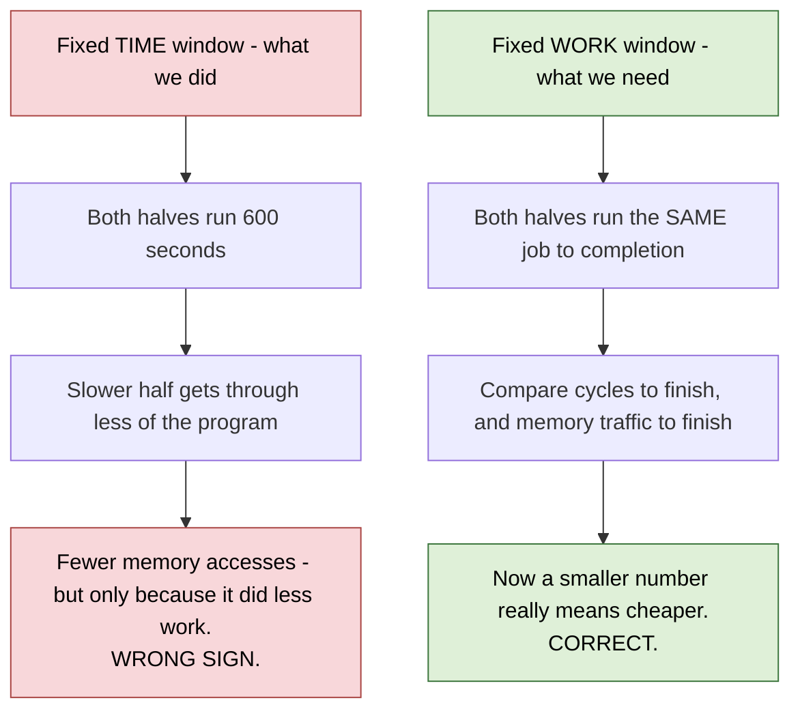

# Day log — 2026-09-11

> # ⚠️ WE ARE IN THE MIDDLE OF A TASK. NOT FINISHED.
>
> **Active task: `ai-documents/coder/006-migrate-switch-and-memory-traffic/`.**
> Most of the hardware landed today, but **the measurement it exists to produce has not been taken.**
> Do not treat any number below as a result. Pick up at §6.

---

## 1. Where the day started

- We had one FPGA A/B (omnetpp, 2026-09-10) saying SBC loses badly, but it was untrustworthy:
  - the measured window was polluted by boot (lines were already parked before the benchmark began)
  - the hit-rate counter counts things that are not CPU requests, so no absolute number was quotable
- Two fixes were agreed and written up as coder task 006:
  - a **migration on/off switch**, default OFF, so a run can start from a clean cache
  - a new headline metric: **main-memory accesses**, counted at the memory port, no denominator to argue about

## 2. What the thinker (this session) did

- Filed **coder task 006** with the full work order, plus two amendments as evidence came in.
- **Amendment 1** — the board cannot read cycle counters from software:
  - `rdcycle` and `rdinstret` both trap. The instruction word in the kernel oops decodes to exactly `rdcycle`.
  - `perf_event_open` fails with `EINVAL` — a PMU is registered but has no real counters behind it.
  - `rdtime` **does** work. So the permission grant is selective, not absent.
  - **Instruction count is unavailable on this board by any route. No IPC. Accept it and move on.**
  - Consequence: added a small `L2_Cycles` counter in the cache's own register block. It is now the
    only way to measure time properly.
- **Amendment 2** — traced the RTL to check whether one bitstream can serve both halves of the A/B.
  Every SBC addition is inert when the switch is off, so on paper "switch off" equals "SBC not built".
- Answered how to build the FPGA bitstream and how to build waveforms (both already scripted).

## 3. What the coder did

Far more than expected. Their report is
`ai-documents/coder/006-migrate-switch-and-memory-traffic/REPORT.md`.

| Piece | State |
|---|---|
| Migration on/off switch (0x3C0, default OFF) | ✅ done |
| Main-memory traffic counters (reads, writes, upgrades, clean evictions) | ✅ done |
| `L2_Cycles` counter | ✅ done |
| `sbc_read --migrate=on/off` and `--reset-all` | ✅ done |
| Register map docs brought up to date | ✅ done |
| Board A/B automation, one bitstream, two phases | ✅ done and run on hardware |
| A dedicated test proving the switch works | ✅ done, 4 of 4 pass |
| `sbc_read` child timing (`rdtime` / CPU time) | ❌ not done |

Things they found on the way that we did not ask for:

- The register map doc had the **config word bit order backwards**. Pre-existing error, now fixed.
- One of our own checks was written against the wrong field. The debug print shows what the *CPU*
  asked for, not what the *cache* sent to memory. Compared correctly, the new counters match the logs
  almost exactly.
- The board automation script used to tell the two bitstreams apart by "did any migration happen".
  With the switch defaulting off, that test now returns the same answer for both — every A/B would
  have been mislabelled. They fixed it before it caused a bad result.
- Clean evictions to memory **do** happen (about 108,000 in one run), so that counter earns its place.

## 4. The board result — first one-bitstream A/B

`520.omnetpp_r`, one SBC bitstream, two 600-second phases back to back, no reboot.

| | switch OFF | switch ON |
|---|---:|---:|
| hit rate | **90.19%** | **57.95%** |
| migrations | 0 | 98,663 |
| parked lines at end | 0 | 1,845 |
| L2 accesses in the window | 853 M | 682 M |

Two things follow.

**Good news — the one-bitstream method works.** The switch-off half scored 90.19%. A separately built
"SBC not present" bitstream scored 90.24% on the same benchmark last week. **0.05 points apart.**
The 5% wobble the coder saw in the tiny Verilator config did not appear on the real one. We can run
both halves on one bitstream and stop worrying about build-to-build variation.

**Bad news — the window is still measuring the wrong thing.** Look at the last row: the two phases did
not do the same amount of work. Same 600 seconds, but the SBC half got through about 20% less of the
program, because it was slower. A fixed-*time* window measures "how much did the machine manage",
not "what did this job cost".

- This would have made the new memory-traffic counter read **backwards** — SBC would appear to touch
  memory less, purely because it did less.
- The fix is not in hardware. It is: **run a job that finishes, and measure that job.**



## 5. Why the hit rate collapsed — one line

Parked lines **are** being reused heavily (about 281 hits per parked line, far above break-even). But
the disruption to ordinary caching costs roughly ten times more than the reuse returns.
**The mechanism works. The economics do not, at this size and on this workload.** That is still the
open research question, and it is what the parked-occupancy workplan exists to answer.

## 5b. The memory counters ARE live on hardware (checked 2026-09-11, later sessions)

The report's board section cites the 23:46 session, which predates Part B. **Two later sessions exist
and they do have the memory counters.** `chipyard/scripts/logs/board_session_20260911-022242.log`
and `...-033822.log`:

```
memReads=6850989 memWrites=3998876 memUpgrades=0 memRelClean=2848017 L2_Cycles=74284524774
  migrate          : OFF
  MEMORY ACCESSES  : 10849865  (reads 6850989 + writes 3998876)
  bytes moved      : 694391360  (x64 B/block)
  mem accesses/kcyc: 0.146
```

- All five new registers answer on the FPGA. **The bitstream was rebuilt with Part B in it.**
- `memUpgrades = 0` — the cache never asks memory for permission alone. Matches simulation.
- `memRelClean` is large (2.8 M) and correctly **excluded** from the headline, since a clean
  eviction moves no bytes. Good call by the coder.
- `L2_Cycles` is counting, so the time normaliser works on hardware too.

**And the fixed-work protocol was already attempted.** Both sessions end by launching a *bounded*
omnetpp run in exact-window mode:

```
./sbc_read --zero -- sh -c './omnetpp_r_base.riscv-64 -c General -r 0 --sim-time-limit=0.3s ...'
```

(0.3 s in the first session, 0.8 s in the second.) That is exactly the fixed-work window we need.

**But both sessions were cut off before the run reported back**, and both only ever show
`migrate: OFF` — no switch-ON phase. So there is still **no completed A/B**. The tooling is done and
proven on hardware; only the run is missing.

## 6. PICK UP HERE TOMORROW

**Decisions waiting on Damith:**

1. **Confirm the one-bitstream method is accepted** (90.19 vs 90.24 on the board). The coder's report
   still ranks "prove the LFSR theory first" as the safe path — that was written before the board run
   and is now over-cautious. My ruling: the board answered it, move on. **Needs your yes.**
2. **Confirm the switch to fixed-work windows.** This means picking a benchmark input that finishes in
   a sensible time, instead of the 600-second window on a run that never ends.

**Work items, in order:**

3. Pick and prepare a **benchmark that completes**. Everything downstream is blocked on this.
4. Re-run the board A/B on it — this finally produces the memory-traffic table that task 006 exists for.
5. Finish the small leftovers: `sbc_read` child timing, and confirm whether the cache clock and CPU
   clock are the same on this board (decides whether `L2_Cycles` is true CPU cycles or only a ratio).
6. Commit. Nothing from today is committed yet — 12 modified files and 2 new source files are sitting
   in the working tree.

**Housekeeping:**

- The coder's report has an internal contradiction: the top says Parts B/D/E landed, but the closing
  **Verdict** section still says "Parts B, C, D, E are untouched" and offers three ways forward that
  the board run has already settled. Ask them to refresh it.
- `tmp.md` at the repo root is now stale — it describes the switch and the counters as proposals
  awaiting approval, and they are built. Delete or refresh it.
- `bistream_gen_vcu118.sh` header still claims "there is no runtime disable". Half true now.

## 7. Files to read first tomorrow

| File | Why |
|---|---|
| `ai-documents/coder/006-migrate-switch-and-memory-traffic/REPORT.md` | the full coder record, including the board session |
| `ai-documents/coder/006-migrate-switch-and-memory-traffic/TASK.md` §11–12 | the two amendments and why they exist |
| `ai-documents/performance/workplan-parked-occupancy-2026-09-11.md` | the research question underneath all of this |
| `ai-documents/performance/omnetpp-differential-2026-09-10.md` | the measurement this task set out to make trustworthy |
