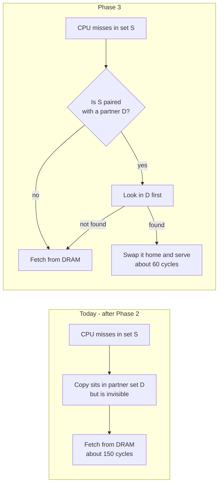
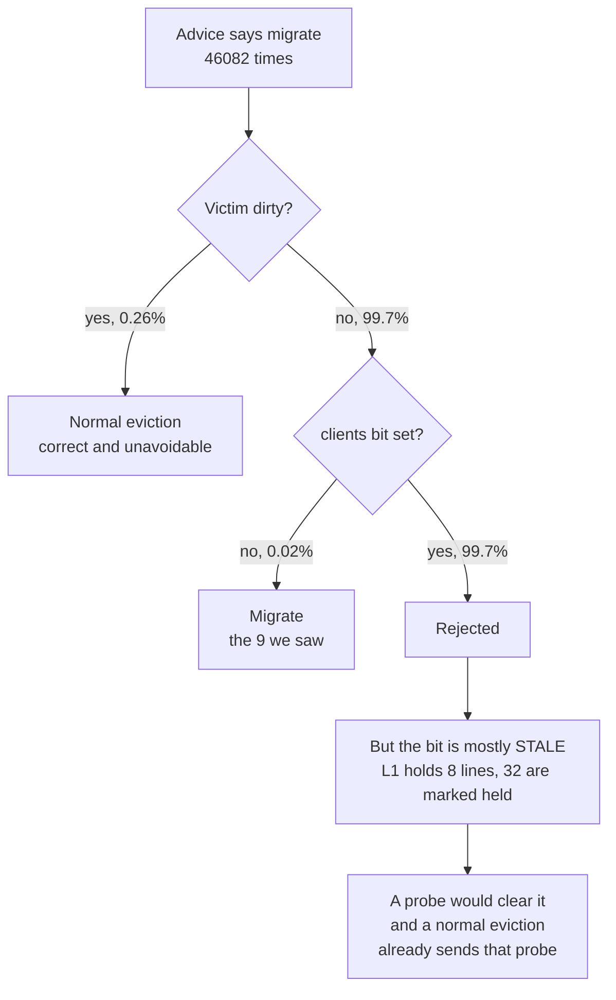
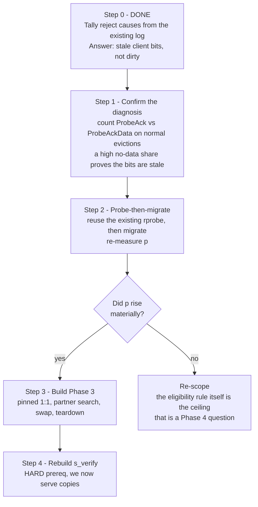

# After-Break Work Plan — Phase 3 restart

**Written:** 2026-08-18 (filename kept as the user named it)
**Branch:** `set_migration_refactored`
**Status of prior work:** Phase 2 COMPLETE and signed off on correctness (2026-08-17).
**Purpose:** what to pick up first now that Phase 2 is closed — including the answer to the
low-`p` blocker, which was measured while writing this doc.

Design detail for Phase 3 lives in [phase-3.md](phase-3.md). This file is the **plan of action**,
not a second design doc. Where the two disagree, this file is newer.

---

## 1. Phase 3 in one line

Phase 2 moves clean lines from a hot set into a cold set. Those copies are **dead weight** — nothing
can read them. Phase 3 makes the cache **find and use them**, which is where the speedup finally
comes from.



Saving per recovered line is roughly DRAM cost minus swap cost, about 90 cycles.

### Three rules already locked in (from phase-3.md, unchanged)

- **Always use, never just detect.** No read-only counter first. A detect-only version can count
  copies that have gone stale and would eventually serve wrong data. Always searching the partner
  before going to DRAM makes stale copies impossible by construction.
- **Swap-then-replay.** On a find, move data only (D to S, and S's victim into D's freed slot), then
  **re-run the lookup**. It now hits natively and the existing untouched hit path serves it. Costs a
  few cycles, saves building a whole new grant datapath.
- **Pinned 1:1 pairing.** While S is paired with D, every spill from S goes to D. No asking the DSS,
  no checking how cold D is. This is the correctness prerequisite: without it S's lines scatter while
  the table remembers one partner, so the search looks in the wrong place.

---

## 2. The blocker — and its cause, now found

### What we knew at sign-off

The sign-off run said migration almost never fires:

```
EVICT-ASSESS  129488    every eviction assessed
ADVICE-MIG     49161    scheduler said "hot set, migrate"
MIG-START          9    actually migrated
COMMIT             6
```

So `p` — the chance an eviction finds a migratable victim — measured about **0.0002**. Phase 3's
whole payoff is `p · (M − C)`, so at that rate there is nothing in the pool to find.
`phase-3.md` recorded the next step as "instrument why victims are ineligible."

### It was already instrumented — we just never tallied it

[MSHR.scala:787](../design/craft/inclusivecache/src/MSHR.scala#L787) already prints `dirty=`,
`clients=` and `displaced=` on **every** `EVICT-ASSESS`. The sign-off log is still on disk. So the
question needed **no RTL and no re-run** — only a tally of the existing log.

Result, over the 46,082 assessments that had migrate advice latched (only these could ever migrate):

| Why the victim was rejected | Count | Share |
|---|---|---|
| **Client held it** (`clients =/= 0`) | 45,952 | **99.72%** |
| Dirty | 120 | 0.26% |
| Dirty and client-held | 1 | 0.00% |
| **Eligible — migration ran** | 9 | 0.02% |

**It is not a write-heavy workload.** Dirty victims are a rounding error. In 99.7% of cases the L2
believes a client still holds the line.

### The client bit is stale — the arithmetic proves it

```
L1 D-cache : WithL1DCacheSets(2) x WithL1DCacheWays(2) x 64B  =  4 lines
L1 I-cache : same                                             =  4 lines
                                              max truly held  =  8 lines

Hot sets receiving advice : 1, 4, 5, 6      = 4 sets
Ways per set                                = 8
Ways marked client-held at assess time      = about 32
```

**8 lines of real L1 capacity cannot account for 32 ways marked as held.** At least three quarters
of those bits are stale — the L1 dropped the line without telling the L2, and the L2 keeps the bit
set until something probes.

Second, independent confirmation: the chosen victim way is spread **uniformly** across all 8 ways
(~5,700 each). `preferEvictable` uses `PriorityEncoderOH`, which always picks the lowest set bit, so
a working evictable tier would bias hard toward low way numbers. Uniform spread means the LFSR tier
ran, which means `evictableOH` was **zero** — the set genuinely had no way that *looked* clean and
client-free. Not a wiring bug (Bug A is still fixed); the directory was telling the truth about what
the bits say.

> **Root cause:** SBC's eligibility test `!dirty && !clients.orR && !displaced`
> ([MSHR.scala:785](../design/craft/inclusivecache/src/MSHR.scala#L785)) reads a **stale**
> `clients` bit. It is not testing "is this line in L1." It is testing "did L2 ever grant this line
> to L1, and has it heard about a release since." In a workload that reuses addresses, that is
> almost always yes — so the gate rejects nearly everything.



### Why this is good news

A normal eviction of a client-held line **already probes the client** to invalidate it
(`s_rprobe`). The probe is how the truth gets discovered — and for a stale bit it comes back
immediately as a `ProbeAck` with no data. So the information SBC needs is already being fetched on
the very path SBC is declining to take.

That makes the candidate fix small and nearly free:

- **Probe, then migrate.** Pick the victim. If `clients` is set, run the existing rprobe to
  invalidate. When the probe drains and the line is still clean, **migrate** instead of releasing.
- The `displaced ⇒ clean and client-free` invariant **still holds by construction** — after the
  probe, `clients` is zero for real, which is stronger than what we check today.
- If the probe returns dirty data (`ProbeAckData`), the line is now dirty → fall back to normal
  eviction. Existing path, no new code.
- **Cost is a wash.** The baseline eviction pays probe plus release. Migration would pay probe plus
  copy. The probe is common to both, so the differential is copy-versus-release exactly as before —
  `C` does not grow.
- **No regression risk versus baseline.** We are not probing anything the baseline would have
  spared: the baseline evicts that same line and probes it anyway.

Upper bound on the win: 84% of assessments were non-dirty, so `p` could rise from 0.02% toward the
tens of percent. Even a fraction of that turns Phase 3 from unmeasurable to measurable.

**Caveat to keep honest:** the fix is *reasoned*, not yet measured. Some of those 46,082 client bits
are real, and the probe will genuinely invalidate a live L1 line in those cases — same as the
baseline eviction would, so it is not a correctness or fairness regression, but it does mean the
realised `p` will land below the 84% ceiling. Step 1 below measures it instead of guessing.

---

## 3. Revised work plan

Ordered. Steps 0 to 2 are cheap and settle whether Phase 3 is worth building at all. Do not start
step 3 before step 2 gives a number.



| Step | What | Cost | Why now |
|---|---|---|---|
| **0** | Tally reject causes from the sign-off log | done | Answered the blocker with no RTL and no re-run |
| **1** | Count `ProbeAck` vs `ProbeAckData` on normal evictions | small — one printf plus a parser line | Directly measures how stale the bits are. A high no-data share confirms the diagnosis |
| **2** | **Probe-then-migrate**, then re-measure `p` | moderate — reuses `s_rprobe`, no new datapath | This is the actual unblocker. `p` is the gate on everything downstream |
| **3** | Phase 3 proper: pinned 1:1 → partner search → swap → teardown | large | Only worth it once `p` is non-trivial |
| **4** | Rebuild `s_verify` behind a non-starvable read path | moderate | **Hard prereq** for step 3, not optional — see below |

### Note on step 2 versus the alternative

An earlier reading of this blocker blamed the tiny eval config (L1 comparable to L2) and proposed a
realistic L2:L1 ratio as the fix. The measured geometry rules that out — the ratio here is already
16:1, which is realistic. The problem is the stale bit, not the size ratio. Re-running on a bigger
L2 is still worth doing eventually for the perf numbers, but it is **not** the fix for `p`.

### `s_verify` is now load-bearing

Phase 2 removed `s_verify` (it starved on the lowest-priority BankedStore read port and deadlocked).
That was safe **only because nothing ever read the parked copies**. Phase 3 **serves them to the
CPU**, so a silent copy corruption becomes wrong architectural data. It moves from nice-to-have to
required, and it needs a non-starvable read path — do not just re-enable the old state.

---

## 4. Open questions for the user

1. **Secondary-hit accounting.** When a line is recovered by a swap, does the home set count it as a
   **hit** or a **miss** for its saturation counter? A hit keeps S looking satisfied. A miss pushes S
   to keep migrating. Interacts with any future throttle.
2. **`s_verify` timing.** Rebuild it *before* the swap lands (safer, since we then serve copies) or
   *after* (faster to a first result)?
3. **Probe-then-migrate scope.** Take it as a Phase-3 prerequisite (recommended — it is what makes
   Phase 3 measurable), or hold it as Phase 4 work on client-held lines?

---

## 5. Carried-over debts (unchanged, do not lose)

- **Displaced-reclaim tier** — verified only under the forced torture config. It never fired on the
  stock sign-off run (6 migrations over 3 sets never fills a set). Its evidence is entirely
  synthetic. Phase 3's teardown work should re-test it.
- **`[born → gate]` sub-window** — latent, unobserved. Do **not** pre-build a fix.
- **Q3, copy-port priority** — tested and rejected. Do **not** reorder BankedStore priorities. The
  order is load-bearing for protocol deadlock-freedom.
- **MMIO flush plus SBC** — documented platform constraint, no hardware. Do not use `Flush64` /
  `Flush32` while `enableSetBalancing` is on.
- **`s_wsafe` in SetCopyUnit** — DO NOT DELETE. It was silently reverted once by a debug-cleanup
  pass and reintroduced a deadlock.

---

## 6. Code cleanup — audited 2026-08-18, and the list shrank

Full detail: [code-cleanup-suggestions.md](code-cleanup-suggestions.md). Summary of the audit against
current source:

| Batch | What | Verdict |
|---|---|---|
| **A** | Delete `MSHR.scala.original` + a commented DUMP block | 🔴 **do** — still owed, zero risk |
| **B** | Fix 3 comments describing the deleted injection path | 🔴 **do first** — still owed, zero risk |
| **C** | Excise dead `s_verify` + the stall classifier | ✅ done in `a2975d6` |
| **D** | Retire the two debug repro knobs | ⛔ **keep both** — verdict reversed |
| **E** | Guard consolidation, dead IO, printf trim | ⛔ **do none of it** |

**So the actionable cleanup is two zero-risk items.** Nothing in D or E is dead code — each is either
a tool still needed or a decision not yet made.

**Do Batch B first, despite being "just comments."** Three comments describe hardware that no longer
exists (the Phase-1 injection path). That is exactly the failure mode that let the `s_wsafe` fix be
deleted during the last cleanup pass: code whose stated reason is wrong reads as cruft to the next
person tidying up. Also delete `MSHR.scala.original` rather than leaving it gitignored — an invisible
stale copy of the most-edited file in the repo is worse than either extreme.

### Why D and E flipped to "don't"

- **D1 `sbcGateStallCycles` — keep.** The original reasoning was "the dst-collision bug it reproduced
  is closed." But the **residual `[born → gate]` sub-window is still open**, and this knob is the only
  instrument that widens it. And if step 2 works, migration goes from 9 per run to thousands — every
  one opening a destination-fence window. A race never hit in 9 attempts is a different proposition at
  9,000, so the repro tooling gets *more* valuable, not less.
- **D2 `sbcForceDstSet` — keep.** Still the only way to fill a set with displaced lines, so still the
  only way to exercise the displaced-reclaim tier, whose evidence is entirely synthetic (§5).
- **E1 — not cleanup any more.** Those six guards include the "one migration in flight" token. Free at
  9 migrations per run, a throughput ceiling at thousands. The question stops being "which are
  redundant" and becomes **"do we allow more than one migration at once?"** — a Phase-3 design
  decision. Fold it into the pinned-pairing step (step 3), which touches that code anyway.
- **E2 — leave.** The dead `assocQuery`/`assocResp` IO is wired up by step 3's partner search.
- **E3 — rejected outright.** Step 0 solved the blocker with **no RTL and no re-run**, purely because
  the `EVICT-ASSESS` printf already carried `dirty`/`clients`/`displaced`. Those printfs just paid for
  themselves, and step 1 adds another. Verbosity is the asset here.

Both knobs and all the printfs are `sbcDebug` / compile-time gated, so keeping them elaborates **zero
hardware**. Baseline stays bit-exact either way.

---

## 7. Cross-references

- **Probe-then-migrate design (the unblocker, step 2 above): [phase-2.5-probe-then-migrate.md](phase-2.5-probe-then-migrate.md)**
- Phase 3 design, in full: [phase-3.md](phase-3.md)
- Phase 2 single source of truth: [phase-2.md](phase-2.md)
- Every bug, fixed and open: [bug-fix-log.md](bug-fix-log.md)
- Pinned-association spec, written but unimplemented: [spec-sbc-phase3-prereqs.md](spec-sbc-phase3-prereqs.md)
- Arbitration and priority orders: [priority-orders.md](priority-orders.md)
- Log analysed for step 0:
  `sw/verilator_logs/migration_stress_test_VerilatorRocket8KL116KL2Config_phase2-verification-test/sbc.log`
