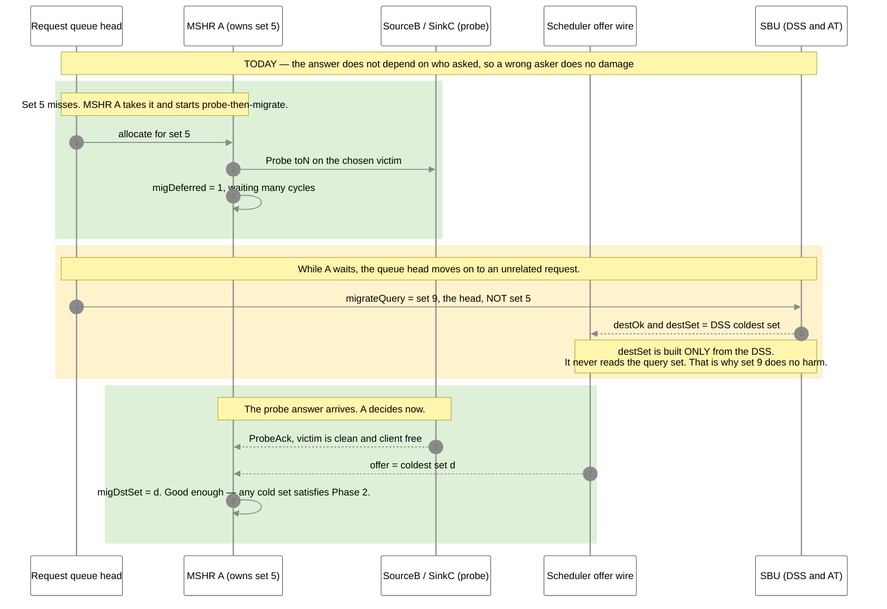
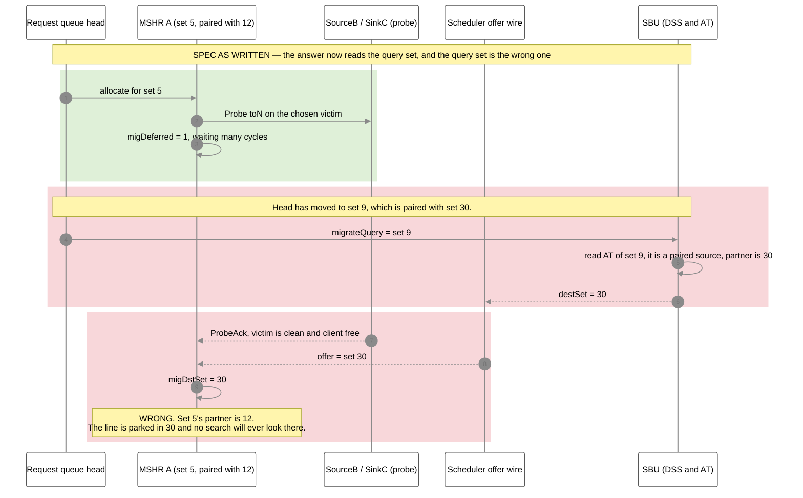
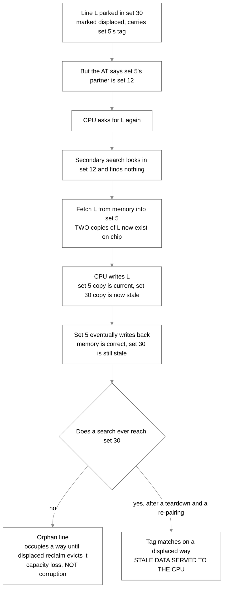
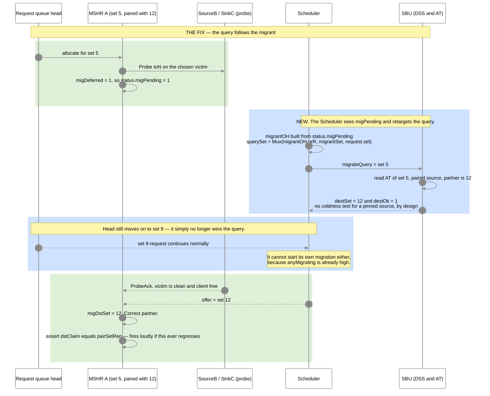
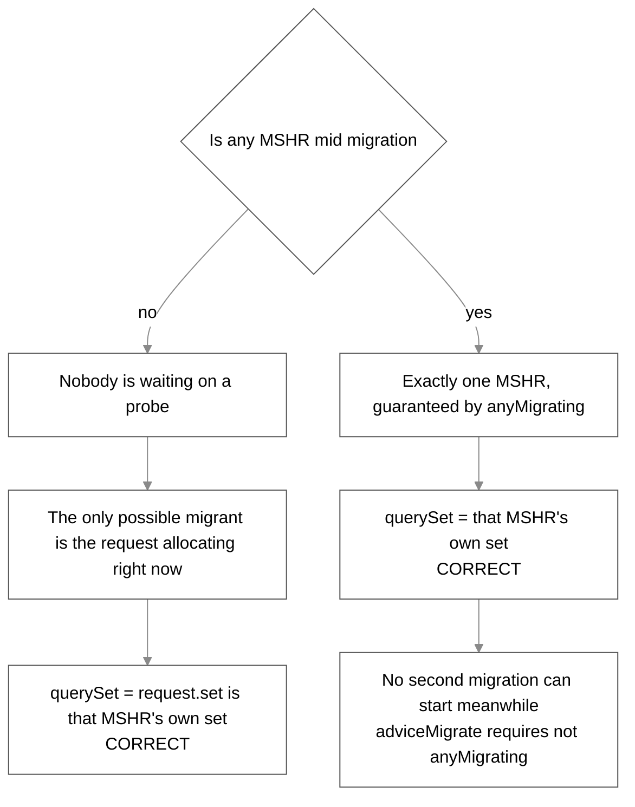
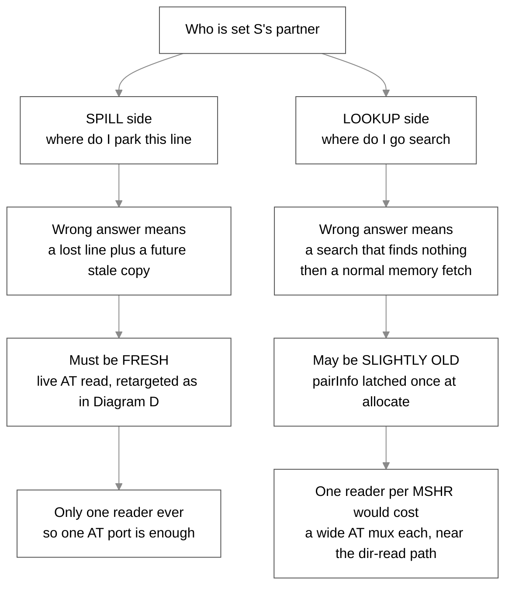

# The stale destination query — why the Phase-3 spec cannot be applied as written (visual)

Companion to [spec-sbc-phase3-prereqs.md](spec-sbc-phase3-prereqs.md) (the spec this corrects),
[phase-3.md](phase-3.md) (always-use SSOT) and [diagram.md](diagram.md) (the full flow).

**Status:** the bug is **latent today** and becomes **real the moment Phase-3 pinning lands**.
Nothing is broken in the tree right now.

**Colour key:** 🟢 green = works today · 🟡 yellow = harmless today · 🔴 red = what breaks · 🔵 blue = the fix.

---

## The idea, in plain English

- Phase 2 answers one question: **"give me any cold set."** The answer does not care who asked.
- Phase 3 answers a different question: **"give me set S's partner."** The answer depends entirely on who asked.
- The code today asks that question on behalf of **whatever request is at the head of the queue** —
  not on behalf of the MSHR that is actually migrating.
- Those two were the same thing in Phase 2. **Probe-then-migrate pulled them apart**, because a
  migration now decides many cycles after it was allocated.
- So applying the spec as written would send most migrations to **somebody else's partner**.

---

## Diagram A — Today (Phase 2.5). Harmless, because the answer ignores the asker.



**Read the middle block again.** The query says set 9 and the answer is about neither 9 nor 5. That
mismatch is invisible today only because the answer is a pure DSS output.

---

## Diagram B — The spec applied as written. The mismatch becomes a wrong partner.

Assume set 5 is paired with set 12, and the unrelated request at the head is for set 9, paired with set 30.



**Why this is the common case, not a corner case.** The deferred path in Diagram B is exactly what
probe-then-migrate (`cbb3837`) made the majority path — it is what took `p` from 0.018 percent to
78.4 percent. Almost every migration now decides late, so almost every migration would take the
wrong partner.

---

## Diagram C — What a misplaced copy actually costs

Not an immediate corruption. Only clean, client-free lines are ever migrated, so memory already holds
identical bytes. The copy is **redundant**, not wrong. The damage arrives later.



Two separate costs, and both are silent:

| Outcome | Severity | Notes |
|---|---|---|
| Orphan lines in the wrong set | capacity loss | Teardown checks the *recorded* partner, sees it empty, and tears down while lines still sit elsewhere. The displaced-reclaim tier eventually frees them. |
| A later search reaches that set | **corruption** | No assert catches it. It lands thousands of cycles after the mistake. |

---

## Diagram D — The fix. Point the query at the migrant, not at the queue head.

The fact that makes this cheap: **only one migration is in flight per bank**, enforced by
`anyMigrating` at [Scheduler.scala:218](../design/craft/inclusivecache/src/Scheduler.scala#L218) and
[:498](../design/craft/inclusivecache/src/Scheduler.scala#L498). One query serves everybody.



### Why the mux is exact, not a heuristic



---

## The two sides of the partner question

The destination is not the only place the partner is needed. The other place tolerates staleness, and
that difference is why they are built differently.



---

## The three edits, in order

| Edit | File | What |
|---|---|---|
| 1 | `Scheduler.scala` | `migrateQuery` follows the migrant. `migrantOH` from `status.migPending`, `Mux1H` for its set, mux against `request.bits.set`. |
| 2 | `SetBalanceUnit.scala` | `destSet = Mux(paired, partner, DSS pick)`. `destOk = not a destination AND (paired OR the DSS pick is cold and unpaired)`. A pinned source gets no coldness test. |
| 3 | none | "Partner is busy" already works. `dstOfferOwned` compares the offer against every live MSHR set — with edit 2 that offer *is* the pinned partner, so the existing line becomes the decline-and-skip check unchanged. |

Plus one assert in `MSHR.scala`, once `pairInfo` is latched:

```scala
assert(!io.dstClaim.valid || !pairValidReg || io.dstClaim.bits === pairSetReg,
       "SBC: paired source migrated outside its partner set")
```

That converts the silent, thousands-of-cycles-later corruption of Diagram C into an immediate,
loud simulation failure.

### Cost

- One `Mux1H` over MSHR status registers, all of which already exist
- One extra wide AT read, `at(dssPick)`, alongside the one the spec already adds
- No new state, no new fences, no change to the offer wire, the claim, or the `dstSetConflict` fence
- Loop-free: `migrantSet` is built only from registered status, satisfying the note at
  [Scheduler.scala:505](../design/craft/inclusivecache/src/Scheduler.scala#L505)

---

## What this changes in the spec

`spec-sbc-phase3-prereqs.md` Part 1 is **correct in intent and wrong in mechanism**. It was written
2026-07-05, before late destination binding (`f40fbd4`) replaced per-source destination selection with
a single broadcast offer wire.

- **Keep:** the pinning rules, the 1:1 invariant, the two commit asserts, the DSS remove port, the
  `secondarySearch` building block, the `pairInfo` latch.
- **Replace:** the destination logic, with edits 1 and 2 above.
- **Drop:** any assumption that `migrateQuery` is driven by the migrating set. It is not, and that is
  the whole bug.
