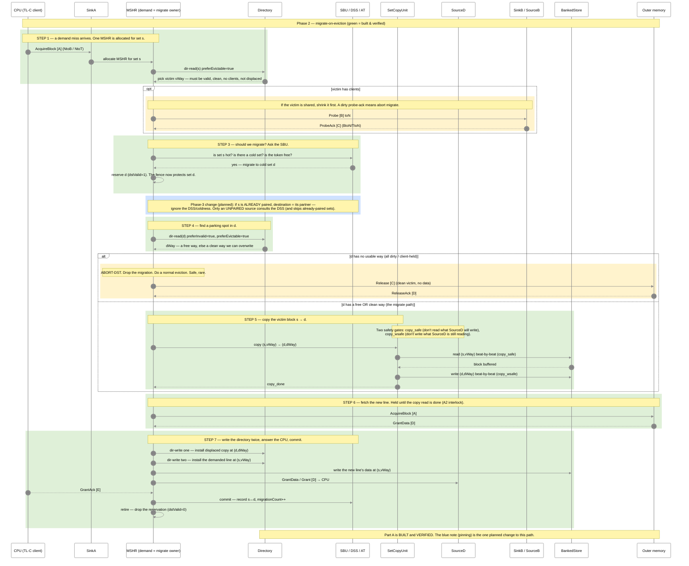
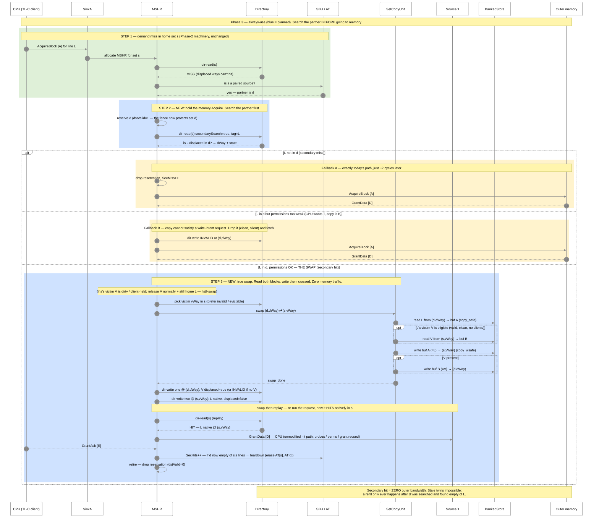

# SBC — Migration + Always-Use reuse flow (visual)

**Part A (migration / spill): COMPLETE & verified** (forced torture config: 20000 iters, PASS, 0
asserts, 10 migrations committed, data correct). **Part B (always-use reuse): PLANNED** — the current
Phase-3 architecture, not built yet. Companion to [phase-3.md](phase-3.md) (the words, always-use SSOT),
[phase-2.md](phase-2.md), and [bug-fix-log.md](bug-fix-log.md) (the bugs).

**Colour key:** 🟢 green = built & verified · 🟡 yellow = fallback / rare · 🔵 blue = Phase-3 planned.

## The idea, in plain English
- **Spill (Part A, built).** A **hot** set keeps missing. Instead of throwing away a clean victim, the
  cache **copies it to a cold partner set** and puts the new line in the freed slot. The copy is parked
  as a **displaced** line.
- **Always-use (Part B, planned).** On a later miss, the cache **searches the partner first**. If the
  line is there, it **swaps it home and serves it** — no memory trip. That saved trip is the speedup.
- **Pinning.** Once a source pairs with a partner, **all** its spills go there and **all** its searches
  look there, until teardown. One partner at a time (strict 1:1).
- **Safety net.** A displaced line is always **clean**, so any awkward case degrades to "drop the copy,
  fetch from memory" — safe, just no speedup that time.

---

## Part A — Migration / spill (Phase 2, built & verified)



---

## Part B — Always-use reuse / swap (Phase 3, planned)

Assumes Part A already parked line **L** in partner set **d**, and **s** is still paired with **d**.



---

## Correctness prerequisite (Phase 3 — build this first)

- **Pinned 1:1 association.** One partner per source until teardown; a set already in a pairing cannot
  be picked as a new destination. Without it, a source's lines scatter across sets, the AT remembers
  only one, and the search looks in the wrong place → duplicate copies → the stale-data hole reopens.
- *(Flush fix dropped 2026-07-05: MMIO flush (`Flush64`/`Flush32`) is unsupported on this platform —
  documented constraint: never use MMIO flush while SBC is enabled. No hardware built.)*

---

## What changed since the last version of this diagram (plain English)
- **Phase 3 is now "always-use," not "detect-first."** We no longer build a read-only detector and
  measure before the swap — the detector's number is poisoned by stale copies. On every miss to a
  paired source we search the partner and swap the line home if found.
- **Serving is "swap-then-replay."** Do only the physical swap + two dir-writes, then re-run the
  request's lookup so the **unmodified hit path** serves it. No new grant/permission datapath.
- **Destination pinning** (planned) modifies the Part-A migrate gate: a paired source always spills to
  its partner and ignores the DSS.
- **Part-A migration is unchanged and still verified** — the destination-collision and set-bricking
  bugs remain FIXED; `s_verify` is still OFF (re-enable rises in priority now that Part B *serves*
  parked copies to the CPU). See [bug-fix-log.md](bug-fix-log.md).

---

## TileLink messages used

| Channel | Direction | Message | When |
|---|---|---|---|
| A (inner) | CPU → L2 | `AcquireBlock` | demand miss enters |
| B | L2 → CPU | `Probe(toN)` | victim is shared (shrink before migrate) |
| C | CPU → L2 | `ProbeAck` / `ProbeAckData` | client shrink; data means dirty → abort migrate |
| C | L2 → Mem | `Release` | **abort / half-swap only** — normal clean eviction |
| A (outer) | L2 → Mem | `AcquireBlock` | fetch line (spill refill, or a secondary **miss**) |
| D (outer) | Mem → L2 | `GrantData` | memory returns the line |
| D (inner) | L2 → CPU | `GrantData` / `Grant` | L2 answers the CPU |
| E | CPU → L2 | `GrantAck` | CPU confirms |

**Key point:** on the migrate path *and* on a secondary **hit**, the line's data moves inside the
cache (a BankedStore copy / swap) — **no outer `Acquire`, zero outer bandwidth**. A secondary **miss**
falls back to a normal memory `Acquire`.

---

## MSHR states (simplified)

**Migrate / spill path (Part A, built):**
```
allocate (set s)
   │  (if victim shared) probe → probe-ack
   ▼
migrate gate: is s hot, is there a cold set, is the token free?
   │  yes → reserve d, migrating = true     [Phase-3: if s paired, d = its partner]
   ▼
2nd dir-read (set d) ──► all ways unusable ──► ABORT: normal eviction (Release)
   │ free or clean way
   ▼
copy s → d   (copy_safe read gate, copy_wsafe write gate)   [s_verify DISABLED]
   ▼
dir-write #1 (install displaced @ d)
fetch line   (Acquire → GrantData, held by A2 interlock)
dir-write #2 (install demanded line @ s)
grant to CPU → GrantAck
   ▼
commit (record s↔d, count++) → retire (drop reservation)
```

**Always-use / swap path (Part B, planned):**
```
allocate (set s) → dir-read(s) = MISS
   │  s paired?  ── no ──► normal memory Acquire (unchanged)
   │  yes → reserve d
   ▼
secondary search: dir-read(d, secondarySearch, tag=L)
   │  not found ──────────► SecMiss++, normal memory Acquire
   │  found, perms weak ──► invalidate (d,dWay), normal memory Acquire
   │  found, perms OK
   ▼
swap: read L(d) + V(s) → write L→(s,vWay), V→(d,dWay)   [half-swap if V dirty/held]
   ▼
dir-write #1 (V displaced @ d, or INVALID)
dir-write #2 (L native @ s)
   ▼
swap-then-replay: dir-read(s) = HIT → unmodified hit path grants to CPU → GrantAck
   ▼
SecHits++; teardown-check on d → retire (drop reservation)
```
