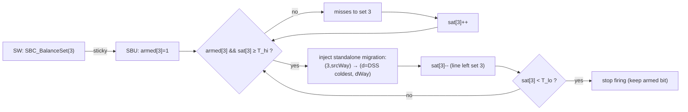
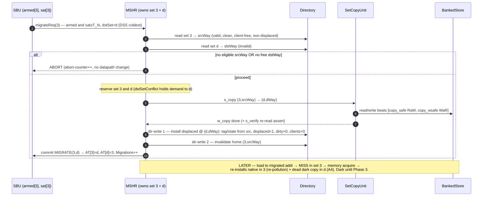

# SBC Phase 1 — Migration Mechanism (debug-triggered, folded into MSHR)

## Context
The copy datapath is wired but never fires. Rather than build a throwaway MMIO→SCU test path, we
build the **real** Phase 1 migration: the MSHR orchestrates a full migrate (copy + displaced install
+ home invalidate). It is **armed per-set over MMIO and fired by saturation** (`SBC_BalanceSet` →
SBU `armed` bit → `sat ≥ T_hi`), the request injected via the flush path. The copy datapath gets first
verified as part of this. Resolves the `copy_safe/wsafe` tie-off (watch-item #1, commit 87fb58a).
Locked decisions live in [phase-1.md](ai-documents/phase-1.md); FSM diagrams in
[SetBalanceUnit_design.md](ai-documents/SetBalanceUnit_design.md). Build in the ordered sub-steps
below — each compiles; the system stays inert until an armed set saturates.

## Sub-step 1 — SourceD hazards (permanent, cheap; do first)
- `SourceD.scala`: add `copy_req/copy_safe` (RaW) and `copy_wreq/copy_wsafe` (WaR) to IO; compute
  both with the same s1–s4 pattern as `evict_safe`/`grant_safe` ([SourceD.scala:375-386](design/craft/inclusivecache/src/SourceD.scala#L375-L386))
  — `copy_safe` checks `copy_req`(src), `copy_wsafe` checks `copy_wreq`(dst).
- `Scheduler.scala`: replace the `copy_safe := true.B`/`copy_wsafe := true.B` tie-offs with real
  `sourceD ↔ setCopyUnit` wiring. (Inert: SCU still untriggered.)

## Sub-step 2 — MSHR → SCU copy lane + done path
- `SCU.start` is not a TileLink channel, so add a **copy lane** to the MSHR schedule bundle (parallel
  to a/b/c/d/e/x/dir): `schedule.bits.copy.valid` + `{srcSet,srcWay,dstSet,dstWay}`.
- `Scheduler.scala`: when the winning MSHR schedules `copy`, pulse `setCopyUnit.io.start` (gate on
  `SCU.idle`); route `SCU.done` back into the owning MSHR (new `io.copy_done`, like the sinkc/d/e
  resp delivery at [Scheduler.scala:81-88](design/craft/inclusivecache/src/Scheduler.scala#L81-L88)).
- Add `io.idle` to `SetCopyUnit`.

## Sub-step 3 — MSHR migration scoreboard + dual dir-write
- New scoreboard bits mirroring `s_release`/`w_releaseack` ([MSHR.scala:124-143](design/craft/inclusivecache/src/MSHR.scala#L124-L143)):
  `s_copy` (kick SCU), `w_copy` (SCU done), `s_dmeta` (install displaced @ `(dstSet,dstWay)`); reuse
  the existing dir-write step for the home `(s,vWay)` invalidate.
- Sequence (owner holds both sets, no coherence-visible intermediate):
  `reserve(s,d) → s_copy → w_copy → s_dmeta [dir-write #1: (dstSet,dstWay) = victim tag/state,
  displaced=1, dirty=0, clients=0] → dir-write #2: invalidate (s,vWay) → release`.
- Make `schedule.bits.dir.set/way/data` migration-aware: mux home-invalidate vs displaced-install by
  step (today it's `request.set`/`meta.way`, [MSHR.scala:319-321](design/craft/inclusivecache/src/MSHR.scala#L319-L321)).
- Drive `io.status.bits.dstValid/dstSet/dstWay` while migrating (feeds the existing `dstSetConflict`
  stall + the ≤1-migration assert).
- **Eligibility / abort** — single decision point combining two reasons:
  ```scala
  val srcEligible = !meta.dirty && !meta.clients.orR && !meta.displaced  // real, from existing dir-read
  val dstEligible = true.B  // sub-step 4: replace with (dstWay invalid, from 2nd dir-read of dstSet)
  val migAbort    = !srcEligible || !dstEligible
  ```
  `dstSet` carried on the request; `dstWay` in an MSHR reg (default 0). No 2nd dir-read yet — that lands in sub-step 4. Sub-step 4 only swaps `dstEligible`; no FSM redesign needed.
- Gate `s_copy/w_copy/s_dmeta` so stubbed `dstWay=0` **cannot** execute a real copy — stays inert until the trigger is wired.

## Sub-step 4 — Arm-a-set trigger (MMIO **arms**; saturation **fires**; reuse flush injection)
The MMIO write never migrates directly — it registers intent; the saturation counter decides *when*.
- `Control.scala`: add **`SBC_BalanceSet`** (W, **`srcSet` only**) via `RegWriteFn` like flush32/64.
- `SetBalanceUnit.scala`: per-set sticky **`armed`** bit set by `SBC_BalanceSet`; assert
  `migrateReq(s) = armed[s] && sat[s] ≥ T_hi`, hysteresis (stop forming once `sat[s] < T_lo`);
  `dstSet = DSS coldest`. Throttle ≤1 migration in flight; re-fire while `sat[s] ≥ T_lo`.
- `SinkX.scala` / `InclusiveCache.scala`: on `migrateReq`, inject **one standalone migration** reusing
  the flush request path (`SinkXRequest + migrate: Bool`; `migrate=false` ⇒ flush unchanged).
  Standalone ⇒ home-invalidate stays a **plain dir-write** (copy↔refill hazard A2 stays deferred to Phase 2).
- `MSHR.scala`: a `request.control && request.migrate` request allocates on `srcSet`, branches into the
  sub-step-3 scoreboard alongside the flush branch (~[MSHR.scala:236](design/craft/inclusivecache/src/MSHR.scala#L236)).
- Read-only counters: attempted / committed / aborted-by-reason. `0x328 SBC_Migrations` goes live.

### Value sourcing (no datapath value rides MMIO)
| Value | Source |
|---|---|
| `srcSet` | `SBC_BalanceSet` (the only MMIO input; reuses flush address bits) |
| `dstSet` | DSS `coldestSet` (already MMIO-*readable* at `0x310`) |
| `srcWay` | dir-read of `srcSet` → valid, clean, client-free, non-displaced way; else abort |
| `dstWay` | 2nd dir-read of `dstSet` → invalid way; else abort |

**2nd dir-read mechanism (LOCKED — Option 1, MSHR-driven):** add `s_dread/w_dread` scoreboard bits
that sequence *before* `s_copy`, plus a read-request lane arbitrated into `directory.io.read` with the
result routed back via `directoryFanout`. Keeps the common allocate path bit-exact (baseline parity).
Abort split: `srcEligible` known at allocate (abort immediately, never issue the 2nd read);
`dstEligible` + `migDstWay` known only when the 2nd read returns. `dstValid` reserves `dstSet` across
the read window (occupancy snapshot stays coherent via `dstSetConflict`).

**prefer-invalid (LOCKED):** `directory.io.result` returns only the single LFSR-picked victim, so it
cannot distinguish "set full" from "random pick missed an existing invalid way". Add a gated
`preferInvalid` flag on the read request: when set and any way is INVALID, the victim mux returns an
invalid way (else the normal LFSR/policy victim — baseline untouched). The migrate 2nd read sets it,
so `dstEligible = (result.state === INVALID)` becomes a correct full/not-full test. Forward note:
dropping the invalid-only check (accept + evict the policy victim) is the Phase-2 extension — same plumbing.

## Sub-step 5 — AT commit (SBU)
- `SetBalanceUnit.scala`: replace `assert(!io.commit.valid)` with real handling — on `commit{MIGRATE,
  s,d}` write `AT[s]={src→d}`, `AT[d]={dst→s}`; if a needed AT slot is occupied → abort. Scheduler
  drives `sbu.io.commit` from the migrating MSHR at its commit step.

## Trigger model & Phase-1 scope (read this)
- **Arm, don't force.** `SBC_BalanceSet(s)` registers intent; migration fires only when `s` actually
  saturates, throttled ≤1 in flight, repeating until `sat[s] < T_lo`.
- **Phase 1 has no balance payoff — by design.** The displaced copy in `d` is **dark** (no secondary
  search until Phase 3), so a re-access to a migrated line: misses in `s` → acquires from memory →
  **re-installs native in `s`** (re-pollutes the set you just relieved) → leaves a **dead duplicate** in
  `d` (risk A4; safe only because clean ⇒ both equal memory). Migrated lines bounce back; armed+saturation
  can ping-pong (hysteresis only dampens).
- ⇒ Phase 1 = **mechanism verification, not a perf win.** Success = `Migrations++`, correct data,
  asserts quiet, SCU `s_verify` passes — **not** hit-rate (which may dip). Durable balancing arrives in
  Phase 3 (secondary search serves/swap-homes from `d` — no memory, no re-fill of `s`).

### Trigger gating


### Execution (one migration, happy-path + abort)


## Invariants (sim `assert`s; also latch a sticky err bit for later FPGA reuse)
- displaced install ⇒ `dirty=0 && clients=0 && displaced=1`.
- ≤1 MSHR with `dstValid`, ≤1 copy in flight per bank.
- SCU self-check (the "HW + printf" choice): add `s_verify` to SCU — after write, re-read
  `(dstSet,dstWay)`, assert `== blockBuf`; `sbcDebug` printf of the beats (catches read-side bugs).
- `w_copy` holds before dir-write #2 / any later write to the copied way.

## Verification
1. **Elaborate** through Chipyard sbt.
2. **Bare-metal directed test** (Verilator; `sw/` + `verilator_sim.sh` style). This is the functional
   sign-off, but note its boundary (below).
   - Prime a line in `srcSet` with **loads** (clean + client-free after an L1D flush → migration-
     eligible; stores would be dirty → abort), fill enough to occupy the set.
   - MMIO `SBC_BalanceSet` srcSet, then drive misses to **saturate** it (`sat ≥ T_hi`) ⇒ fires a
     migration to the DSS-coldest `dstSet` (read back at `0x310`).
   - Assert: `SBC_Migrations` increments; a load to the migrated address now **misses** (latency-
     detected, misshit style) and **returns the correct value** (clean ⇒ memory truth) ⇒ migration
     fired, home freed, no corruption. Arm a set whose DSS-coldest `dstSet` is full → abort counter increments.
   - **Coverage boundary (SW cannot reach):** the displaced copy in `d` is dark (no secondary search),
     so SW can't read it back — byte-correctness at `(dstSet,dstWay)` is proven by the SCU `s_verify`
     assert + `sbcDebug` printf, NOT by the bare-metal load.
3. **Concurrency / races** — use a **multicore config** (single-core bare-metal can't drive mid-
   migration traffic). Orchestrate: one core arms `s` via `SBC_BalanceSet` and loops misses to keep it
   saturated (re-firing migrations) while another streams loads to addresses mapping to `s` and `d`, so
   traffic actually hits the reserved sets. Backed by
   the RTL asserts (≤1 owner/set, ≤1 migration, `dstSetConflict` serialization) — which must not fire;
   races are rare/timing-dependent and Verilator multicore is slow, so the asserts are the real net.
   This is also the early warning for the Phase 2 latent deadlock (C/X blocked to `d`).
4. **Baseline parity**: separate `sbc-baseline` branch; with no force-migrate issued, behaviour matches.

## Documentation updates (markdown, done by me — not coder)
- `ai-documents/phase-1-progress.md`: mark copy-ports + SCU-wiring ✅ (commit 87fb58a); update flowchart;
  rewrite "Still To Do" to the 5 sub-steps above; record the commit watch-items.
- `ai-documents/phase-1.md`: **revise IN PLACE (no new phase-1a.md); keep it concise.** Rewrite its
  existing change-by-file + verification steps to the agreed shape: copy datapath ✅ (87fb58a) →
  SourceD hazards → MSHR copy-lane + migration scoreboard (`s_copy`/`w_copy`/`s_dmeta`, dual dir-write,
  eligibility/abort) → flush-style debug trigger (NO throwaway direct-MMIO→SCU) → AT commit. Verification
  → layered (bare-metal happy-path + coverage boundary; multicore concurrency/asserts; baseline parity).
  Note `copy_safe/wsafe` idle = `false.B`, wired atomically with `start`.
- `ai-documents/SBC_implementation_challenges.md`: refine A1 (`dstSetConflict` blocks C/X to `d`);
  add the `victimWay`-not-displaced-aware sequencing fix (DISP_EVICT from Phase 2); add the AT
  single-association ceiling (perf); add the FPGA methodology section (sticky flags + watchdog + ILA,
  multicore-Verilator races, eligibility-rate gate).

## Watch-items (carried; mostly Phase 2)
- ✅ Resolves `copy_safe/copy_wsafe` tie-off (now real).
- ⬜ `dstSetConflict` blocks C/X to `d` — bounded here (debug-triggered + clean), but must become
  nest-capable before Phase 2 makes migration demand-triggered.
- ⬜ `victimWay` not displaced-aware — fine until persistent displaced entries accumulate (Phase 2 /
  displaced-eviction); a demand eviction of a displaced way needs a `DISP_EVICT` commit.
