# SBC Phase 1 — Progress

## Status: In Progress — sub-step 3 done (migration scoreboard + dual dir-write + step-0 blockers); arm-and-fire trigger (2nd dir-read) next

```mermaid
flowchart LR
    A[Directory\ndisplaced-aware hit] -->|✅| B[MSHRStatus\ndstValid/dstSet/dstWay]
    B -->|✅| C[Scheduler\ndstSet stall]
    C -->|✅| D[SetCopyUnit\nnew file]
    D -->|✅ 87fb58a| E[BankedStore\ncopy ports + SCU wired]
    E -->|✅ sub-step 1| F[SourceD\ncopy hazards]
    F -->|✅ sub-step 2| G[MSHR copy-lane\nstart / done / idle]
    G -->|next: sub-step 3| H[MSHR migration scoreboard\ns_copy / w_copy / s_dmeta + dual dir-write]
    H -->|sub-step 4| I[Debug trigger\nflush-style force-migrate MMIO]
    I -->|sub-step 5| J[SetBalanceUnit\nAT commit]
```



Sub-steps follow [discussion-phase1.md](discussion-phase1.md). Everything stays **inert** (no copy
fires) until sub-step 3 drives the copy lane and sub-step 4 adds the trigger.

---

## Changes Made

### `Directory.scala` ✅
- Native hit check excludes displaced ways:
  ```scala
  w.tag === tag && w.state =/= INVALID && !w.displaced && (...)
  ```
  Prevents a displaced line from satisfying a demand lookup (false-hit guard).

### `MSHR.scala` ✅
- `MSHRStatus` carries `dstValid / dstSet / dstWay` (default `false/0/0`; set by the migrating MSHR
  only) — feeds `dstSetConflict`.
- **Sub-step 2:** added `SetCopyRequest{srcSet,srcWay,dstSet,dstWay}` and a `copy` lane to
  `ScheduleRequest` (parallel to a/b/c/d/e/x/dir); `io.copy_done` input. `schedule.bits.copy.valid` is
  hardwired `false` (the migration FSM that drives it is sub-step 3) so the lane is **inert**;
  `io.schedule.valid` now ORs `copy.valid`.

### `Scheduler.scala` ✅
- `dstSetConflict`: true when any active MSHR's `dstSet` matches the incoming request set;
  `request.ready` gated by `!dstSetConflict` — stalls traffic to the migration destination.
- **87fb58a:** instantiate `SetCopyUnit`; wire `SCU ↔ BankedStore` copy ports.
- **Sub-step 1:** wire `SourceD ↔ SCU` copy hazards (`copy_req/copy_safe`, `copy_wreq/copy_wsafe`) —
  replaces the temporary `:= true.B` tie-offs.
- **Sub-step 2:** pulse `setCopyUnit.io.start` from the winning MSHR's `schedule.copy`
  (`mshrId := mshr_select`); gate scheduling a copy on `setCopyUnit.io.idle` in `mshr_request`; route
  `done` to the owning MSHR via `copy_done := done && doneId === i`.

### `SourceD.scala` ✅ (sub-step 1)
- Added `copy_req/copy_safe` (RaW, mirrors `evict_safe`) and `copy_wreq/copy_wsafe` (WaR, mirrors
  `grant_safe`), same s1–s4 pipeline comparison.

### `BankedStore.scala` ✅ (87fb58a)
- `sourceCopy_radr/_rdat` (R) and `sourceCopy_wadr/_wdat` (W) appended **last** (lowest priority) in
  `reqs`; write-before-read mirrors `sourceDw > sourceDr`. `decodeCopy` mirrors `decodeD`.

### `SetCopyUnit.scala` ✅ (new, 87fb58a; extended sub-step 2)
- FSM `IDLE → READ → WRITE → DONE`; reads a full block from `(srcSet,srcWay)` into `blockBuf`, writes
  to `(dstSet,dstWay)`. 2-cycle read latency via `RegNext(RegNext(bs_radr.fire))`.
- Hazard IO `copy_req/copy_safe` (RaW) + `copy_wreq/copy_wsafe` (WaR); lowest-priority BankedStore ports.
- **Sub-step 2:** added `io.idle` (≤1 copy/bank gate), `io.doneId` + latched `mshrId` to steer `done`
  back to the owning MSHR.

---

## Still To Do (sub-steps 3–5, per [discussion-phase1.md](discussion-phase1.md))

| Sub-step | File(s) | What |
|------|------|------|
| 3 — Migration scoreboard + dual dir-write | `MSHR.scala` | `s_copy` (kick SCU via copy lane), `w_copy` (on `copy_done`), `s_dmeta` (install displaced @ `(dstSet,dstWay)`); reuse dir-write for home `(s,vWay)` invalidate; drive `dstValid/dstSet/dstWay`; eligibility/abort (`!dirty && !clients`, `dstWay` invalid) |
| 4 — Debug trigger | `SinkX.scala` / `Control.scala` / `InclusiveCache.scala` / `MSHR.scala` | `SinkXRequest.migrate` (+`dstSet`/`srcWay`); `SBC_ForceMigrate` MMIO reusing flush injection; migration-allocate branch in MSHR; attempted/committed/aborted-by-reason counters (`0x328` goes live) |
| 5 — AT commit | `SetBalanceUnit.scala` | Replace `assert(!io.commit.valid)` with `AT[s]={src→d}`, `AT[d]={dst→s}`; abort if slot occupied; Scheduler drives `sbu.io.commit` at commit step |

**First functional sign-off lands with sub-steps 3+4** (a force-migrate actually fires a copy): SCU
`s_verify` self-check + `SBC_Migrations==1` + a post-migration load misses and returns correct data.

---

## Watch-items
- ✅ `copy_safe/copy_wsafe := true.B` tie-off **resolved** — now the real SourceD hazard signals, wired
  atomically with the (still-inert) `start` lane.
- ⬜ `dstSetConflict` blocks channels **C/X** to `d`, not just A — bounded/safe here (debug-triggered,
  clean), but must become **nest-capable before Phase 2** (demand-triggered migration), or it's a
  latent deadlock.
- ⬜ `victimWay` is **not** displaced-aware — fine until persistent displaced entries accumulate; a
  demand eviction of a displaced way will need a `DISP_EVICT` commit (Phase 2 / displaced-eviction).
- ⬜ SCU `s_done` printf is ungated — gate behind `sbcDebug` when sub-step 3 makes copies fire.
- ⬜ **prefer-invalid (required before the 2nd dir-read goes live):** `directory.io.result` returns
  only the single LFSR victim, so `dstEligible` can't tell "set full" from "random pick missed an
  invalid way". Add a gated `preferInvalid` flag on the read request (invalid-first when any INVALID
  way exists, else normal LFSR/policy — baseline untouched). Without it, the abort path always passes
  in step 4 and over-aborts in step 5.
