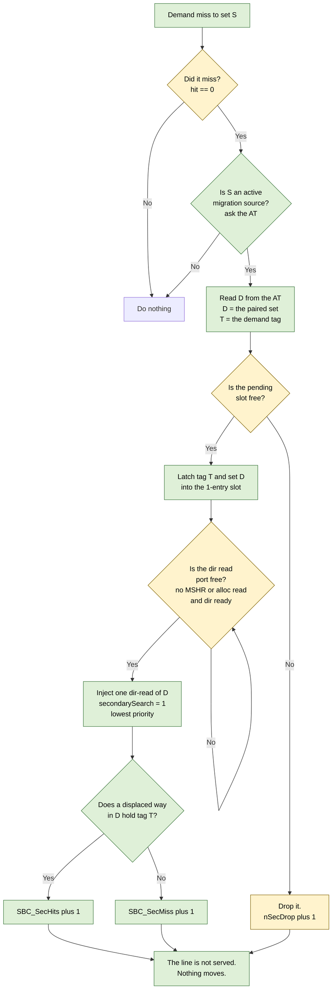
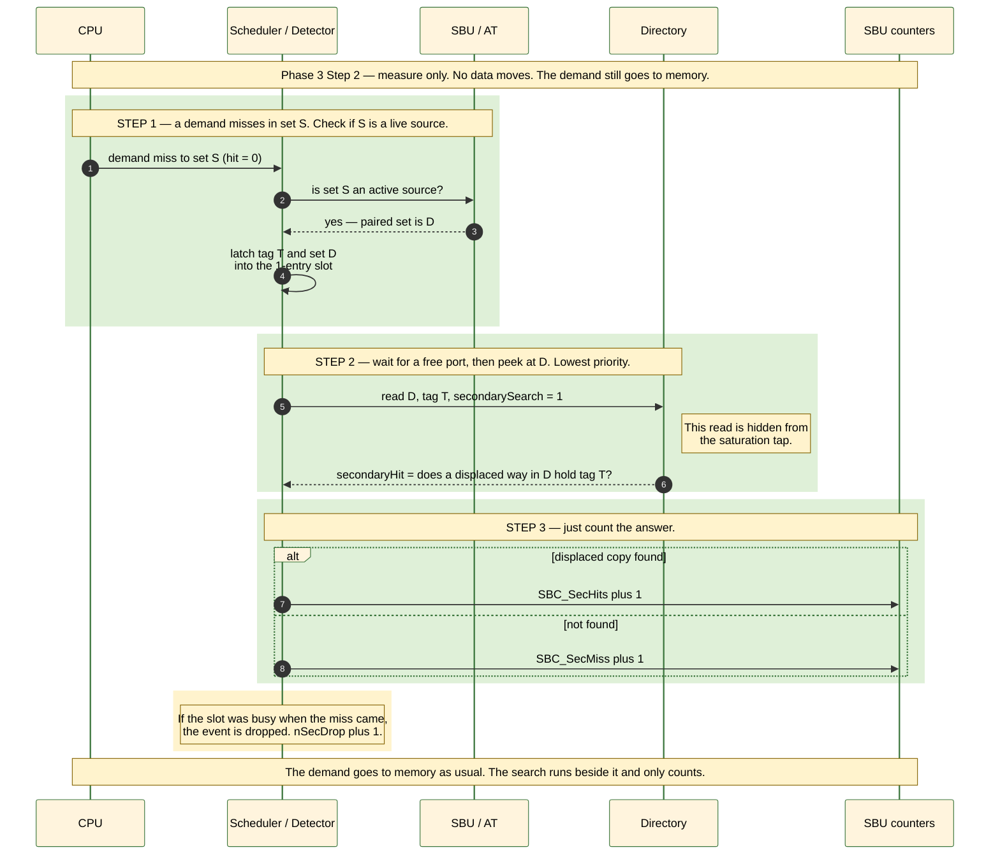
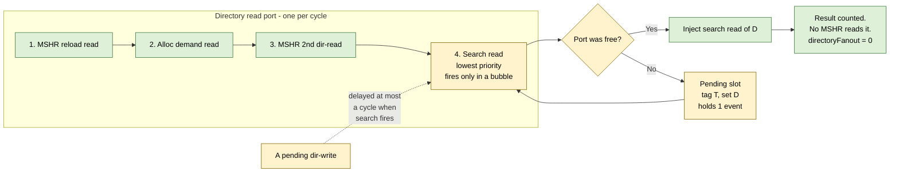

Here are the Mermaid diagrams for Phase 3 Step 2 — the secondary-search detector (measure-only). Simple English, short sentences.

## 1. Flow chart — the detector logic

## 2. Sequence diagram — one detected event

## 3. Transaction / port-arbitration view — where the extra read fits

Key points shown by the diagrams:
- The search only runs when the port is free. It never blocks the demand.
- The demand still goes to memory. Nothing is served, nothing moves.
- The search read is hidden from the saturation tap, so counters stay clean.
- Its result reaches no MSHR (`directoryFanout = 0`), so it is purely a count.
- A busy 1-entry slot drops the event and bumps `nSecDrop`.

Want me to save these into a doc (e.g. `ai-documents/diagram-phase3.md`), or adjust any diagram?