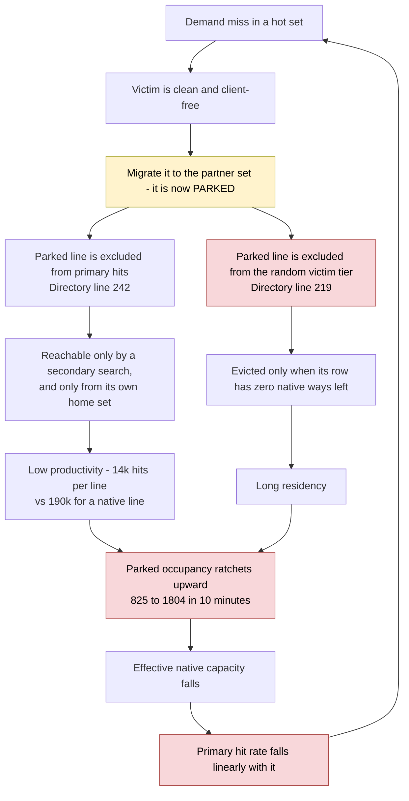

# 520.omnetpp_r differential, SBC on vs off — VCU118 / Linux, 2026-09-10

**Status: MEASURED. This is the SSOT for the omnetpp A/B.** It closes the 🔴 open item in
[daily-summary/2026-09-10.md](daily-summary/2026-09-10.md) §7 ("run 520.omnetpp_r on NoSBC").

**Platform:** VCU118, 50 MHz, 1 Rocket core, 8 KB L1I + 8 KB L1D, 256 KB 16-way L2 (256 sets,
4,096 lines), Linux from SD. Configs verified identical apart from `enableSetBalancing`
([RocketConfigs.scala:183-199](../../../generators/chipyard/src/main/scala/config/RocketConfigs.scala#L183-L199)):
thresholds auto-derive to `satCounterBits=5, T_hi=31, T_lo=16`, which is the paper's rule.

**Workload:** `520.omnetpp_r -c General -r 0`, ref input, pinned to cpu 0, 60 s warm-up + 600 s
window via `sw/run_sbc_window.sh`. The benchmark never completes at 50 MHz — the window sits in
steady state, by design.

> **The headline is not the A/B gap. It is that SBC's own two readings, same bitstream and same
> workload thirty minutes apart, differ by 16.5 points — and the difference tracks parked-line
> occupancy.** That is a within-session control, and it is what makes the result credible
> independently of the cross-config comparison.

---

## 1. The result

Each session took a free-running read *before* the windowed run. All four readings, in order:

| Read | `parked` | native lines | primary hit | total hit | `secMiss` | search success |
|---|---:|---:|---:|---:|---:|---:|
| SBC, free-running since boot | 825 | 3,271 / 4,096 | **79.00 %** | 82.59 % | 1.30 M | **93.15 %** |
| SBC, 600 s window | 1,804 | 2,292 / 4,096 | **62.48 %** | 66.10 % | 21.89 M | **53.63 %** |
| NoSBC, free-running since boot | 0 | 4,096 / 4,096 | **93.31 %** | 93.31 % | — | — |
| NoSBC, 600 s window | 0 | 4,096 / 4,096 | **90.24 %** | 90.24 % | — | — |

⚠️ The two *free-running* reads are **not comparable to each other** — 490.8 M vs 102.5 M accesses
since boot, roughly 5× different accumulated work. Use them only within their own config.

### The windowed A/B

| | SBC on | SBC off | |
|---|---:|---:|---|
| L2_Accesses | 699,162,541 | 854,316,358 | SBC does **18.2 % fewer** lookups/s |
| L2_Hits | 436,850,312 | 770,956,389 | |
| Primary hit rate | 62.48 % | **90.24 %** | −27.8 pt |
| **Total hit rate (primary + secondary)** | **66.10 %** | **90.24 %** | 🔴 **−24.1 pt** |
| Net misses (past the L2) | 236,998,090 | 83,359,969 | 🔴 **2.84×** |
| Net misses per 1,000 lookups | 339.0 | 97.6 | 🔴 **3.47×** |
| L2 access rate | 1,165,271 /s | 1,423,861 /s | 1 per 42.9 vs 35.1 cycles |
| Parked lines | 1,804 (44.0 % of L2) | 0 | |

**Verdict: on omnetpp at FPGA scale, SBC is a substantial net loss, and the loss grows with
runtime.** Even crediting SBC every one of its 25.3 M secondary hits, it ends 24.1 points behind on
hit rate and takes 2.84× the misses.

---

## 2. Is the 90.24 % real?

Asked directly, because it looks high. **Yes as a counter readout — but it is an upper bound, and
so is SBC's, by the same amount.**

`L2_Accesses` / `L2_Hits` increment on `io.result.valid && !internalRead`
([Directory.scala:326-331](../design/craft/inclusivecache/src/Directory.scala#L326-L331)). Four known
biases, all already documented in [coder/005-hit-accounting-and-sampling/TASK.md](coder/005-hit-accounting-and-sampling/TASK.md):

| Bias | Direction |
|---|---|
| C-channel Releases counted, and a Release is a **guaranteed** hit (inclusion) | inflates toward 100 % |
| X-channel flushes counted | inflates |
| BtoT permission upgrade counted as a hit despite a full outer round trip | inflates |
| Repeat-path hits never read the directory, so are invisible | deflates |

**These do not create the gap.** They apply to both configs. The one asymmetry is that under SBC a
C Release landing on a *parked* line is a primary **miss** (`secC` = 157,635) rather than a
guaranteed hit — 0.02 % of lookups, far too small to matter here.

**Two things confirm the denominators are comparable.** Secondary searches and migration
destination reads are marked `internalRead` and excluded
([Scheduler.scala:431](../design/craft/inclusivecache/src/Scheduler.scala#L431)), so SBC is not
double-counting its own extra work. And the counters are 64-bit, so at these rates nothing wraps.

---

## 3. Why the result is trustworthy: the within-session control

The obvious objection to any wall-clock window on a benchmark that never finishes is that the two
configs sampled **different parts of the program** (SBC is 18.2 % slower, so it is further behind).
That objection is real (see D1) — but it cannot be the primary cause, because **the effect
reproduces inside one session with no cross-config comparison at all**:

Plot primary hit rate against the fraction of the cache still available to native lines:

| Read | native capacity | primary hit |
|---|---:|---:|
| NoSBC window | 100.00 % | 90.24 % |
| SBC free-running | 79.86 % | 79.00 % |
| SBC window | 55.96 % | 62.48 % |

A straight line through the two extremes has slope **0.6303 hit-points per native-capacity-point**
and predicts the middle point at 77.55 % against an actual **79.00 %** — a residual of **+1.45
points** across a 44-point span.

**The hit rate is very nearly a linear function of how much of the cache parked lines have taken
over.** Program phase does not produce that.

### The productivity gap that drives it

| | lines | hits served | hits per line |
|---|---:|---:|---:|
| Native (SBC window) | 2,292 | 436,850,312 | **190,598** |
| Parked (SBC window) | 1,804 | 25,314,139 | **14,032** |

**Parked lines hold 44.0 % of the capacity and return 5.5 % of the hits — 13.6× less productive per
line.** And that gap is widening: in the earlier read it was 5.5×.

---

## 4. Root cause: the eviction policy, not the SBC concept

`322494a` masked displaced ways out of the random-victim tier
([Directory.scala:219](../design/craft/inclusivecache/src/Directory.scala#L219)). The victim mux is
now five tiers, and a parked line is only taken by **tier 5** — i.e. only when its row has **zero
native ways left**. Combined with serve-in-place (no repatriation), a line that gets parked
essentially never leaves.

Measured over the 600 s window: **74,729 lines parked in, 73,766 out, net +979** — `parked` went
825 → 1,804 and **was still climbing at window close**. This is a ratchet, not a steady state; the
equilibrium occupancy is unknown and unmeasured.



**`322494a`'s own commit message predicted this** — "costs more than it returns here: +21,266
secondary hits against −73,803 primary, net −52,537 … Re-measure at FPGA scale before judging." It
has now been re-measured at FPGA scale: same sign, much larger.

### The paper analogy is broken here

Rolán et al. §2.2 insert a displaced line as **MRU under LRU**. That gives it a head start and then
lets it **age out normally**. We have no LRU — replacement is a random LFSR — so "exempt it from the
random tier" is not the analogue of MRU insertion. It is **permanent immunity**. Bounded preference
became unbounded protection, which is a difference in kind, not degree.

### A second, compounding defect in the same mux

```scala
Mux((lfsrVictimOH & nonDisplacedOH & freeWays).orR, lfsrVictimOH & nonDisplacedOH & freeWays,   // tier 3
Mux((nonDisplacedOH & freeWays).orR, PriorityEncoderOH(nonDisplacedOH & freeWays),              // tier 4
```

`lfsrVictimOH` is one-hot. When the LFSR lands on a parked way, tier 3 yields **nothing** and tier 4
fires — `PriorityEncoderOH`, i.e. **the lowest-indexed native way, deterministically**. At 44 %
occupancy that is roughly 44 % of all evictions collapsing onto the same few way indices.

**Native replacement quality degrades on top of the capacity loss, and for an unrelated reason.**
The fix is cheap: re-roll the LFSR *within* the native mask instead of falling through to a priority
encoder. This is a defect independent of whether parked-line protection is kept.

---

## 5. Secondary-search efficiency is collapsing too

| | free-running read | 600 s window |
|---|---:|---:|
| Searches (`secHits` + `secMiss`) | 18,925,084 | 47,201,211 |
| Share of primary misses that searched | 18.4 % | 18.0 % |
| **Success rate** | **93.15 %** | **53.63 %** |
| Wasted searches as share of all lookups | 0.26 % | **3.13 %** |
| Hits per park | 500.9 | 338.7 |

21.9 M wasted second searches = **3.13 % of every lookup paying an extra directory read for
nothing**. As parking spreads, `parkCount`/`mayHold` says "search" far more often while the odds of
finding the line fall. This is the "wasted searches" item on the tracked risk list, now measured.

Migration churn is degrading in step: attempts rose 4.4× (70,601 → 309,424) while accesses rose only
1.4×, and the abort rate went **53.1 % → 75.9 %**.

---

## 6. Discrepancy register

Everything found while auditing this dataset, including the items that came back clean.

| # | Finding | Severity |
|---|---|---|
| **D1** | **Wall-clock windows ≠ equal work.** SBC does 18.2 % fewer lookups/s, so the two windows cover different slices of a benchmark that never completes. A real confound — defeated as the *primary* explanation by §3, but not eliminated. | 🔴 method |
| **D2** | **SBC's two reads disagree 79.00 % → 62.48 %** with `parked` 825 → 1,804, same session, same workload. The headline finding, and it was not visible in the pasted output. | 🔴 finding |
| **D3** | **Parked occupancy is unbounded and ratcheting** (§4). +979 net in 600 s, still climbing at 44 % of the L2. Equilibrium unknown. | 🔴 finding |
| **D4** | **Tier-4 fallback collapses replacement** to the lowest-indexed native way on ~44 % of evictions (§4). Independent of D3's fix. | 🔴 defect |
| **D5** | **Second-search success 93.15 % → 53.63 %**; 3.13 % of all lookups now pay a wasted extra directory read (§5). | 🟡 finding |
| **D6** | **Migration abort rate 53.1 % → 75.9 %**, attempts up 4.4× against accesses up 1.4×. Thrashing rises as the cache degrades. | 🟡 finding |
| **D7** | **`aborted + migrations > attempted` in both reads** (+2,060 and +286). `migAttempt` pulses at two sites ([MSHR.scala:1073](../design/craft/inclusivecache/src/MSHR.scala#L1073), [:1146](../design/craft/inclusivecache/src/MSHR.scala#L1146)), `migAbort` at three ([:1133](../design/craft/inclusivecache/src/MSHR.scala#L1133), [:1161](../design/craft/inclusivecache/src/MSHR.scala#L1161) — deliberately conditional, "count declines apart from dirty rejects" — and [:1482](../design/craft/inclusivecache/src/MSHR.scala#L1482)). **`attempted` is not a valid denominator for an abort rate.** Fix or document. | 🟡 accounting |
| **D8** | **All SBC event counters are OR-reduced across MSHRs** ([Scheduler.scala:686-699](../design/craft/inclusivecache/src/Scheduler.scala#L686-L699)) — simultaneous events in one cycle count once. At ≤1.6e-3 events/cycle the loss is ~1e-6, **numerically negligible here**. But `nParked`'s decrement uses the OR-reduced `parkErase` while its increment is token-limited ([SetBalanceUnit.scala:269-270](../design/craft/inclusivecache/src/SetBalanceUnit.scala#L269-L270)), so any drift is **one-directional (upward)**. Since the 44 % figure carries the whole analysis, cross-check it: `assert(nParked === sum(parkCount))` is free. | 🟢 note |
| **D9** | **`homeBranch=0` and `secPerm=0` are correct by construction, not dead counters.** The elaboration print in [Scheduler.scala](../design/craft/inclusivecache/src/Scheduler.scala) computes BRANCH reachability; with a last-level L2 and an outer manager that always grants T, BRANCH is unreachable. `secProbe` was 21 in the free-running read, so that counter is alive too. Three exact zeros look alarming; they are fine. | ✅ cleared |
| **D10** | **`dispRelease`=32 against `secC`=157,635.** 157,635 C-channel writebacks landed on parked lines, yet only 32 parked victims were dirty at eviction vs 73,734 clean drops. Most likely benign — written parked lines are the hot ones, and hot lines are exactly the ones tier-5 protection keeps resident, so the evicted population is the cold never-written one. But the failure mode if it is wrong (dirty bit not set on the parked entry) is **silent data loss on FPGA, where asserts do not report**. The RTL branch itself is correct: `when (m.dirty) { dispRelease } .otherwise { dispDrop }` ([MSHR.scala:1109](../design/craft/inclusivecache/src/MSHR.scala#L1109)). Worth one directed check. | 🟡 verify |
| **D11** | **No cycles or instructions were captured.** There is no performance number in this dataset — only counter ratios. Compounding it: at 50 MHz against fast DDR4 a miss costs only a handful of core cycles, so **this platform understates both the harm and the benefit** of any L2 change. Paper §5.2 is explicit that hit/miss rate is the wrong characterisation for SBC. | 🔴 method |
| **D12** | **SBC state carried into the window.** `--zero` deliberately preserves `sat`/AT/DSS/`parkCount`/`nParked`, so the SBC window opened with 825 lines already parked while NoSBC started clean. Comparable only if the degraded state is the steady state — and D3 says it is not, because it is still climbing. | 🟡 method |

---

## 7. What this does *not* establish

State plainly, because the temptation is to over-read a −24 point result.

- **It does not show the SBC concept fails.** It shows that *this* eviction policy makes parked
  lines effectively immortal, and that a cache which gives away 44 % of its capacity to lines
  returning 5.5 % of its hits will lose on any workload. Those are different claims, and the
  experiment that separates them has not been run.
- **It is not a performance result.** No cycles, no instructions, no IPC (D11). The 18.2 % lookup-rate
  gap is a *proxy* for slowdown, not a measurement of it.
- **It does not generalise past omnetpp.** One workload, one geometry, single runs.
- **The absolute hit rates are not defensible yet** (§2). The *differential* is; the absolutes wait
  on task 005.

## 8. Method fixes required before the next number

1. **Fixed-work windows.** `sbc_read --zero -- <cmd>` on an input that *completes* (omnetpp train or
   test), so both configs execute identical work start to finish. This mode already exists and is
   what it was built for; `run_sbc_window.sh` currently uses a fixed `sleep` instead. Kills D1 and
   D12 outright.
2. **Capture `rdcycle` + `rdinstret`** around the workload. Without them there is no performance
   claim (D11).
3. **Define the starting state.** Either reprogram/reboot before each SBC run so `parked` starts at
   0, or record it and treat occupancy as an explicit independent variable (which §3 suggests is the
   more informative choice).
4. **Repeat.** Every number here is a single run.

**Next actions and their sequencing: [workplan-parked-occupancy-2026-09-11.md](workplan-parked-occupancy-2026-09-11.md).**
