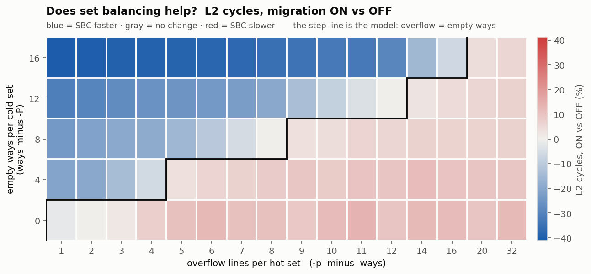
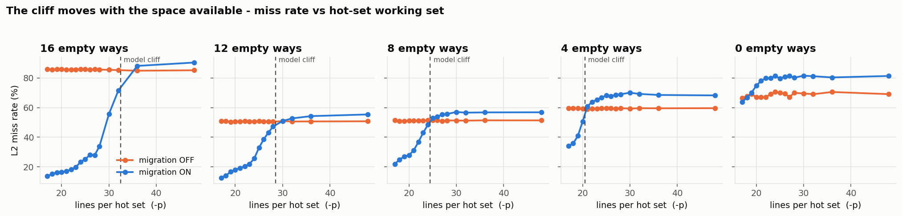
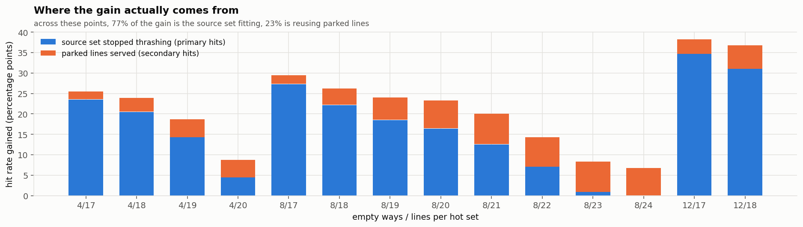

# The SBC operating envelope, measured — 80-point board sweep (2026-09-25)

**What this settles:** when set balancing helps, when it hurts, and by how much — as one rule with a
number in it, checked against 80 measured points on real hardware.

| | |
|---|---|
| Date | 2026-09-25 |
| Platform | VCU118, single Rocket, 50 MHz, 2 GB DDR4 |
| Bitstream | **sha256 `af11762b917780e5ec71e8246ec4455b7914b9102e635c0ce1c91741a3d32ec4`** (`…SBCPLRU-012-c2-97d0162-2026-09-25.bit`, commit `97d0162`) |
| L2 | 64 KB, 16-way, 64 B lines = 64 sets · PLRU (`L2_Replacement = 1`) |
| Workload | `sw/l2_miss_calib.c`, `-h 32 -m 32 -s 100000`, sweeping `-P` and `-p` |
| Runs | 5 × 16 × {migration OFF, ON} = **160 runs → 80 A/B points**, ~25 min |
| Transcript | `chipyard/scripts/logs/012-calib-sweep-r1-20260925-111300.log` |
| Data | [calib-sweep-80-points.csv](figs-calib-envelope-2026-09-25/calib-sweep-80-points.csv) |

## 1. The rule

`l2_miss_calib` touches **exactly one line per set per step**, so a set's page count is both its
working set and its reuse distance. That makes the whole design two numbers:

- a **hot** set holds `MP` lines in `ways` ways → it overflows by **`MP − ways`**
- a **cold** set holds `HP` lines in `ways` ways → it offers **`ways − HP`** empty ways

A migration moves the hot set's overflow into its partner's empty ways. So it should pay exactly
while the overflow fits:

> ### SBC wins ⟺ `overflow ≤ empty ways` ⟺ `MP ≤ 2·ways − HP`

**Measured: the rule is right on 78 of 80 points (98%).**

Blue is faster with migration on, red is slower, gray is no change. The black staircase is the rule,
drawn from the formula — not fitted to the data. The blue region sits inside it.

## 2. The cliff moves exactly where the rule says

`-P` was hardcoded until this task, so every previous measurement sat on one vertical line of that
plane. Varying it moves the cliff, and it lands on the prediction four times out of five:

| empty ways | rule: win while overflow ≤ | measured: wins up to | first loss at |
|---:|---:|---:|---:|
| 16 | 16 | **16** | 20 |
| 12 | 12 | **12** | 14 |
| 8 | 8 | **8** | **9** |
| 4 | 4 | **4** | **5** |
| 0 | 0 | 2 | 3 |

The 8 and 4 rows pin it to a single line (the grid had consecutive values there); 16 and 12 bracket it.
The 0 row wins two points more than predicted — `-P 16` does not leave *literally* zero room, since
PLRU and stray OS lines still free the odd way.

## 3. How big it gets, both ways

| | empty ways | overflow | cycles | memory reads | miss rate |
|---|---:|---:|---:|---:|---|
| **best** | 16 | 1 | **−41.2%** | **−85.5%** | 85.9% → 13.8% |
| **worst** | 0 | 11 | **+13.6%** | **+23.9%** | 67.1% → 81.3% |

Both arms run the identical program, so this is fixed work, not a fixed time window.

**The downside is not symmetric with the upside, and it is not rare:** 40 of the 80 points lose. Being
outside the envelope is not "no benefit" — it actively costs up to 13.6% cycles and 24% more DRAM
reads, because migrations flood the partner and evict the lines that were hitting there.

## 4. Where the gain comes from — mostly *not* from reusing parked lines

Across the winning points, **77% of the gain is primary hits** — the source set no longer thrashing
once its excess is moved out — and only 23% is serving parked lines.

The split shifts with the overflow: at small overflow the gain is almost entirely the source set
fitting again; near the envelope's edge most of the working set lives in the partner and secondary
hits carry it.

**This kills "hits per parked line" as a figure of merit.** Among *winning* points it ranges from
**0.19 to 295**. omnetpp loses at 0.47 — a value that appears in both winning and losing points here.
The number that decides the outcome is whether the overflow fits, not how often a parked line is used.

## 5. What it means for the real workload

omnetpp on this cache sits far outside the envelope: its per-set working set is in the hundreds of
lines against 16 ways, so the overflow is enormous while spare capacity is ~0. That is the `-p 48`
corner of this map, where the measurement says **+13% cycles**. Our omnetpp result (parity, slightly
negative) is what that corner looks like once the saturation counters throttle migration.

So the honest summary of the design as it stands: **the mechanism works, and works very well, inside a
region this map now defines. Real workloads on a 64 KB 16-way L2 are outside it.**

Two ways forward, and this map makes the choice concrete rather than a guess:

1. **Detect the regime in hardware and stop when it doesn't fit.** The cache cannot currently tell
   `-p 19` from `-p 48`: it migrates whenever a source is hot and a destination looks cold, and in the
   second case it destroys performance. A throttle that notices "my overflow doesn't fit" is worth more
   than any further destination-side work (tracker L6).
2. **Change the geometry toward the paper's.** The paper used 4096 sets, 8-way; we have 64 sets,
   16-way. It says itself that fewer, larger sets are more balanced and leave less to win.

**What this does not say:** every point here is one run, not repeated. The rule is confirmed by 80
points agreeing, not by any single point's precision.

## 6. Method, and the one caveat

Each point drains the cache (thrash every set with migration off), **verifies `SBC_Parked` reached 0**,
then `--reset-all`, then runs the arm. All 80 points reported `drainedParked=0`.

**Caveat, measured rather than assumed:** once migration is switched on, the 700 KB static binary
paging itself in parks 55–135 lines before `main()` reads the counter. Those sit in destination sets
and eat some of the empty ways the row claims — worst on the small-spare rows. It is **not** driving
the result: within each row the correlation between startup-parked lines and the outcome is weak and
flips sign (r = −0.35 … +0.22). Column `parked_at_start_on` carries it per point.

Reproduce: `sw/scripts/run_calib_sweep.exp` → `parse_calib_sweep.py` → `plot_calib_sweep.py`.
