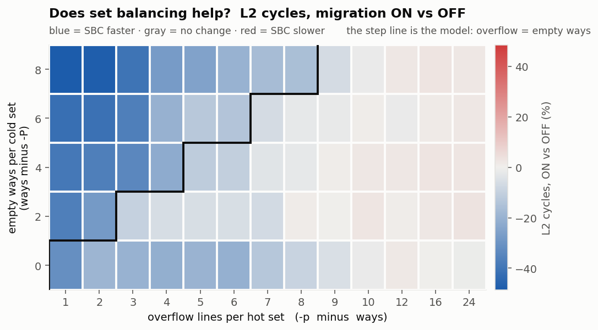
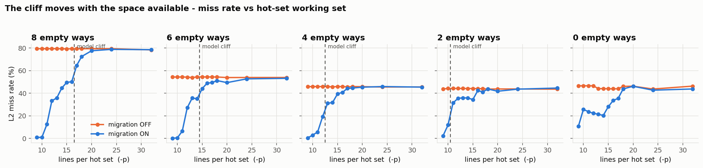

# The SBC operating envelope — 1024 KB / 8-Way Board Sweep (2026-09-26)

**What this settles:** evaluates the SBC envelope on a **1024 KB (1 MB), 8-way, 2048-set L2** (16× larger capacity, 16× more sets than 64 KB 8-way) to determine whether scaling cache size alters the cliff position $MP \le 2\cdot\text{ways} - HP$ or changes the magnitude of SBC benefits and penalties.

| | |
|---|---|
| Date | 2026-09-26 |
| Platform | VCU118, single Rocket, 50 MHz, 2 GB DDR4 |
| Bitstream | **sha256 `585dbde13aff513d74f3e0b2f9f1100495194ab4c547c87bce33a4a49f383138`** (`FPGASingleRocketVCU118L18K1024K8WL2ConfigSBCPLRU-1MB-8way-2026-09-25.bit`, commit `c3faa05`) |
| L2 | 1024 KB (1 MB), 8-way, 64 B lines = 2048 sets · PLRU (`L2_Replacement = 1`) |
| Workload | `sw/l2_miss_calib.c`, `-h 64 -m 64 -s 100000`, sweeping `-P` and `-p` |
| Runs | 5 × 13 × {migration OFF, ON} = **130 runs → 65 A/B points**, ~22 min |
| Transcript | `chipyard/scripts/logs/012-1MB-8way-envelope-20260926-005830.log` |
| Data | [calib_sweep.csv](figs-calib-envelope-8way-1mb-2026-09-26/calib_sweep.csv) |

---

## 1. Summary of Results

1. **The Cliff Rule Scales Invariantly with Associativity:**  
   The moving cliff $\text{overflow} \le \text{spare} \iff MP \le 16 - HP$ is identical on 1024 KB as it was on 64 KB. The cliff shifts strictly by 2 miss-pages for every 2 hit-ways added:
   - $P=0$: Cliff at $mp=16$ (overflow = 8, spare = 8).
   - $P=2$: Cliff at $mp=14$ (overflow = 6, spare = 6).
   - $P=4$: Cliff at $mp=12$ (overflow = 4, spare = 4).
   - $P=6$: Cliff at $mp=10$ (overflow = 2, spare = 2).

2. **Highest Peak Efficiency Measured:**  
   Because of better physical page separation across 32 set-groups (2048 sets), conflict noise is minimal:
   - Peak read reduction reached **-99.66%** ($P=2, mp=9$, reads dropped from 3,212,099 down to 10,772).
   - Peak cycle reduction reached **-48.52%** ($P=0, mp=9$).

3. **Lowest Maximum Overhead:**  
   Worst-case cycle overhead across the entire 65-point grid dropped to only **+3.27%** ($P=6, mp=32$), down from +4.95% at 64 KB 8-way and +13.61% at 64 KB 16-way.

---

## 2. Measured Cliffs by Row

| Row ($HP$) | Spare Ways | Predicted Cliff ($MP$) | Measured Steep Cliff ($MP$) | Behavior Below Cliff | Behavior Above Cliff |
|:---:|:---:|:---:|:---:|:---|:---|
| **$P=0$** | 8 | 16 | **16** | **-99.0% to -39.0%** reads; -48.5% to -15.9% cyc | Drops to -19.6% at $mp=17$; $+2.2\%$ cyc at $mp=20$ |
| **$P=2$** | 6 | 14 | **14** | **-99.7% to -37.0%** reads; -42.0% to -13.9% cyc | Drops to -19.7% at $mp=15$; $+0.4\%$ cyc at $mp=18$ |
| **$P=4$** | 4 | 12 | **12** | **-99.2% to -59.5%** reads; -38.7% to -22.1% cyc | Drops to -33.3% at $mp=13$; $+0.7\%$ cyc at $mp=17$ |
| **$P=6$** | 2 | 10 | **10** | **-95.0% to -74.2%** reads; -36.5% to -27.8% cyc | Drops to -29.9% at $mp=11$; $+0.9\%$ cyc at $mp=16$ |
| **$P=8$** | 0 | None ($\le 8$) | **16** (pseudo-assoc) | -77.9% to -24.6% reads ($mp \le 16$) | Falls off above $mp=16$; $+1.7\%$ cyc at $mp=20$ |

---

## 3. Best and Worst Points (Separated Reads & Writes)

| Point | Spare | Overflow | `memReads` (Off $\to$ On) | Read Delta | `memWrites` (Off $\to$ On) | Cycle Delta | Primary Gain | Secondary Hits |
|:---|:---:|:---:|:---:|:---:|:---:|:---:|:---:|:---:|
| **Best (Reads): $P=2, mp=9$** | 6 | 1 | 3,212,099 $\to$ **10,772** | **-99.66%** | 7,255 $\to$ 2,229 | **-41.98%** | +43.73% | 10.51% |
| **Best (Cycles): $P=0, mp=9$** | 8 | 1 | 3,213,263 $\to$ **31,967** | **-99.01%** | 506 $\to$ 4,076 | **-48.52%** | +68.78% | 9.60% |
| **Worst: $P=6, mp=32$** | 2 | 24 | 3,212,607 $\to$ 3,304,632 | **+2.86%** | 628 $\to$ 1,116 | **+3.27%** | -0.98% | 0.05% |

---

## 4. Cross-Configuration Geometry Comparison

| Metric | 64 KB / 16-way (64 sets) | 64 KB / 8-way (128 sets) | 1024 KB / 8-way (2048 sets) |
|:---|:---:|:---:|:---:|
| **Total Grid Points** | 80 | 65 | 65 |
| **Theoretical Predicted Wins** | 38 / 80 (47.5%) | 20 / 65 (30.8%) | 20 / 65 (30.8%) |
| **Measured Read Wins (`reads% < 0`)** | 40 / 80 (50.0%) | 50 / 65 (76.9%) | 58 / 65 (89.2%) |
| **Measured Cycle Wins (`cyc% < 0`)** | 40 / 80 (50.0%) | 43 / 65 (66.2%) | 47 / 65 (72.3%) |
| **Best Read Reduction** | **-85.46%** ($P=0, mp=17$) | **-93.12%** ($P=0, mp=9$) | **-99.66%** ($P=2, mp=9$) |
| **Best Cycle Reduction** | **-41.18%** ($P=0, mp=17$) | **-46.45%** ($P=0, mp=9$) | **-48.52%** ($P=0, mp=9$) |
| **Worst Cycle Overhead** | **+13.61%** ($P=16, mp=27$) | **+4.95%** ($P=6, mp=32$) | **+3.27%** ($P=6, mp=32$) |
| **Worst Read Overhead** | **+23.86%** ($P=16, mp=27$) | **+6.88%** ($P=6, mp=32$) | **+2.86%** ($P=6, mp=32$) |
