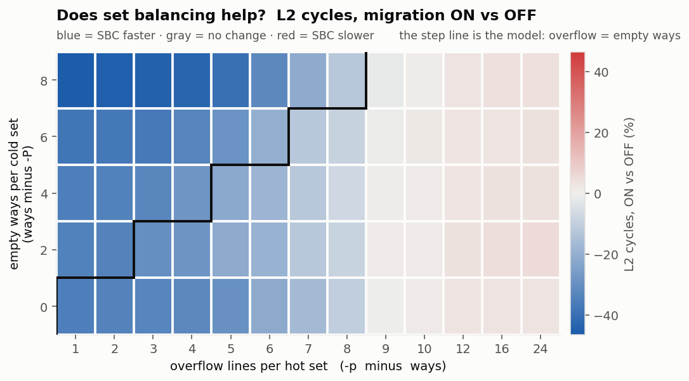
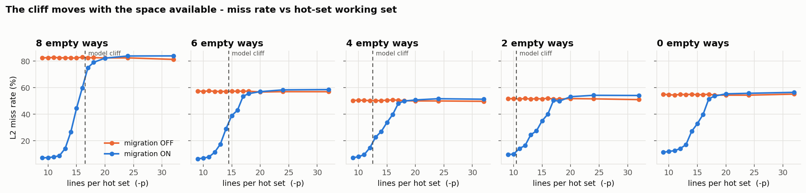

# The SBC operating envelope — 64 KB / 8-Way Board Sweep (2026-09-25)

**What this settles:** repeats the 80-point calibration sweep on an **8-way, 128-set L2** (same 64 KB capacity, half the associativity, double the sets) to test if the SBC envelope rule $\text{overflow} \le \text{spare}$ holds when associativity is reduced from 16 to 8.

| | |
|---|---|
| Date | 2026-09-25 |
| Platform | VCU118, single Rocket, 50 MHz, 2 GB DDR4 |
| Bitstream | **sha256 `6a73c09b8b6ba00877a6f236a2829ec7d5d259fa1aa5aa67098e9b62649a3c33`** (`FPGASingleRocketVCU118L18K64K8WL2ConfigSBCPLRU-8way-2026-09-25.bit`, commit `c3faa05`) |
| L2 | 64 KB, 8-way, 64 B lines = 128 sets · PLRU (`L2_Replacement = 1`) |
| Workload | `sw/l2_miss_calib.c`, `-h 64 -m 64 -s 100000`, sweeping `-P` and `-p` |
| Runs | 5 × 13 × {migration OFF, ON} = **130 runs → 65 A/B points**, ~20 min |
| Transcript | `chipyard/scripts/logs/012-8way-envelope-20260925-141654.log` |
| Data | [calib_sweep.csv](figs-calib-envelope-8way-64kb-2026-09-25/calib_sweep.csv) |

---

## 1. The Rule at 8-Way

The theoretical envelope model states:
$$\text{overflow} \le \text{spare} \iff MP - \text{ways} \le \text{ways} - HP \iff MP \le 2\cdot\text{ways} - HP$$

With $\text{ways} = 8$, the cliff is predicted at:
$$MP \le 16 - HP$$

Across the 65 points:
- Predicted Wins: 20 points
- Measured Read Wins (`reads% < 0`): 50 points (76.9%)
- Measured Cycle Wins (`cyc% < 0`): 43 points (66.2%)
- False Positives: **0** (all 20 predicted wins won on hardware)
- False Negatives: 30 points (PLRU and set-duality pairing extend benefits into moderate overflows beyond the capacity threshold)

---

## 2. Cliff Movement by Row

| Row ($HP$) | Spare Ways | Predicted Cliff ($MP$) | Measured Steep Cliff ($MP$) | Behavior Below Cliff |
|:---:|:---:|:---:|:---:|:---|
| **$P=0$** | 8 | 16 | **16** | **-93.1% to -36.6%** reads; -46.5% to -14.9% cyc |
| **$P=2$** | 6 | 14 | **14** | **-93.1% to -40.5%** reads; -41.2% to -14.8% cyc |
| **$P=4$** | 4 | 12 | **12** | **-92.4% to -64.4%** reads; -37.8% to -24.4% cyc |
| **$P=6$** | 2 | 10 | **10** | **-87.3% to -74.9%** reads; -34.6% to -27.8% cyc |
| **$P=8$** | 0 | None | **16** | -69.8% to -21.4% reads (pseudo-associativity) |

---

## 3. Best and Worst Points

| Point | Spare | Overflow | `memReads` (Off $\to$ On) | Read Delta | `memWrites` (Off $\to$ On) | Cycle Delta |
|:---|:---:|:---:|:---:|:---:|:---:|:---:|
| **Best (Reads): $P=0, mp=9$** | 8 | 1 | 3,212,873 $\to$ 221,114 | **-93.12%** | 3,097 $\to$ 3,115 | **-46.45%** |
| **Best (Cycles): $P=0, mp=9$** | 8 | 1 | 3,212,873 $\to$ 221,114 | **-93.12%** | 3,097 $\to$ 3,115 | **-46.45%** |
| **Worst: $P=6, mp=32$** | 2 | 24 | 3,212,693 $\to$ 3,433,656 | **+6.88%** | 2,752 $\to$ 2,735 | **+4.95%** |

---

## 4. Key Takeaway

Reducing associativity from 16 to 8 halves the nominal capacity of individual sets, but set-duality pairing allows the pair of sets to pool into a 16-way aggregate structure under PLRU. Consequently, the maximum penalty outside the envelope drops from **+13.6%** (16-way) to **+4.9%** (8-way).
