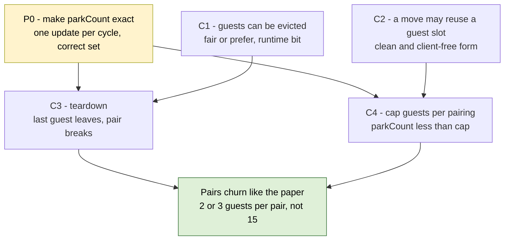

# Fix plan — follow the paper's placement and eviction rules

**Written 2026-09-16 · Status: proposal, needs your decision before any RTL.**
Follows on from [why-sbc-loses-2026-09-15.md](why-sbc-loses-2026-09-15.md) (the diagnosis) and replaces
**Step 3** of [workplan-parked-occupancy-2026-09-11.md](workplan-parked-occupancy-2026-09-11.md)
(switches A and B). Tracker items: M4, M11, M14, L6, L8.

**Words:** *guest line* = a line moved out of its own set and now living in a partner set (the code says
*displaced* / *parked*). *Home line* = a line sitting in the set it belongs to. **S** = source set,
**D** = destination set, **K** = ways per set.

---

## 0. New evidence — I read the paper itself, not the summary

`ai-documents/background/178-rolan-1-2.pdf` has a broken text layer, so I rendered pages 3–5 as images
and read them. Three things are now settled that the summary in `background/rolan-et-al-SBC.md` left
open. **Figure 2 and Figure 3 are the evidence; the transcription skipped both.**

**a) M11 is settled — our heat counter matches the paper on the half that matters.**
Figure 2 (SSBC, 2-way, counters 0–3): after the second search hits in set 2, **set 2's counter goes
1 → 0** and set 0's stays at 3 (its maximum). Figure 3 (DSBC) is consistent — both counters are already
at their limits, so they do not move. §3.3 says the counter "will be updated" for a secondary hit and a
definitive miss alike, "although this will not influence the association".

So the paper's rule is: **the counter of the set the access physically landed in.** A native miss in S is
+1 for S *even when the second search hits*; a secondary hit is −1 for **D**.

Ours: S +1 ✅ (the tap fires on the home lookup), D unchanged ❌ (the second search is `internalRead`, so
the tap is suppressed — `Directory.scala:317`).

**The missing half is inert in the DSBC.** A paired destination is never a DSS candidate
(`SetBalanceUnit.scala:124`) and can never become a source (`:189`), and §3.2 says displacements do not
consult D's counter. D's counter is only read again after the pair breaks. **Recommendation: close M11,
no RTL change** — and revisit only if we build teardown (C3), where D's counter decides how soon D can be
chosen again. Take the "⚠️ verify this week" box off M11.

**b) The paper has no exemption for guest lines when a displacement needs room.**
§3.3, on a secondary miss from a paired source: *"If there is a miss, the LRU line of the destination set
will be evicted, and the LRU line from the source set will be moved to the destination set to replace it.
This happens in parallel with the resolution of the miss, whose line will be inserted in the source set."*
The destination's victim is its LRU line — **guest or home line, no distinction.** Our
`!io.directory.bits.displaced` in `dstEvictable` ([MSHR.scala:1468-1470](../../design/craft/inclusivecache/src/MSHR.scala#L1468-L1470))
is our own invention, not the paper's.

**c) Do not add the receiver check.** §3.2 measured it: *"If the same policy as in the SSBC were applied,
that is, displacements only take place when the destination set saturation counter is smaller than K, the
average miss rate in our experiments would have been on average 0.6% larger, and the resulting IPC would
have been 0.38% worse."* So "a pinned source ignores how hot its destination is" (`SetBalanceUnit.scala:206`)
is correct paper behaviour. Rule 4 in the 09-15 analysis should be re-labelled: it is **not** a deviation.

**d) The paper's teardown test is already in our Directory.** §3.4: *"this condition is equivalent to
requiring that the OR of the d bits of all the lines but the one to evict is 0"* — that is exactly
`displacedOther` ([Directory.scala:303](../../design/craft/inclusivecache/src/Directory.scala#L303)),
computed and never read. `parkCount` in the SBU is an even cheaper equivalent (see C3).

---

## 1. The paper's rules against ours

| # | Paper | Ours | Verdict |
|---|---|---|---|
| 1 | A displacement evicts **D's LRU line**, guest or home (§3.3) | a migration may only overwrite a **home** line, `!displaced` (MSHR.scala:1468-1470) | ❌ **ours, fix as C2** |
| 2 | D's own misses evict D's LRU line, guest or home (§2.2 LRU) | guests are masked out of the random tier and taken only when no home way is left (Directory.scala:216-226) | ❌ **ours, fix as C1** |
| 3 | A guest enters at **MRU** — a head start, then it ages out (§2.2) | a guest is never picked, so the head start is permanent | ❌ **ours, no cheap fix — see §2** |
| 4 | The pair breaks when D evicts its last guest (§3.4) | never (`SetBalanceUnit.scala:263-271` writes the AT, only `SBC_Reset` clears it) | ❌ **ours, fix as C3** |
| 5 | Displacements ignore D's saturation once paired (§3.2, measured) | same (`SetBalanceUnit.scala:206`) | ✅ **already matches** |
| 6 | A destination never sources; it is out of the candidate pool (§3.3, §3.1) | same (`:189`, `:124`) | ✅ **already matches** |
| 7 | Native miss in S is +1 for S even when the second search hits; secondary hit is −1 for **D** (Fig 2) | S +1 ✅, D untouched ❌ | 🟡 **inert — see §0a** |
| 8 | Displace only from a set at its **maximum** counter value, 2K−1 (§2.2, §3.2) | auto-derived `T_hi = 2·nWays−1` (`Configs.scala:64-66`) | ✅ **already matches** |
| 9 | *Added 2026-09-17.* The counter moves on each **access** to the set (§2): a read from the level above | moves on every directory lookup (`SetBalanceUnit.scala` `dirTap`), so each L1 write-back (inner C `Release`) is a −1. Same-line requests that skip the lookup (repeat, queue pop) do not move it. Board, 128 KB OFF half: 1,144.3 M updates for 985.2 M accesses, so **≥159.1 M extra −1s (≥13.9%)**; the counters see a 14.3% miss rate instead of 16.6% | ❌ **ours** — sets reach max less often, and busy sets look colder to the DSS |
| 10 | *Added 2026-09-17.* The counter is updated first, **then** tested for max (§3.3: *"the saturation counter is updated and if it has reached its maximum…"*) | the advice reads `sat` at allocate, one cycle before the tap adds this access (`Scheduler.scala` `migrateQuery`) | ❌ **ours** — needs one extra miss before a set can displace |
| 11 | *Added 2026-09-17.* — | 🐞 **likely bug (tracker M17):** a request popped from the queue latches advice computed from the *incoming* sink request's set (`migrateQuery.bits := request.bits.set`), not its own | ❌ **ours** — can migrate from a set not at max, and skip a hot one. Frequency unknown |
| 12 | *Added 2026-09-17.* DSS has **4** entries (§5); an entry is dropped once its level reaches K (§3.1) | `dssEntries = 8`; an entry stays and only the pick is filtered by `< T_lo` (same pick); plus our own reject block list and 1,024-cycle retry | 🟡 **near-equivalent** — the extra parts are ours, needed because a migration cannot always take D's line |

**Rules 1, 2 and 4 are the whole fixed point.** They are also three small, independent changes.

---

## 2. Why "let guests compete equally" is not enough on its own

This is the part the 09-15 analysis did not carry all the way through, and it changes what we build.

Let **A** = guests arriving in D per unit time (migrations from S), **M_D** = D's own miss rate, **g** =
guests resident in D. Under **random** replacement every eviction in D picks a guest with probability
`g/K`, and every miss *and* every migration evicts exactly one line:

```
guests leaving = (M_D + A) · g/K        guests arriving = A
equilibrium    → g/K = A / (A + M_D)
```

S is hot by construction and D was chosen for being cold, so `A ≫ M_D` and **g/K → 1**. Fair random
eviction moves the fixed point from 15/16 to something like 10/16. It does not fix it.

**LRU is what makes the paper's version work**, and not because it throws guests out — because it
*protects D's own working set*. D's live home lines are re-referenced, so they sit near MRU and survive;
a guest nobody re-reads falls to LRU within a handful of accesses and is gone. Eviction is by **recency**,
never by category. We have no recency at all (random victim, `Directory.scala:170-176`), so category or a
quota is the only lever we have.

**The paper's own numbers say a quota is the right size of the effect.** It reports **2.15 lines displaced
per pairing** — with pairs that break as soon as the last guest leaves, that is **one or two guests
resident in D at a time, out of K=16 ways** (roughly 6–12% of the row). We sit at 15 of 16 (94%).

> **So: a cap of 2–3 guests per pairing is not a hack around the paper — it is the paper's own steady
> state, reproduced by arithmetic because we have no LRU to produce it for us.**

---

## 3. The fix — one prerequisite and four changes



### P0 — make `parkCount` exact. **Do this first; it is a latent data bug.**

`Scheduler.scala:689-693` reduces the parked-line erase pulses from every MSHR with `reduce(_||_)` and
picks the home set with `Mux1H`. Two MSHRs reclaiming a guest in the same cycle gives **one** decrement
applied to the **OR of two set indices** — a set that lost nothing. The `PopCount(dispOH) <= 1` assert on
`:694` catches it in simulation only; on the board it is silent.

Today that costs a wasted second search (`mayHold` is a hint). **After C3 and C4 it is a correctness
input:** `parkCount` reaching 0 tears the pairing down, and an early teardown orphans real guests — their
writeback address is recovered from the AT, so orphaning them means a **write to the wrong address**.

Fix: guarantee one update per cycle structurally (small skid queue of home-set indices, drained one per
cycle), or take the decrement off the directory write that actually erases the entry — the directory has a
single write port, so that is exact by construction. Keep the assert. Same bug family as coder/005 §2.2
("add with `PopCount`, never OR").

### C1 — guests can be evicted (paper rule 2)

**Where:** `Directory.scala:216-226`, the victim mux.
**What:** a 2-bit runtime policy on the guest mask:
- `00 protect` — today's behaviour, bit-identical (the mask, plus the first-home-line fallback);
- `01 fair` — guests join the random tier: `lfsrVictimOH & freeWays`, no `nonDisplacedOH`;
- `10 prefer` — guests first: the tier order swaps, `displacedOH` before `nonDisplacedOH`.

`01` and `10` delete workplan **Switch B** for free: the always-take-the-first-home-line fallback
(`Problem B`, 44% of evictions) only exists because the mask can return nothing.
**Cost:** a mux on an existing mask. **Risk:** it exercises the parked-victim release path (L2, "proven
only in a forced test") at full rate — that is a plus for coverage and the main thing to re-test in sim.
**C3 cannot fire without C1**: if only migrations remove guests, every guest slot is refilled by another
guest and `parkCount` never reaches 0.

### C2 — a migration may reuse a guest slot (paper rule 1)

**Where:** `MSHR.scala:1468-1470`, `dstEvictable`.
**What:** drop `!io.directory.bits.displaced`. Keep `!dirty && !clients.orR` for now, so the slot is taken
by the same silent overwrite the code already does for a clean home line — **no new release path, no new
state.** Under strict 1:1 pinning the guest being replaced belongs to the same S that is migrating, so
`parkCount(S)` is unchanged (one out, one in) and the home-set recovery is unchanged.
**Cost:** one term. **Risk:** low; the address bookkeeping is identical because both lines are S's.
**Left out on purpose:** replacing a *dirty* or *client-held* guest needs a real Release from the
migrating MSHR — same class as L5, not in this plan.

### C3 — teardown (paper §3.4, tracker L8)

**Where:** `SetBalanceUnit.scala`, at the `parkCount` decrement.
**What:** when a decrement takes `parkCount(src)` from 1 to 0, clear `at(src)` and `at(dst)` and re-admit
both sets to the DSS. `parkCount == 0` is the same predicate as the paper's "OR of the d bits is 0" and
needs no new directory signal; `displacedOther` stays unused.
**Cost:** a few lines. **Two nets it needs:**
1. **Do not tear down while a migration is in flight** (there is only ever one, G4) — its commit would
   re-pair a set the DSS may have handed to someone else, and the 1:1 assert at `:246-252` would fire.
2. **An in-flight second search must re-check the pairing when its result comes back.** After teardown D
   can be re-paired to a different source S', and a stale searcher from S could tag-match S' guest — a
   wrong-address hit. The MSHR already re-reads `assocResp` keyed to the directory result (the 002 C1 fix),
   so this is a compare, not new plumbing. **This is the one genuinely dangerous corner of the plan.**

### C4 — cap guests per pairing (our substitute for LRU, sized by the paper's 2.15)

**Where:** `SetBalanceUnit.scala` — add `parkFull = parkCount(assocQuery) >= cap` to the **existing**
`assocResp` bundle (same index as `mayHold`, so **no new sets-wide mux**), and make the MSHR drop the
migration when it is set (counts as `SBC_Declined`, coder/005 `0x430`).
**What it buys:** D keeps `K − cap` ways for its own lines no matter how hot S is, which is precisely what
LRU does for the paper. With `cap = 2` and every set paired, parked occupancy is **2/32 = 6.25%** instead
of today's 46.9%.
**Cost:** one comparator. **Compile-time parameter** `guestCap`, **default 2** (the paper's own steady
state); `0` means no cap and elaborates nothing.

---

## 4. Packaging — no register (decided 2026-09-16)

An earlier version of this plan put all four behind one runtime register so a single bitstream could
carry every combination. **Rejected: it would cost more hardware than the fix.** Three of the four
changes *delete* logic — a mask, two fallback tiers, a guard term — and a register with four fields plus
a mux per rule would add more than they remove, on the deepest path in the design (G7).

So each rule is simply built. The only tunable is a compile-time parameter, `guestCap` (default **2**),
alongside `migrationThreshold` and `dssEntries`.

**We still get the comparison we need:**
- **SBC off vs on, one bitstream:** `SBC_MigrateEnable` (`0x3C0`, task 006) is untouched by any of this.
- **Old rules vs new rules:** already measured. Two board sessions on 2026-09-15/16, same geometry, same
  benchmark, agreeing to 0.1% on the off halves (005 REPORT, "Board runs").
- **Per-change direction:** from the simulation gate after each commit, not from the board.

What we accept: on the board the four changes arrive as one result. If the combined result lands between
the two decision lines in §5, separating the causes costs extra bitstreams — that is the price of not
building the register, and it is the right trade at four changes.

## 5. What to run, and what each result means

One bitstream, fixed-work omnetpp A/B (`sbc_read --zero -- <cmd>`), 256 KB and 64 KB, **3 repeats** (M2).
Read `SBC_Parked`, `L2_MemReads`, `L2_MemWrites`, `L2_Cycles`, and after coder/005 the outcome counters.

**In simulation, after each commit** (cheap, and the only per-change evidence):

| after commit | expected direction |
|---|---|
| 0 exact counts | every counter unchanged; `SBC_Parked` may read lower — if so, the 477–483 board figure was inflated |
| 1 guests evictable | parked falls but stays high — §2 predicts roughly half the set |
| 2 reuse a guest slot | refused migrations collapse; parked still high |
| 3 teardown | `SBC_Parked` **falls** as well as rises for the first time; pairings recycle |
| 4 cap 2 | parked near 2 per pairing; primary hits recover |

**On the board, one session:** `run_board_session.exp -ab`, migrate-off half then migrate-on half, fixed
work, 64 KB. Compare against the two sessions of 2026-09-15/16 (67.2% off / 35.0% on, parked 477–483).
Read `SBC_Parked`, `L2_MemReads`, `L2_MemWrites`, `L2_Cycles` and the outcome counters.

**Decided in advance:**
- Run 5 within 2 points of baseline hit rate **and** serving secondary hits → the rules were wrong,
  Answer A, carry on.
- Run 5 still 10+ points behind → Answer B, the idea does not pay on a random-replacement L2 with a
  ~40-cycle miss. Write up the explained negative. **Say so with the mechanism: no recency, so a guest
  cannot earn its slot.**
- Run 2 alone landing near baseline would mean §2's flow argument is wrong — tell me, do not carry on.

**Honest expectation:** even run 5 is unlikely to *win* by much here. A miss costs ~40 cycles on this
board against ~500 in the paper (09-15 analysis §4), so the upside is a fraction of the paper's. The point
of this plan is that the *mechanism* becomes the paper's, and the remaining gap becomes explainable.

---

## 6. What I am deliberately not proposing

| Not doing | Why |
|---|---|
| Receiver saturation check before each displacement | §3.2 measured it worse (0.6% miss rate, 0.38% IPC). Our RTL already matches the paper |
| Decrement D's counter on a secondary hit (M11) | Settled in §0a: correct per Figure 2, but inert while paired. Revisit with C3 |
| A recency bit per way (CLOCK/NRU) | The real substitute for LRU, but it needs a decay mechanism and a row-wide directory write. **Keep it as Stage 2** if run 5 lands "close but not there" |
| Migrating dirty or client-held guests out of D | Needs a second release from the migrating MSHR. Same class as L5 |
| Rebuilding switch B from the workplan | C1 deletes the bad fallback as a side effect |

---

## 7. Open decisions for you

1. **Scope:** all four (P0, C1–C4) in one coder task, or P0+C1+C3 first and the cap after we see the
   flow-argument prediction confirmed? *(My call: all four — one bitstream, and the cap is the cheapest
   of them.)*
2. **Cap default: 2, 3 or 4?** *(My call: 2, matching the paper's 2.15 lines per pairing.)*
3. **Sequencing against coder/005 and the merge.** 005 is mid-flight on `sbc-sampling` and its counters
   are what make run 5 readable. *(My call: finish 005, merge, then this as coder/007, then **one**
   bitstream.)*
4. **M11:** close it as "matches the paper, no change"? That removes half the "verify this week" box.

## 8. Risks

- **C3 net 2 (stale second search after a re-pairing) is a data-corruption corner.** It must be a real
  assert in the RTL, not a comment, and it must be in the sim gate before any board run.
- **C1 puts the parked-victim release path under real load for the first time** (L2 was only ever proven
  under forcing). The full sim gate — `migration_stress_test` 7/7, the `tmp.c` oracle, both shadow
  checkers, through `make run-binary` with `+dramsim` — comes before the board.
- **P0 is a prerequisite, not a nice-to-have.** Teardown reading a drifting counter is how a guest gets
  written back to the wrong address.
- Everything here is still built on **one run per configuration** (M2 unfixed) and on a model inferred
  from counters, not a trace. The board checks M12 and M13 are still worth running first — they are free
  and they either confirm or kill the fixed-point model in an afternoon.
