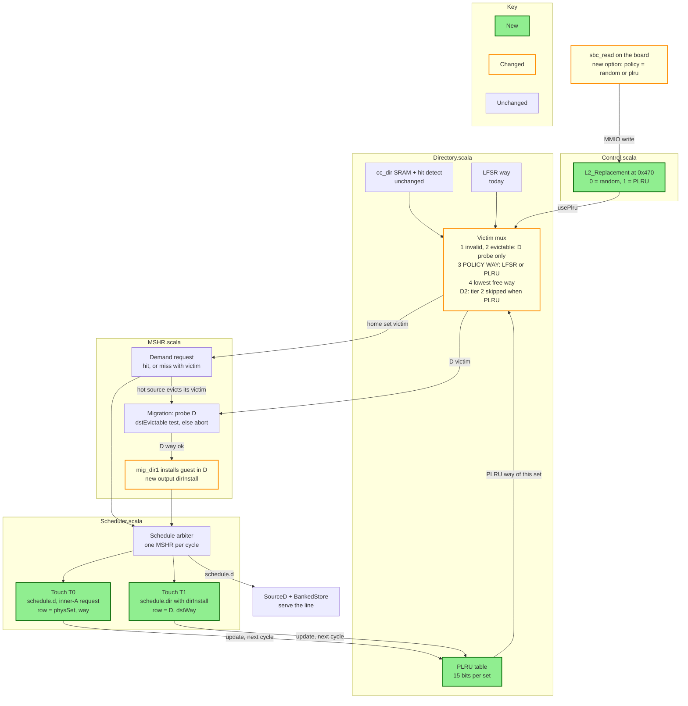

# Plan — change the L2 replacement policy to PLRU (before the rest of task 007)

**Written 2026-09-17** by the thinker. **Status: waiting on your decisions D1–D3 (section 4).** Once they
are made this becomes `coder/008-plru-replacement/TASK.md`.
Starting point: `744fabb` (007 C0–C3 + the B7-1 fix), branch `sbc-sampling`. Checked against that RTL.

---

## 0. In short

- **Why now:** after 007 C0–C3 SBC only breaks even (64 KB: +0.41% cycles, 128 KB: +0.15%), and a
  moved line is found again only **0.18–0.21 times per migration**. The paper inserts a moved line as
  **most recently used**, so it survives long enough to be used again. Under random replacement it can
  be evicted on the very next miss. 007 C4 (the guest cap) only exists because we have no recency.
- **What:** keep a **15-bit PLRU tree per set** (16 ways) and use it to choose the victim.
  Reuse rocket-chip's own `SetAssocLRU(sets, ways, "plru")` (`util/Replacement.scala`, already used by
  Rocket's TLB and PTW). No new tree logic of our own.
- **Where:** its own small module, `Recency.scala`, instantiated inside `Directory`. It owns the recency
  bits. Its inputs are the "touches" (which line was just used), taken from signals that already exist.
  Its only output is a victim way, which replaces the random way in the victim mux. Nothing else reads it.
- **A/B:** a 1-bit runtime register `L2_Replacement` (recommended, D1) gives random vs PLRU on **one**
  64 KB image, with the migrate switch as today. So all four halves run on the same RTL.
- **007 C4 waits** for the board result (section 8).

### Where PLRU fits in the cache

Green is new, orange is changed, blue is unchanged. The loop to follow: the victim mux reads the PLRU
table → the MSHR uses that victim → the Scheduler sends the reply or the guest install → that same
row and way update the PLRU table from the next cycle.



---

## 1. Why PLRU, and not exact LRU or CLOCK

| Policy | State per set (16 ways) | Notes |
|---|---:|---|
| Random (today) | 0 (one shared LFSR) | no recency. "Insert as MRU" cannot be expressed |
| **Tree PLRU** | **15 bits** | rocket-chip ships it. Never evicts the most recent way; roughly LRU order |
| Exact LRU | 120 bits (n·(n−1)/2) | 8× the state, larger update logic |
| CLOCK / reference bit | 16 bits + a hand | needs a decay rule and a row-wide clear. More design than PLRU |

Cost of PLRU in flip-flops: **960** at 64 KB (64 sets), **1,920** at 128 KB, **3,840** at 256 KB. It can
move to LUTRAM later, together with the `sat`/`at`/`parkCount` tables.

**Why not store it in the directory SRAM:** a hit would then need a directory write on every access. The
directory has one port and a read blocks the write (`write.ready := !io.read.valid`), so that would slow
the whole L2. A separate register table has no such cost.

---

## 2. The paper's rules this brings back

| Paper (§2.2, §3.3) | Today | With PLRU |
|---|---|---|
| A set evicts its LRU line | random way ([Directory.scala:176-180](../../design/craft/inclusivecache/src/Directory.scala#L176-L180)) | the PLRU way |
| The source migrates its LRU line | the random victim | the PLRU victim (no extra change) |
| A moved line enters D as **MRU** | not expressible | the install touches D's PLRU at the new way |
| A migration evicts **D's LRU line** | lowest-index clean way ([Directory.scala:191](../../design/craft/inclusivecache/src/Directory.scala#L191), `preferEvictable`) | D's PLRU way — **D2** |
| A guest nobody uses ages out | random, so no head start | ages out by recency |

**Today a guest behaves as if it were inserted at LRU — the case the paper warns against** (§2.2: *"each
new displacement would evict the line inserted in the previous one"*). The destination probe takes D's
lowest-index clean, client-free way. The guest just installed there is still clean and client-free, so
the next migration usually picks the same way again. Board, 128 KB: **71.8% of migrations (94,096 of
130,982) overwrote a guest**. That is a likely cause of the 0.18 secondary hits per migration.
Not yet proven to be the *previous* guest each time: V3 should log `dstWay` per migration to confirm.

**How the MRU head start works in a tree PLRU.** Each tree node holds one bit, "which half is older". A
touch of way w sets every node on w's path to point to the other half. The victim is found by following
the "older" bits from the root. So right after the install touch, w cannot be the victim. It becomes the
victim only after the other side of each node on its path has been touched again: at least one touch in
each of 4 sibling groups (sizes 8, 4, 2, 1). True LRU would need all 15 other lines to be touched. A
guest that gets a secondary hit is touched again and stays. A guest nobody uses drifts to the victim
while D's own busy lines keep pointing the tree away from themselves.

---

## 3. Design

### 3.1 State

- New micro parameter **`plruReplacement: Boolean = false`**. `false` builds nothing: no state, no
  register field, and the register reads 0. Not tied to `enableSetBalancing` — the plain-L2 half needs
  it too.
- New module `Recency` (`Recency.scala`), instantiated in `Directory`. Inside it:
  `val plru = new SetAssocLRU(params.cache.sets, params.cache.ways, "plru")`.
  IO: `touch = Input(Vec(2, Valid(set, way)))`, `querySet = Input(UInt)`, `victimWay = Output(UInt)`.
- New Directory inputs, passed straight through to `Recency`: `touch` and `usePlru: Bool`.
- **No same-cycle bypass.** A touch changes the state from the next cycle. The victim reads state that
  is always a register. This keeps it clear of B7-2 (see risks).

### 3.2 Victim choice

In the result cycle, using the result-aligned `set` register (the same one the tap uses):

```scala
recency.io.querySet := set
val plruOH   = UIntToOH(recency.io.victimWay, params.cache.ways)
val policyOH = Mux(usePlru, plruOH, lfsrVictimOH)
victimWayOH  = Mux(preferInvalid && freeInvalid,             PriorityEncoderOH(invalidWayOH & freeWays),
               Mux(preferEvictable && !usePlru && freeEvict, PriorityEncoderOH(evictableOH & freeWays),   // D2
               Mux((policyOH & freeWays).orR,                policyOH & freeWays,
               Mux(freeWays.orR,                             PriorityEncoderOH(freeWays),
                                                             PriorityEncoderOH(~0.U)))))
```

The tier order, the way-lock mask and the asserts do not change. With `usePlru = 0` every pick is
exactly today's pick.

### 3.3 What counts as a "use" (a touch) — D3

Both touches come from the MSHR that won the schedule this cycle, so there are at most two per cycle.
They are taken from **the same fields that move the data**, so they cannot point at a different line
than the one being served or written:

| # | When | Set, way | Covers |
|---|---|---|---|
| T0 | `schedule.d.valid && d.prio(0) && !d.control && !d.bad` ([Scheduler.scala:182](../../design/craft/inclusivecache/src/Scheduler.scala#L182)) | `d.physSet`, `d.way` ([MSHR.scala:827-828](../../design/craft/inclusivecache/src/MSHR.scala#L827-L828)) | every access: primary hit, data miss (the refilled way), upgrade miss, secondary hit (the guest's way in D), repeat reloads, I$ `Get`s |
| T1 | `schedule.dir.valid && schedule.dirInstall` | `dir.set`, `dir.way` | a migration install, so the guest enters D as MRU |

- `dirInstall` is one new `Bool` on `ScheduleRequest`, driven by the existing `mig_dir1`
  ([MSHR.scala:540](../../design/craft/inclusivecache/src/MSHR.scala#L540)).
- If T0 and T1 land in the same set in one cycle, apply T0 then T1 (`SetAssocLRU.access` folds in order).
- **Not touches:** inner C `Release`/`ReleaseData` write-backs, B probes, X flushes, SBC's internal
  directory reads. This is the "access" of [cache-terminology.md](../guides/cache-terminology.md).

**Why at the D grant and not at the lookup:** at the grant, `way` is the way really serving the line
(after a refill, after a serve-in-place), with no second derivation. The cost is a short window: a miss's
victim way is still "oldest" until its grant, ~40 cycles later. A second victim pick in that row inside
the window already takes the way-lock fallback (lowest free way), so it is safe. It is just not LRU.
Check V3 counts how often that happens.

### 3.4 The switch — D1

- `L2_Replacement` at **`0x470`**, R/W, 1 bit, **reset 0 = random**, 1 = PLRU. (`0x430` is reserved for
  `SBC_Declined`, `0x440`–`0x468` for the 005 sampler.)
- Safe to flip at any time: every way is a legal victim, and the PLRU state keeps updating while
  random is selected, so PLRU starts warm.
- Wiring as for `SBC_MigrateEnable`: `Control` → `InclusiveCache` → `Scheduler` → `Directory.usePlru`.
  Same change: `sw/sbc_mmio.h`, and `sbc_read --policy=random|plru`, which also prints the policy in
  every read so each log records it.

### 3.5 What does not change

Saturation counters, DSS, AT, teardown, `mayHold`, the second search, the way-lock, the LFSR itself, and
every counter.

---

## 4. Decisions for you

| # | Question | Recommended | Other choices |
|---|---|---|---|
| **D1** | How to choose the policy | **Runtime register `0x470`** — all four halves on one image and one RTL; one 64 KB build; costs a 2:1 mux | Compile-time only: simpler, no register or SW change, but two bitstreams per size. The 09-16 "no register" rule was about four muxes on the SBU path. This is one mux in the directory. |
| **D2** | Which way a migration evicts in D when PLRU is on | **D's PLRU way, or abort** if it is dirty or held by a client (the MSHR's existing `dstEvictable` test at [MSHR.scala:1524](../../design/craft/inclusivecache/src/MSHR.scala#L1524)). Same as the paper | (F) PLRU way, else today's lowest-index clean way: more migrations, but it throws out D lines that are in use. (T) unchanged: PLRU only for normal misses |
| **D3** | What counts as a use | **T0 + T1 above** (accesses + migration installs) | Also touch on C write-backs |

Why D2 = abort: an abort costs one directory read, and the source victim then leaves exactly as it would
in the plain L2. Option F keeps migrations going by evicting a line that D (a cold, fully used set) is
still using, which is the "cold ≠ has room" problem again. Expect `SBC_Aborted` to rise. That is the
measured cost. Side effect: an abort also sets `migRejectDst`
([MSHR.scala:1539](../../design/craft/inclusivecache/src/MSHR.scala#L1539)), which blocks D in the DSS
until the other candidates have been tried, so the DSS will rotate faster.

---

## 5. Commits

| # | What | Files |
|---|---|---|
| C1 | PLRU state + T0/T1 touches + `L2_Replacement` + the §3.2 mux **without** the D2 term | new `Recency`, `Parameters`, `Configs`, `Directory`, `Scheduler`, `MSHR` (`dirInstall` only), `Control`, `InclusiveCache`, `sw/sbc_mmio.h`, `sw/sbc_read.c` |
| C2 | D2: `!usePlru` on the evictable tier | `Directory` (one term) |
| C3 | docs: CLAUDE.md register row + parameter row, README tracker | docs |

Turn on `plruReplacement = true` in the 64 KB `…ConfigSBC` and `…ConfigNoSbc` FPGA configs and in the
Verilator gate configs. ⚠️ Those configs are uncommitted work in the chipyard repo — **edit, never
`git checkout`**.

---

## 6. Checks in Verilator (through `make run-binary` / `run_sbc.sh` only)

| # | Check | Pass |
|---|---|---|
| V1 | **Nothing changes while random is selected.** Flag on, register left at reset. Re-run the `007-b71-c3` gate with the **same binaries** | every counter **identical** to `007-b71-c3`; 8/8 + 7/7, T1–T4, 0 asserts, shadows quiet |
| V2 | **PLRU gate.** Same tests built with `-DL2_POLICY=1` (writes `0x470` first), plus a `=0` build of the same source as the reference | 8/8 + 7/7, T1–T4, 0 asserts, shadows quiet; the counter identities hold |
| V3 | **Replay.** `sbcDebug` printfs with a cycle count: `PLRU-TOUCH set way src=T0/T1` and, on every read, `PLRU-VICTIM set plruWay chosen busy tier`. A short script replays the touches through a Python tree-PLRU (touches from earlier cycles only, T0 before T1) | `plruWay` = model on **every** read; `chosen = plruWay` whenever the PLRU tier fired. Report the fallback count and the number of installs that were D's very next victim (expect 0) |
| V4 | **Sanity, NoSbc.** Same binary, policy 0 then 1 | report `L2_DataMiss` for both. If PLRU is clearly worse, **stop and report** (no tuning mid-test) |
| V5 | **Build.** 64 KB bitstream | no DRC errors (watch LUTLP-1), timing met, FF delta vs the last 64 KB image ≈ 960 + register |

No directed "was line X evicted?" test: the sim config has only 8 sets, and code and stack lines land in
every one of them, so such a test would be flaky. V3 checks the same thing directly.

---

## 7. Board run (64 KB, omnetpp, fixed work)

One image, built from `744fabb` + this task. Tag `744fabb` first, so the random baseline has a name.

- **Session R:** `sbc_read --policy=random`, then the usual `-ab` (OFF half, ON half).
- **Session P:** `sbc_read --policy=plru`, then `-ab`.
- A fresh boot for each session, so no half inherits guests from another. Start with one R and one P,
  then repeat both twice more with the order swapped (tracker M2: we still have no repeats).
- During each ON half, read `SBC_Parked` about every 60 s (overlaps M13).

| Compare | Answers |
|---|---|
| P-OFF vs R-OFF | does PLRU alone help the plain L2? |
| **P-ON vs P-OFF** | **SBC vs a plain L2 with recency — the paper's own comparison. The headline.** |
| R-ON vs R-OFF | today's result, now with B7-1 + C3. First board number for them, as a side effect |
| secondary hits per migration, P-ON vs R-ON | does the MRU head start make guests pay off? (today 0.18–0.21) |
| `SBC_Attempted` / `SBC_Aborted`, P-ON vs R-ON | the cost of D2 |
| `SBC_Parked` over time, P-ON | decides C4 (section 8) |

Report `L2_MemReads` and `L2_MemWrites` separately, plus `L2_Cycles` and the exact hit rate.

---

## 8. What happens to 007 C4 (guest cap)

C4 is staged (`wip-2026-09-17/apply_c4.py`) and stays **unapplied**. Its reason was the fix plan §2 flow
argument: under random replacement, guests pile up in D. Two facts change that:

- After C1–C2 the board already shows few guests (`SBC_Parked` ends at 0–1).
- PLRU gives guests a head start (MRU insert), so parked occupancy may **rise** under PLRU.

So: if P-ON parked lines stay near the paper's ~2 per pairing, **close C4 as not needed**. If they climb,
apply C4 on top of PLRU.

---

## 9. Risks

| # | Risk | Watch |
|---|---|---|
| R1 | Longer path: a sets-wide 15-bit mux plus a 4-level tree in the directory result cycle, the same cycle the MSHR plan logic runs | Vivado timing report (V5) |
| R2 | B7-2 (256 KB combinational loop) is still open | PLRU state is a register with no bypass, so it cannot close a new loop. **Build 64 KB only** until B7-2 is fixed |
| R3 | PLRU is not exact LRU. It never evicts the most recent way, but beyond that the order is approximate. The paper's numbers are for true LRU | say so next to every result |
| R4 | **Inclusion victims:** L1 hits never reach the L2, so a line that is hot in L1 looks old to L2's PLRU. Evicting it probes L1 and costs L1 a miss. Random has this too, but LRU aims at those lines more | shows up only in `L2_Cycles`; no direct counter. Name it if P-OFF loses to R-OFF |
| R5 | D2 raises aborts, so there are fewer migrations, and each abort blocks that D in the DSS for a while | `SBC_Aborted` / `SBC_Attempted`, `SBC_Migrations` |
| R6 | The touch window (§3.3) sends some victim picks to the lowest-free-way fallback | fallback count from V3 |
