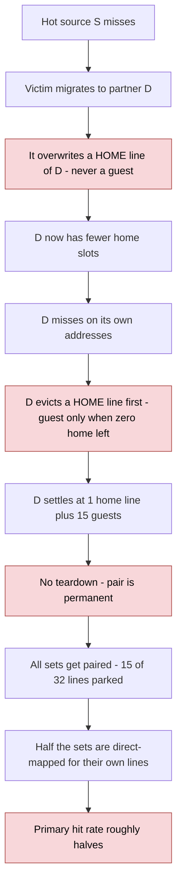

# Why our SBC loses where the paper wins

**Written:** 2026-09-15 (analysis of the fixed-work board runs) · **Status: not yet verified** — run the
checks in §6 first · **Start here on 2026-09-15.**
Tracker items (see [../README.md](../README.md)): L8 pairings never end, M4 two-switch experiment, M11
heat counter on a partner hit, M12–M14 (the checks and the fair variant proposed below).
Code references checked against the RTL on 2026-09-14.

## Short answer

I agree it isn't the cache size. It also isn't the workload or the cost of the migration hardware. The cause is a **fixed point built into our eviction rules**:

- Every source/destination pair ends up with 16 home lines in the source and **1 home line + 15 guest lines in the destination**.
- That is 15/32 = **46.9% of the whole cache parked, at any cache size**.
- Half the sets end up with only one slot for their own lines, so the primary hit rate roughly halves.

The paper avoids this because its guests compete with home lines under LRU, and its pairings break on their own. We copied the paper's pinning but not the two rules that make pinning safe.

## 1. What the runs show (both are valid fixed-work A/Bs)

| | 64 KB (this log) | 256 KB (`board_session_20260912-021811.log`) |
|---|---|---|
| Same work in both halves? | ✅ event #9,347,248 both | ✅ event #35,128,553 both |
| Memory reads | 1.61 B → 3.98 B (**2.47×**) | 2.32 B → 8.98 B (**3.87×**) |
| Memory writes | 375 M → 891 M (2.38×) | 776 M → 2.04 B (2.63×) |
| L2 cycles | **+51.2%** | **+46.0%** |
| L2 accesses (same work) | +24.5% | +14.7% |
| Primary hit rate | 69.69% → 35.58% | 86.81% → 50.61% |
| Primary hits lost / secondary hits gained | −1.35 B / +0.28 B | −5.07 B / +1.00 B |
| **Parked at end** | **480 / 1024 = 46.9%** | **1903 / 4096 = 46.5%** |

`memReads` equals total misses exactly (3,976,237,323 vs 3,976,237,322), so the headline metric is consistent.

## 2. Parked lines hit a hard ceiling of 15/32

Four rules in the RTL combine:

1. **A migration can only overwrite a home line in the destination, never an older guest.** `dstEvictable` requires `!displaced` ([MSHR.scala:1468-1470](../../design/craft/inclusivecache/src/MSHR.scala#L1468-L1470)). The slot it takes is the lowest-index clean home way ([Directory.scala:218](../../design/craft/inclusivecache/src/Directory.scala#L218)), not a spare one.
2. **The destination's own misses evict its home lines first.** A guest is taken only when no home way is left ([Directory.scala:217-226](../../design/craft/inclusivecache/src/Directory.scala#L217-L226)).
3. **Pairs never break.**
   - The association table is written only on commit and on `SBC_Reset` ([SetBalanceUnit.scala:263-271](../../design/craft/inclusivecache/src/SetBalanceUnit.scala#L263-L271)).
   - `displacedOther` is computed ([Directory.scala:308](../../design/craft/inclusivecache/src/Directory.scala#L308)) but nothing reads it. There is no teardown.
   - Paired sets are kept out of the DSS ([SetBalanceUnit.scala:156](../../design/craft/inclusivecache/src/SetBalanceUnit.scala#L156)), so the candidate pool only shrinks.
4. **A destination can never become a source** ([SetBalanceUnit.scala:189](../../design/craft/inclusivecache/src/SetBalanceUnit.scala#L189)). A pinned source also ignores how hot its destination has become ([SetBalanceUnit.scala:206](../../design/craft/inclusivecache/src/SetBalanceUnit.scala#L206)).

What happens inside a destination set D:
- D fills with guests until it has no home lines.
- D's next miss drops one guest to fetch its own line, leaving 15 guests and 1 home line.
- That home line was just handed to the L1, so its client bit is set and it can't be evicted. The next migration into D aborts. That fits the **82.6% abort rate**, though `attempted` is a known-bad denominator ([D7 in omnetpp-differential](omnetpp-differential-2026-09-10.md); tracker M8).
- When that line goes clean, a migration takes it. D's next miss drops a guest, and D is back at 15.
- So `dispDrop` ≈ `migrations`: 1,547,614 vs 1,547,988 (0.9998). **Each migration swaps one guest for another and costs D its only home line.**

With no teardown, every set eventually gets paired:
- **64 KB:** 64 sets → 32 pairs × 15 = **480. Measured: 480 exactly.**
- **256 KB:** 128 pairs × 15 = 1920. Measured: 1903.

**This model predicts the hit rate.** Source sets keep their baseline hit rate, and destination sets get almost no primary hits, so the primary rate should be about half of baseline:
- **64 KB:** 69.69 / 2 = **34.84% predicted, 35.58% measured.**
- **256 KB:** 43.4% predicted, 50.6% measured. The fit is looser here, probably because traffic isn't split evenly between sources and destinations, but it's the same regime.

**This is why the size doesn't matter.** The ceiling is set by the number of ways (15 of 32), not by capacity. More sets only change how fast the pairs freeze.

## 3. How the paper avoids it

| Paper (§2.2, §3.2–3.4, §7.3) | Ours |
|---|---|
| LRU: a guest goes in as most-recent, then ages out | Random victim; a guest is last priority, so in practice permanent |
| A migration evicts the destination's LRU line, which may be an old guest | A migration can only take a home line |
| The destination's misses evict its LRU line, guest or not | The destination's misses evict home lines first |
| The pair breaks when the destination evicts its last guest | No teardown |
| **2.15 lines displaced per pairing** | **~48,000 (64 KB) / ~65,000 (256 KB) per pair**, never broken |
| 3.29 secondary hits per displaced line | 180 / 120 |
| 47.7% of second searches hit; 10.2% of accesses search | 64 KB: 28.5% / 14.8%. **256 KB: 50.4% / 9.8%** |

- **The paper's pairings are short and self-correcting; ours are permanent.** Its rule "keep sending to the destination whatever its saturation" (§3.2) is safe only because LRU and disassociation let the destination take its lines back.
- **The search-and-serve half works.** At 256 KB our second-search numbers match the paper almost exactly. The loss is in placement and eviction.
- **`hits per park = 180, break-even ≈ 1.0` is misleading.** Every park costs the destination a line it was using. The real comparison is 1.35 B primary hits lost against 0.28 B secondary hits gained, about **4.8 to 1 against** (5.1 to 1 at 256 KB).
- **"Cold" picks the wrong destination.** A cold set is one whose lines all hit, which means it needs all of them. LRU would still find its one idle line; we overwrite the lowest-index clean line instead. This is the old "low miss pressure ≠ has room" finding, now the main cost rather than just a source of aborts.

## 4. Other factors: real, but not the cause

- **The slowdown comes from misses, not migration hardware.** +109.8 B cycles over +2.37 B extra memory reads is ≈46 cycles per read (41.8 at 256 KB), which covers all of it. Even at 100 cycles each, the 1.55 M copies are **0.14%** of the extra time. The one-migration limit, the fences and the copy unit are not the problem.
- **L2 accesses rose 24.5% for the same work.** This is a hypothesis, not measured: the destination's single home line is evicted on almost every miss while the L1 still holds it, so the L1 gets shot down and asks again. Counting inner probes would confirm it.
- **Wasted second searches:** 700 M at 64 KB. A real cost, but the 256 KB run matches the paper, so it doesn't explain the gap.
- **Platform ceiling:** here a miss costs ~40 cycles; in the paper it is ~500 (125 ns at 4 GHz). Even a correct SBC gains less on this board. That still can't produce 2.5× more misses.
- **Hot-source victim choice:** a hot source also prefers its lowest-index clean way ([Scheduler.scala:451](../../design/craft/inclusivecache/src/Scheduler.scala#L451)), so its replacement isn't random either. Minor, not measured.
- **The workload isn't the issue.** omnetpp is the paper's *best* case: about 70% fewer L2 misses at 2 MB and +15% IPC.

## 5. What this means for the 2026-09-11 workplan

- **Switch B (fix the fallback) will probably do almost nothing.** At the fixed point, sources hold no guests, so the random pick always lands on a home way. Destinations have one home way, so either tier picks it. I'd predict under 1 point.
- **Switch A (guests in the random tier) fixes rule 2 only.** Rules 1 and 3 stay: pairs are still permanent and migrations still eat home lines. Expect a partial gain.
- **The "straight line with guest count means Answer B" test doesn't separate the answers.** Each new pair adds ~15 guests and turns one set direct-mapped, so the line is straight under Answer A too.
- **My view: the evidence points to Answer A, but the missing rules aren't in the plan.** "A and B still 10 points behind" would be testing a design that isn't the paper's. A fair variant would:
  - let guests compete equally,
  - let a migration replace an older guest,
  - wire up teardown (`displacedOther` already exists).

  Without recency, a 1-bit reference bit per way (CLOCK) is the cheapest LRU stand-in. It's also what makes "insert as most-recent" possible.

## 6. Cheap checks before trusting this (no RTL change)

1. After an SBC run, sweep `SBC_SetSel` (0x300) over all sets and read `SBC_Status` bit 2 (0x320), `SBC_AtAssoc` (0x398) and `SBC_SetSat` (0x308). **Prediction:** every set paired, 32 sources and 32 destinations, destination saturation near 31.
2. Sample `SBC_Parked` (0x3A0) every few seconds during the ON half. **Prediction:** it rises in steps of ~15 as pairs form, then goes flat and never falls.

**Caveats:**
- Each config has a single run.
- The model is inferred from counters and RTL, not traced.
- The 256 KB hit-rate fit is looser than the 64 KB one.
- The access increase from the L1 is a hypothesis.
