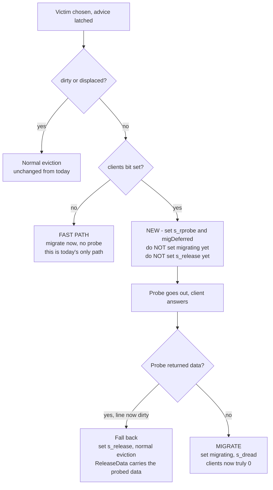
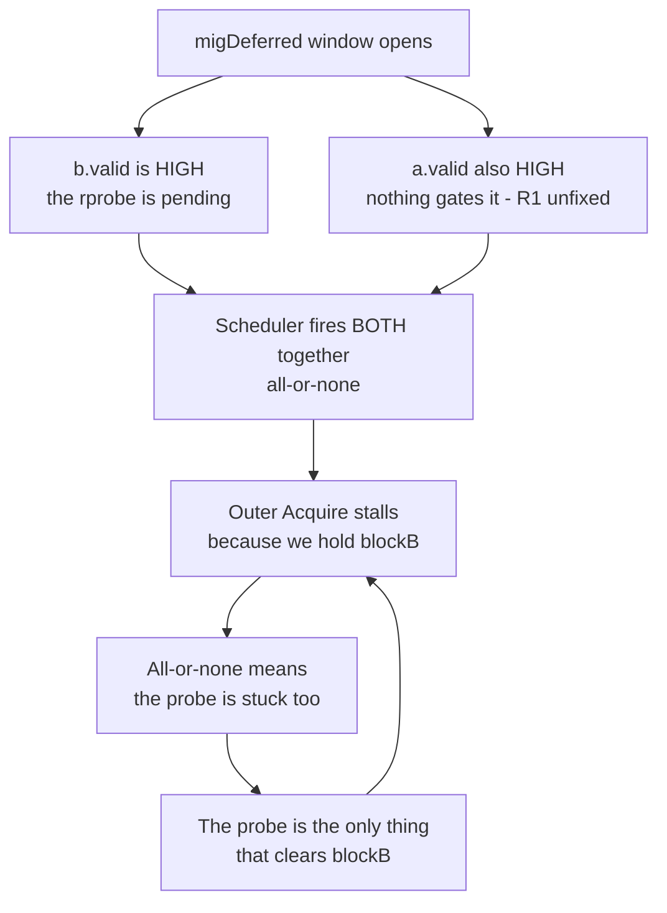

# Phase 2.5 — Probe-then-Migrate

**Written:** 2026-08-18
**Branch:** `set_migration_refactored`
**Status:** IMPLEMENTED (2026-08-18) — hypothesis CONFIRMED, one open assert. See §10.
**Why it exists:** Phase 2 works but migrates ~1 eviction in 5,500. Phase 3's payoff is `p·(M−C)`,
so at `p ≈ 0.0002` there is nothing to build on. This is the bridge that raises `p`.

Companion docs: [July18AfterBreakWorkplan.md](July18AfterBreakWorkplan.md) (how we got here),
[phase-3.md](phase-3.md) (what comes after), [bug-fix-log.md](bug-fix-log.md).

---

## 1. The problem in one paragraph

A migration only happens if the victim passes `!dirty && !clients.orR && !displaced`
([MSHR.scala:785](../design/craft/inclusivecache/src/MSHR.scala#L785)). Measured over 129,488
evictions, `clients` blocked **82%** and `dirty` blocked **16%**. But the `clients` bit is
**conservative, not true**: rocket's L1 D$ runs with `silentDrop = true` (the default —
`acquireBeforeRelease = false` in `HellaCache.scala:42`, and `DCache.scala:810/820` gate the
voluntary release on it), so the L1 discards clean lines **without telling the L2**. The bit is set
on grant and cleared only by a probe. Capacity confirms it: the L1 D$ holds 4 lines, yet ~32 ways
read as held.

**So we are refusing to migrate based on a bit that is usually a lie.**

## 2. The core insight — the probe is already being sent

This is what makes the fix cheap, and it is worth stating precisely because it is easy to
misread as "add a probe to the migration path."

Today, when the victim is client-held, SBC takes the `.otherwise` branch: a **normal eviction**,
which sets `s_rprobe := false` and probes the client to invalidate it
([MSHR.scala:816-819](../design/craft/inclusivecache/src/MSHR.scala#L816)). That probe **already
happens, on every one of those 82% of evictions.** The answer we need is already coming back — we
throw the eviction away before looking at it.

> **We are not adding a probe. We are moving the decision to after the probe we already send.**

Consequences that follow directly:

- **`C` (migration cost) does not grow.** Baseline pays probe + release. We pay probe + copy. The
  probe is common to both, so the differential is copy-versus-release, exactly as in Phase 2.
- **No extra L1 invalidation.** We invalidate exactly the lines the baseline was already
  invalidating — the victim is being evicted either way. (One caveat in risk R6 below.)
- **The invariant gets stronger, not weaker.** After a `toN` probe completes, the victim is
  client-free *for real*, which is a stronger guarantee than the stale bit we test today.

## 3. Current FSM facts this design depends on

Verified by reading the RTL, 2026-08-18. Anyone implementing this should re-check these first.

| Fact | Where | Why it matters |
|---|---|---|
| Eviction rprobe always asks `toN` | `b.bits.param := Mux(!s_rprobe, toN, ...)` [MSHR.scala:410](../design/craft/inclusivecache/src/MSHR.scala#L410) | After the probe, every client is at N — clients really is 0 |
| `ProbeAckData` sets `meta.dirty := true` | [MSHR.scala:607](../design/craft/inclusivecache/src/MSHR.scala#L607) | The post-probe dirty re-check needs no new logic — just read `meta.dirty` |
| `probes_toN` accumulates invalidated clients | [MSHR.scala:595](../design/craft/inclusivecache/src/MSHR.scala#L595) | Post-probe client set is `meta.clients & ~probes_toN` |
| `excluded_client` is 0 on an eviction | [MSHR.scala:396](../design/craft/inclusivecache/src/MSHR.scala#L396) (`meta.hit` is false) | The rprobe covers **all** clients, none skipped |
| Release waits for the probe | `c.valid := (!s_release && w_rprobeackfirst)` [MSHR.scala:~254](../design/craft/inclusivecache/src/MSHR.scala#L254) | Falling back to a release after the probe is already legal |
| `c.bits.opcode := Mux(meta.dirty, ReleaseData, Release)` | [MSHR.scala:414](../design/craft/inclusivecache/src/MSHR.scala#L414) | The dirty fallback writes back the probed data automatically |
| Acquire gate | `a.valid := !s_acquire && s_release && s_pprobe && (!migrating \|\| w_copy)` [MSHR.scala:253](../design/craft/inclusivecache/src/MSHR.scala#L253) | **This is the hazard.** See R1 |
| `displacedEntry.clients := meta.clients` | [MSHR.scala:381](../design/craft/inclusivecache/src/MSHR.scala#L381) | **Must change.** See R2 |

## 4. The design

### 4.1 Split the eligibility test in two

```
Today (one test, before the probe):
    migEligible = !dirty && !clients.orR && !displaced

Proposed (two tests, around the probe):
    migCandidate = !dirty && !displaced                    // at assess, clients NOT tested
    migConfirm   = !meta.dirty                             // after w_rprobeacklast
                                                           // clients is provably 0 by then
```

### 4.2 Three paths out of the assess block



The fast path (E) is exactly today's behaviour and must stay — a victim that is already client-free
should never pay a probe.

### 4.3 New state

- `migDeferred : Bool` — "this MSHR wants to migrate but is waiting for its rprobe to finish."
  Set in the assess block, cleared when the decision is made.
- No other new state. `migrating`, `migDstSet`, `migSrcWay`, `s_dread` are set later than today,
  but are otherwise unchanged.

### 4.4 The decision block

A new block, deliberately separate from the SinkC handler so it reads plainly:

```
when (migDeferred && w_rprobeacklast) {
  migDeferred := false.B
  when (!meta.dirty) {                 // probe returned no data - still clean
    migrating  := true.B
    migDstSet  := migAdviceDstReg
    migSrcWay  := <latched victim way>
    s_dread    := false.B
    w_dread    := false.B
    migAttempt := true.B
  } .otherwise {                       // ProbeAckData - line is dirty now
    s_release    := false.B
    w_releaseack := false.B
  }
}
```

Re-reading the **live** `meta.dirty` register (not a value latched at assess) is deliberate — it
also picks up `nestedwb.c_set_dirty` ([MSHR.scala:204](../design/craft/inclusivecache/src/MSHR.scala#L204))
if a nested writeback dirtied the line while we waited.

The victim way must be latched at assess into `migSrcWay` (or a shadow register), because
`new_meta.way` is only valid in the assess cycle.

---

## 5. Risks, in severity order

### R1 — 🔴 CRITICAL: the refill can race the deferred decision

**What breaks.** The acquire gate is
`a.valid := !s_acquire && s_release && s_pprobe && (!migrating || w_copy)`.
During the deferred window we have set **neither** `s_release := false` (we have not decided to
release) **nor** `migrating := true` (we have not decided to migrate). So both guards read
"nothing to wait for" and the outer Acquire fires immediately. The grant then refills into
`(srcSet, victimWay)` — **overwriting the victim data before the copy engine reads it.**

This is silent data corruption, not an assert. It is the single most dangerous part of this change.

**Why it does not happen today.** Today the decision is made in the assess cycle, so one of the two
guards is always armed before the next cycle.

**Mitigation.** Add `migDeferred` to the gate:

```
io.schedule.bits.a.valid := !s_acquire && s_release && s_pprobe &&
                            (!migrating || w_copy) && !migDeferred
```

**Test.** Assert that no A-channel request fires while `migDeferred` is set.

### R1a — Why the gate CANNOT deadlock (and why omitting it DOES)

This deserves its own treatment, because the intuition "adding a gate risks deadlock" is backwards
here. The gate is not a new constraint we are inventing — it re-establishes an invariant the RTL
already relies on and already documents.

**The existing rule.** [MSHR.scala:187-190](../design/craft/inclusivecache/src/MSHR.scala#L187):

```
// [1]: We cannot issue outer Acquire while holding blockB (=> outA can stall)
// However, inB and outC are higher priority than outB, so s_release and s_pprobe
// may be safely issued while blockB. Thus we must NOT try to schedule the
// potentially stuck s_acquire with either of them (scheduler is all or none).
```

Two facts make this bite:

- **The scheduler is all-or-none.** When an MSHR wins arbitration, *every* sub-request it has marked
  valid fires together. You cannot fire the probe but hold back the acquire.
- **`blockB` is high during our window.**
  `blockB := !meta_valid || ((!w_releaseack || !w_rprobeacklast || !w_pprobeacklast) && !w_grantfirst)`
  ([MSHR.scala:214](../design/craft/inclusivecache/src/MSHR.scala#L214)). While the rprobe is
  outstanding, `!w_rprobeacklast` is true and `!w_grantfirst` is true, so **`blockB` is true.**

**The deadlock, if we do NOT gate:**



That is a genuine circular wait, and it is exactly the case the `[1]` comment was written to prevent.
So R1 is not only a data-corruption bug — **it is a deadlock bug**, and the gate is its fix.

**Why today's code is safe.** On the normal eviction path the assess block sets `s_release := false`
in the same cycle it sets `s_rprobe := false`. Since `a.valid` requires `s_release`, the acquire is
held low for the whole probe. Today `a.valid` and `b.valid` are **never** simultaneously high on this
path. Deferring the decision without a gate is precisely what would break that.

`!migDeferred` restores the property using a different register, because `s_release` is the one thing
we can no longer set early (we have not yet decided whether to release at all).

**Liveness — can `migDeferred` stick high forever?** It clears on exactly one condition,
unconditionally:

```
when (migDeferred && w_rprobeacklast) { migDeferred := false.B ; <decide> }
```

So the only way to hang is for the probe never to complete. Five reasons it must:

1. **The probe can always be issued.** `b.valid := !s_rprobe || !s_pprobe` is *not* gated by
   `migDeferred`. We block the A channel only, never B.
2. **We never block C.** `blockC := !meta_valid` is unchanged, so the ProbeAck path into this MSHR
   stays open.
3. **The client must answer independently.** TileLink requires a client to service a Probe on C
   without waiting for its own A-channel request to be granted. Rocket may `probeNack` and retry
   ([DCache.scala:827,841](../../../rocket-chip/src/main/scala/rocket/DCache.scala#L827)), but that
   retry is bounded by its own in-flight refill, which we do not block (see 4).
4. **We hold strictly fewer resources than the baseline does at the same point.** During the deferred
   window there is no pending C release, no directory port held, and — critically — **no destination
   fence**. Baseline, by contrast, already has `s_release` pending and wants SourceC. Our
   hold-and-wait set is a strict subset of a configuration already proven deadlock-free, so we cannot
   introduce a new cycle.
5. **The wait is bounded**, not merely finite: one probe round trip, the same bound the baseline
   eviction already pays on this exact path.

**Two rules that must hold or the argument above collapses:**

- 🔴 **Do not raise `dstValid` (the destination fence) before the probe completes.** That would add a
  hold-and-wait edge — "migration holds set d while waiting on the L1" — that the baseline does not
  have, and it is the one thing that could close a new cycle. Reserve the destination *after* the
  decision. (`dstValid := migrating` today, and `migrating` is set only after the decision, so this
  falls out naturally — but it must not be "optimised" later.)
- 🔴 **Never gate B or C on `migDeferred`.** Only A.

**Assertions to prove it in sim** (all cheap, all sim-only):

```
assert(!(migDeferred && io.schedule.bits.a.valid))        // the gate actually holds
assert(!(migDeferred && io.status.bits.dstValid))         // no fence held while deferred
assert(!(migDeferred && migrating))                       // mutually exclusive
assert(!(migDeferred && !s_release))                      // no C release pending while deferred
```

plus a **watchdog**, which is what actually catches a hang in a long run:

```
val defCtr = RegInit(0.U(16.W))
when (!migDeferred) { defCtr := 0.U } .otherwise { defCtr := defCtr + 1.U }
assert(defCtr < 1000.U, "SBC: migDeferred stuck - probe never completed")
```

The watchdog is the one to add first. It converts a hang — which in Verilator looks like a test that
simply never finishes, the hardest failure to debug — into a named assert with a cycle count.

### R2 — 🔴 CRITICAL: the displaced entry would claim clients it no longer has

**What breaks.** `displacedEntry.clients := meta.clients`
([MSHR.scala:381](../design/craft/inclusivecache/src/MSHR.scala#L381)) copies the **pre-probe**
client mask. `meta.clients` is written at allocate and is *not* updated by probes — the post-probe
value lives in `meta.clients & ~probes_toN`. So a probe-then-migrate would install a displaced entry
marked as client-held.

That breaks the invariant the whole Phase-2 safety net rests on: **displaced ⇒ clean + client-free**.
Specifically, the displaced-reclaim tier *silently drops* a displaced way with no probe and no
release. If the entry claims clients, reclaim would drop a line while a client believes it holds it —
a coherence violation, and the reclaim tier is exactly the mechanism whose evidence is already
synthetic.

The assert at [MSHR.scala:384](../design/craft/inclusivecache/src/MSHR.scala#L384) would fire first,
which is good, but only in sim with asserts on.

**Mitigation.**

```
displacedEntry.clients := meta.clients & ~probes_toN     // provably 0 on the migrate path
assert(!mig_dir1 || (!meta.dirty && (meta.clients & ~probes_toN) === 0.U),
       "migrate source must be clean + client-free after probes")
```

Both edits are one line each. Missing either is a silent correctness hole.

### R3 — 🟠 The already-open `[born → gate]` window gets much wider

**What breaks.** [bug-fix-log.md](bug-fix-log.md) lists one still-open bug: the migrant reserves
`dstSet` only at its *gate* (`dstValid`), a few cycles after the MSHR is born, so a request
allocating inside that window could slip past the destination fence. It has never been observed, and
we deliberately chose not to pre-build a fix.

Probe-then-migrate **stretches that window from a few cycles to a full probe round trip.** This is
not a new bug — it is the existing latent one, made far more reachable.

Note the connection: `sbcGateStallCycles` was built precisely to widen this window artificially for
testing. This change widens it for real.

**Mitigation, in order of preference.**
1. **Test it first.** Run with `sbcGateStallCycles` set to a realistic probe latency and see whether
   the slip is reproducible. If it is, we now have a repro for a bug we could never trigger.
2. If reproduced, reserve `dstSet` from the **latched advice** rather than the gate — the fix that
   was already designed and deferred.

**Do not raise the destination fence early as a workaround** — see R9.

### R4 — 🟠 The migration token is now held across a probe

**What breaks.** `adviceMigrate` requires `!anyMigrating && !migTokenPending`
([Scheduler.scala:468](../design/craft/inclusivecache/src/Scheduler.scala#L468)) — one migration in
flight, globally. Two sub-problems:

- If `anyMigrating` does **not** include `migDeferred`, a second MSHR can start its own migration
  while we wait for our probe. That breaks the one-at-a-time assumption the Phase-2 fences were
  designed under.
- If it **does** include it, the token is held for the whole probe round trip, and throughput drops.
  Irrelevant at 9 migrations, but this change is *designed* to make migrations thousands of times
  more common, at which point the token becomes the ceiling.

**Mitigation.** Correctness first: add `migPending` to `MSHRStatus` and OR it into `anyMigrating`.
Then measure attempts-per-completion. If the token binds, that is the "allow more than one migration
in flight" work already reclassified as Phase-3 design (item E1 in
[code-cleanup-suggestions.md](code-cleanup-suggestions.md)) — do not pre-build it here.

### R5 — 🟡 Victim selection still steers away from the newly-eligible lines

**What breaks.** `evictableOH` requires `!clients.orR`
([Directory.scala:150](../design/craft/inclusivecache/src/Directory.scala#L150)). Under
probe-then-migrate a clean-but-client-held way is now migratable, but the directory does not know
that. When every way looks held, `evictableOH` is 0 and selection falls through to **LFSR**, which
picks a dirty way ~16% of the time — throwing away an opportunity while 7 clean ways sat there.

**Mitigation.** Add one tier, strictly *below* the existing one:

```
invalid  →  evictable (clean + client-free, no probe needed)
         →  migratable (clean, client-held - needs a probe)   <-- NEW
         →  LFSR native  →  non-displaced fallback  →  displaced reclaim
```

Ordering matters: keeping "clean + client-free" above "clean + held" means we only disturb a
client-held line when there is no free-and-clean alternative.

**Caveat.** This *is* a replacement-policy change on hot sets. `preferEvictable` already biases
replacement today, so it is incremental rather than new — but it must be measured, not assumed
(see R6).

**Sequencing.** Land the FSM change first, measure, then add this tier. Two variables at once
makes the result unreadable.

### R6 — 🟡 More L1 invalidations than baseline (the one real regression risk)

**What breaks.** The claim "no extra L1 invalidation" in §2 holds for the FSM change alone. It stops
holding once R5's tier lands: preferring a clean-but-held way over the LFSR pick means we sometimes
invalidate a line the L1 is actively using, where baseline LFSR would have evicted something else.

**Mitigation.** Measure L1 D$ miss rate (MPKI) with and without the new tier. If it rises, either
drop the tier or make it conditional on the set being hot. This is precisely why R5 lands as a
separate, separately-measured step.

### R7 — 🟡 Multi-core makes the probe worse

More clients means more probes per eviction, a longer deferred window, and a higher chance that one
returns data and forces the fallback. Single-core Verilator will not show this.

**Mitigation.** Note it and re-measure on the FPGA/multicore platform before drawing conclusions
about `p` there. Do not tune for it now.

### R8 — 🟢 The dirty fallback

If the probe returns `ProbeAckData`, `meta.dirty` becomes true and we must release instead.

This is already handled: `c.valid` needs `w_rprobeackfirst` (true by then), and
`c.bits.opcode := Mux(meta.dirty, ReleaseData, Release)` writes back the probed data. Setting
`s_release := false` late is legal. **Low risk, but it must be explicitly tested** — it is the path
that carries real dirty data.

### R9 — 🟢 Deadlock freedom

The argument: we add **no new resource hold** during the deferred window. We do not take the
destination fence, we do not hold a directory port, we do not block SinkC. The probe/response
dependency is the same one the normal eviction path already has, and that path is proven.

**The rule that keeps this true: do not raise `dstValid` (the destination fence) until the probe
completes.** Raising it early would block all traffic to the destination set for the length of a
probe round trip — bounded, but it converts a short fence into a long one and adds a hold we
currently do not have.

Also ensure `migDeferred` cannot let the MSHR retire mid-decision. `no_wait` already includes
`w_rprobeacklast`, so this should hold, but assert it.

---

## 6. What to measure

The fix instruments itself — the probe result *is* the measurement of how stale the bits were.

| Counter | Meaning | What it tells us |
|---|---|---|
| `SBC_ProbeDeferred` | migrations that had to probe first | how often the clients bit blocks us |
| `SBC_ProbeCleared` | probe came back with no data → migrated | **how many client bits were lies** |
| `SBC_ProbeDirty` | `ProbeAckData` → fell back to release | the genuinely-dirty rate, post-probe |
| existing `MIG-START` / `COMMIT` / `ABORT-DST` | unchanged | new `p`, and whether dst aborts now dominate |

`ProbeCleared / ProbeDeferred` is the headline number. If it is near 1.0, the bits were almost all
stale and `p` should approach the clean fraction (~84% here).

## 7. Build and test order

1. **Predict, before building.** Flip `acquireBeforeRelease = true` in the config and re-run. That
   makes L1 send voluntary releases, so the bits go truthful with **zero RTL**. If `p` jumps, this
   design is worth building and we have its upper bound. If `p` stays flat, the diagnosis is wrong —
   stop and rethink. *Diagnostic only — do not report numbers measured this way, since silent drop is
   what real cores do.*
2. **FSM change only** — `migDeferred`, the decision block, R1's gate, R2's two lines, R4's status
   bit. No directory change yet.
3. **Regression:** `migration_stress_test`, all 7 cases, stock config. Must stay 7/7 with 0 asserts.
4. **Re-measure `p`** and the new counters.
5. **Then** add R5's victim tier, re-measure `p` *and* L1 MPKI (R6).
6. **Then** re-run on a workload that actually writes (`matmult_float`, or better) — the 16% dirty
   figure is a property of the stress test, not of software in general.
7. **R3 probe:** run with `sbcGateStallCycles` at realistic probe latency, hunting the `[born→gate]`
   slip.

Gate for Phase 3: does `p` reach a level where `p·(M−C)` is measurable? If yes, Phase 3 proceeds as
written. If no, the eligibility *policy* is the ceiling and the next question is Phase 4 (dirty
lines), not the secondary search.

## 8. Open questions

1. **Fast path only, or always probe?** Should a victim that already reads client-free skip the
   probe (yes — that is today's path and it is free), or should we probe unconditionally for
   uniformity? Recommend: keep the fast path.
2. **Abort or retry on ProbeAckData?** We fall back to a normal eviction. The alternative — write
   back, then migrate the now-clean line — is more complex and delays the demand. Recommend: fall
   back for now, revisit only if `ProbeDirty` turns out to be large.
3. **Does R5's tier belong here or in Phase 3?** It is the difference between "migrate when we
   happen to pick a good victim" and "pick a good victim on purpose." Recommend: here, but as a
   separate measured step.

## 9. What this does NOT change

- The `displaced ⇒ clean + client-free` invariant — **strengthened**, provided R2 lands.
- BankedStore priorities — do not touch (tested and rejected, Q3).
- `s_wsafe` in `SetCopyUnit` — do not delete.
- The allocation-side destination fence — unchanged, but see R3.
- Phase 3's design — unchanged. This only fills the pool it draws from.


---

## 10. Implementation results (2026-08-18)

Implemented in `MSHR.scala` + `Scheduler.scala` (FSM change only — R5's directory tier deliberately
NOT included). Run: `migration_stress_test`, all 7 cases, stock `VerilatorRocket8KL116KL2Config`.

### The hypothesis is confirmed, emphatically

| Measure | Phase 2 (before) | Probe-then-migrate | Change |
|---|---|---|---|
| `EVICT-ASSESS` | 129,488 | 144,686 | — |
| `ADVICE-MIG` | 49,161 | 83,039 | — |
| **`MIG-START`** | **9** | **65,109** | **~7,200×** |
| **`p` = start / advice** | **0.018%** | **78.4%** | **~4,300×** |
| `MIG-COMMIT` | 6 | 63 | 10× |
| `EVICT-DISPLACED-RECLAIM` | 0 | 84 | first natural firing |

**The stale-bit diagnosis was right, and the margin is not close:**

```
MIG-DEFER        57,853   victims rejected by the old rule, now probed
MIG-PROBE-CLEAR  57,845   probe returned NO data -> the bit was a lie   (99.986%)
MIG-PROBE-DIRTY       8   probe returned data -> genuinely dirty         (0.014%)
```

**99.99% of the `clients` bits that were blocking migration were stale.** The dirty-fallback path
(R8) is real but vanishingly rare here — 8 events in 144,686 evictions.

Side benefit: `EVICT-DISPLACED-RECLAIM` fired 84 times. That tier had **never** fired on the stock
config before (its evidence was synthetic, forced-config only — see
[bug-fix-log.md](bug-fix-log.md)). It is now exercised naturally.

### Two bugs found and fixed during bring-up

1. **🔴 `s_acquire` retired without the Acquire ever firing (hang).** The schedule-fire bookkeeping
   read `when (s_release && s_pprobe) { s_acquire := true.B }` — hand-mirroring `a.valid` instead of
   using it. Adding `!migDeferred` to the gate broke that coupling: the schedule fires to send the
   probe, and the refill is marked "done" without being sent. The MSHR then waits forever for a grant
   that never comes. **Fixed** by keying off the signal itself: `when (io.schedule.bits.a.valid)`.
   This cannot drift again, and it also closes the same latent hole for the pre-existing
   `(!migrating || w_copy)` term — which is exactly what the `BUG-A-DETECT` printf had been watching
   for. Baseline-identical.
2. **🔴 Displaced entry installed as `TRUNK` with zero clients (assert).** `TRUNK` means "one client
   owns this exclusively", and the directory asserts `TRUNK => clients =/= 0`
   ([MSHR.scala:139](../design/craft/inclusivecache/src/MSHR.scala#L139)). Probe-then-migrate can
   migrate a victim that *was* `TRUNK`, and R2 zeroes its client mask — installing an impossible
   entry that trips the assert when the way is next read. **Fixed** by collapsing `TRUNK -> TIP` on
   the displaced entry (the client relinquished the line and returned no data, so the L2 copy is
   current and unshared) — the same rule the ordinary path uses at
   [MSHR.scala:357](../design/craft/inclusivecache/src/MSHR.scala#L357). Guarded by a new assert.

Neither was predicted in §5. Both are the same *class* as R1/R2 — invariants that held only because
the old eligibility rule never let a client-held victim reach the migrate path.

### Test result: 6 of 7 PASS, one open failure

```
case_free_dst           PASS      case_reaccess_migrated   PASS
case_full_clean_dst     PASS      case_hazard_rw           PASS
case_dirty_victims      PASS      case_bankstore_saturation FAILED (assert)
case_full_dirty_dst     PASS
```

🔴 **OPEN — `assert (new_meta.hit)` at [MSHR.scala:848](../design/craft/inclusivecache/src/MSHR.scala#L848).**
An inner `Release` (prio 2) from the L1 looked up the directory and **missed** — the client returned a
line the L2 has no record of. Fires late, only in the bank-store saturation case, after ~144k
evictions. Last events before it were a `MIG-PROBE-CLEAR -> MIG-START -> ABORT-DST` sequence.

**Leading hypothesis — this is R3 materialising, as predicted.** The destination set is fenced only
from `dstValid`, which now rises a *full probe round trip* after the MSHR is born instead of a few
cycles. `migTokenPending` covers just 8 cycles ([Scheduler.scala:491](../design/craft/inclusivecache/src/Scheduler.scala#L491)),
so it expires mid-probe. During that widened window an independent demand can allocate on the
destination set, and dir-write #1 then tramples its entry — the Phase-2 destination-collision failure
mode, reopened by the longer window. §5 R3 called this out and said to expect it.

**Proposed fix (deadlock-safe, does NOT violate the R9 rule):** do not fence the destination early.
Instead, **re-check at the decision point** — when the probe clears and we are about to set
`migrating`, confirm no other MSHR currently owns the chosen `dstSet`; if one does, decline and fall
back to a normal eviction. Declining adds no hold and no wait, so the R1a liveness argument is
unaffected. This needs a "dstSet is unowned" signal from the Scheduler into the MSHR (the Scheduler
already computes `dstSetOwned` at advice time — it just needs to be live at MIG-START too).

### The bottleneck moved — destination side is now the wall

```
MIG-START   65,109
ABORT-DST   64,985   99.81% of migrations die at the destination
MIG-COMMIT      63
```

`dstEvictable` requires `!dirty && !clients.orR && !displaced`
([MSHR.scala:~712](../design/craft/inclusivecache/src/MSHR.scala#L712)) — **the same stale `clients`
bit, now on the destination.** This is R3's sibling and was listed as cause 3 in the workplan. Fixing
the source side simply exposed it: commits rose only 10× while starts rose 7,200×.

So the next question after the open assert is **destination-side eligibility**, not the Phase-3 swap
datapath. Options, in increasing cost: let the destination victim be probed too (needs the migration
to own probes in two sets — non-trivial); rely on the displaced-reclaim tier (now firing, 84×); or
re-tune the DSS so destinations are genuinely cold. Measure before choosing.
