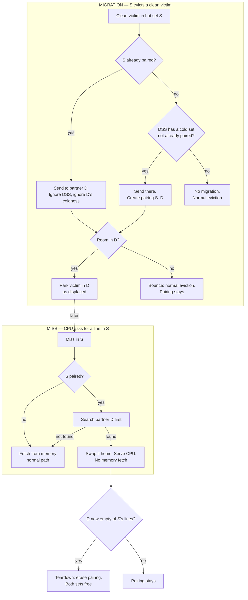

# Phase 3 — Making migration pay off (always-use design)

> # ⚠️ SUPERSEDED 2026-08-29 — this file describes SWAP/REPATRIATE, which is deleted
>
> **The current design is serve-in-place. SSOT: [coder/003-serve-in-place/](coder/003-serve-in-place/)**
> (`TASK.md` for the work order, `diagram.md` for the visuals).
>
> The paper (MICRO'09 §2.4) does **not** swap: *"the SBC does not swap lines to return them to their
> original set... swapping... had a negligible impact on performance."* We overrode that at Q1 and
> built repatriation; it was reversed on 2026-08-28 and **deleted from the RTL** in `50524ea`.
>
> Three claims in this file are now known false. They are marked inline below. Everything about
> **pinned 1:1 association, teardown, thresholds and the performance model still stands** — that is
> why this file is kept rather than deleted.

## What Phase 3 is for

After Phase 2, migration moves lines to cold sets, but those moved copies are dead. If the CPU asks for one again, the cache ignores the on-chip copy and refetches from memory. So today the migration machinery gives zero speedup — it is pure overhead.

Phase 3's job is to make those copies pay off: when the CPU asks for a moved line, find it on-chip and serve it, skipping the slow memory trip. That saved trip is the speedup.

## Where we are

> **2026-08-24 — read [destination-side-blocker.md](destination-side-blocker.md) first.** It carries the
> current destination-side numbers (749 commits, 98.3% ABORT-DST), the `internalRead` + DSS-reject fixes,
> the `acquireBeforeRelease` finding, the verdict on both "dirty" extensions, and the strategic risk that
> this evaluation setup may have no spare capacity to migrate into.

- Phase 2 (migrate-on-eviction) is complete and **signed off on correctness** (2026-08-17): stock-config
  regression 7/7 cases PASS, 0 asserts, destinations spread. See [phase-2.md](phase-2.md) §7.
- 🔴 **BLOCKER before building anything here — `p` is measured, and it is ~0.** The sign-off run gave us
  the first real number for the pool equation below: across **129,488 evictions** the migrate advice
  fired **49,161** times but only **9** migrations started — the victim was almost never clean +
  client-free. That is **risk #1 (low `p`)** with `p ≈ 0.0002`. Phase 3's entire payoff is
  `f* · (M−C) = p · (M−C)`, so at this rate the secondary search finds nothing and every displaced
  lookup is wasted work. Building the swap datapath before that is building a road to an empty pool.
  - ✅ **CAUSE FOUND 2026-08-18 — stale `clients` bits, not dirty lines.** The `EVICT-ASSESS` printf
    ([MSHR.scala:787](../design/craft/inclusivecache/src/MSHR.scala#L787)) already logged the reject
    reason, so no RTL or re-run was needed — only a tally of the existing log. Of the 46,082
    advice-latched assessments: **99.72% rejected for `clients =/= 0`**, 0.26% dirty, 0.02% eligible.
    The bit is **stale** — L1 holds at most 8 lines (2×2 D$ + 2×2 I$) yet ~32 ways read as held, and
    the victim way is spread uniformly (so `evictableOH` was genuinely zero, not a wiring bug).
  - ➡️ **Candidate unblocker: probe-then-migrate.** A normal eviction already probes a client-held
    victim, so the truth is already being fetched on the path we decline. Reuse `s_rprobe`, then
    migrate — the `displaced ⇒ clean + client-free` invariant gets *stronger*, and `C` does not grow
    (baseline pays probe + release, we pay probe + copy). **Full plan and ordering:
    [July18AfterBreakWorkplan.md](July18AfterBreakWorkplan.md).**
- ⚠️ **`s_verify` moves from "nice to have" to a hard prerequisite.** Phase 2 parked copies without
  verifying them, which was safe only because nothing read them. Always-use *serves* them.
- Threshold fix — **applied** to [Configs.scala](../design/craft/inclusivecache/src/Configs.scala) (T_hi=2K−1, T_lo=K). Working tree, not committed.
- `SBC_Reset` register (0x358) — **implemented** by the coder. Zeroes all SBC counters/DSS/AT via devmem.
- The Phase-3 *approach* changed after review (see below). Nothing in the always-use datapath is built yet.

## The big decision — always-use, not detect-first

The earlier plan was **measure first**: build a cheap read-only detector, count how often a moved line *could* be reused, then decide whether to build the swap.

We dropped that. Reason: the detector's number is **poisoned**. A moved line can go stale like this — it gets refetched into the home set, written, then evicted to memory, while the old copy still sits in the partner set. Nothing links the two copies, so the old one is never cleaned. The detector would count that stale copy as a "hit." Worse, if we ever served it, we'd serve wrong data.

To make the detector's number trustworthy, we'd have to build "invalidate the partner copy on refill" plus a guaranteed second directory read plus a directory write to the partner. That is already **half the swap**. So the "cheap measurement" was not cheap.

**Decision:** skip the detect-only step. **Always use the displaced copy.** On every miss, check the partner set first. Found → swap it home and serve it. Not found → go to memory as normal. A memory refill only ever happens *after* the partner was searched and found empty — so a line always lives in exactly one place, and stale twins are impossible **by construction**.

## How migration behaves now

Two sides: the spill side (creating copies) and the lookup side (using them).

### Spill side (S evicts a clean victim)

- If S is **already paired** → send the victim to that partner. Always. Do not ask the DSS. Do not check how cold the partner is. (This matches the paper: during an active association it deliberately ignores the partner's saturation.)
- If S is **not paired** → ask the DSS for the coldest set, but skip any set that is already in a pairing. Pair with the chosen set. The first move creates the pairing.
- Partner **full** → bounce (do a normal eviction). The pairing stays.

### Lookup side (S misses) — the "always use"

- S has a partner → search the partner **before** going to memory.
- Found → swap it home, serve it. No memory fetch.
- Not found → fetch from memory, as normal.

### Serving — "swap-then-replay"

The clean way to serve the found line: do only the **physical swap** (copy the line D→S, park S's victim in the freed D slot, two directory writes), then **re-run the request's directory lookup**. It now hits natively in S, and the completely unmodified hit path serves it — probes, permissions, grant, GrantAck all reuse existing logic. A few extra cycles per hit, but no new serve/grant datapath and no new permission logic.

(Serving straight from the copy buffer is faster but needs new grant logic — deferred to a later latency optimization.)

### Pairing ends only at teardown

While S is paired with D, all spills go to D and all searches look in D. The pairing dissolves only at **teardown**: when D no longer holds any of S's lines (checked by OR-ing the displaced bits in D → zero), erase the AT entries. Both sets are then free to take new roles.

**The DSS does not go away.** It is still what makes the scheme dynamic — it just runs at pairing
granularity instead of per-migration:

- Source **unpaired** → ask the DSS for the coldest set that is not already in a pairing. That first
  move creates the pairing.
- Source **paired** → use the partner. Do not ask the DSS, and deliberately ignore the partner's
  saturation (paper-confirmed).
- **Teardown** → the pairing dissolves, and the next spill from S asks the DSS again.

`DSS picks → pairing lives → teardown → DSS picks again` is the loop. Pinning is not "stop being
dynamic"; it is "hold still long enough that the secondary search knows where to look."

### Decision — decline-and-skip when the partner is unavailable (approved 2026-08-20)

A paired source **cannot re-pick** a different destination inside its pairing. So when the partner is
full, fenced, or otherwise unavailable at the moment we want it, the migration is **declined** and we
fall back to a plain eviction for that one victim. The pairing itself is untouched.

- **Approved as the v1 behaviour.** It is the simplest correct thing, it needs no new state, and it
  degrades to baseline rather than to a bug.
- It is the same shape as the existing Phase-2 `ABORT-DST` fallback, so it reuses a path that is
  already proven.
- Applies to both flavours of unavailable: **full** (no free or evictable way) and **busy** (another
  MSHR owns the set right now, or a migration is already in flight).

**Liveness confirmed (coder trace, 2026-08-24).** Pinning cannot deadlock on declines: `migDeferred`
clears unconditionally on `w_rprobeacklast` and falls through to a plain release
([MSHR.scala:743](../design/craft/inclusivecache/src/MSHR.scala#L743)), and a watchdog assert already
guards the deferred window. A raised decline rate costs opportunities, not liveness.

**Instrument it before assuming it is fine.** A declined migration is a lost opportunity, and if the
decline rate is high the pool never fills and Phase 3 has nothing to find. Count declines separately
from dirty-victim rejects — the two have completely different fixes.

#### Optimization points, if decline-and-skip underperforms

Ordered cheapest-first. Only build one if the decline counter says it is needed.

| # | Option | What it does | Cost / risk |
|---|---|---|---|
| 1 | **Retry on the next eviction** | Do nothing extra — the next victim from S tries again. Already the behaviour; just confirm the partner becomes available on a useful timescale. | Free. Might be enough on its own. |
| 2 | **Prioritized drain of the partner** | When declines from S spike, raise the priority of the background cold-source drain on D so room appears sooner. | Reuses the drain we already owe for teardown. Tuning only. |
| 3 | **Force-overwrite a full partner** (what the paper does) | Instead of declining, evict one of D's own lines to make room. | We deliberately chose **not** to do this: it can stomp a dirty or client-held line, which is a TileLink correctness question, not a tuning one. Would need the same probe-then-migrate treatment on D's victim. |
| 4 | **Allow a second partner** (1:N association) | S spills to a second set when the first is full. | **Breaks the single-lookup property** — the secondary search would have to check N sets. This is the thing pinning exists to prevent. Treat as a redesign, not a tweak. |
| 5 | **Early teardown on sustained decline** | If S keeps declining, tear the pairing down and let the DSS pick a fresher partner. | Interacts with the teardown rule (lines still parked in D must be drained first). Needs care; do not do this before the drain works. |

Note that options 1–2 keep the concept unchanged, 3 changes a safety property, and 4 changes the
architecture. **Do not jump to 4.**

## Correctness prerequisite — must land first

### Flush — DROPPED as a fix, kept as a platform constraint (2026-07-05)

The flush hole was real in principle: MMIO flush-by-address looks only in the home set, so a displaced copy in the partner would survive a flush, and DMA + re-access could then serve stale data. **But this platform never supports / uses the MMIO flush registers (`Flush64`/`Flush32`)** — the hole cannot be triggered. So no hardware is built. Instead it is a documented constraint: **MMIO flush must not be used while `enableSetBalancing` is on.** (Optional cheap guard: assert on any control request under SBC in sim. If flush support is ever needed, the dropped design — flush searches the partner and silently drops the clean copy, reusing the dread lane and the dstValid fence — is recorded in git history of the prereqs spec.)

### The one real fix — Pin the destination (strict 1:1 association)

Today each migration re-picks a destination and overwrites the association table. So S's lines can scatter across several sets while the AT remembers only one — the search looks in the wrong place → duplicate copies → the stale-data hole reopens. **Fix:** while S is paired with D, every spill from S goes to D (override the DSS). On the destination side, a set already in a pairing cannot be picked as a new destination. Confirmed with the paper: one entry per set, one partner at a time, deliberately ignore the partner's saturation during the association.

## The safety net

Every displaced line is **clean** by construction (Phase 2 only migrates clean, client-free victims), so memory holds identical bytes. That means **"drop the copy and fetch from memory" is always correct.** Every hard corner below degrades to this — losing speed, never correctness.

> **⚠️ This net is being given up on purpose.** It is exactly what forbids migrating dirty victims,
> and in any real workload most victims are dirty — so it is the cap on SBC's coverage, not just a
> convenience. 003 step 2e drops the client-free half; Stage 3 drops the clean half. What replaces it
> is address recovery via the AT (`expandAddress(tag, AT[row].assocSet)`) plus the `homeShadow`
> sim-only check that polices it. **Read that as: after 003, "drop it and refetch" is no longer
> universally safe.**

## Coherence audit — what cannot go wrong

- ~~**Releases** (L1 evicting to L2) can't target a displaced line — a Release needs a client holding the line, but a displaced line has no clients and can never gain one (it can't hit).~~
- ~~**Inner probes** can't target a displaced line — same reason.~~

  **❌ PREMISE DEAD, 2026-08-29.** Both rest on "a displaced line has no clients and can never gain
  one". Serving in place gives it one. Both cases are now real and handled: Releases/flushes arm the
  secondary search on the C and X plan branches (003 step 2d, finding P2), and probe responses route
  on `(probeSet, probeTag)` rather than set alone (003 Stage 1). **Redo this audit against
  `coder/003-serve-in-place/TASK.md` §7, not against this list.**
- **Permission upgrades** (e.g. BtoT) act only on native lines — an upgrade means a client holds it, so it's native in S.
- **No outer probes** exist — the CacheCork below the L2 turns everything into uncached memory traffic.

## Corner cases — all degrade to the safety net

- **Copy found but permissions too weak** (CPU wants to write, copy is read-only) → drop the copy, fetch from memory.
- **No room to swap** (S's victim is dirty or client-held, can't be parked) → release that victim normally, just bring the found line home (half-swap).
- **Uncached traffic** (DMA Get/Put) misses in S too → don't swap; drop the copy if present and go to memory.

## Build order

1. **Correctness prerequisite** — pinned 1:1 association (plus the shared building blocks: directory secondary-search, MSHR pairInfo latch). Lands first; makes everything else safe. The flush fix is dropped — MMIO flush unsupported on this platform (documented constraint).
2. **Mandatory secondary search on miss** — the second directory read of the partner with a displaced-tag match (reuses the Phase-2 `dread` lane).
3. ~~**The swap** — swap-then-replay serving.~~ **❌ built, then deleted (`50524ea`). Replaced by serve-in-place — see `coder/003-serve-in-place/`.**
4. **Teardown** — OR-of-displaced-bits, native-miss trigger, plus our cold-source drain (a full partner never gets native misses to clean itself, so we drain quiet ones in the background).
5. **Later** — re-enable `s_verify`, the serve-from-buffer latency optimization, and a throttle if thrashing shows up.

## Open debts and risks

- **`s_verify`:** Phase 2 parked copies without verifying them; always-use *serves* them to the CPU. A silent copy corruption becomes wrong architectural data. Re-enabling verification (or an equivalent) moves up in priority.
- **Bounce vs force-overwrite:** the paper force-overwrites a full partner; we bounce. Under pinning, a full partner makes S's migrations abort until teardown/drain frees room. Safe (falls back to normal eviction) but temporarily stops migration from S. Teardown/drain keeps it from being permanent.
- **Fence pressure:** the partner-set fence blocks all requests to the partner during a swap window. Bounded (already true in Phase 2), but always-use makes windows frequent — worth a counter to watch.
- **Throughput:** every miss in a paired set now pays a mandatory second directory read, and the one-token rule serializes swaps to one in flight. Fine for v1, measure later.
- **Destination-side `clients` staleness (2026-08-24):** 46% of migration aborts are on a `clients` bit that is provably false — max true client-held fraction is 6.25% (the I$ is not a TL-C client, so all bits come from a 4-line D$), measured 52%. Root cause is Rocket's `acquireBeforeRelease = false` default (`silentDrop`), **not** our RTL. Try the config flag before building the destination probe: [destination-side-blocker.md](destination-side-blocker.md).
- **Migration is a net negative — MEASURED 2026-08-25, ⚠️ figures now STALE (superseded by `522c540` and the 003 corruption fix; last verified differential is +0.10% / 1.00x at `b6156d4`):** first SBC-on vs SBC-off differential run on a real benchmark (`matmult` N=32). Data correct (identical checksum, 1,737 migrations), but **+42% cycles and 9.29x the DRAM traffic**. Miss rate ~10% -> ~93%: the L2 effectively stops working. Leading (unproven) cause: sets fill with displaced lines, which cannot serve hits and are evictable only by the last-resort reclaim tier, so effective associativity collapses. **This is the number Phase 3 has to beat.** SSOT: [matmult-differential-2026-08-25.md](matmult-differential-2026-08-25.md).

## Threshold fix + re-run (carried over)

The threshold fix and the FPGA re-run still matter, but their role narrowed. The re-run still validates the **migration rate** (does migration fire enough under the stricter T_hi=2K−1?). The old "abort magnet / abort-feedback" concern is largely superseded: with pinned associations the destination is only chosen once per source (at the first pairing), so per-migration DSS selection no longer drives the abort rate. Abort dynamics are now governed by pinning + teardown.

## Performance model + degradation points (note these — they decide whether SBC pays off)

### The pool-balance equation

Let, for a hot source set S paired with D:
- **P** = lines of S currently parked in D (the pool — this *is* migration's advantage)
- **p** = chance an eviction in S finds at least one clean, client-free way (picker searches all K ways)
- **f** = fraction of S's misses that find their line in D (secondary hits)
- **M** = DRAM miss cost (~100–200 cyc), **C** = swap cost (~40–80 cyc)

Pool change per S-miss: migrate on ordinary miss (+1, prob (1−f)·p), half-swap on secondary hit with
dirty victim (−1, prob f·(1−p)), else 0. Expected change:

> **E[ΔP] = p − f  →  equilibrium at f\* = p**

The pool **self-balances** — it does not drain to zero unless p = 0 (and at p = 0, Phase-2 migration
never parked anything either, so there was no advantage to lose). Half-swaps withdraw from the pool;
ordinary-miss migrations redeposit at exactly the balancing rate.

Payoff per S-miss versus baseline:

> **Saving = f\* · (M − C) = p · (M − C)** — e.g. M=150, C=60 → ≈ 90·p cycles saved per hot-set miss.

### Where performance can degrade (watch each one)

| # | Risk | Mechanism | How to see it |
|---|------|-----------|---------------|
| 1 | **Low p (write-heavy hot sets)** | Benefit is capped at p·(M−C). If S's lines are mostly dirty/client-held, p is small and SBC helps little. Not a design flaw — a workload property — but it bounds everything. | Add **`SBC_HalfSwaps`** (+ full-swap count) — p is directly observable as fullSwaps/(fullSwaps+halfSwaps). |
| 2 | **Swap cost C creeping toward M** | The win is (M−C). Fence stalls, port contention, and replay overhead all inflate C. If C approaches M, the swap saves nothing. | Measure swap latency in sim; serve-from-buffer (v1.5) is the lever to shrink C. |
| 3 | **Wasted searches on secondary misses** | Every miss in a paired set pays the mandatory partner search (~2 cyc) even when the line is not there — pure overhead on the (1−f) fraction. Small per event, but paid on *every* paired miss. | `SBC_SecMiss` vs `SBC_SecHits` — a low hit fraction means mostly-wasted searches. |
| 4 | **Pool drained by D's native misses** | Reclaim in D (native miss victimizes a displaced way) removes parked lines without a half-swap — pushes real f below p. A busy partner eats the pool. | Reclaim counter, or f\* measured (SecHits rate) sitting well below measured p. |
| 5 | **Ping-pong thrash** | The same lines swap S⇄D repeatedly. Each swap still beats a DRAM miss (C < M), so it's a *reduced* win, not a loss — but it's the case the yield throttle (Step 5) exists for. | Repeat-swap rate on the same tags; throttle only if measured. |
| 6 | **Fence pressure on D** | The partner fence blocks all requests to D during each swap window; always-use makes windows frequent. D's own traffic pays. | Stall counter on the dstSetConflict fence. |
| 7 | **Serialization (one token)** | One swap in flight at a time — concurrent hot sets queue behind each other. | Fine for v1; revisit if attempt rate ≫ completion rate. |
| 8 | **⚠️ No spare capacity anywhere (added 2026-08-24)** | The premise is that some sets have room. Measured: **2 free ways in 44,060 destination probes**. Every migration displaces a *resident* line. Worse, "coldest" (low miss-pressure) selects the sets whose lines **hit most**, i.e. the fullest ones — we have no signal for "has room" at all. If SBC shows no gain, **this is the first explanation to test**, ahead of any policy tuning. | Free-way rate on the dst probe (already in `sbc_stats.py`). Fixing it is a **workload + geometry** change, not RTL — see [destination-side-blocker.md](destination-side-blocker.md) §Strategic risk. |

**Counters this adds to the build list:** `SBC_HalfSwaps` (risk 1 — required), reclaim + fence-stall
counters (risks 4/6 — cheap, recommended).

## Not in Phase 3 (on purpose)

- Tag/data decoupling (data-pointer method) — shelved; breaks 1:1 tag↔data indexing and the bounded two-set window.
- ~~Serving a secondary hit *in place* (zero movement) — TileLink inclusivity denies it; that's why we swap.~~
  **❌ FALSE, retracted 2026-08-29.** Inclusivity does not deny it — it requires the probe and release
  paths to take their set from the AT rather than from the entry's location. That is exactly what
  task 003 builds. Serve-in-place is the current design.
- Handling dirty / client-held lines at the destination — Phase 4.
- Everything stays gated by the SBC enable flag; baseline runs unaffected.

## Decisions locked in

- **Always-use**, not detect-first.
- ~~**Swap-then-replay** serving (serve-from-buffer deferred).~~ **❌ REVERSED 2026-08-28. Serve in place, per the paper.**
- **Destination pinned until teardown; strict 1:1** (matches the paper).
- **Pinned association is THE correctness prerequisite** — build first. The flush fix is dropped: MMIO flush is unsupported on this platform (documented constraint, no hardware).
- **Clean-copy drop-and-refetch** is the universal escape hatch for every corner.

## Still open — your call

- **Secondary-hit accounting:** when a line is recovered by a swap, does it count as a **hit** or a **miss** for the home set's saturation counter? A hit keeps S looking satisfied; a miss pushes S toward migrating again. Interacts with the future throttle.
- **`s_verify` timing:** re-enable it before the swap lands (safer, since we now serve copies) or after (faster to first result)?
