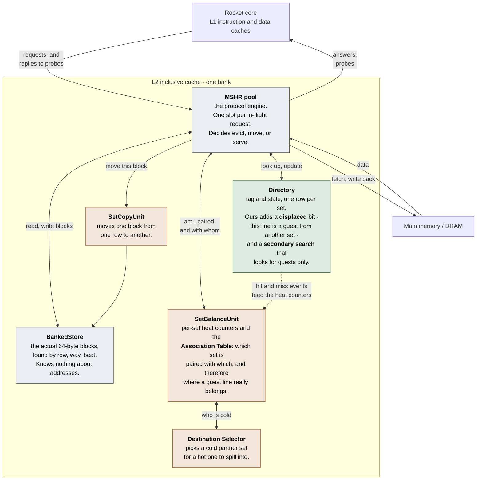

# Weekly report — 31 Aug 2026

**A moved line served real data for the first time.**

> **Published artifact:** https://claude.ai/code/artifact/9bf932a0-d495-4e25-b252-ef74280d988c
> Source: [`2026-08-31.html`](2026-08-31.html) in this directory. To update the published page,
> republish that same file with the URL above — editing it here alone does not change what the
> professor sees.

Audience: supervisor progress update. Written in plain language on purpose — technical detail lives in
`ai-documents/coder/003-serve-in-place/` (TASK, REPORT, diagrams) and `ai-documents/bug-fix-log.md`.

---

## Headline

**The mechanism the whole project exists for now works.** On a miss, the cache looks in the partner
set, finds the line that was moved there earlier, and **answers from where it sits** — no trip to main
memory. 7 of 7 correctness tests pass, no assertion failures, both data-integrity monitors clean.

**2,873 lines served this way.** Before this week the number was zero, because the mechanism did not
exist.

The long-open data-corruption bug — open since the start of this work, survived two full debugging
tasks — was **found and closed**.

---

## Where last week left off

The 21 Aug report ended with three next steps. All three are done.

| # | Last week's next step | Status |
|---|---|---|
| 1 | Apply the stale-record fix on the **receiving** side | ✅ Done. Two defects, not one: the cache was heating its own sets by looking at them, and "coldest" was measuring the wrong thing — a set whose lines always hit looks idle while being completely full |
| 2 | Re-measure on a **realistic** workload | ✅ Done. Third-party benchmark suite ported to the platform. First measurement was bad (+42% cycles); after the fixes below it is **+0.10% cycles, 1.00× memory traffic** — i.e. the feature is now free when it does not fire |
| 3 | **Begin Phase 3** — serve the line from the partner set | ✅ Done, and finished. This is the headline |

---

## The architecture

What the L2 cache looks like, and where our additions sit. The three boxes on the right are ours;
everything else is the stock SiFive design.

### How a request flows through it

1. A request misses in its own set. The cache **holds the eviction back** instead of acting on it.
2. It asks the Association Table: *is my set paired, and with whom?*
3. It runs a **secondary search** of the partner set, looking only for guest lines.
4. **Found** → serve the block straight out of the partner's row. Nothing is evicted, nothing is
   copied, nothing is fetched. **Not found** → the held-back eviction is armed now, and the ordinary
   miss path runs. Cost of having looked: one extra directory read.

---

## The change of direction, and why

We had built the wrong thing, and this week we replaced it.

The old design **copied the line back home** on a hit: evict a healthy line from the home set to make
room, copy the block across, erase the original. The reference paper does not do this — it serves the
line **where it already sits**. We had overridden that choice earlier for two reasons, and both turned
out to be wrong:

- *"Serving in place needs a bigger directory — every slot would have to record which set its line
  really belongs to."* **False.** Because each set is paired with exactly one partner, that
  information is **one value per set**, and the Association Table already stores it. We were pricing a
  per-slot field we never needed.
- *"Our test L1 cache is tiny, so a served line falls straight back out."* True, but that is an
  artifact of the small test configuration, not of the design.

Serving in place is cheaper per hit — it deletes one block copy, one eviction of a healthy line, and
one directory write, **every time** — and it is the prerequisite for the next phase.

---

## The structural change underneath it

One field in the design, named `set`, was doing two different jobs that had always been the same
number and now are not:

| | means | used for |
|---|---|---|
| **the row** | which physical row of memory the bytes are in | directory lookups, data array access, hazard checks |
| **the address** | which part of the real memory address this is | fetches from memory, write-backs, probes to the CPU |

For a guest line these differ: the bytes are in row 7, but the address belongs to set 5. Use the wrong
one on a write-back and you overwrite an **unrelated line in memory** — silent, unrecoverable data
corruption.

**We deleted the field rather than renaming it.** That turned all thirteen places that used it into
compile errors, so each one had to be decided deliberately. Renaming would have left any missed site
working perfectly for ordinary lines and failing only for guests — the worst possible failure mode,
and one this project had already been caught by twice.

---

## What we found and fixed

Six real defects. Three are worth the supervisor's time.

### 1. The corruption bug that had survived two debugging tasks

- **Found on the first run** of a new simulation-only monitor that records, for every block written
  into the data array, which address the writer *believed* it was writing — then checks it on every
  read.
- **Cause:** the block-copy engine collided with itself. The copy-home path and the copy-away path
  could target the same slot five cycles apart, because one of them was missing a guard the other
  had.
- **Outcome:** the failing test passes. The bug is now **gone rather than fixed** — the copy-home path
  it lived in was deleted wholesale when we switched to serving in place.
- The monitor cost one afternoon to build and was paying for itself by that evening. It has since
  caught two more issues.

### 2. Serving a line put it into a state the code then refused to accept

The best bug of the week, because the mechanism is self-inflicting:

- Serving a line to a *writer* leaves it exclusively held by the CPU.
- But the acceptance test for serving **rejected exactly that state.**
- So the next write to the same line was **guaranteed** to be rejected — and rejection meant erasing
  the entry with no probe to the CPU, no write-back, and no accounting. The cache forgot a line the
  CPU still held and had modified.
- **Fix:** treat a hit in the partner set exactly like an ordinary hit that happens to be in a
  different row. If the CPU holds it, probe it back — the same thing the cache already does for
  ordinary lines.
- **Evidence it worked:** 12% of all serves now find the line in that previously-fatal state, which
  can only happen because an earlier serve left it there and it survived.

### 3. "No longer reachable" was wrong, and that is the lesson

- A monitoring assertion was reading a value one cycle before it was written, producing a false
  alarm. We recorded it as harmless and **not reachable any more**, because an unrelated change had
  moved the code that triggered it.
- The defect was never removed — only made rare. When fix 2 above made that code path busier, it
  fired again immediately.
- **Rule adopted:** a timing hazard is not closed by moving one of the things that trips over it. It
  is closed by reading the correct value. Three of this project's worst bugs have now been this exact
  shape.

*(Also fixed: a channel that could deadlock the cache permanently; a case where the cache could drop a
line the CPU still held, breaking the inclusion property; and a stale-record defect that had been
labelled "harmless" for a whole task — it was never harmless, only hidden by code we then deleted.)*

---

## Measured results

Full correctness suite, seven directed tests, feature on.

| Metric | 21 Aug | 31 Aug |
|---|---|---|
| Correctness suite | 7 / 7 | **7 / 7** |
| Assertion failures | none | **none** |
| **Lines served from a partner set** | **0** — mechanism did not exist | **2,873** |
| Memory block-fetches avoided | 0 | **2,873** (≈180 KB, arithmetic from the counter) |
| Data-integrity monitors | did not exist | **2 running, both clean** |
| Long-open corruption bug | open | **closed** |
| Cost when the feature does not fire | +42% cycles / 9.29× memory traffic | **+0.10% cycles / 1.00×** |

Migrations fell 22,691 → 17,616 (−22%) across the serve change. **This is expected and arguably the
point:** moved lines now survive being used instead of being destroyed, so partner sets stay occupied
and fewer new moves are accepted. It is a capacity effect, not a regression.

---

## Two results reported plainly, because both are negative

- **The serve hit rate is flat, not rising.** It starts at 16% in the small targeted tests and settles
  at ~2.5% for the rest. The bulk of the run is one saturation test that streams 32 distinct lines per
  set against 8 slots — the reuse distance exceeds capacity, so there is **nothing to re-hit**. A pool
  of preserved lines cannot help a workload with no reuse. This reads as a property of the test, not
  of the design, but it needs a workload with real reuse to confirm.
- **One code path is built but never exercised.** When the cache holds only a *shared* copy and the
  CPU wants to write, it must serve the data and fetch write permission separately. That path
  elaborates and is asserted safe, but this workload never took it once. **It is not proven working**
  and needs a directed test.

Both are consequences of the test configuration: 8 sets, 8 ways, 256-byte L1 caches. Adequate for
proving correctness, **not** adequate for a performance claim.

---

## Next steps

1. **Allow moved lines to be dirty.** Currently only clean lines can be moved. In real programs most
   candidates are dirty, so this is the single biggest constraint on how often the mechanism can fire.
   The address-recovery machinery it needs was built and proved this week.
2. **A bigger, more realistic configuration.** The current one is too small for a performance number
   to mean anything. This requires rewriting the test's hard-coded geometry first.
3. **A directed test for the two unexercised paths** — the shared-copy-plus-write case, and a
   workload with genuine reuse to test whether the hit rate climbs.

---

## Note on method

The strongest result of the week was not a fix, it was an instrument. A simulation-only monitor that
records what each writer *believed* it was doing, and checks it on every read, found a bug in one run
that two full tasks of reasoning had failed to locate — and it found it **on the cycle it happened**,
rather than as a wrong value in memory ten million cycles later.

The corresponding warning: three separate defects this week were logged as "harmless by inspection"
and every one was actually **hidden by other code**. When that other code was deleted, they became
live. Findings marked benign are now re-opened whenever nearby code is removed.

---

## Commits behind this report

| commit | what |
|---|---|
| `7ad8020` | stop the cache heating its own sets; rotate the destination |
| `97b0d54` | pinned 1:1 set pairing |
| `522c540`, `b6156d4` | moved lines can be evicted; directory secondary search |
| `0672f79` | **the row/address split** and both integrity monitors |
| `50524ea` | delete the copy-home path — corruption bug confirmed and closed |
| `9363efa` | hold the eviction until the search answers |
| `ac7253d`, `7266ea5` | slot-level locking; write-backs and flushes can find a moved line |
| `97c282b` | **a hit in the partner set is a hit** — full serve-in-place, all tests green |

Verified on the stock Verilator configuration (8 sets × 8 ways L2, single Rocket core). Correctness
suite: seven directed corner-case tests, each checking data integrity after a line has been moved.
