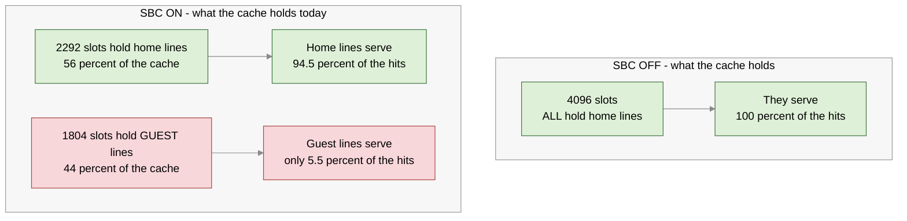
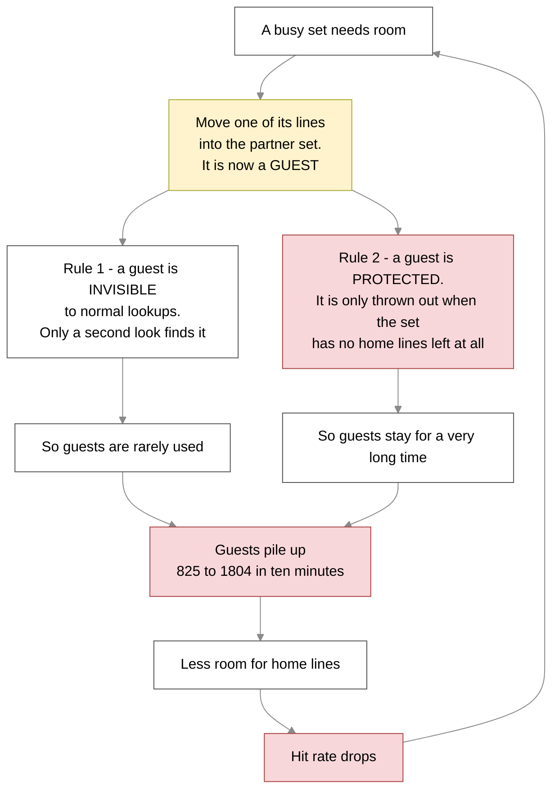
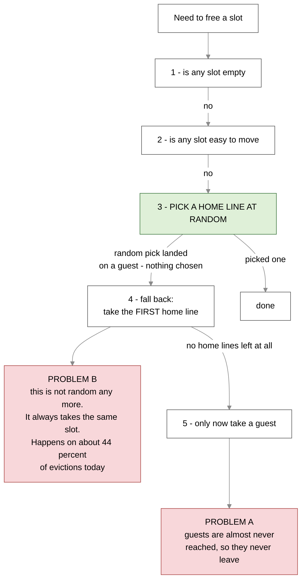
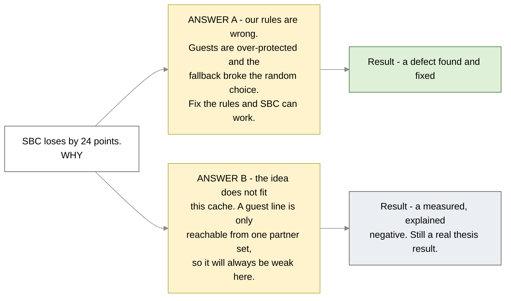
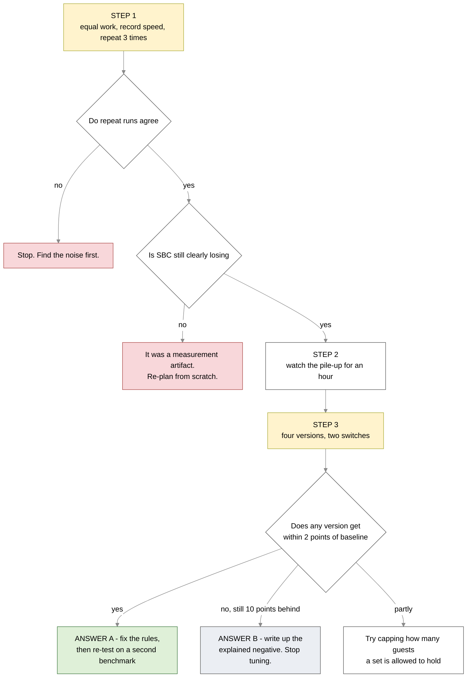

# Workplan — why SBC is losing, and how we find out

**Opened 2026-09-11.** Replaces the P0 part of [weekly-plan-2026-09-08.md](weekly-plan-2026-09-08.md).
Full technical detail: [omnetpp-differential-2026-09-10.md](omnetpp-differential-2026-09-10.md).

**Wording used here:** a **guest line** is a line that was moved out of its own set and now lives in a
partner set. (The code calls it *displaced* or *parked*.) A **home line** is a line sitting in the set
it belongs to.

---

## 1. What we measured

Real hardware. VCU118 board, Linux, 256 KB cache, running the omnetpp benchmark for 10 minutes with
SBC switched on, then again with SBC switched off.

| | SBC ON | SBC OFF | |
|---|---:|---:|---|
| Found in cache (best case, counting both kinds of hit) | **66.1 %** | **90.2 %** | 🔴 24 points worse |
| Trips to memory | 237 million | 83 million | 🔴 **2.8× more** |
| Work done in the same 10 minutes | — | — | 🔴 about **18 % less** |
| Guest lines in the cache at the end | 1,804 | 0 | out of 4,096 slots |

**SBC is losing clearly, and it is not close.**

### The number that actually explains it

Each board session takes a *second* reading before the timed run. Nobody had compared them. Same
chip, same benchmark, 30 minutes apart:

| SBC reading | guest lines in the cache | hit rate |
|---|---:|---:|
| earlier | 825 | **79.0 %** |
| later | 1,804 | **62.5 %** |

**SBC's own score fell 16 points during one session.** It gets worse the longer it runs. And the
drop lines up almost exactly with how much of the cache the guest lines have taken over — plot the
two and they form a straight line.

So this is not bad luck, and it is not the benchmark. Something is filling the cache up.

---

## 2. What is filling the cache up

**Nearly half the cache is doing one twentieth of the work.**

Per slot: a home line answers about **190,000** requests in the window. A guest line answers about
**14,000**. That is **13.6 times less useful per slot**.

Why guests are weak: a guest line can only be found by a *second look* in the partner set, and only
when the request comes from its own original set. A home line can be found by anyone, immediately.

---

## 3. Why it keeps getting worse

Guest lines are protected from being thrown out, and nothing ever sends them home. So they build up.

In the 10-minute window: **74,729 lines became guests, 73,766 left, net gain 979** — and the count
was **still climbing** when we stopped. We do not know where it settles. It could be most of the
cache.

**The paper does not have this problem.** In the paper the cache uses a "least recently used" rule,
so a guest line gets a head start and then naturally ages out. Our cache picks victims at random,
so "give the guest a head start" turned into "the guest is never picked". A temporary advantage
became a permanent one.

---

## 4. Two separate things are broken

When the cache needs to free a slot, it works down a ladder of rules:

**Problem A — guests are too protected.** They sit at the very bottom of the ladder, so they only
leave when a set has no home lines at all. This is what causes the pile-up in section 3.

**Problem B — the fallback ruins the random choice.** Step 3 picks one slot at random. If that slot
happens to hold a guest, step 3 gives up and step 4 just grabs the *first* home line — the same slot
every time. With 44 % guests, this happens on roughly **44 % of all evictions**. So nearly half the
time the cache stops choosing randomly and keeps evicting the same few slots.

**Problem B is a plain bug and should be fixed either way.** It has nothing to do with whether
guests are a good idea.

---

## 5. The one question we have to answer

Both answers are worth writing up. They are just very different papers. **Everything below exists to
tell them apart.**

---

## 6. The plan — three steps

Owner tags: **[E]** = you and me, analysis · **[C]** = coder, RTL · **[D]** = your decision.

### Step 1 — fix how we measure 🔴 do this first, nothing else counts until it is done

Two problems with the numbers we have:

- **The two runs did not do the same amount of work.** We measured for 10 minutes each, but SBC is
  slower, so it got less far through the benchmark. Fix: use a benchmark input that **finishes**, and
  measure the whole thing. The tool already supports this.
- **We never recorded speed.** We only have hit rates. We do not actually know how much slower SBC
  is. Fix: record cycles and instructions around the run.

| | Task | Owner | Time |
|---|---|---|---|
| 1.1 | Use a benchmark that finishes, measure it end to end, both settings | **[E]** | 1 hour |
| 1.2 | Record cycles and instructions so we get a real speed number | **[E]** | 1 hour |
| 1.3 | Start each SBC run from a clean cache, or write down what it started with | **[E]** | 15 min |
| 1.4 | Run everything 3 times — every number we have is a single run | **[E]** | 1 day |

**Check before moving on:** three runs of the *same* setting must agree within about 1 point. If they
do not, stop and find out why. If the gap disappears once both sides do equal work, stop and re-plan
— that would mean the whole result was a measurement artifact.

### Step 2 — watch the pile-up happen

Run SBC for an hour and read the counters every minute. Plot two lines: how many guest lines there
are, and what the hit rate is.

| | Task | Owner | Time |
|---|---|---|---|
| 2.1 | One long run, reading every minute, then plot it | **[E]** | 2 hours |
| 2.2 | Does the guest count level off, and where | **[E]** | analysis |
| 2.3 | Double-check the guest count is real — add a cheap self-check in the hardware, because this one number carries the whole argument | **[C]** | small |

**Why this matters:** if the hit rate keeps tracking the guest count in a straight line all the way
along, that is strong evidence for **Answer B** — guests are dead weight in proportion to how many
there are, and no rule change fixes that. This is also the clearest single chart this project has
produced.

### Step 3 — the experiment that decides it

Build four versions and compare. Two switches, on or off:

- **Switch A — stop over-protecting guests.** Let a guest be picked at random like any other line.
- **Switch B — fix the fallback bug.** When the random pick lands on a guest, pick another home line
  at random instead of always grabbing the first one.

| version | protect guests | fallback fixed | hit rate | speed | guests at end |
|---|---|---|---|---|---|
| SBC off (baseline) | — | — | **90.2 %** | | 0 |
| today | yes | no | **66.1 %** | | 1,804 |
| A only | **no** | no | | | |
| B only | yes | **yes** | | | |
| A and B | **no** | **yes** | | | |

| | Task | Owner | Time |
|---|---|---|---|
| 3.1 | Write the work order for the two switches | **[E]** | half day |
| 3.2 | Build both switches, prove nothing changes when SBC is off | **[C]** | half day |
| 3.3 | Build 5 bitstreams, about 20 minutes each | **[C]** | 2 hours |
| 3.4 | Run all 5 using the Step 1 method | **[E]** | 1 day |

**Decided in advance, so we cannot argue ourselves into a nice answer afterwards:**

- Any version gets **within 2 points of 90.2 %** while still serving guest hits → **Answer A**. The
  rules were wrong, SBC can work here, carry on.
- "A and B" is still **more than 10 points behind** → **Answer B**. Stop tuning. Write up the
  negative with the explanation.
- Anything in between → partial fix. Then we try capping how many guests are allowed.

---

## 7. How we decide

---

## 8. Other things going on at the same time (not blocking)

| | Task | Why |
|---|---|---|
| 8.1 | **Task 005 — fix how hits are counted.** Right now write-backs from the L1 are counted as cache hits, which pushes *both* scores up. The 24-point gap is still real, but 90.2 % and 66.1 % are both flattering. | Needed before any number goes in the thesis |
| 8.2 | The "migration attempted" counter does not add up — attempts are lower than successes plus failures. So the 76 % failure rate we quote is based on a bad denominator. | We are quoting it |
| 8.3 | One safety check: modified guest lines must be written back to memory, never dropped. The hardware looks right, but the counters make an odd pair — 157,635 write-backs landed on guest lines, yet only 32 guests were modified when thrown away. Almost certainly fine, but if it is not, it is silent data loss. | Cheap check, bad downside |

---

## 9. Rules while we are testing

- **Do not quote 90.2 % or 66.1 % as absolute numbers** until task 005 is done. Compare the two, do
  not publish either on its own.
- **Do not change thresholds or any other setting during Steps 1-3.** One variable at a time, or the
  experiment tells us nothing.
- **Do not "fix" anything mid-run to make a result look better.** A bad result is a finding. Write it
  down and keep going.
- **Do not compare the two "since boot" readings** in the current data — the two boards had done very
  different amounts of work.

---

## 10. The honest position

We have a cache feature that **works correctly, we know what it costs in chip area, and it currently
loses 24 points of hit rate** — with the loss growing the longer it runs. We know the loss tracks how
much of the cache the guest lines have taken over, and we have found two specific rules that could
explain it.

Step 3 tells us which write-up we are doing: *"we found a defect and fixed it"*, or *"set balancing
does not pay on a cache like this one, and here is exactly why"*.

**The second one is not a failure.** It is a measured result on real hardware with a clear
explanation, and nobody has that number for this design. The only real failure would be reporting
either answer before Step 1 is done.
