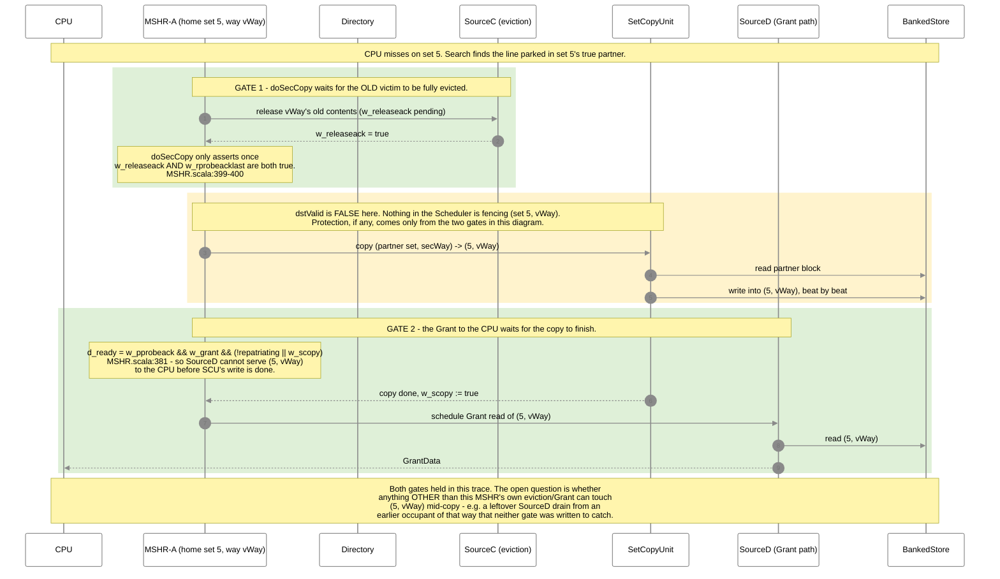

# LEAD — repatriation writes into an unfenced destination

Companion to [ai-documents/diagram.md](ai-documents/diagram.md). Same drawing style, one lead.

**Status:** found by reading RTL only. NOT confirmed as a bug. Two other gates appear to close
the race in every case checked so far — this is a hypothesis to test, not a diagnosis.

**Colour key:** 🟢 green = fenced/safe today · 🟡 yellow = unfenced but currently covered another
way · 🔴 red = where a gap would show up if the other gates ever slipped.

---

## The idea, in plain English

- The copy engine (`SetCopyUnit`) is used for two different moves:
  - **Migrate-out**: victim leaves its home set, parks in a cold, otherwise-idle set.
  - **Repatriate-in**: a parked line comes back into the set that is currently missing on it.
- For migrate-out, the destination is fenced: `dstValid` is raised, and the Scheduler refuses to
  let any new request allocate onto that set until the copy is done.
- For repatriate-in, the destination is the **demand's own home set** — and `dstValid` is only
  ever driven by `migrating`. It is **never raised for repatriation**.
- So the one write path that has an explicit "keep everyone else out" mechanism doesn't use it
  for the newer of its two callers.
- Reasoning found two things that seem to cover the gap anyway: the copy won't start until the
  old victim's eviction is acknowledged, and the Grant to the CPU won't fire until the copy is
  done. If either of those has a hole, this becomes a live corruption path. If not, it's a
  harmless asymmetry worth commenting, nothing more.

---

## Part 1 — the asymmetry

```mermaid
%%{init: {"theme":"base","themeVariables":{"background":"#ffffff","mainBkg":"#ffffff","textColor":"#000000","lineColor":"#8a8a8a","primaryColor":"#ffffff","primaryTextColor":"#000000","primaryBorderColor":"#555555","secondaryColor":"#f2f2f2","tertiaryColor":"#ffffff","nodeTextColor":"#000000","nodeBorder":"#555555","clusterBkg":"#f7f7f7","clusterBorder":"#999999","edgeLabelBackground":"#ffffff"}}}%%
flowchart TD
    SCU["SetCopyUnit - one engine, two callers"] --> M
    SCU --> R

    subgraph M["MIGRATE-OUT (fenced)"]
      M1["dstSet = a cold, idle set<br/>chosen by the DSS"] --> M2["dstValid := migrating<br/>MSHR.scala:332"]
      M2 --> M3["Scheduler: dstSetConflict<br/>blocks new alloc onto dstSet"]
      M3 --> M4["no other requester can<br/>touch dstSet during the copy"]
    end

    subgraph R["REPATRIATE-IN (not fenced)"]
      R1["dstSet = request.set<br/>THIS MSHR's own home set<br/>MSHR.scala:404"] --> R2["dstValid stays FALSE<br/>never raised for repatriating"]
      R2 --> R3["Scheduler: dstSetConflict<br/>sees nothing to block"]
      R3 --> R4{"is the set protected<br/>some other way?"}
      R4 -->|"one MSHR per set already<br/>owns this set exclusively"| R5["no SECOND MSHR can land here<br/>- ordinary exclusivity, not dstValid"]
      R4 -->|"but what about THIS<br/>MSHR's own in-flight work?"| R6["eviction of the old victim,<br/>and the Grant to the CPU,<br/>both touch the same way"]
    end

    style M1 fill:#dff0d8,stroke:#3c763d,color:#000000
    style M2 fill:#dff0d8,stroke:#3c763d,color:#000000
    style M3 fill:#dff0d8,stroke:#3c763d,color:#000000
    style M4 fill:#dff0d8,stroke:#3c763d,color:#000000
    style R1 fill:#fff3cd,stroke:#aaaa33,color:#000000
    style R2 fill:#f8d7da,stroke:#a94442,color:#000000
    style R3 fill:#fff3cd,stroke:#aaaa33,color:#000000
    style R4 fill:#ffffff,stroke:#555555,color:#000000
    style R5 fill:#dff0d8,stroke:#3c763d,color:#000000
    style R6 fill:#fff3cd,stroke:#aaaa33,color:#000000
```

---

## Part 2 — the transaction, and where the gates actually sit

This is the sequence for a demand miss that gets repatriated. The two gates that (currently)
appear to close the race are marked. If either one is wrong, the write to `(request.set,
meta.way)` is unfenced against whatever comes next.

---

## Part 3 — what would make this a real bug, and what would clear it

| if true | verdict |
|---|---|
| some *other* in-flight SourceD activity (not this MSHR's own eviction/Grant) can still be draining `(set, vWay)` when the copy write starts | 🔴 real gap — same shape as the Bug-B hazard the migrate path already had to guard against |
| the only things that ever touch `(set, vWay)` during repatriation are this MSHR's own eviction (before) and its own Grant (after) | 🟢 the asymmetry is harmless — ordinary one-MSHR-per-set exclusivity already does `dstValid`'s job here |

**Note:** `SetCopyUnit`'s own `copy_wsafe` check (`SourceD.scala:405-409`) already scans SourceD's
pipeline for exactly this — so if `copy_wsafe` is correct, gate 1/gate 2 may not even be the only
things holding this closed. That check was written for the *migrate* case; whether it is
sufficient on its own for the repatriate case (without `dstValid`'s help) is the open question.

---

## What this does NOT claim

- No TileLink protocol violation is implied by this lead.
- The two currently-failing stress cases are not explained by this on their own — this is a
  parallel lead, not a replacement diagnosis.
- This does **not** touch the `pairSetReg`/`destQuery` latch (that class of bug — the wrong
  partner set — was raised and then disproven separately; see `ai-documents/coder/002-partner-latch-fix/`).

---

## How to confirm — needs new instrumentation, not a re-run of existing logs

Unlike the wrong-partner-set lead, this one can't be checked against logs we already have.
Proposed test: log every cycle a repatriating MSHR's copy is writing `(request.set, meta.way)`,
and every cycle any *other* SourceD/SourceC activity touches that same `(set, way)`. Zero overlap
across the stress test and matmult clears this lead the same way Step 0/0b cleared the last two.
